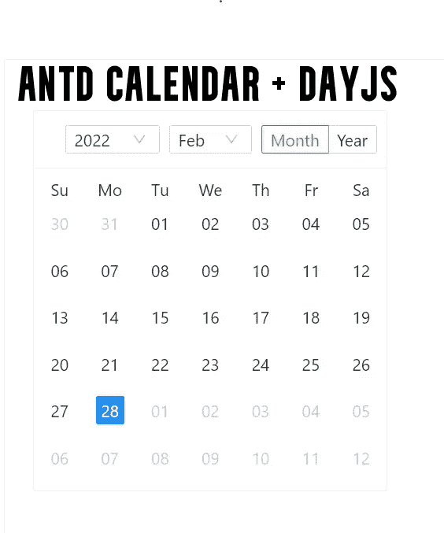
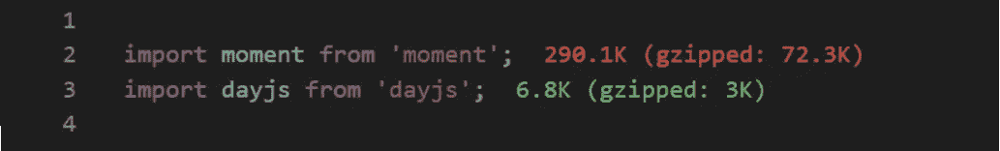
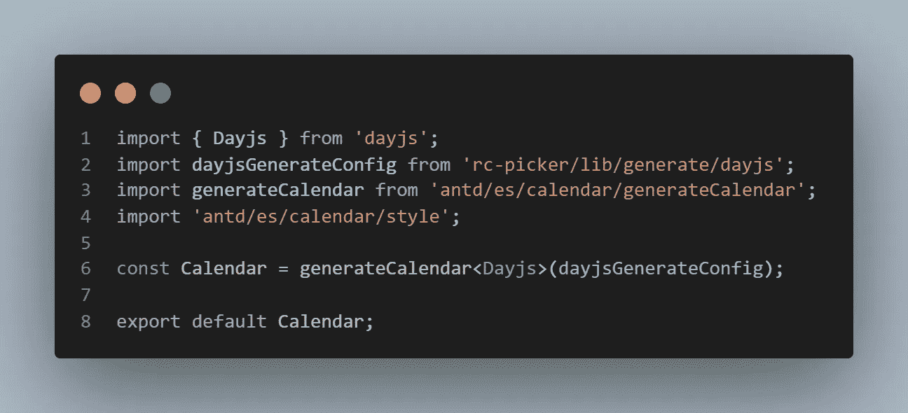
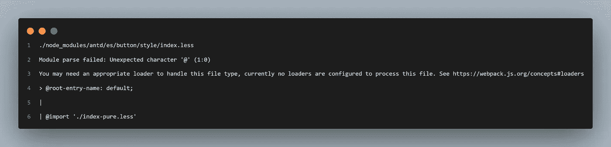
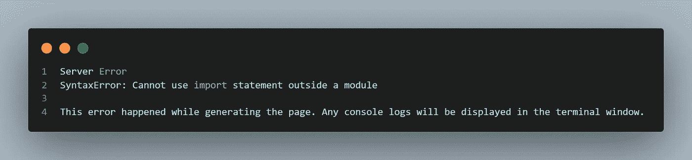
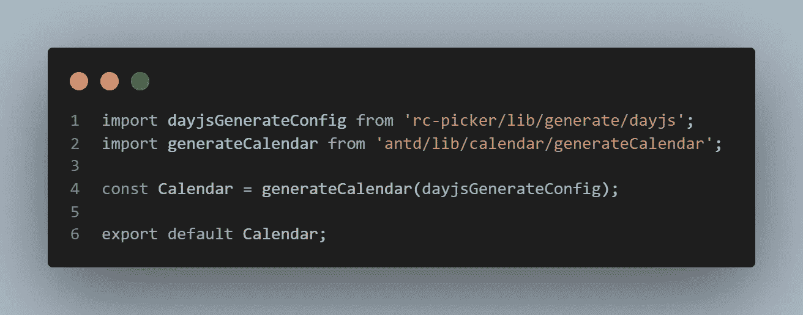

# 如何将 Antd 日历与 DayJs 一起使用

> 原文：<https://medium.com/globant/antd-calendar-with-day-js-3f3f346f50ed?source=collection_archive---------0----------------------->

用 Antd 日历替换 moment js，用 DayJs 构建它

**简介:**

众所周知，Antd 是流行的 React UI 库之一。它拥有高质量的组件，我们可以集成这些组件来构建丰富的交互式用户界面。Antd React UI 库的每个组件都有一组 API 方法来定制其默认行为。

**Antd 日历组件:**

无论何时，应用程序中的数据，如日期、时间表、时间表、价格日历、农历或年/月表示日历，都是大多数 web 应用程序中使用的组件的明显选择。

由于集成的简单性和几个定制选项，Antd Calendar 成为 React 应用程序中的流行选择。

默认情况下，Antd Calendar 附带了 Moment.js，它是用于执行多个日期操作的默认日期类型。Moment.js 成功应用于数百万个项目。但是世界各地的用户提出了以下问题，所以它将被一个新的库所取代。

*   力矩对象是*可变的*
*   时刻是高的
*   不能很好地与现代的“树分片”算法一起工作，所以它增加了 web 应用程序包的大小。
*   根据官方文档，Moment 现在被认为是处于维护模式的遗留项目。

目前有几种合适的替代方案，如 [date-fns](https://date-fns.org/) 、 [luxon](https://moment.github.io/luxon/#/) 、 [dayjs](https://day.js.org/) 等。所以，我们来看看 Antd Calendar 和 DayJs 的整合。

**为什么是 DayJs？**

*   很小，几乎以 KB 为单位(2KB)
*   它是一个极简主义的 JavaScript 库，为现代浏览器解析、验证、操作和显示日期和时间。
*   一系列广泛的时刻。js 兼容的 API
*   对国际化的重要支持，最好的事情是它不会成为你的应用程序构建的一部分，除非被使用。

**时刻和日的大小比较:**

moment vs day js size comparison

**带日期的 Antd 日历:**

在这个故事中，我们在演示 NextJs 应用程序中使用 Atnd Calendar & DayJs 和自定义组件方法。根据文档，我们必须使用下面的代码进行集成。

在这里阅读文档。

但是这个代码是行不通的。因为它在 NextJs 中抛出了下面的错误。

antd custom calendar component error

因为它给出了一个与 CSS 相关的错误，你可能认为不要导入 Antd 日历样式，尽管如此，它还是会给出如下的另一个错误。

antd calendar custom component syntax error

因此，我们需要对我们的代码进行如下更改，以使其可行。

为此，我们必须从“antd/lib/calendar/generateCalendar”模块中导入“generate calendar”函数。做出这些更改后，我们的 Antd 日历将开始在网页上呈现。

因此，只需一个简单的技巧，我们的 Antd 日历就可以与 DayJs 一起工作。此集成的演示可从以下网址获得:

 [## GitHub-alankarmore/antd-calendar-dayjs:用 DayJs 替换 Antd 日历组件时刻…

### 这是一个用 create-next-app 引导的 Next.js 项目。首先，运行开发服务器:打开…

github.com](https://github.com/alankarmore/antd-calendar-dayjs)