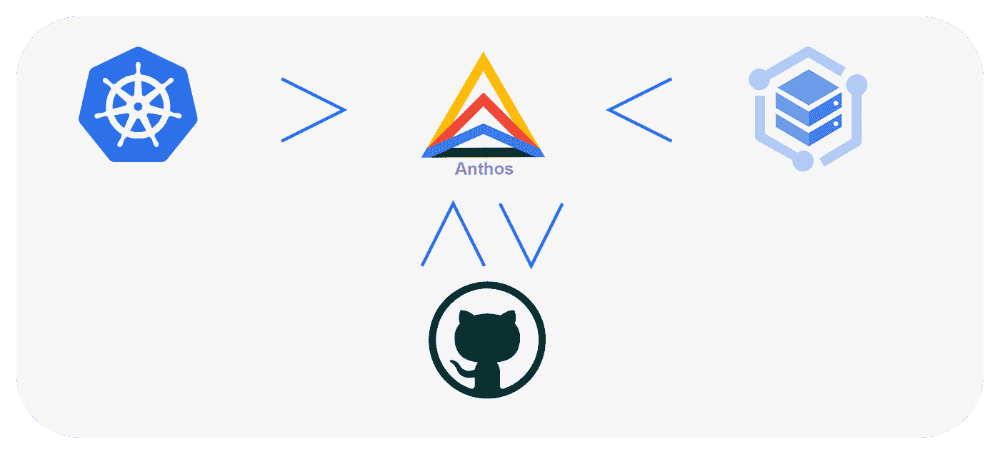
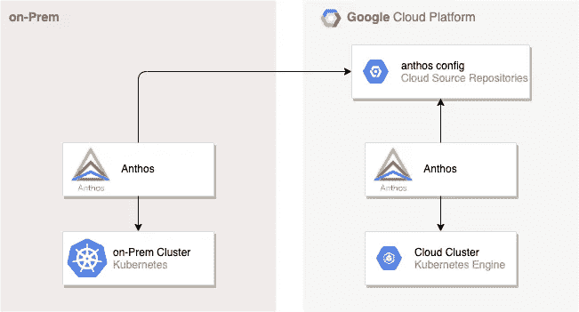

# 简而言之

> 原文：<https://medium.com/globant/anthos-in-a-nutshell-1004fd203c33?source=collection_archive---------1----------------------->

## 如何跨多个云提供商管理和协调多集群。



Anthos as an orchestrator for different technologies

[Anthos](https://cloud.google.com/anthos/) 是一个 [Kubernetes](https://kubernetes.io) (K8S)分布式代理，负责跨不同平台应用多集群范围的配置。

Anthos 依靠版本控制软件来存储和分发集群配置和部署。

> K8S 的治理和审计过程的语义取决于组织的需求。

在本文中，我们将回顾一个部署 Anthos 的基本参考架构。我们还将向由 Anthos 管理的板载 K8S 集群展示所需的准备工作。

## 参考架构

遵循跨不同提供商连接多个 K8S 集群的基本参考体系结构。这使我们能够通过单一控制台进行管理和配置。



Anthos architecture reference

每个必需的 K8S 集群都需要一个嵌入在集群领域中的组件。所述组件执行对主谷歌云平台(GCP)项目的回调函数。这个特定的项目也称为宿主项目。它的主要目标是管理和配置 k8 车队。

> *[Anthos Config](https://cloud.google.com/anthos/config-management)*存储库可以托管在任何支持命令的`git`接口的源存储库中。也就是说，只要谷歌 Kubernetes 引擎(GKE)对它有读取权限。**

## **K8S 簇的制备**

**准备每个 K8S 集群由 Anthos*管理需要四个步骤:***

*   ***对于每个集群:在集群中安装 Anthos 配置管理:***

```
***kubectl apply -f [***config-management-operator.yaml***](https://cloud.google.com/anthos-config-management/docs/downloads#manifest)***
```

> ***访问 Anthos 配置管理工具可以在[这里](https://cloud.google.com/anthos-config-management/docs/downloads)找到。***

*   ***创建 YAML 部署文件(每个集群一个)，并考虑以下关键因素:***

```
***…
apiVersion: configmanagement.gke.io/v1
kind: ConfigManagement
metadata:
 name: config-management
 namespace: config-management-system
spec:
 clusterName: ***cluster_name***
 git:
 syncRepo: ***url_to_git_path***
 syncBranch: ***git_branch***
 secretType: ssh
 policyDir: “***custom_directory***”
…***
```

> ***`cluster_name`对于每个分类必须是唯一的。结果，你将会有和你必须管理的集群一样多的`config_management_cluster_name.yaml`文件。***

*   ***为每个集群应用以前的配置:***

```
***kubectl apply -f config_management_***cluster_name***.yaml***
```

*   ***对于每个集群:在 K8S 中配置 git 访问凭证***

```
***#kubectl create secret generic git-creds — namespace=config-management-system — from-file=ssh=**PATH_TO_PRIVATE_KEY*****
```

***这是根据中央存储库同步所有集群所需的配置。***

***现在，唯一合理的问题是我们如何知道同步的状态，答案以名为`nomos`的二进制形式出现。***

***二进制包`nomos`也可以从 [Anthos 下载页面](https://cloud.google.com/anthos-config-management/docs/downloads#nomos_command)下载。用`Go`写的，各种平台都有。基本用法如下:***

```
***#nomos -h
Set up and manage a Anthos Configuration Management directory (version v1.1.1-rc.4)Usage:
  nomos [command]Available Commands:
  help        Help about any command
  hydrate     
  init        Initialize a Anthos Configuration Management directory
  status      Prints the status of all clusters with Configuration Management installed.
  version     Prints the version of ACM for each cluster as well this CLI
  vet         Validate a Anthos Configuration Management directoryFlags:
  -h, --help   help for nomosUse "nomos [command] --help" for more information about a command.***
```

***这意味着当您运行`nomos status`时，它将输出每个被管理集群的状态。***

```
***#nomos status
Connecting to clusters...
Current   Context    Status       Last Synced Token   Sync Branch
-------   -------    ------       -----------------   -----------
*         cluster_1  SYNCED       1b664887            master   
          cluster_2  SYNCED       1b664887            master***
```

***在这种情况下，`kubectl`连接到`cluster_1`。这样的集群与提交 id 为`1b664887`的存储库完全同步。同样，同步发生在资源库的`main`分支上。对此类分支的任何提交都将触发每个集群上的更新。***

***最后是托管所有集群配置所需的文件夹结构。***

***我们可以使用`[nomos init](https://cloud.google.com/anthos-config-management/docs/how-to/nomos-command#init)`命令来建立一个基本的集群结构。一旦执行，它将创建如下所示的树:***

```
******cluster_1***
├── README.md
├── cluster
├── clusterregistry
├── namespaces
└── system
    ├── README.md
    └── repo.yaml***
```

***要获得关于存储库结构和语义的完整参考，您可以查看 [Anthos 参考指南](https://cloud.google.com/anthos-config-management/docs/concepts/repo)。***

***要验证一个现有的存储库，您可以使用`[nomos vet](https://cloud.google.com/anthos-config-management/docs/how-to/nomos-command#vet)`命令。***

```
***nomos vet --path=./cluster_1***
```

***最后，您可以从一个空的配置存储库开始，或者使用一个现有的演示存储库。在[演示报告](https://github.com/GoogleCloudPlatform/csp-config-management)中，有一个`[foo-corp](https://github.com/GoogleCloudPlatform/csp-config-management/tree/1.0.0/foo-corp)`集群配置供您检查和执行最基本的部署。***

## ***结论***

***总之，我们看到了如何在每个集群(GKE 或其他)上配置 Anthos。我们还看到了如何检查集群状态和初始化存储库来托管集群配置。***