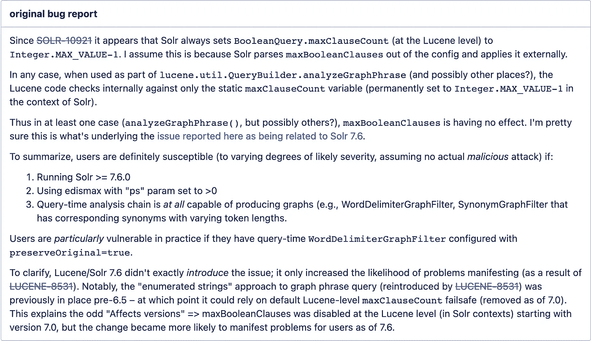
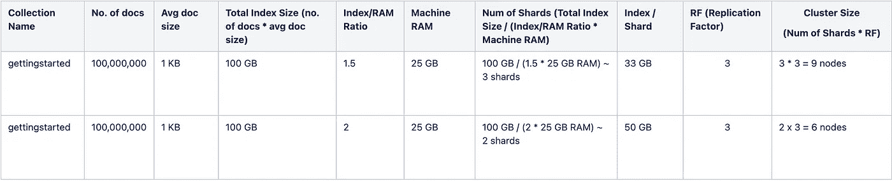

# Solr 反模式—第 1 部分

> 原文：<https://medium.com/walmartglobaltech/anti-patterns-in-solr-9361a9ae04e7?source=collection_archive---------1----------------------->

一个 [**反模式**](https://en.wikipedia.org/wiki/Anti-pattern) 是对一个重复出现的问题的常见回应，这种回应通常是无效的，并且有可能产生非常不利的后果。

这是描述 solr 反模式的系列文章中的第一篇，为了提高 Solr 集群的性能和稳定性，应该避免使用这些反模式。


Image by [David Zydd](https://pixabay.com/users/davidzydd-985081/?utm_source=link-attribution&utm_medium=referral&utm_campaign=image&utm_content=2502391) from [Pixabay](https://pixabay.com/?utm_source=link-attribution&utm_medium=referral&utm_campaign=image&utm_content=2502391)

最常见的反模式是:

## 1.深度分页

在 Solr 中，使用`start`和`rows`参数支持[基本分页搜索](https://solr.apache.org/guide/8_8/pagination-of-results.html#basic-pagination)，但是在 Solr 中使用[深度分页](https://solr.apache.org/guide/8_8/pagination-of-results.html#performance-problems-with-deep-paging)会出现性能问题。

使用非常大的`start`或`rows`参数值可能会适得其反。深度分页不仅需要 Solr 在内存中计算(和排序)应该为当前页面获取的所有匹配文档，还需要计算可能出现在以前页面上的所有文档。

解决方案:使用[游标查询](https://lucene.apache.org/solr/guide/8_1/pagination-of-results.html#fetching-a-large-number-of-sorted-results-cursors)来避免高起点和行参数的限制。游标查询是为深度分页而设计的，并推荐用于深度分页。使用游标查询时，需要注意的[约束](https://solr.apache.org/guide/8_1/pagination-of-results.html#constraints-when-using-cursors)很少。

## 2.显式提交和优化

应该避免从客户端应用程序发送显式提交请求，因为这会严重影响集群的性能。

运行优化将从索引中删除所有已删除的文档，并将创建一个单独的段。此操作将创建比未来合并所考虑的最大值大得多的段，您必须定期执行此操作。这是一个非常繁重的操作，在执行期间索引大小加倍，并且基本上再次重建索引。

解决方案:Solr 提供了[ignorecommoptimizeupdateprocessorfactory](https://solr.apache.org/guide/8_8/shards-and-indexing-data-in-solrcloud.html#ignoring-commits-from-client-applications-in-solrcloud)，将忽略所有显式提交/优化。这种改变可以在 solrconfig.xml 中完成。

## 3.没有[文档值](https://solr.apache.org/guide/8_8/docvalues.html#docvalues)的字段或大型结果集上的 SFPSGH

SFPSGH ->排序/方面/透视/统计/分组/突出显示

如果在没有 docValues 的字段上运行 SFPSGH 查询，那么 Solr 就不能使用 OS 缓存，而必须将该字段的整个索引加载到 JVM (Java 虚拟机)中。如果那个字段的索引大于分配给 Solr 的 JVM 堆，这将导致 Solr 节点用完内存。

即使 Solr 没有退出内存， *FieldCache* 也不会被推出 Solr JVM，而是永远留在那里，直到 Solr 节点重新启动或者您重新加载集合。

解决方案:为字段启用 docValues (docValue=true ),并缩小必须执行 SFPSGH 操作的查询结果集。

注意:不要为所有字段启用文档值。DocValues 在写入端有一个性能损失，如果您在许多字段上启用了它，将会导致您的接收速度变慢。此外，更改 docValue 需要重新索引文档。

## 4.无限制刻面

您需要小心地为查询设置适当的 facet.limit 参数。如果在具有许多唯一值的字段上设置 facet.limit=-1，情况尤其如此。

解决方案:尽量限制 facet 的结果集的数量，在启用了 docValue 的字段上使用 facet，并使用 [json facet API](https://solr.apache.org/guide/8_8/json-facet-api.html) 代替旧式的 facet。

## 5.将所有字段存储在 Solr 中

搜索索引是 RAM 受限的，因为它们必须将大部分索引保存在内存中。因此，不必要的字段存储会导致性能问题或增加硬件成本。

有时，有些字段不会被搜索，但需要显示在搜索结果中。您可以通过将字段属性设置为 stored=true 和 indexed=false 来实现。存储字段会增加索引的大小，索引越大，搜索越慢。

解决方案:根据业务需求存储和索引字段。

## 6.捕捉所有字段

托管模式中带有类似于<copyfield source="”*”" dest="”_text_”/">的条目的 _text_ field 被称为 catch-all 字段。</copyfield>

在某些情况下，如果客户端不知道可以搜索哪些字段，则可以启用此功能，但是在为“无所不包”字段的字段类型设计管道时要非常小心。如果您有同义词扩展或图形过滤器工厂，那么解析的查询可能会爆炸，并可能导致内存不足的问题，特别是如果您使用 solr 7.x，请参见以下错误报告片段:



[https://issues.apache.org/jira/browse/SOLR-13336](https://issues.apache.org/jira/browse/SOLR-13336)

欲了解更多详情，请阅读此处的。

解决方案:无所不包的字段会显著增加索引的大小。如果不需要，可以考虑删除该字段和相应的 copyField 指令。

## 7.堆大小:太大或太小

您需要理解，当涉及到 Solr 中的堆使用时，一种大小并不适合所有情况。您需要一个足够大的堆，这样您就不会有 OOM 异常和持续垃圾收集的问题，但也要足够小，这样您就不会浪费内存或遇到大量垃圾收集暂停。

解决方案:确定正确大小的最佳方法是分析位于日志目录中的垃圾收集(GC)日志。有各种各样的工具，如 [GCViewer](http://www.tagtraum.com/gcviewer.html) 和 [GCEasy](https://gceasy.io/) 可以帮助分析这些日志，特别是显示 GC 完成后使用的内存量。

## 8.大型事务日志(TLOGs)

只有当*你*告诉 Solr 进行硬提交(或者自动提交发生，在 solrconfig.xml 中配置)时，TLOGs 才会翻转。

因此，在批量加载的情况下，比如说每秒加载 1，000 个文档，并且一个小时内没有执行硬提交，那么您的单个 tlog 将包含 3，600，000 个文档。并且不正常的关闭可能导致在 Solr 节点开始营业之前完全重放它。这可能需要*个小时。*

解决方案:如果您有非常大的 tlogs，这是一件坏事，您应该更改您的硬提交设置。

## 9.在一个碎片中存储数十亿份文档

请记住，Lucene/Solr 对每个 lucene-index 有大约 21.4 亿个文档的限制，但是在 Solr 中，即使删除的文档也算作常规文档，并且更新的结果不是 1 个文档→而是 1 个删除的文档和 1 个新文档。

因此，被删除的文档也计入 21.4 亿个文档的限制中。由于删除的文档很难估计，建议将常规文档的数量限制在 10 亿。这为删除的文档提供了空间，也为扩展提供了一些缓冲。

解决方案:考虑到未来 6 个月到一年的数据增长，规划您的分片策略。您可以从 1.5 或 2 的索引/Ram 比率开始，假设您有 1 亿个大小为 1 KB 的文档，这意味着总大小为 100 GB。

在每个具有 25gb Ram 的节点/计算中，索引/Ram 比率为 1.5 或 2，您可以将索引大小保持在(35 到 40)或 50 GB(如果最少的方面/透视查询的查询率较低)。
您至少需要 2 或 3 个碎片来容纳 100 GB。



注意:这只是一个开始的例子，您必须进行适当的性能测试，以获得满足您的读写吞吐量的实际数字。

## **10。唯一键上的分组/分面**

对唯一键进行分组或分面不是有效的用例，因为唯一键字段的计数将始终为 1。但是有时用户会在不知不觉中犯这样的错误，这会导致集群中断。

假设 jobId 被定义为托管模式中的唯一键，那么运行下面的查询会导致 OOM，因为如果字段的基数(字段中唯一值的数量)很大(对于唯一键字段，基数最高)，分组和分面是繁重的操作。

```
q=*:*&group.ngroups=true&rows=0&group.field=jobId&group=true

q=*:*&facet.limit=-1&facet.field=jobId&rows=0&facet=true
```

注意:如果您想按唯一键排序，请确保您不是在排序数百万条记录，在运行 SFPSGH 之类的复杂操作之前，尝试缩小搜索结果的范围。

解决方案:避免在唯一键上运行分面/分组。

# 结论

这篇文章是我们列出 10 个最常见的 solr 反模式及其替代解决方案的第一部分。在[第 2 部分](/walmartglobaltech/solr-anti-patterns-part2-ad6b15a6e991)中，我们介绍了更多的反模式和解决方案，以帮助您提高集群的稳定性和性能。敬请期待！