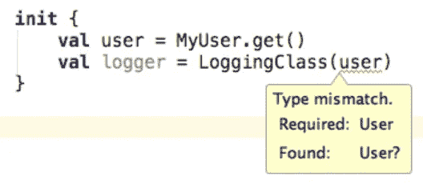

# Java 能做的任何事情 Kotlin 都能做得更好

> 原文：<https://medium.com/pinterest-engineering/anything-java-can-do-kotlin-can-do-better-a1c1ddae8ffd?source=collection_archive---------0----------------------->

Zach Westlake | Pinterest 工程师，核心体验

虽然最近有很多关于 Kotlin 的讨论，但你可能仍然会问自己为什么要使用它。Kotlin 做了哪些 Java 做不到的事情？对任何新技术保持健康的怀疑态度是有好处的。

但是 Kotlin 的秘密在于——这种语言本身基本上不会做 Java 做不到的事情。只要有足够的技巧，Kotlin 做的很多事情都可以在 Java 中复制。的确，您可以从头开始编写所有代码，而忽略 Kotlin 添加到开发环境中的过多工具和有用的附加功能。很多应用不使用 Kotlin 和 ship 就可以了。然而，Kotlin 比 Java 做得更好的是通过使代码简单易读来加速开发，同时消除一些您习惯编写的样板代码。

在这篇文章中，我们将关注两个特别有用的领域:Kotlin 中的属性和可空性。

## **属性**

让我们从用户模型开始，这是一个你可能在一个新的应用程序中创建的常见模型。用户模型有两个字段，电子邮件地址(即字符串)和用户年龄(例如整数)。在 Java 中，您可能习惯于将它写出来，或者让您喜欢的 IDE 自动生成它。下面是 Java 中的一个例子:

```
public final class User { @NotNull private final String email; private final int age; public User(@NotNull String email, int age) { if (email == null) { throw new RuntimeException("Email can't be null"); } super(); this.email = email; this.age = age; } @NotNull public final String getEmail() { return this.email; } public final int getAge() { return this.age; } public String toString() { return "User(email=" + this.email + ", age=" + this.age + ")"; } public int hashCode() { return (this.email != null ? this.email.hashCode() : 0) * 31 + this.age; } @NotNull public final User copy(@NotNull String email, int age) { Intrinsics.checkParameterIsNotNull(email, "email"); return new User(email, age); } public boolean equals(Object otherObject) { if(this != otherObject) { if(otherObject instanceof User) { User otherUser = (User)otherObject; if(this.email.equals(otherUser.email) && this.age == otherUser.age) { return true; } } return false; } else { return true; } }}
```

创建用户模型所需的 getters、setters 和 equal 函数大约需要 50 行代码。现在让我们在科特林做吧。

```
data class **User**(val email: String, val age: Int)
```

总的来说，Kotlin 以简单取胜，只有一行代码。这不是错误，这也不是 vim golf——它在功能上与 Java 代码完全相同。事实上，从技术上讲，这并不是 100%正确的，因为 Kotlin 代码还保护开发人员在编译时不会意外地将 email 作为空值传递。

## **可空性**

让我们继续讨论可空性。在这种情况下，Kotlin 在类型系统中内置了 null。这到底是什么意思？当你在 Kotlin 中定义一个对象时，你必须指定你是否允许它为空，因为默认情况下，对象是不可空的。

例如，让我们用 Java 编写一个简单的日志类，它需要用户的电子邮件来记录事件。

```
**public** **class** **LoggingClass** { **private** **final** User myUser; **public** **LoggingClass**(User myUser) {
  **this**.myUser = myUser;
 } **public** **void** **logEvent**(String eventName) {
  String userEmail = myUser.getEmail();
  AnalyticsClient.logEvent(eventName, userEmail);
 }

}
```

此 Java 代码的问题是，如果 myUser 为空，调用 logEvent 可能会导致 NullPointerException，从而导致崩溃，所以您尝试修复它:

```
**public** **class** **LoggingClass** { **private** **final** User myUser; **public** **LoggingClass**(User myUser) {
  **this**.myUser = myUser;
 } **public** **void** **logEvent**(String eventName) {
  **if (myUser != null) {
**   String userEmail = myUser.getEmail();
   AnalyticsClient.logEvent(eventName, userEmail);
  **}**
 }

}
```

如果我们诚实的话，我们都在某个时候见过或做过这种事。虽然这是一个快速的短期解决方案，但从长远来看，你只是把问题越拖越远。崩溃已经修复，但问题仍然存在，现在只是静静地失败，副作用是我们不再正确地记录事件，可能会导致痛苦的调试会话，试图找出原因。

让我们用 Kotlin 写同样的类:

```
**class** **LoggingClass**(**private** **val** **myUser**: **User**) { fun **logEvent**(eventName: String) {
  val userEmail = myUser.email
  AnalyticsClient.logEvent(eventName, userEmail)
 }}
```

在这个例子中，如果传递给它的用户模型可能为 null，那么(在正常情况下)就不可能编译这个应用程序。Kotlin 的一个优点是编译器会在这里生成一个错误，防止您创建一个 NullPointerException。



如上所示，编译器不允许我们将一个可能为 null 的用户传递给记录器。这意味着您不必担心用户对象为空，并且您可以通过保护空值来编写日志记录类，而不必担心用户模型的状态。

那么 Kotlin 在这里做什么来强制一个不能为空的值呢？让我们反编译我们的 Kotlin 代码来看看。除了编译时检查，Kotlin 还增加了运行时检查:

```
**public** **LoggingClass**(@NotNull User myUser) {
 Intrinsics.checkParameterIsNotNull(myUser, “myUser”);
 **super**();
 **this**.myUser = myUser;
}
```

您可以轻松地创建自己的 util 类，在运行时用 Java 实现这一点，并通过足够的技巧编写一个 linter，在编译时提供帮助，或者您可以使用 Kotlin 轻松地免费获得它。

## **结论**

Kotlin 使开发人员能够编写更少的代码，从而减少错误、节省时间和减轻压力。开发人员可以花更少的时间编写样板代码或修复 NullPointerExceptions，并将更多的时间用于产品创新和为用户提供更好的体验。


*这是我们关于科特林系列的第三篇文章。看看这些其他的:*

*   [*Kotlin 针对脾气暴躁的 Java 开发者*](/@Pinterest_Engineering/kotlin-for-grumpy-java-developers-8e90875cb6ab)
*   [*诉科特林案*](/@Pinterest_Engineering/the-case-against-kotlin-2c574cb87953)