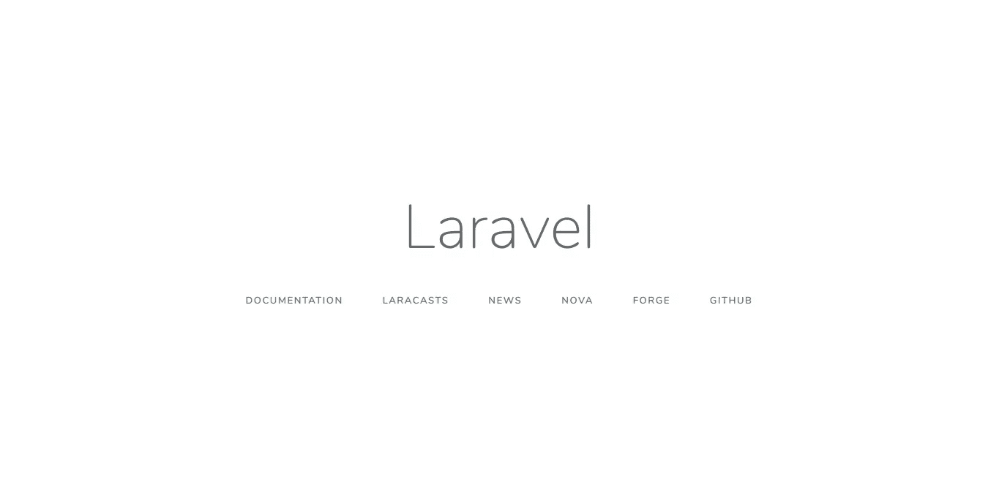

# Apa itu Artisan CLI pada Laravel?

> 原文：<https://medium.easyread.co/apa-itu-artisan-cli-pada-laravel-62a94232a29a?source=collection_archive---------2----------------------->

## Part 5 — Artisan CLI


Photo by [David Carboni](https://unsplash.com/@davidcarboni?utm_source=medium&utm_medium=referral) on [Unsplash](https://unsplash.com?utm_source=medium&utm_medium=referral)

# Laravel Series List

[**0\. Laravel Series — Belajar Laravel dari Awal yok!**](https://medium.com/easyread/laravel-series-belajar-laravel-dari-awal-yok-c21dc47863da)[**1\. Persiapan untuk Pengerjaan Proyek dengan Laravel**](https://medium.com/easyread/persiapan-untuk-pengerjaan-proyek-dengan-laravel-2f9a99146313)[**2\. Pengenalan Laravel Framework**](https://medium.com/easyread/pengenalan-laravel-framework-1c829b8164af)[**3\. Instalasi Laravel Framework**](https://medium.com/easyread/instalasi-laravel-framework-41eeec1551ef)[**4\. Struktur Folder Laravel Framework**](https://medium.com/easyread/struktur-folder-laravel-framework-299f0225cd55) **5\. Apa itu Artisan CLI pada Laravel?— (You’re here)** [**6\. Rancang Database-mu dengan Migration Pada Laravel**](https://medium.com/easyread/rancang-database-mu-dengan-migration-pada-laravel-28d419d0089e)[**7\. Mengarahkan Request dengan Router pada Laravel**](https://medium.com/easyread/mengarahkan-request-dengan-router-pada-laravel-a0df91142f51)[**8\. Olah Request dengan Controller pada Laravel**](https://medium.com/easyread/olah-request-dengan-controller-pada-laravel-a77b52235a4b)[**9\. Mudahnya Mengolah Data Menggunakan Model dan Eloquent pada Laravel**](https://medium.com/easyread/mudahnya-mengolah-data-menggunakan-model-dan-eloquent-pada-laravel-80af915c80b5)[**10\. Membuat Tampilan Web dengan Blade pada aplikasi Laravel — Part I**](https://medium.com/easyread/membuat-tampilan-web-dengan-blade-pada-aplikasi-laravel-part-i-c9f5ceee65e6)[**11\. Membuat Tampilan Web dengan Blade pada aplikasi Laravel — Part II**](https://medium.com/easyread/membuat-tampilan-web-dengan-blade-pada-aplikasi-laravel-part-ii-9e233233972a)

Untuk para pengembang aplikasi berbasis *web* yang menggunakan *framework* Laravel, Artisan CLI merupakan salah satu senjata utama yang harus dikuasai.

Ilustrasinya begini. Ibarat petani, bajak dipakai untuk mempermudah pekerjaan. Dengan bajak, petani bisa membajak sawahnya dengan cepat dan usaha yang lebih sedikit. Kalau pakai cangkul mungkin lebih lama kerjanya.

Jika ilustrasi petani pada ilustrasi diatas kita gantikan dengan pengguna *framework* Laravel, Artisan CLI adalah bajaknya. Artisan CLI akan membantu pengembang untuk meng- *generate* file-file dengan struktur kode dasar yang dibutuhkan pengembang. Pengembang bisa saja membuat file-file secara manual, tapi akan banyak waktu dan usaha. Contohnya, ketika membuat `controller` secara manual, pengembang perlu mengingat *class* mana saja yang di- *extend* dan digunakan oleh suatu `**controller**` . Ribet bukan?

Jadi, untuk langsung menggunakan Artisan CLI, teman-teman bisa membuka CMD atau terminal dan buka *root folder* project yang sudah di- *generate* sebelumnya. Coba jalankan perintah berikut

```
**php artisan list**
```

Maka akan muncul daftar perintah yang bisa kita gunakan pada Artisan CLI.

```
Available commands:
  clear-compiled       Remove the compiled class file
  down                 Put the application into maintenance mode
  dump-server          Start the dump server to collect dump information.
  env                  Display the current framework environment
  help                 Displays help for a command
  inspire              Display an inspiring quote
  list                 Lists commands
  migrate              Run the database migrations
  optimize             Cache the framework bootstrap files
  preset               Swap the front-end scaffolding for the application
  serve                Serve the application on the PHP development server
  tinker               Interact with your application
  up                   Bring the application out of maintenance mode
 app
  app:name             Set the application namespace
 auth
  auth:clear-resets    Flush expired password reset tokens
 cache
  cache:clear          Flush the application cache
  cache:forget         Remove an item from the cache
  cache:table          Create a migration for the cache database table
 config
  config:cache         Create a cache file for faster configuration loading
  config:clear         Remove the configuration cache file
 db
  db:seed              Seed the database with records
 event
  event:generate       Generate the missing events and listeners based on registration
 key
  key:generate         Set the application key
 make
  make:auth            Scaffold basic login and registration views and routes
  make:channel         Create a new channel class
  make:command         Create a new Artisan command
  make:controller      Create a new controller class
  make:event           Create a new event class
  make:exception       Create a new custom exception class
  make:factory         Create a new model factory
  make:job             Create a new job class
  make:listener        Create a new event listener class
  make:mail            Create a new email class
  make:middleware      Create a new middleware class
  make:migration       Create a new migration file
  make:model           Create a new Eloquent model class
  make:notification    Create a new notification class
  make:observer        Create a new observer class
  make:policy          Create a new policy class
  make:provider        Create a new service provider class
  make:request         Create a new form request class
  make:resource        Create a new resource
  make:rule            Create a new validation rule
  make:seeder          Create a new seeder class
  make:test            Create a new test class
 migrate
  migrate:fresh        Drop all tables and re-run all migrations
  migrate:install      Create the migration repository
  migrate:refresh      Reset and re-run all migrations
  migrate:reset        Rollback all database migrations
  migrate:rollback     Rollback the last database migration
  migrate:status       Show the status of each migration
 notifications
  notifications:table  Create a migration for the notifications table
 optimize
  optimize:clear       Remove the cached bootstrap files
 package
  package:discover     Rebuild the cached package manifest
 queue
  queue:failed         List all of the failed queue jobs
  queue:failed-table   Create a migration for the failed queue jobs database table
  queue:flush          Flush all of the failed queue jobs
  queue:forget         Delete a failed queue job
  queue:listen         Listen to a given queue
  queue:restart        Restart queue worker daemons after their current job
  queue:retry          Retry a failed queue job
  queue:table          Create a migration for the queue jobs database table
  queue:work           Start processing jobs on the queue as a daemon
 route
  route:cache          Create a route cache file for faster route registration
  route:clear          Remove the route cache file
  route:list           List all registered routes
 schedule
  schedule:run         Run the scheduled commands
 session
  session:table        Create a migration for the session database table
 storage
  storage:link         Create a symbolic link from "public/storage" to "storage/app/public"
 vendor
  vendor:publish       Publish any publishable assets from vendor packages
 view
  view:cache           Compile all of the application's Blade templates
  view:clear           Clear all compiled view files
```

Banyak bukan? Saya sendiri juga belum pernah menggunakan semua perintah pada Artisan CLI. Tapi di *part* ini, saya akan tunjukkan beberapa perintah pada Arisan CLI yang menurut saya akan sangat membantu pekerjaan kita.

*   `**php artisan serve**` , adalah perintah yang kita gunakan untuk menjalankan aplikasi kita pada *localhost.* Dengan menjalankan perintah diatas, maka akan muncul pesan berikut di shell teman-teman.

```
**Laravel development server started: <**[**http://127.0.0.1:8000**](http://127.0.0.1:8000)**>**
```

Artinya kita bisa mengakses `127.0.0.1:8000` atau `localhost:8000` melalui *web browser* kita untuk melihat aplikasi kita.



Tampilan awal dari aplikasi aplikasi kita

*   `**php artisan key:generate**` , adalah perintah untuk men-generate *random string* yang digunakan sebagai *key* yang diperlukan untuk semua proses enkripsi dan dekripsi pada aplikasi kita. Proses yang saya maksud seperti proses *session* , *CSRF token, sign url,* dan masih banyak lagi. Berikut adalah potongan file `**.env**` pada project saya dan `**APP_ENV**` -nya sengaja saya hapus untuk contoh pada tutorial ini.

```
APP_NAME=Laravel
APP_ENV=local
APP_KEY=
APP_DEBUG=true
APP_URL=[http://localhost](http://localhost)
```

Berikut adalah potongan file `**.env**` project saya setelah menjalankan perintah `**php artisan key:generate**` . Variable `**APP_ENV**` pada proyek saya sudah terisi *random string* sebagai *key* pada aplikasi saya.

```
APP_NAME=Laravel
APP_ENV=local
APP_KEY=base64:BUxta68R42x12cfOV4xPyFrExTxzIXX1icXl8HRG6QM=
APP_DEBUG=true
APP_URL=[http://localhost](http://localhost)
```

*   `**php artisan make:controller <ControllerName>**` , adalah perintah untuk men- *generate* file `**controller**` yang akan ditempatkan di folder `**Http\Controller**`
*   `**php artisan make:model <ModelName>**` , adalah perintah untuk men- *generate* file `model` yang akan ditempatkan di folder `**App**`
*   `**php artisan make:migration <MigrationName>**` , adalah perintah untuk men- *generate* file `**migration**` yang akan ditempatkan pada folder `**database\migrations**`

Itu adalah beberapa perintah Artisan CLI yang akan membantu kita dalam penggunaan *framework* Laravel. Teman-teman bisa eksplorasi fitur-fitur Artisan CLI yang lain secara pribadi.

Oh iya, ada satu perintah lagi yang menjadi favorit saya, yaitu `**php artisan inspire**` . Perintah ini akan menampilkan *random quote* untuk menyemangati teman-teman.


Taken from me.me

Sampai jumpa di- *part* berikutnya!

Cappy Hoding! ❤️ = ☕️ + 💻