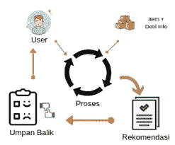
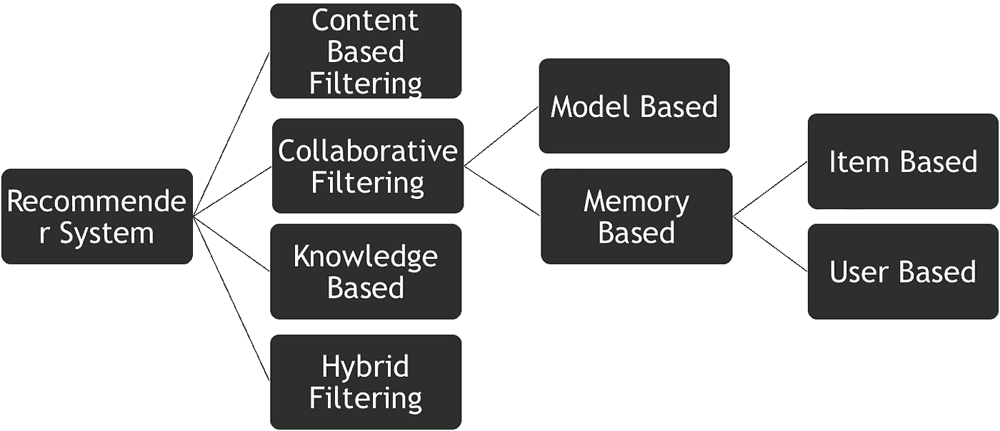

# Apa itu Sistem Rekomendasi[Recommender System]?

> 原文：<https://medium.easyread.co/apa-itu-sistem-rekomendasi-recommender-system-45bf5825ac04?source=collection_archive---------0----------------------->

detroitlabs.com

Akhirnya bisa sempet nulis lagi, ada topik yang sebenarnya saya udah ga tahan mau di publish disini. Niatnya pas nanti ketika blog pribadi udah rilis, tulisan pertama saya mau buat series tentang topik ini. Tapi karena masih dalam development dan ga jadi-jadi dari pada lupa dan hilang semangat saya untuk nulisnya, akhirnya saya buka aja deh disini.

Sesuai judulnya, kamu akan saya ajak beberapa menit saja untuk melihat isi curhat saya disini.

**Apa itu Sistem Rekomendasi?**

Ada yang penasaran gimana sih Youtube atau Netflix bisa kasih aku dan kamu banyak rekomendasi channel atau video-video yang kita suka atau yang sering kita tonton ? Gimana musik Spotify bisa kasih rekomendasi musik-musiknya ke aku dan kamu? Atau kok bisa Amazon bisa tau kalau buku-buku yang dikasih tuh tipe aku dan kamu banget? Jika memang iya penasaran silakan lanjutkan bacaan ini sampai kamu merasa cukup dengan penjelasan saya, dan buat kamu yang tertarik mengetahui dibalik prosesnya gapapa ga usah dipaksain untuk terus dibaca, saya ga marah kok :)

Jadi *apa itu Sistem Rekomendasi?*

Sistem rekomendasi merupakan teknik untuk memberikan rekomendasi / saran / prediksi terhadap sesuatu (item) yang terkait dengan pengguna. Bisa berupa film untuk di tonton, buku untuk dibaca, produk untuk dibeli atau pun sesuai di industri.

Mungkin karena jumlah pertumbuhan dan perkembangan informasi sudah sangat cepat dan banyak, sehingga berlebih untuk penggunanya dan informasi yang dibutuhkan atau diinginkan terlewat dan tidak dapat lagi di temukan, maka datanglah rekomendasi-rekomendasi ini untuk saya dan kamu sebagai pengguna.

Prosesnya kurang lebih seperti ini :

Kalau dari gambarnya si, penjelasannya seperti ini :

*   Pengguna

Dari pengguna, akan didapatkan informasi dan deskripsi berupa riwayat pribadi, riwayat pencarian, riwayat kegiatan, dan riwayat penilaian secara langsung.

*   *Item*

Sedangkan dari *Item* , didapatkan informasi dan deskripsi berupa detil *item* tersebut, dan *item* yang telah dinilai. *Item* tersebut bisa berupa produk, barang, komponen kriteria, buku, film, musik, dan semacamnya.

*   Proses Rekomendasi

Untuk proses rekomendasi, dilakukan pemrosesan rekomendasi terhadap data yang telah di dapatkan seperti data pengguna dan *item* nya. Proses rekomendasi dilakukan berdasarkan pendekatan yang dipilih. Pendekatan yang dipilih sangat menentukan parameter apa saja yang akan diperlukan.

*   Hasil Rekomendasi

Hasil rekomendasi yang dihasilkan berupa *item* yang telah diproses dengan menggunakan pendekatan yang telah dipilih.

*   Umpan Balik

Dari hasil yang didapatkan, pengguna dapat berkesempatan membuat umpan balik terhadap hasil rekomendasi yang didapatkan. Biasanya dengan mengunjungi *item* yang telah diberikan sampai dengan memberikan sebuah *rating* atau penilaian. Dari umpan balik tersebut diketahui pengguna tersebut menyukai atau tidak rekomendasi yang telah diberikan. Dari hasil umpan balik tersebut akan dijadikan sumber data baru sebagai proses rekomendasi berikutnya.

Terakhir yang saya pelajari di tahun lalu, metodenya atau pendekatannya dibagi menjadi beberapa, terlihat seperti di bawah ini :

Untuk penjelasan lebih lanjut mengenai masing — masing metode atau pendekatannya, saya akan bahas di tulisan berikutnya. Karena saat ini saya nulisnya malam-malam, sudah ngantuk ehehe.

**Kesimpulannya**

Sistem rekomendasi merupakan sistem yang tepat untuk memberikan pengguna suatu saran karena zaman now informasi yang kita dapatkan sudah terlalu banyak di internet, manfaat lainnya meningkatkan engagement pengguna terhadap aplikasi atau tool yang kita kembangkan. Dengan adanya sistem rekomendasi, pengguna dapat terbantu untuk mengefisienkan pencarian informasi yang mereka butuhkan.

Saya akhiri untuk sesi kali ini ya, selamat membaca dan semoga bermanfaat.

Perbanyak referensi agar semakin matang ya teman-teman.

Mari kita berteman, bisa cari saya di [@pandhu_wibowo](https://twitter.com/pandhu_wibowo) , main-main ke [sini](https://www.instagram.com/pandhu.wibowo/) .

Terima kasih. Salam.