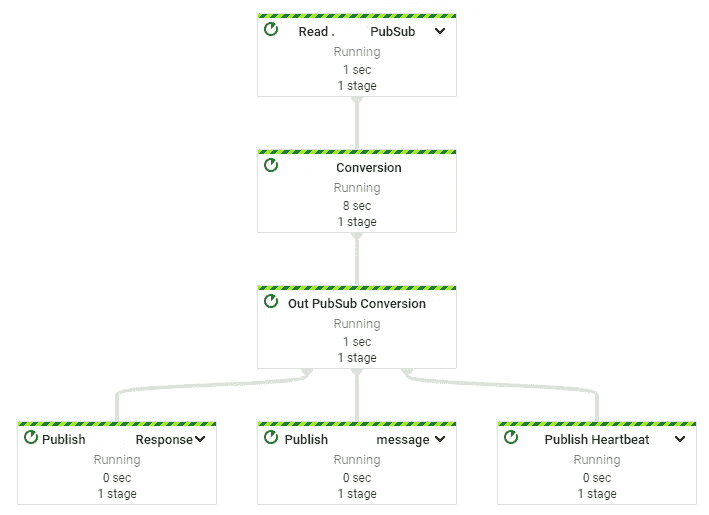

# Apache Beam 数据流 GCP 管道设置框架

> 原文：<https://medium.com/globant/apache-beam-dataflow-gcp-pipeline-setup-framework-447835fd67cb?source=collection_archive---------2----------------------->


**Apache Beam Dataflow Pipeline**

本文的目的是提供使用 [Apache Beam](https://beam.apache.org/) 在 [GCP](https://cloud.google.com/) (谷歌云平台)建立管道时所需的样板代码，这样开发者就不需要在多个项目中重复编写类似的代码。这有助于开发人员将数据流选项和编码传递给框架，框架负责设置它们。它为`PubsubMessage`设置自定义和默认的编码器，并返回一个在数据流中使用的`Pipeline` 实例。



**Schematic of GCP Pipeline**

本文的读者应该对 Apache Beam 管道和管道术语有所了解。这个故事对在[数据科学](https://en.wikipedia.org/wiki/Data_science)和[大数据](https://en.wikipedia.org/wiki/Big_data)处理领域工作的读者很有帮助。

# **支持数据的批处理和流式传输**

大数据正在三个方面扩展:数据量、数据速度和数据多样性。它支持通过批处理和流处理数据。Apache Beam 是一个开源的高级统一编程模型，适用于批处理(有限)和流(连续)用例。使用 Apache Beam，可以使用 SDK([Java](https://www.java.com/)、 [Python](https://www.python.org/) 、 [Go](https://go.dev/) 和 [Scala](https://www.scala-lang.org/) )创建 BigData 处理管道。

Apache Beam 流水线可以在最流行的数据处理系统中执行，如 [GCP 数据流](https://cloud.google.com/dataflow)、 [Spark](https://spark.apache.org/) 、 [Flink](https://flink.apache.org/) 、 [Hadoop Map Reduce](https://en.wikipedia.org/wiki/MapReduce) 等。，并提出了类似于 [ETL](https://en.wikipedia.org/wiki/Extract,_transform,_load) (提取、转换和加载)[分析](https://en.wikipedia.org/wiki/Analytics)和[流处理](https://hazelcast.com/glossary/stream-processing/)的解决方案。管道是消息在云系统中流动的主要媒介。

# **使用阿帕奇光束的原因**

我们将看到下面的用例以及有资格使用 Apache Beam 的情况。

*   **消息驱动系统**:在不同消息类型的消息驱动系统中，我们可以创建不同的管道，将消息从一种形式转换为另一种形式，并发布到[GCP](https://cloud.google.com/pubsub/docs/overview)的相关主题中。
*   **用于处理消息的双工和多路复用管道**:管道可以是双工或多路复用的，通过它它们可以监听来自前端和后端的消息并独立地处理它们。
*   **异步消息处理:**以消息的形式异步处理大数据。
*   **关注业务逻辑需求:**开发人员可以关注核心业务逻辑，而不用担心消息是如何在系统中处理和流动的。
*   **系统性能问题:**一旦消息处理被委托给 GCP Apache Beam 管道开发人员，就不必担心系统在负载下的性能，因为这一切都由 GCP 管理。

# **框架的积木**

以下部分显示了管道和编码器的类别。

## 管道类别

`AcmePipeline`类提供了一组变量、构造函数、管道设置方法和管道编码程序。

```
class AcmePipeline {
  Pipeline pipeline;
  DataflowPipelineOptions options;
  PipelineOptionsFactory.Builder pipelineBuilder;
  AcmePipeline(PipelineOptionsFactory.Builder pipelineBuilder)
  AcmePipeline(String[] args, Class < ?
    extends DataflowPipelineOptions > clazz, List < AcmeCoder >
    coders)
  AcmePipeline(String[] args, Class < ?
    extends DataflowPipelineOptions > clazz, List < AcmeCoder >
    coders, boolean streaming)
  AcmePipeline(String[] args, Class < ?
    extends DataflowPipelineOptions > clazz)

  createPipeline(DataflowPipelineOptions options)
  createPipeline(DataflowPipelineOptions options, booleam streaming)
  createPipeline(DataflowPipelineOptions options, List < AcmeCoder >
    coders)
  createPipeline(DataflowPipelineOptions options, List < AcmeCoder >
    coders, booleam streaming)

  registerCoders(Pipeline pipeline, List < AcmeCoder > coders)
  void setOptions(DataflowPipelineOptions options)
  DataflowPipelineOptions getOptions()
  Pipeline getPipeline()
}
```

## 编码器类别

`AcmeCoder`类提供了一组注册定制编码者和注册默认编码者的方法。

```
class AcmeCoder {
  Class < ? > clazz;
  Coder < ? > coder;
  void registerCoders(CodeRegistry codeRegistry, List < AcmeCoder > coders)
  void registerDefaultCoders(CodeRegistry codeRegistry)
}
```

我们已经创建了类`AcmePipeline`和`AcmeCoder`来设置管道中的编码员。默认的编码器是`**PubsubMessage.class**`的`**PubsubMessageWithAttributesCoder**`及其属性。

## 设置管道

管道可以按如下方式设置:

```
public AcmePipeline(String[] args, Class < ?
  extends DataflowPipelineOptions > clazz, List < AcmeCoder > coders
  ) {
  PipelineOptionsFactory.register(clazz);
  this.options = (DataflowPipelineOptions) PipelineOptionsFactory
    .fromArgs(args).withValidation().as(clazz);
  this.options.setStreaming(true);
  this.pipeline = Pipeline.create(this.options);
  log.info("Register coders called");
  this.registerCoders(this.pipeline, coders);
  this.setOptions(this.options);
}
```

在上面的例子中，`AcmePipeline()`构造函数接受提到的具有数据流选项的命令行参数、`DataflowPipelineOption`的相应的`Pipeline` 特定实现，以及`List<AcmeCoder>`管道用于消息转换的编码器。管道的默认操作模式是流真，因为管道将处理流数据。

## 登记编码员

编码器的设置如下:

`registerCoder()`调用从管道中获取`CoderRegistry`，并调用各自`AcmeCoder`上的 registerCoders 在管道中注册自己。结束时的调用`registerDefaultCoders()`如下。

```
public static void registerDefaultCoders(
CoderRegistry coderRegistry) {
  coderRegistry.registerCoderForClass(PubsubMessage.class,
    PubsubMessageWithAttributesCoder.of());
}
```

数据流适配器可以使用`initDataflowPipeline()`初始化数据流管道来设置管道。

`**PubsubMessageWithAttributesCoder**` 是序列化和反序列化`PubsubMessage`所需的编码器。`PubsubMessage`是 GCP 预定义的报文格式。我们可以把这个编码器当作我们需要的缺省编码器，由 Apache Beam 库提供。

```
public void initDataflowPipeline(String[] args) {
  if (null != args && 0 < args.length) {
    AcmePipeline acmePipeline = new AcmePipeline(args,
      AcmeDataflowOptions.class, getCoders());
    AcmeDataflowOptions options = (AcmeDataflowOptions) acmePipeline
      .getOptions();
    executePipeline(options, acmePipeline.getPipeline());
  }
}
```

编码者列表如下:

```
private List < AcmeCoder > getCoders() {
  List < AcmeCoder > coders = new ArrayList < > ();
  coders.add(new AcmeCoder(HBMessage.class, new HBMessageCoder()));
  coders.add(new AcmeCoder(HBData.class, new HBDataCoder()));
  coders.add(new AcmeCoder(DeviceShutdownMessage.class,
    new DeviceShutdownMessageCoder()));
  return coders;
}
```

每个编码器类从`org.apache.beam.sdk.coders.CustomCoder`扩展并实现`encode()`和`decode()`。这是在转换过程中**序列化**和**反序列化**消息所必需的；`encode()`用于序列化，`decode()`用于反序列化。

## 创建管道

可以按如下方式创建管道:

```
public AcmePipeline(String[] args, Class < ?
  extends DataflowPipelineOptions > clazz, List < AcmeCoder > coders
  ) {
  PipelineOptionsFactory.register(clazz);
  options = PipelineOptionsFactory.fromArgs(args).withValidation()
    .as(clazz);
  options.setStreaming(true);
  pipeline = Pipeline.create(options);
  registerCoders(pipeline, coders);
  setOptions(options);
}

public void createPipeline(DataflowPipelineOptions options,
  boolean streaming) {
  options.setStreaming(streaming);
  pipeline = Pipeline.create(options);
}
```

# 结论

我希望通过这篇文章，您可以了解如何开发一个框架，以便在 GCP 无缝地建立 beam 管道。为了更好地理解 Apache Beam 基础知识，请阅读下面的故事:

[](/globant/apache-beam-with-gcp-dataflow-and-pubsub-c10235a7b598) [## 具有 GCP 数据流和公共订阅的 Apache Beam

### 介绍

medium.com](/globant/apache-beam-with-gcp-dataflow-and-pubsub-c10235a7b598) 

感谢您的阅读！