# 具有 GCP 数据流和公共订阅的 Apache Beam

> 原文：<https://medium.com/globant/apache-beam-with-gcp-dataflow-and-pubsub-c10235a7b598?source=collection_archive---------0----------------------->

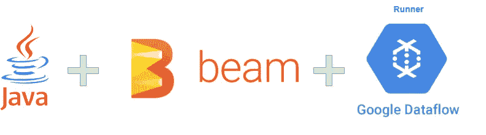

# **简介**

在本文中，我们将看看如何在 Java 中使用 apache beam 创建数据流管道。我们还将了解如何构建和部署管道，使用 beam 测试框架编写集成测试用例，并且我们还将研究一些高级概念，如使用元组标签来划分管道。

*   [Apache beam](https://beam.apache.org/get-started/beam-overview/) —这是一个用于在更短的时间内创建分布式批处理和流式生产就绪管道的框架，它非常灵活，支持多个源和接收器，并支持各种**分布式处理后端**，其中包括 [Apache Flink](https://flink.apache.org/) 、 [Apache Spark](http://spark.apache.org/) 和 [Google Cloud Dataflow](https://cloud.google.com/dataflow) 。

beam 对于令人尴尬的并行数据处理任务特别有用，在这种任务中，问题可以分解成许多更小的数据束，这些数据束可以独立并行处理。您还可以将 Beam 用于提取、转换和加载(ETL)任务以及纯数据集成。这些任务有助于在不同的存储介质和数据源之间移动数据，将数据转换为更理想的格式，或将数据加载到新系统中。

*   [GCP 数据流](https://cloud.google.com/dataflow#section-6) —这是一个用于运行 apache beam 管道的托管服务。据说它也是由阿帕奇横梁支撑的转轮之一。

# 用例

假设我们要构建一个数据流作业，该作业从 GCP pubsub topic***input-topic***读取数据，订阅名为***input-topic-sub***，处理该数据并将消息转换为另一种格式，然后将其放回到另一个 pubsub topic，名为***【output-topic***，如果在转换过程中出现任何错误，如验证错误或格式错误的 JSON 错误，我们需要创建错误消息并将其放入 pubsub**也就是说，我们必须根据成功和错误来划分我们的管道。**

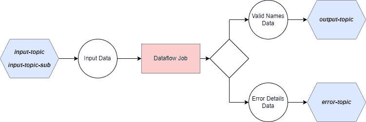

例如，假设我们有一个 JSON 格式的输入消息，它只有两个字段，即 ***名字*** 和 ***姓氏*** 作为-

```
{firstname: "harsh", lastname: "sharma"}
```

现在，转换后的消息应该有三个字段，分别是 ***全名*** 、 ***id、*** 和 ***长度*** 作为-

```
{fullname: "Harsh Sharma", id: "Unique-Id", length: 12}
```

现在，如果 firstname 或 lastname 为空或者不符合标准，我们应该在错误主题上发布一条错误消息，作为-

```
{fields: [{field: "firstname", message:"Should not be empty"}, {field: "lastname", message:"Should not contain any special characters"}], error: "Validation Error"}
```

# 行动中的代码

*   **定义管道选项**

创建一个名为*nametransformoroptions*的类，该类扩展了***DataflowPipelineOptions***声明 inputSubscription、outputTopic、outputErrorTopic 的 setter 和 getter 方法，并将其他 GCP 参数配置为—

```
import org.apache.beam.runners.dataflow.options.DataflowPipelineOptions;
import org.apache.beam.sdk.options.Default;
import org.apache.beam.sdk.options.Description;
import org.apache.beam.sdk.options.Validation;public interface NameTransformerOptions extends DataflowPipelineOptions { // specific to Dataflow Runner
    // inputSubscription - for input PubSubMessage
    [@Description](http://twitter.com/Description)("The Cloud Pub/Sub subscription to consume from. " + "The name should be in the format of "
        + "projects/<project-id>/subscriptions/<subscription-name>.")
    [@Validation](http://twitter.com/Validation).Required
    String getInputSubscription();
    void setInputSubscription(String inputSubscription);//outputTopic - for Out PubSubMessage
    [@Description](http://twitter.com/Description)("The Cloud Pub/Sub topic to publish to. The name should be in the format of projects/<project-id>/topics/<topic-name>.")
    [@Validation](http://twitter.com/Validation).Required
    String getOutputTopic();
    void setOutputTopic(String outputTopic);// outputErrorTopic - for error during message processing
    [@Description](http://twitter.com/Description)("The Output error topic Pub/Sub to publish errors to")
    [@Validation](http://twitter.com/Validation).Required
    String getOutputErrorTopic();
    void setOutputErrorTopic(String outputErrorTopic);[@Description](http://twitter.com/Description)("Windowing delay in minutes for allowed lateness.")
    [@Default](http://twitter.com/Default).Long(60)
    Long getAllowedWindowDelayInMins();
    void setAllowedWindowDelayInMins(Long allowedWindowDelayInMins);[@Description](http://twitter.com/Description)("Window time in seconds. ")
    [@Default](http://twitter.com/Default).Long(10)
    Long getWindowTimeInSeconds();
    void setWindowTimeInSeconds(Long windowTimeInSeconds);[@Description](http://twitter.com/Description)("Max No. of elements in window")
    [@Default](http://twitter.com/Default).Integer(1000)
    Integer getWindowElementsSizeLimit();
    void setWindowElementsSizeLimit(Integer windowElementsSizeLimit);[@Description](http://twitter.com/Description)("Pub/Sub max batch size ")
    [@Default](http://twitter.com/Default).Integer(10)
    Integer getPubSubMaxBatchSize();
    void setPubSubMaxBatchSize(Integer pubSubMaxBatchSize);
}
```

*   **创建输入输出的 DTO**

```
[@Data](http://twitter.com/Data)
public class InputDto implements Serializable { // Serializable is needed for PTransform
    private static final long serialVersionUID = -33331355L; @NotBlank(message="Should not be empty") @SpecialChar(message="Should not contain any special char")//Custom Validator
private String firstname;@NotBlank(message="Should not be empty") @SpecialChar(message="Should not contain any special char")
private String lastname;
}[@Data](http://twitter.com/Data)
public class OutputDto implements Serializable {
    private static final long serialVersionUID = -13331355L;
    private String id;
    private String fullname;
    private Integer length;
    private ErrorDto errorDto; // report error
}[@Data](http://twitter.com/Data)
public class ErrorDto implements Serializable {
    private static final long serialVersionUID = -23331355L;
    private List<FieldError> fields;
    private String error;
}[@Data](http://twitter.com/Data)
public class FieldError implements Serializable {
    private static final long serialVersionUID = -23331355L;
    private String field;
    private String message;
}
```

*   **创建管道—**

我们正在创建具有所需选项的管道。另外，我们需要**注册编码员**。原因是阿帕奇波束移动中的数据。它既可以保存在磁盘上，也可以在工作线程之间转移。编码器负责这两个操作，因为它解释了如何将数据写入磁盘或通过网络传输并转换回对象。每个 p 集合< T >操作都需要编码器。没有它，管道就不会执行，因为运行者不知道如何将 Java 对象转换成持久格式。

例如下面的 InputDtoCoder 用于**序列化和反序列化**输入的 dto —

```
import com.demo.dto.InputDto;
import com.demo.util.JsonUtil;
import org.apache.beam.sdk.coders.CoderException;
import org.apache.beam.sdk.coders.CustomCoder;
import org.apache.beam.sdk.util.StreamUtils;

import java.io.IOException;
import java.io.InputStream;
import java.io.OutputStream;
import java.nio.charset.StandardCharsets;

public class InputDtoCoder extends CustomCoder<InputDto> {
    private static final long *serialVersionUID* = -83328263L;

    @Override
    public void encode(InputDto value, OutputStream outStream) throws IOException {
        if (value == null) {
            throw new CoderException("* cannot encode a null object of type InputDto");
        }
        String json = JsonUtil.*serialize*(value);
        byte[] bytes = json.getBytes();

        outStream.write(bytes);
    }

    @Override
    public InputDto decode(InputStream inStream) throws IOException   {
        byte[] bytes = StreamUtils.*getBytesWithoutClosing*(inStream);
        String json = new String(bytes, StandardCharsets.*UTF_8*);
        return JsonUtil.*deserialize*(json, InputDto.class);
    }
}
```

类似地，你可以为输出创建 DTO，有一些编码器已经存在于 beam 的 lib 中，比如 publibsubmessagewithattributescoder。

现在，为了使用这些代码，你需要通过代码注册来注册，比如

```
CoderRegistry coderRegistry = pipeline.getCoderRegistry()coderRegistry.registerCoderForClass(PubsubMessage.class, PubsubMessageWithAttributesCoder.*of*());
coderRegistry.registerCoderForClass(InputDto.class, new InputDtoCoder());
coderRegistry.registerCoderForClass(OutputDto.class, new OutputDtoCoder());
```

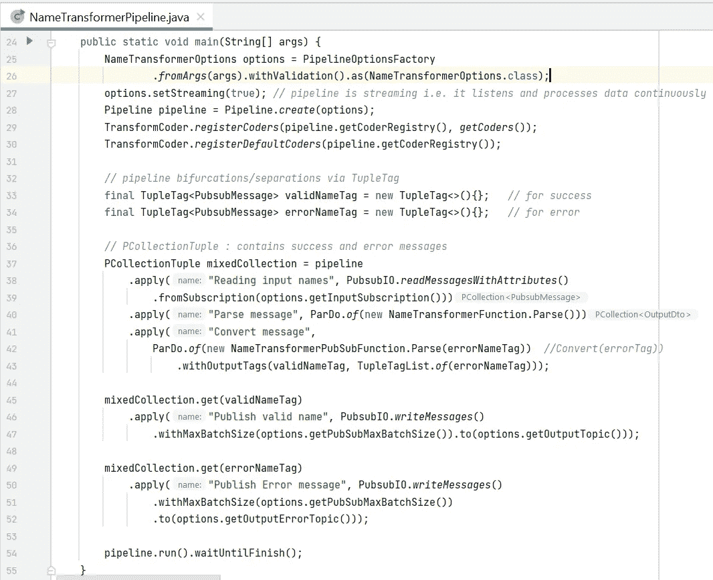

在上述管道中，有两个名为 NameTransformerFunction 和 NameTransformerPubSubFunction 转换函数

*   **名称转换功能**

它将用于从有效负载获取输入 pubsub 消息，然后将其序列化为 InputDTO 消息，再将其转换为 OutputDTO 消息

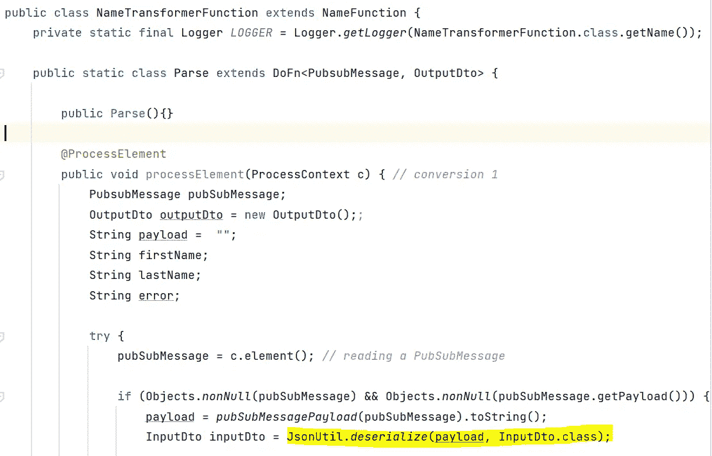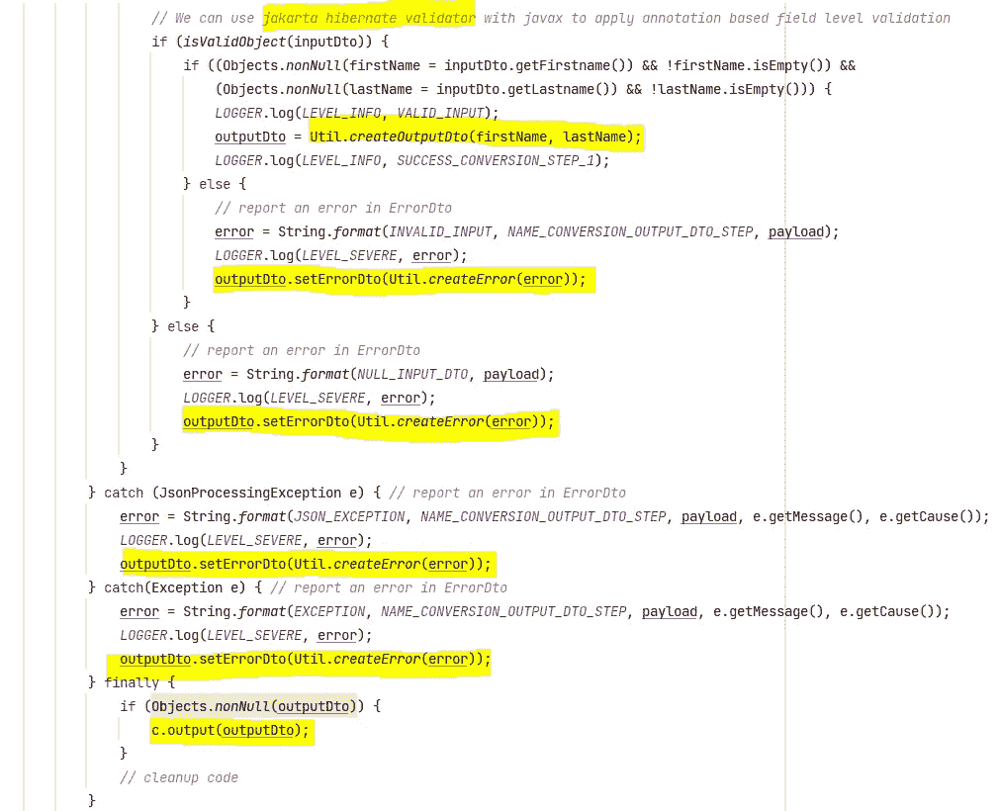

我创建了一个 Util 类来创建输出和错误对象，如下所示

```
public static OutputDto createOutputDto(String firstName, String lastName) {
    String fullName = firstName.concat(" ").concat(lastName);
    OutputDto outputDto = new OutputDto();
    outputDto.setFullName(fullName);
    outputDto.setId(UUID.*randomUUID*().toString());
    outputDto.setLength(fullName.length());
    return outputDto;
}public static ErrorDto createError(String error) {
    ErrorDto errorDto = new ErrorDto();
    errorDto.setMessage(error);
    return errorDto;
}

public static ErrorDto createError(String error, List<FieldError> list) {
    ErrorDto errorDto = new ErrorDto();
    errorDto.setMessage(error);
    *//Any field errors* errorDto.setFields(list);
    return errorDto;
}
```

*   **命名 TransformerPubsubFunction**

用于将 OutpuDTO 消息转换为 pubsub 消息，并基于元组标签对消息进行分叉，元组标签为 ***validNameTag*** 和 ***errorNameTag*** 。

如果您想要输出带有标记的消息，则必须在流程上下文的输出方法中指定标记名，如果您不指定标记，则消息将标记为默认标记。

现在问题来了，谁来决定默认标签？答案是，当我们创建了管道并指定了不带输出标签的***(valid name tag，tuple taglist . of(error name tag))***，第一个参数被注册为默认值，这就是为什么我们在构造函数中只传递了 *errorNameTag* 。

此外，请注意，我们将错误对象包装在 OutputDto 对象中，原因是我们只希望分支发生在管道的最后阶段。

同样对于转换，我们使用了 ***Jackson*** lib 对象映射器来序列化和反序列化它。

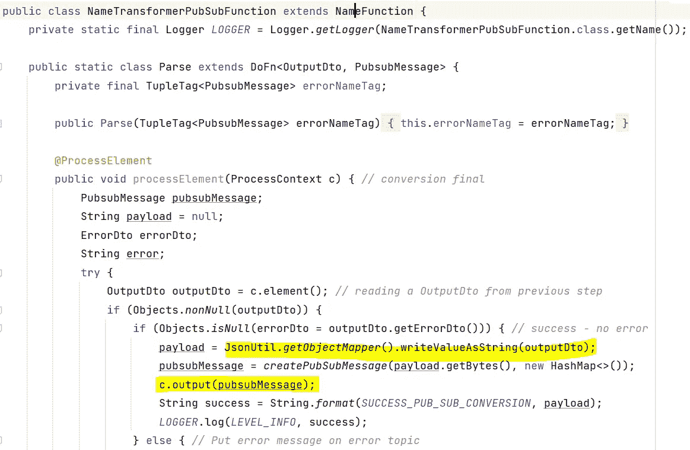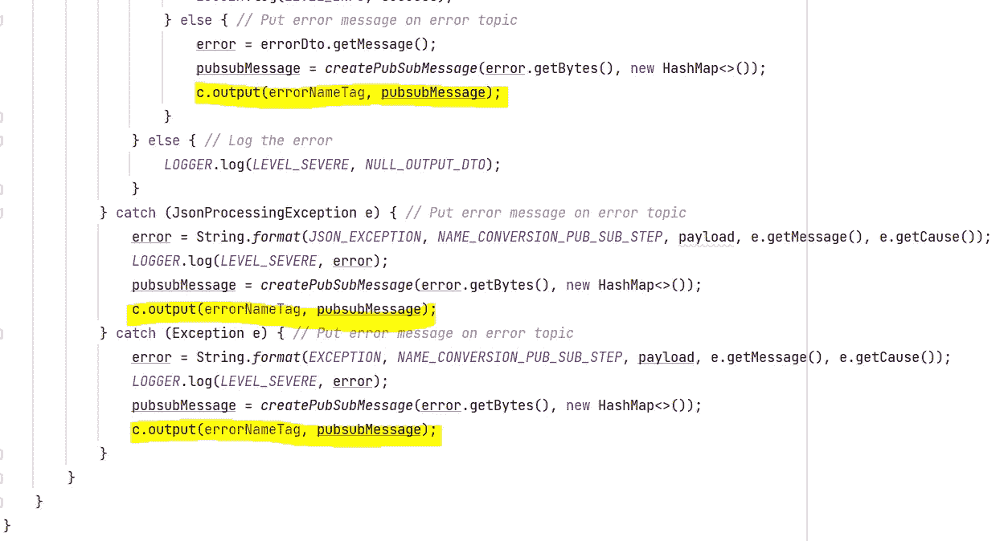

两个函数类都扩展了名称函数。这是一个自定义创建的类，有一些消息转换方法和一些公共常量。

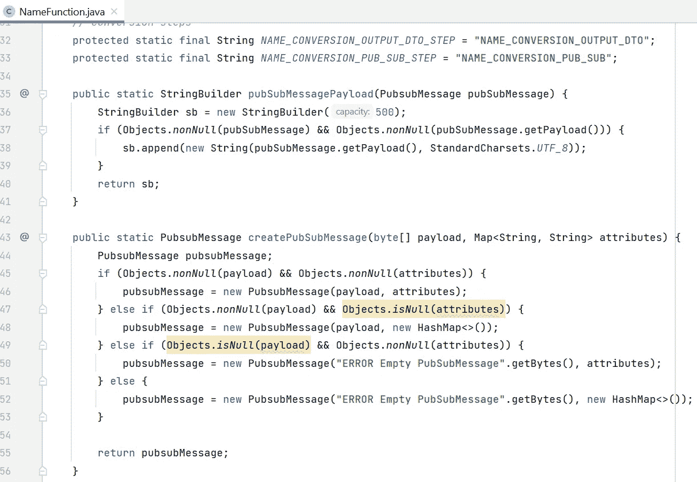

# 整合测试

测试是任何技术的重要方面，apache beam 通过使用其测试框架，为以集成方式测试管道提供了非常强大的支持。

> 这里我只关注使用 apache beam 测试框架编写集成测试。

1.  **准备测试数据**

在目录下用您想要执行测试的数据创建一个 JSON 文件，例如**src/test/resources/valid input data . JSON**

创建一个实用程序类，并添加读取文件数据并将其转换为 Pubsub 消息类型的方法

```
public PubsubMessage pubSubMessage(String fileName) throws IOException {
    String json = Resources.*toString*(Resources.*getResource*(fileName), StandardCharsets.*UTF_8*);
    InputDto inputDto;
    PubsubMessage pubsubMessage;

    try {
        inputDto = JsonUtil.*deserialize*(json, InputDto.class);
        *LOGGER*.log(*LEVEL_INFO*, fileName + " File Data " + json + " inputDto "+ inputDto);
        pubsubMessage = new PubsubMessage(json.getBytes(), new HashMap<>());
    } catch (JsonProcessingException e) { *// when we have invalid JSON send data as it is in PubSubMessage* pubsubMessage = new PubsubMessage(json.getBytes(), new HashMap<>());
    }
    return pubsubMessage;
 }
```

2.**定义测试管道**

创建一个名为 nametransferpipelineintegrationtest 的类，并使用@RunWith(JUnit4.class)进行注释，然后启动测试管道并定义测试，如下所示

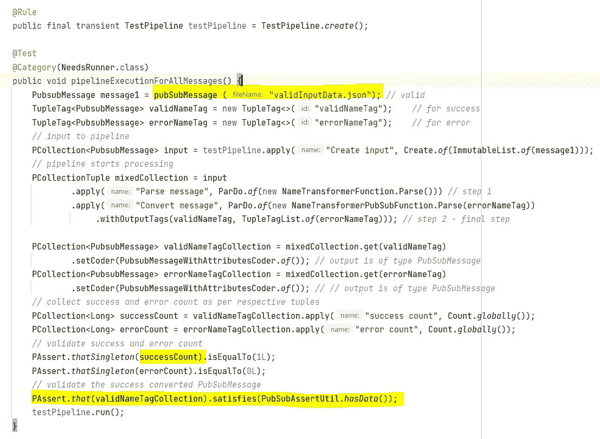

3.**断言数据**

为了断言数据，要么检查消息计数，要么用预期的数据验证输出负载。

为了断言有效载荷，我在 PubSubAssertUtil 类中创建了 ***hasData()*** 方法。

如果你想断言一个属性，你只需要通过***msg . get attribute(" attr 1 ")***方法获取该属性，其余逻辑相同。

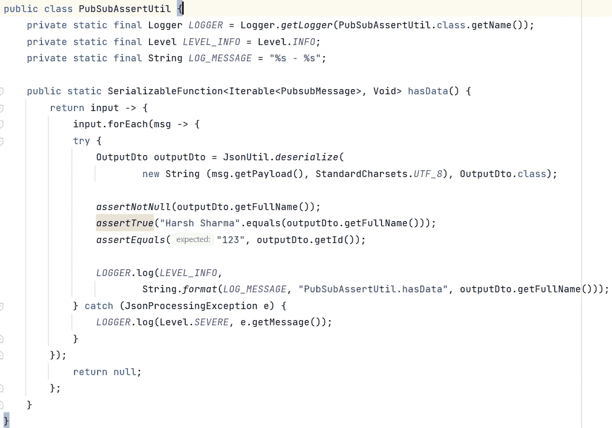

# 构建和部署

**先决条件**

在将您的工作部署到 GCP 数据流之前，您首先需要如下设置您的帐户—

a.登录您的 GCP 帐户。
b .创建一个存储，并在其中创建两个文件夹 temp 和 stag
c .创建 3 个主题，一个用于输入，另外两个用于输出
d .创建您所在区域的子网
e .创建一个具有以下权限的服务帐户

*   *“角色/发布订阅者”*
*   *“角色/发布订阅发布者”*
*   *“角色/发布订阅查看器”*
*   *“角色/存储.对象创建者”*
*   *“角色/存储.对象查看器”*
*   *"角色/数据流.管理"*
*   *" roles/iam . service account user "*
*   *“角色/数据流.工人”*

f.如这里提到的在本地设置用于验证的 Google 应用程序凭证。

g.在本地安装 **gcloud** 实用程序，并通过以下命令进行验证-

*   *gcloud 认证登录*
*   *gcloud 认证应用-默认登录*

为了部署您的管道，您有两个选择—

* ***注意*** *—我使用 Gradle 作为构建工具*

1.  **使用 fat/uber Jar 文件**

为了部署管道，您首先需要创建一个 fat jar。为了创建脂肪罐，我使用了 Gradle 的 ***shadowJar*** 插件，如果你使用 Maven，那么使用 ***shade Jar*** 插件，并在这里引用文档

```
plugins **{** id 'com.github.johnrengelman.shadow' version '7.1.2'
}//other code for dependencies.//shadowJar **{** archiveBaseName.set('name-transformer-job')
    archiveClassifier.set('')
    archiveVersion.set('')
    exclude 'META-INF/INDEX.LIST'
    exclude 'META-INF/LICENSE'
    exclude 'META-INF/*.RSA'
    exclude 'META-INF/*.SF'
    exclude 'META-INF/*.DSA'
    mergeServiceFiles()
    manifest **{** attributes 'Main-Class': 'com.demo.dataflow.NameTransformerDataflowApplication'
        attributes 'Description': 'Dataflow job for name transformer'
    **}
}**
```

现在，使用下面的命令创建一个构建**"*gradle clean shadow jar "***

构建成功后，转到 **libs > build** 文件夹，您会发现生成的 jar 文件，文件名为 **name-transformer.jar** ，现在运行下面的命令来部署您的管道。

```
java -jar name-transformer.jar --runner=DataFlowRunner --project=<project-name> --gcpTempLocation=gs://dataflow-test-bkt/temp --stagingLocation=gs://dataflow-test-bkt/stag --inputSubscription=projects/<project-name>/subscriptions/input-topic-sub --outputTopic=projects/<project-name>/topics/output-topic --region=us-east1 --windowTimeInSeconds=120 --windowElementsSizeLimit=1000 --jobName=name-transformer-job --[serviceAccount=name-transformer-service-account@](mailto:serviceAccount=sns-siq-axis-adapter@exemplary-oven-338907.iam.gserviceaccount.com)<project-name>[.iam.gserviceaccount.com](mailto:serviceAccount=sns-siq-axis-adapter@exemplary-oven-338907.iam.gserviceaccount.com)  --defaultWorkerLogLevel=DEBUG --subnetwork=regions/us-east1/subnetworks/default --usePublicIps=false --outputErrorTopic=projects/<project-name>/topics/error-topic
```

执行上述命令后，转到 GCP 云控制台的数据流部分，您将看到一个名为 name-transformer-job 的新创建的作业。

2.**模板化方法**

在模板化方法中，我们首先需要创建一个模板，然后一旦创建了模板，我们就需要使用该模板来部署我们的工作。因此，为了创建一个模板，我们首先需要添加一个名为 execute 的新 Gradle 任务。

```
task execute (type:JavaExec) **{**
        main = System.*getProperty*("mainClass")
        classpath = sourceSets.main.runtimeClasspath
        systemProperties System.*getProperties*()
        args System.*getProperty*("exec.args").split()
**}**
```

使用以下命令运行任务以生成模板

```
gradlew execute -DmainClass=com.demo.dataflow.NameTransformerDataflowApplication -Dexec.args="--runner=DataFlowRunner --project=<project-name> --gcpTempLocation=gs://dataflow-test-bkt/temp --stagingLocation=gs://dataflow-test-bkt/stag --inputSubscription=projects/<project-name>/subscriptions/input-topic-sub --outputTopic=projects/<project-name>/topics/output-topic --region=us-east1 --windowTimeInSeconds=120 --windowElementsSizeLimit=1000 --jobName=name-transformer-job --serviceAccount=name-transformer-service-account@<project-name>.iam.gserviceaccount.com  --defaultWorkerLogLevel=DEBUG --subnetwork=regions/us-east1/subnetworks/default --usePublicIps=false --outputErrorTopic=projects/<project-name>/topics/error-topic --templateLocation=gs://dataflow-test-bkt/name-transformer-job.template"
```

你可以看到我已经添加了一个名为 **templateLocation** 的新参数，并为其分配了带有存储桶位置的模板名称。现在，一旦您执行了上面的命令，名为***name-transformer-job . template***文件的模板就已经在您的 bucket 中创建好了。

现在，为了部署创建的模板，使用以下命令—

```
gcloud beta dataflow jobs run name-transformer-job --project=<project-name> --region=us-east1 --staging-location=gs://dataflow-test-bkt/stag --service-account-email=name-transformer-service-account@<project-name>.iam.gserviceaccount.com --gcs-location=gs://dataflow-test-bkt/name-transformer-job.template
```

执行上述命令后，转到 GCP 云控制台的数据流部分，您将看到一个名为 **name-transformer-job** 的新创建的作业。

> 如果您想为您的工作创建 CICD 管道，模板化方法是最合适的。

**数据流作业的图形视图**

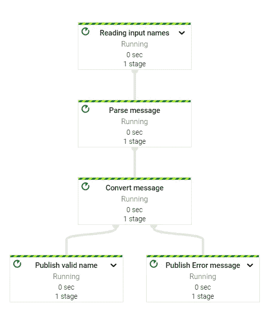

# 处理大量数据

如您所知，数据流主要用于需要处理大量数据的**大数据**用例，主要是 [**批处理(有界数据)或流(无界数据)**](https://memgraph.com/blog/batch-processing-vs-stream-processing) 。现在，让我们了解数据流如何处理大量数据，以及我们需要在 beams 管道中做什么配置才能充分利用它。

答案很简单，数据流是无服务器的，它可以根据处理负载在多个工作节点之间分配工作。它会根据负载自动旋转新节点，但是如果您想要控制工作节点和其他配置，那么在 apache beam 中有大量选项可供配置。

*   在 DataflowPipelineWorkerPoolOptions 中，有一个名为 **setMaxNumWorkers** 的选项来设置最大工作节点
*   如果要将自动缩放算法 AutoscalingAlgorithmType 更改为**基本或*基于吞吐量的***
*   如果你想改变优化，那么**设置 FlexRSGoal** 为 ***速度优化或成本优化***
*   对于流式操作，您可以根据您的使用情况更改 [**窗口策略**](https://colab.research.google.com/github/apache/beam/blob/master/examples/notebooks/tour-of-beam/windowing.ipynb#scrollTo=5UC_aGanx6oE https://www.waitingforcode.com/apache-beam/coders-apache-beam/read) 。

# 结论

这就是我们如何使用元组标签在管道中进行分支，并通过 Apache Beam 和 GCP 数据流部署生产就绪的管道。我们还看到了如何使用 apache beam 测试框架编写集成测试用例。

希望你喜欢这篇报道。如果你有任何问题/意见，请给我留言！

# 参考

> **阿帕奇光束**
> 
> [https://beam.apache.org/get-started/beam-overview/](https://beam.apache.org/get-started/beam-overview/)
> 
> [https://www.youtube.com/watch?v=HKPpohFFDoY](https://www.youtube.com/watch?v=HKPpohFFDoY)
> 
> [https://www . waiting for code . com/Apache-beam/coders-Apache-beam/read](https://www.waitingforcode.com/apache-beam/coders-apache-beam/read)
> 
> [https://colab . research . Google . com/github/Apache/beam/blob/master/examples/notebooks/tour-of-beam/windowing . ipynb # scroll to = 5UC _ aganx 6 OE](https://colab.research.google.com/github/apache/beam/blob/master/examples/notebooks/tour-of-beam/windowing.ipynb#scrollTo=5UC_aGanx6oE)
> https://www . waiting for code . com/Apache-beam/coders-Apache-beam/read
> 
> [https://beam . Apache . org/releases/javadoc/2 . 0 . 0/org/Apache/beam/SDK/values/tuple tag . html](https://beam.apache.org/releases/javadoc/2.0.0/org/apache/beam/sdk/values/TupleTag.html)
> 
> **数据流**
> [https://cloud.google.com/sdk/gcloud/reference/dataflow/jobs](https://cloud.google.com/sdk/gcloud/reference/dataflow/jobs)