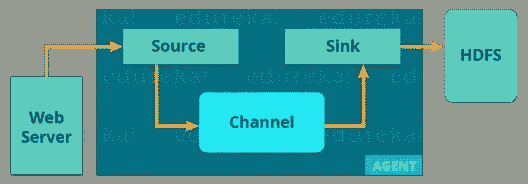
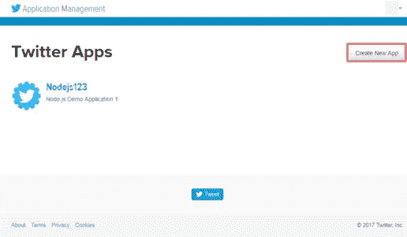
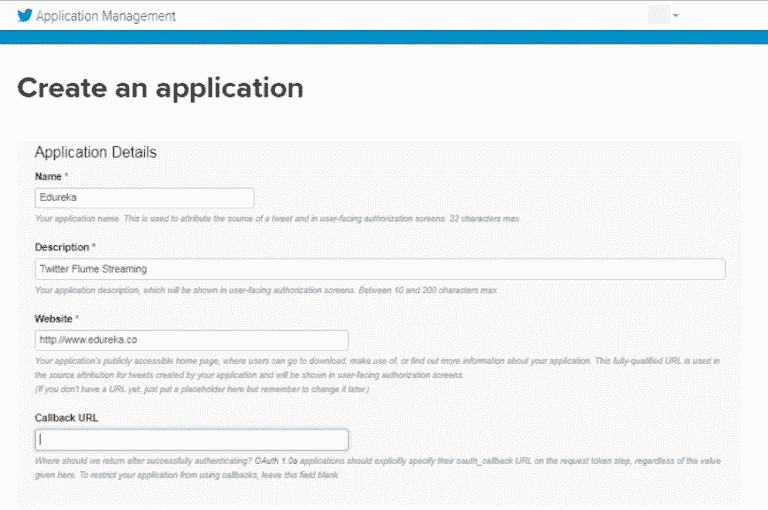
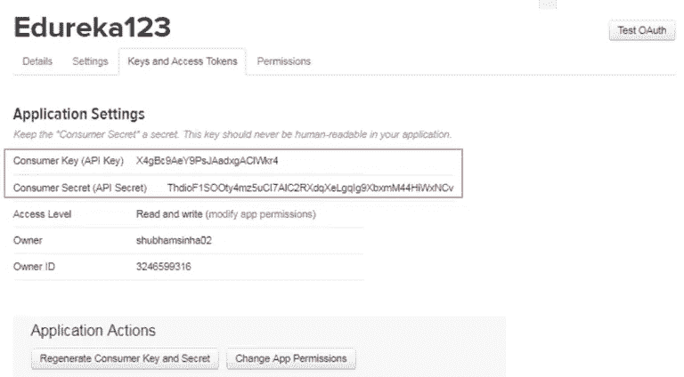
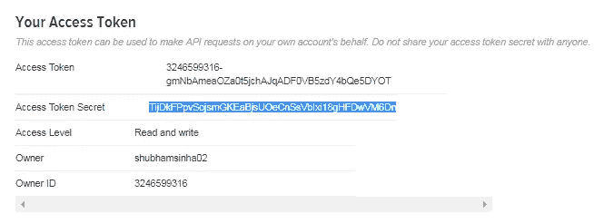
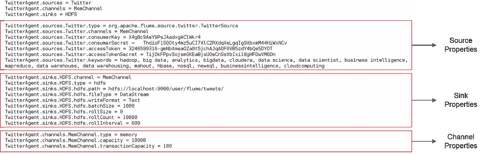
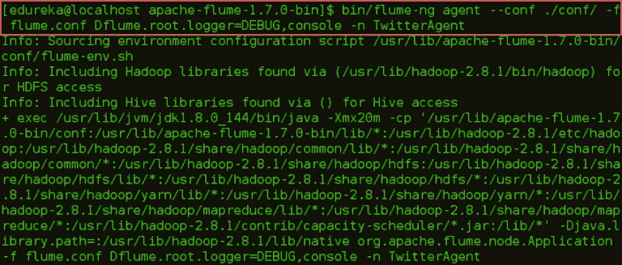
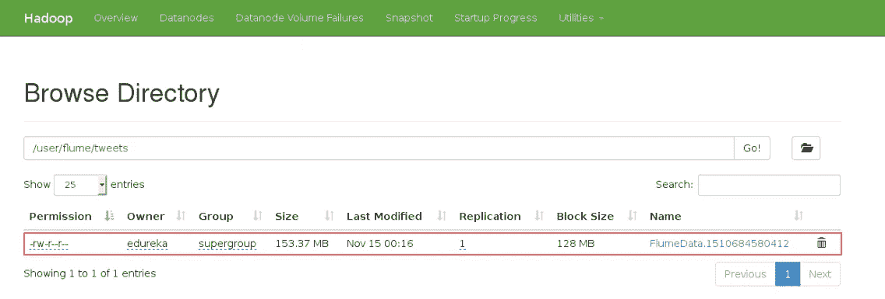

# 使用 Apache Flume 流式传输 Twitter 数据

> 原文：<https://medium.com/edureka/apache-flume-tutorial-6f7150210c76?source=collection_archive---------5----------------------->

Apache Flume Tutorial- Edureka

在这篇 Apache Flume 教程文章中，我们将了解 Flume 如何帮助从各种来源传输数据。但在此之前，让我们理解数据摄取的重要性。为了处理和分析数据，然后从中获得商业价值，数据摄取是最初的也是重要的一步。在一个组织中，可以从多个来源收集数据。

再来说说 Flume 如此受欢迎的另一个重要原因。我希望你可能熟悉 ***Apache Hadoop*** ，由于它可以存储各种数据，所以在行业中被大量使用。Flume 可以轻松地与 Hadoop 集成，并在 HDFS 上转储非结构化和半结构化数据，这是对 Hadoop 强大功能的补充。这就是为什么 Apache Flume 是 Hadoop 生态系统的重要组成部分。

在本文中，我们将讨论以下主题:

*   阿帕奇水槽介绍
*   阿帕奇水槽的优势
*   水槽建筑
*   使用 Flume 流式传输 Twitter 数据

我们将从讨论什么是阿帕奇水槽开始这个水槽教程。接下来，我们将了解使用 Flume 的优势。

# 阿帕奇水槽介绍

Apache Flume 是 HDFS 的一个数据摄取工具。它收集、聚合和传输大量流数据，如日志文件、来自网络流量、社交媒体、电子邮件等各种来源的事件。去 HDFS。Flume 是一个高度可靠的分布式系统。

Flume 设计背后的主要思想是从各种网络服务器捕获流数据到 HDFS。它有一个简单灵活的基于数据流的体系结构。它是容错的，并为容错和故障恢复提供可靠性机制。

在了解了什么是 Flume 之后，现在让我们进入这个 Flume 教程博客，了解 Apache Flume 的好处。接下来，我们将看看 Flume 的架构，并尝试从根本上理解它是如何工作的。

# 阿帕奇水槽的优势

Apache Flume 有几个优点，这使它成为比其他更好的选择。优点是:

*   Flume 是一个可扩展的、可靠的、容错的和可定制的，用于不同的源和汇。
*   Apache Flume 可以将数据存储在集中式存储中(即数据由单一存储提供)，如 HBase & HDFS。
*   Flume 是水平可伸缩的。
*   如果读取速率超过写入速率，Flume 会在读取和写入操作之间提供稳定的数据流。
*   Flume 提供可靠的消息传递。Flume 中的事务是基于通道的，其中为每条消息维护两个事务(一个发送者和一个接收者)。
*   使用 Flume，我们可以将来自多个服务器的数据导入 Hadoop。
*   它为我们提供了一个可靠的分布式解决方案，帮助我们收集、聚合和移动大量数据集，如脸书、Twitter 和电子商务网站。
*   它帮助我们从网络流量、社交媒体、电子邮件、日志文件等各种来源获取在线流数据。在 HDFS。
*   它支持大量的源和目的地类型。

该架构为 Apache Flume 提供了这些好处。现在，我们知道了 Apache Flume 的优点，让我们继续了解 Apache Flume 架构。

# 水槽建筑

现在，让我们从下图中了解 Flume 的架构:

有一个 Flume 代理将来自不同数据源的流数据接收到 HDFS。从图中可以很容易理解 web 服务器表示数据源。Twitter 是流媒体数据的著名来源之一。

水槽代理有 3 个组件:源、接收器和通道。

1.  **Source** :接受来自输入流线的数据，并将数据存储在通道中。
2.  **频道**:一般来说，读的速度比写的速度快。因此，我们需要一些缓冲来匹配读&写速度差异。基本上，缓冲区充当中间存储，临时存储正在传输的数据，从而防止数据丢失。类似地，通道充当数据源和 HDFS 中的持久数据之间的本地存储或临时存储。
3.  **Sink** :然后，我们的最后一个组件，也就是 Sink，从通道收集数据，并将数据永久提交或写入 HDFS。

现在我们知道了 Apache Flume 是如何工作的，让我们来看一个实际的例子，我们将在这里接收 Twitter 数据并将其存储在 HDFS 中。

# 流媒体 Twitter 数据

在这个练习中，我们将使用 Flume 从 Twitter 传输数据，然后将数据存储在 HDFS，如下图所示。

第一步是创建一个 Twitter 应用程序。为此，你首先要访问这个网址:***https://apps.twitter.com/***并登录你的 Twitter 账户。转到创建应用程序选项卡，如下图所示。

然后，创建一个应用程序，如下图所示。

创建这个应用程序后，您将找到密钥和访问令牌。复制密钥和访问令牌。我们将在 Flume 配置文件中传递这些令牌来连接这个应用程序。

现在在 flume 的根目录下创建一个 flume.conf 文件，如下图所示。正如我们所讨论的，在 Flume 的架构中，我们将配置我们的源、汇和通道。我们的来源是 Twitter，我们从那里传输数据，我们的汇点是 HDFS，我们在那里写数据。

在源配置中，我们将 twitter 源类型作为*org . Apache . flume . source . Twitter . twittersource .*传递，然后，我们将传递从 Twitter 收到的所有四个令牌。最后，在 source 配置中，我们传递将要获取 tweets 的关键字。

在接收器配置中，我们将配置 HDFS 属性。我们将设置 HDFS 路径，写入格式，文件类型，批量大小等。最后，我们将设置一个内存通道，如下图所示。

现在我们都准备好执行了。让我们继续执行这个命令:

`$FLUME_HOME/bin/flume-ng agent --conf ./conf/ -f $FLUME_HOME/flume.conf`

执行此命令一段时间后，您可以使用 CTRL+C 退出终端。然后，您可以继续在 Hadoop 目录中检查提到的路径，无论文件是否已创建。

下载文件并打开它。你将得到如下图所示的东西。

我希望这篇文章能给你带来信息和附加值。

如果你想查看更多关于人工智能、Python、道德黑客等市场最热门技术的文章，你可以参考 Edureka 的官方网站。

请留意本系列中解释大数据其他各方面的其他文章。

> 1. [Hadoop 教程](/edureka/hadoop-tutorial-24c48fbf62f6)
> 
> 2.[蜂巢教程](/edureka/hive-tutorial-b980dfaae765)
> 
> 3.[养猪教程](/edureka/pig-tutorial-2baab2f0a5b0)
> 
> 4.[地图缩小教程](/edureka/mapreduce-tutorial-3d9535ddbe7c)
> 
> 5. [HBase 教程](/edureka/hbase-tutorial-bdc36ab32dc0)
> 
> 6. [HDFS 教程](/edureka/hdfs-tutorial-f8c4af1c8fde)
> 
> 7. [Hadoop 3](/edureka/hadoop-3-35e7fec607a)
> 
> 8. [Sqoop 教程](/edureka/apache-sqoop-tutorial-431ed0af69ee)
> 
> 9.[大数据教程](/edureka/big-data-tutorial-b664da0bb0c8)
> 
> 10. [Oozie 教程](/edureka/apache-oozie-tutorial-d8f7bbbe1591)
> 
> 11. [Hadoop 生态系统](/edureka/hadoop-ecosystem-2a5fb6740177)
> 
> 12.[HQL 顶级配置单元命令及示例](/edureka/hive-commands-b70045a5693a)
> 
> 13. [Hadoop 集群搭配亚马逊 EMR？](/edureka/create-hadoop-cluster-with-amazon-emr-f4ce8de30fd)
> 
> 14.[大数据工程师简历](/edureka/big-data-engineer-resume-7bc165fc8d9d)
> 
> 15. [Hadoop 开发人员-工作趋势和薪水](/edureka/hadoop-developer-cc3afc54962c)
> 
> 16. [Hadoop 面试问题](/edureka/hadoop-interview-questions-55b8e547dd5c)

*原载于 2017 年 11 月 14 日*[*www.edureka.co*](https://www.edureka.co/blog/apache-flume-tutorial/)*。*