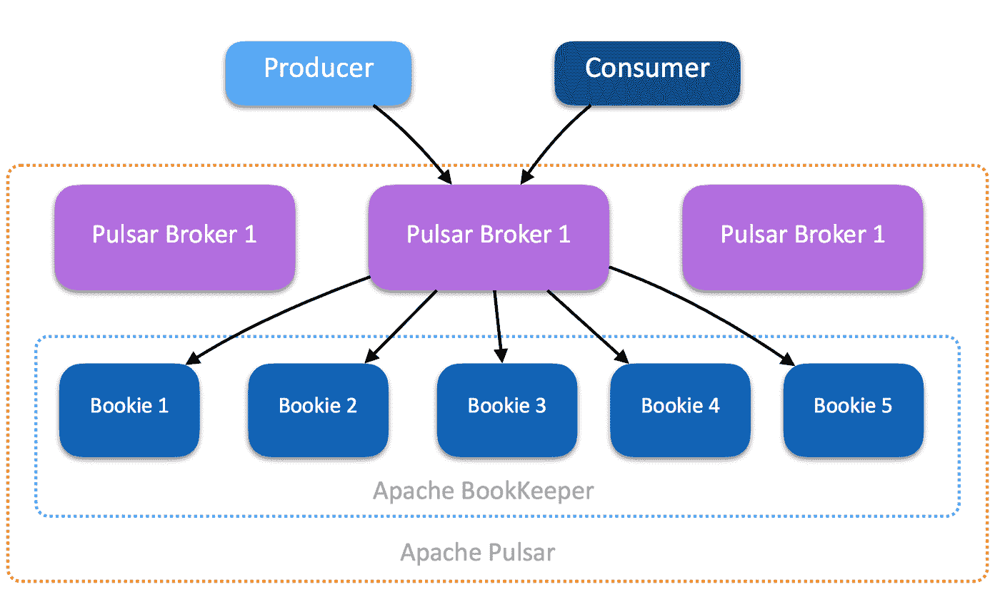
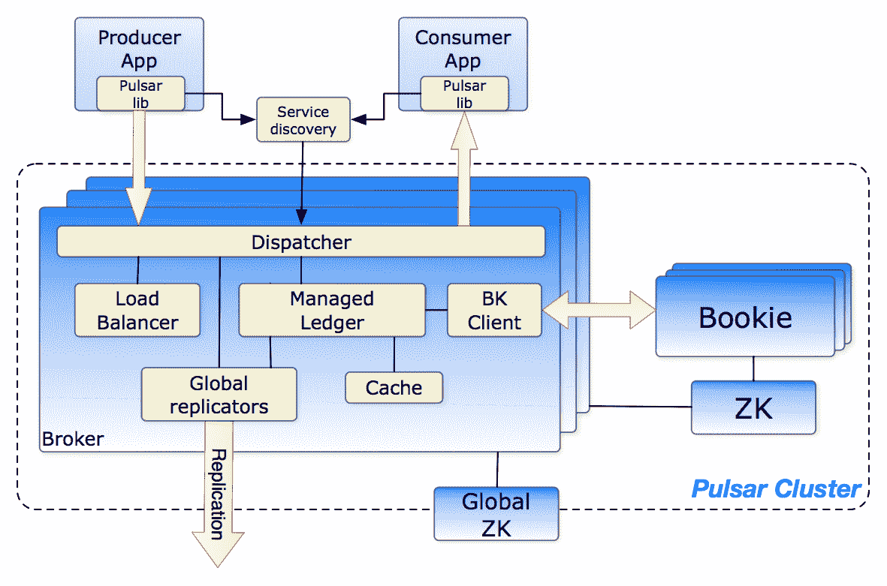
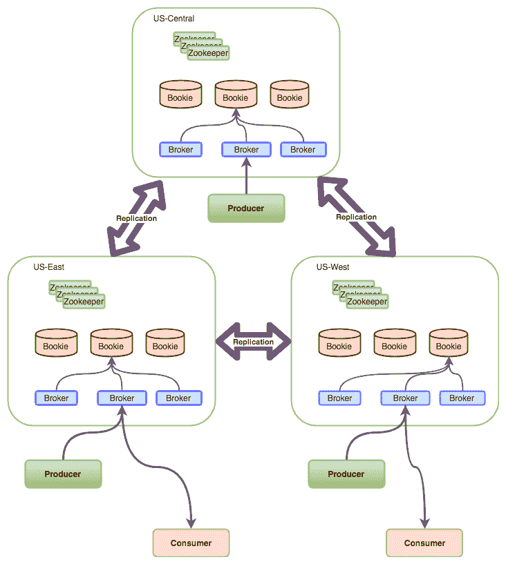
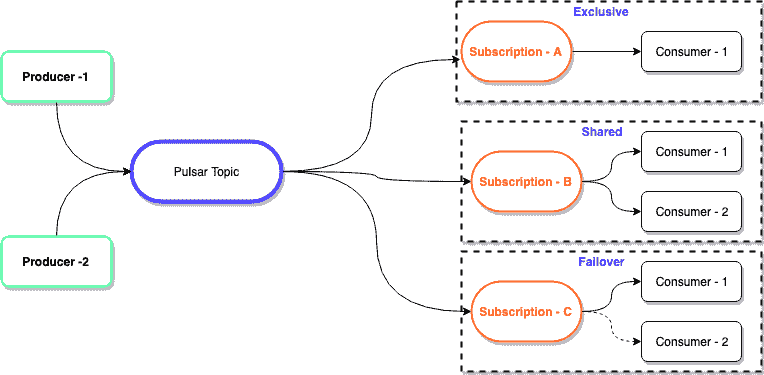

# Apache Pulsar——对 Apache 最新的发布-订阅消息平台的温和介绍

> 原文：<https://medium.com/capital-one-tech/apache-pulsar-apaches-newest-pub-sub-messaging-platform-1c1ba1a6c673?source=collection_archive---------2----------------------->

[Apache Pulsar](https://pulsar.apache.org/) 是一个开源的发布-订阅消息平台，由持久存储( [Apache Bookkeeper](https://bookkeeper.apache.org/) )提供支持，具有以下酷功能:

*   地理复制
*   多租户
*   零数据丢失
*   零再平衡时间
*   统一排队和分流模型
*   高度可扩展
*   高流通量
*   脉冲星代理
*   功能

[脉冲星文档](https://pulsar.apache.org/docs/en/standalone/)详细解释了每一个特征；这篇博客是从 Pulsar *用户*的角度写的，涵盖了在开始使用 Pulsar 之前你需要知道的一些东西。

## **术语**

*   **Apache ZooKeeper** —存储关于脉冲星簇的元数据信息。
*   **代理** —无状态组件公开 REST 和本地端点来管理消息传输和存储。
*   **Bookie** — Bookie 是 Apache BookKeeper 的一个实例，用于存储消息。这是脉冲星簇的永久存储器。

## **建筑**

[Pulsar — Architecture](https://pulsar.apache.org/docs/en/concepts-architecture-overview/). Diagram taken from the Apache Pulsar Documentation.

当前的消息传递系统已经采取了在相同的集群节点或实例上共同定位数据处理和数据存储的方法。由于减少了网络上的数据传输，该设计选择提供了更简单的基础架构和一些可能的性能优势，但代价是可扩展性、弹性和操作。Apache Pulsar 采用了一种云友好的方法，将服务层和存储层分开。

Pulsar 有一个分层架构，数据由无状态的“代理”节点提供，而数据存储由“庄家”节点处理。这种架构具有以下优势:

*   独立衡量经纪人。
*   独立衡量博彩公司。
*   集装箱化的动物园管理员，经纪人和庄家。
*   ZooKeeper 提供集群的配置和状态。

[**Pulsar — Architecture how it works**](https://pulsar.apache.org/docs/en/concepts-architecture-overview/)**.** Diagram taken from the Apache Pulsar Documentation.

以下是上图中最让我兴奋的亮点:

*   **负载平衡器:** Pulsar 有一个内置的负载平衡器，它在内部所有代理之间分配负载。
*   **服务发现:** Pulsar 内置了服务发现功能，可以识别在哪里以及如何使用单个端点连接到代理。
*   **全局复制器**:帮助在为名称空间配置的 n 代理之间复制数据。
*   全球 ZK:全球动物园管理员帮助实现地理复制。

## **地理复制**

地理复制是用于提供灾难恢复的典型机制。通常，任何数据库或消息总线解决方案都会在两个数据中心之间复制数据。Pulsar 通过以下策略支持多数据中心复制(n-mesh ):

*   异步复制
*   同步复制

全局集群可以在名称空间级别进行配置，以便在任意数量的集群中进行复制。在下面的示例中，数据中心 C 没有消费者，但是它的消息仍然可以在基于订阅模型的数据中心 A 或 B 中使用。

## **地理复制**

**多租户
这一内置功能极大地降低了组织的基础架构和运营成本。**

***敬请关注关于在 Pulsar 中建立多租户功能的详细博客。***

**零再平衡时间** Pulsar 的分层架构和代理的无状态特性有助于零再平衡时间。如果一个新的代理被添加到集群中，它可以立即进行读写操作，而不需要花费任何时间来重新平衡集群中的数据。

从博彩公司的角度来看，当一个新的博彩公司添加到集群时，由于其底层的分布式日志架构和读/写隔离，它可以立即准备好任何写操作。基于数据段复制配置的数据重新平衡在后台进行，对群集没有任何影响。

**统一的排队和流式模型** Pulsar 在一个模型中同时支持流式和排队语义。这一特性被称为*订阅模式*。消费者使用以下三种订阅模式中的任意一种订阅主题:

**不同类型的脉冲星订阅**

1.  **Exclusive —** 支持流语义。任何时候都只能有一个消费者。
2.  **故障转移—** 支持流语义。允许多个消费者连接到一个主题，但在任何给定时间只有一个消费者会收到消息。只有当当前的接收消费者失败时，其他消费者才会开始接收消息。
3.  **共享—** 支持排队语义。多个消费者可以附加到同一个主题，每个消费者将收到一小部分消息

## **功能**

函数是本地化的监听器，可以位于脉冲星内部或外部。从使用本身来看，函数可以用于基于内容的路由，这可以帮助企业应用程序只接收/接收所有预期的消息。

## **代理**

当部署在云中或 Kubernetes 中时，需要代理来向外界公开代理。代理本身可以提供身份验证和授权，并在 TLS 或没有 TLS 的情况下与代理无缝连接。代理有一个内置特性，可以将授权令牌传递给代理进行名称空间权限验证。

## **结论**

Apache Pulsar 是一个强大的发布-订阅模型，构建在分层架构上，开箱即用，具有地理复制、多租户、零重新平衡时间、统一队列和流、基于 TLS 的身份验证/授权、代理和耐用性。如果您正在从事流平台、大数据管道或发布-订阅消息总线方面的工作，那么学习更多关于 Apache Pulsar 的知识是值得的。

***脉动快乐！***

# 本系列的相关文章

[Apache Pulsar —整个企业使用多租户的一个集群](/capital-one-tech/apache-pulsar-one-cluster-for-the-entire-enterprise-using-multi-tenancy-ac0bd925fbdf)
[Apache Pulsar —地理复制和混合部署模式，实现同步复制](/capital-one-tech/apache-pulsar-geo-replication-and-hybrid-deployment-model-to-achieve-synchronous-replication-35f30e8b0f2)

*披露声明:2019 首创一。观点是作者个人的观点。除非本帖中另有说明，否则 Capital One 不隶属于所提及的任何公司，也不被这些公司认可。使用或展示的所有商标和其他知识产权是其各自所有者的财产。*