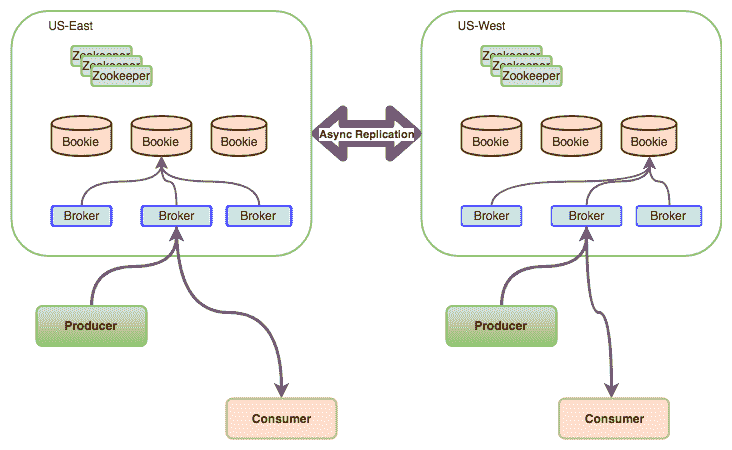
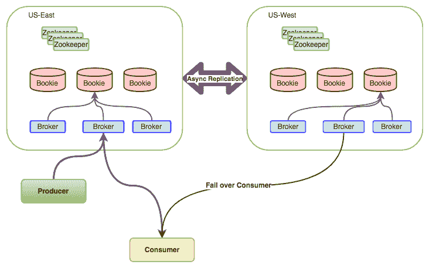
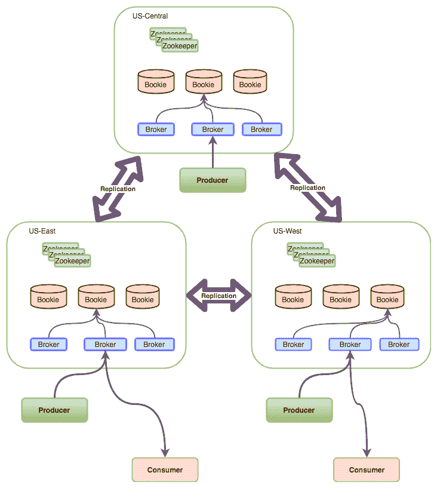
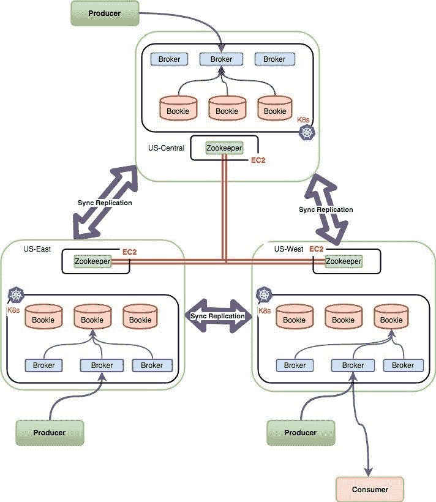

# Apache Pulsar-地理复制和混合部署模式可实现同步复制

> 原文：<https://medium.com/capital-one-tech/apache-pulsar-geo-replication-and-hybrid-deployment-model-to-achieve-synchronous-replication-35f30e8b0f2?source=collection_archive---------0----------------------->


Apache Pulsar 系列的第 3 部分是关于地理复制的。如果你直接来到这里，请阅读阿帕奇脉冲星 *中的* [*特性。*](/capital-one-tech/apache-pulsar-apaches-newest-pub-sub-messaging-platform-1c1ba1a6c673)

正如我们在[上一篇文章](/capital-one-tech/apache-pulsar-apaches-newest-pub-sub-messaging-platform-1c1ba1a6c673)中提到的， [Apache Pulsar](https://pulsar.apache.org/) 是一个新的开源分布式发布-订阅消息平台，由雅虎创建，现在是 Apache 软件基金会的一部分。Pulsar 提供了各种开箱即用的功能，我们将在本文中评估/测试地理复制功能。

Apache Pulsar 支持地理复制，包括 n-mesh 复制模式:

*   异步复制
*   同步复制

下面详细讨论一下实现、优缺点以及如何选择最适合的。

# **异步复制**



Asynchronous Replication (Active-Active)

异步复制涉及发布到主题的数据，这些数据在位于不同区域的已配置集群之间异步复制。可以在租户有权访问的命名空间级别配置异步复制。一旦消息在本地发布/保存到集群，生产者就会得到确认。然后，代理将数据复制到已配置的复制集群。复制数据时，会保留顺序，但**不会保留光标**的位置。

**注意:** *光标位置在本地集群内被保留和维护。*

## 异步复制(故障转移)



Asynchronous Replication (Failover)

配置集群类似于上面的模式，除了集群有一个消费者。订阅是群集的本地订阅。

当美国东部集群关闭时，即使没有活动订阅，也可以通过配置来保留消息，从而将生产者和消费者移动到美国西部集群。在此事件中，数据不会丢失，因为复制是从美国东部到美国西部进行的。当我们在 US-West 上启动消费者时，我们需要重置光标，以重放从开始处理失败时开始的消息。

这种模式的主要缺点是手动迁移生产者/消费者，重置游标以重播失败时的消息可能会导致重复百分比降低，这取决于游标重置的准确性级别。

这种部署/可配置模式推荐用于:

*   幂等数据的应用。
*   后端数据未复制和/或在不同区域维护副本的应用程序。
*   可以接受重复消息直到恢复时间到来的应用程序。

## 配置异步复制

假设我们在 **A** 和 **B** 中有两个集群，执行下面的命令让每个集群加入集群的仲裁。运行以下命令，将集群 **B** 到集群 **A** 注册为复制集群:

```
./bin/pulsar-admin clusters create \
— url http://<DNS-OF-B>:<PORT> \
— broker-url pulsar://<DNS-OF-B>:<PORT> \
— broker-url-secure pulsar+ssl://<DNS-OF-B>:<PORT> \
— url-secure https://<DNS-OF-B>:<PORT> B
```

在上面的命令中， **B** 是在 broker.conf 中配置的集群名称。为了配置复制集群，admin 希望提供所有参数，即使它们是互斥的。

类似地，寄存器组 **A** 到 **B** :

```
./bin/pulsar-admin clusters create \
— url http://<DNS-OF-A>:<PORT> \
— broker-url pulsar://<DNS-OF-A>:<PORT> \
— broker-url-secure pulsar+ssl://<DNS-OF-A>:<PORT> \
— url-secure https://<DNS-OF-A>:<PORT> A
```

通过为两个集群配置权限，在两个集群中创建租户。

```
./bin/pulsar-admin tenants create my-tenant \
— admin-roles admin — allowed-clusters A,B
```

在两个集群中创建命名空间以及权限:

```
./bin/pulsar-admin namespaces create my-tenant/ns1./bin/pulsar-admin namespaces grant-permission my-tenant/ns1 \
— actions produce,consume \
— role ‘admin’
```

在命名空间级别设置集群配置，如下所示:

```
./bin/pulsar-admin namespaces set-clusters my-tenant/ns1 \
— clusters A,B
```

复制跨两个集群配置。当应用程序在 my-tenant/ns1/my-topic 上生成消息时，数据会在整个集群中复制。上述模式也可以在 Kubernetes 上轻松配置。

# 同步复制



Synchronous Replication

同步复制是由 Apache BookKeeper 实现的。同步复制为只需要一个群集的企业提供了更大的灵活性。这里的主要配置问题涉及到在代理上启用“rackAwarePlacementPolicy ”,以便在托管于不同地理位置的不同数据中心之间将数据持久化。Pulsar 支持这一特性。

要配置同步复制，最佳选择是在裸机上提供 ZooKeeper 和 Pulsar，这是根据[http://Pulsar . Apache . org/docs/en/deploy-bare-metal-multi-cluster/](http://pulsar.apache.org/docs/en/deploy-bare-metal-multi-cluster/)上的说明进行的。

这种方法的缺点是:

*   集装箱化和使用集装箱的灵活性。
*   基于组织需求的集群维护。
*   云治理和敏捷性(刚性模型)。
*   资源利用。
*   不一定划算。

## 同步复制—混合模式

为了充分利用 Pulsar 对云和 Kubernetes 的支持，并克服上面提到的复杂性，我想提出一个新的部署模型——混合模型。

在混合模式中，配置发生在裸机和 Kubernetes 集群(GKE EKS 或独立的 Kubernetes 集群)上。

**假设:**

*   ZooKeeper 可以使用 Apache Pulsar 二进制文件安装在裸机上。
*   经纪人和赌注登记经纪人的容器是可用的。

该模型建议按如下所述配置组件:

*   裸机/EC2(AWS)上的 ZooKeeper
*   Kubernetes 上的庄家和经纪人

例如，要在三个地区提供 ZooKeeper，我们可以选择 AWS 地区 US-East、US-West 和 US-Central，总共有三个 ZooKeeper 节点来形成集群或 ZooKeeper 仲裁。



Synchronous Replication — Hybrid

以下是实现混合同步复制所需的配置:

*   使用 initialize-cluster-metadata 命令，在其中一个集群名称为“hybrid”的节点上配置 Pulsar 的集群元数据。
*   在每个地区(如美国东部、美国西部和美国中部)调配 Kubernetes 集群。向 Kubernetes 集群部署博彩公司和经纪人。比方说，每个有三个复制品。
*   在 Bookies 配置中将 ZooKeeper 节点配置为 ZooKeeper 服务器。
*   在代理配置中将 ZooKeeper 节点配置为 ZooKeeper 服务器和配置存储服务器。
*   启用机架感知策略。

上述配置以及写法定数(应该是 AckQuorum+1)将允许簿记员跨不同的地理位置/区域复制数据。

**使用该模式的主要优势:**

*   与裸机相比，资源共享可降低成本。
*   表现为单个逻辑群集，在尽可能多的区域中有尽可能多的物理群集。
*   n 个集群可以从任意数量的区域开始。
*   零数据丢失。
*   弹性模型(主题)—如果一个集群关闭，主题可以无缝转移到另一个集群。
*   弹性模型(消息)—如果一个群集出现故障，消息将根据写入仲裁复制到另一个群集上的博彩公司。
*   消费者可以使用来自任何地区/集群的消息。
*   与异步复制不同，故障转移期间不会产生重复的消息。
*   保留光标位置，因为此模型的行为类似于单个逻辑集群。

**使用该模式的主要缺点:**

*   维护两种不同的供应架构— EC2 和 Kubernetes。如果使用 EKS 或 GKE，那么使用混合框架实现同步复制是一种简单的模式。
*   主题创建/删除过程中基于 leader 的 ZooKeeper 跳之间的延迟。这不会影响消息的生命周期。

# 测试地理复制

可以使用我们在本文 [**文章**](/capital-one-tech/apache-pulsar-one-cluster-for-the-entire-enterprise-using-multi-tenancy-ac0bd925fbdf) 中开发的相同的生产者和消费者集合来测试地理复制。修改下面的行以反映不同的群集主机/端口:

*Producer.java*

```
String localClusterUrl = “pulsar+ssl://<DNS-OF-A>:<PORT>”;String namespace = “my-tenant/ns1”;String topic = String.format(“persistent://%s/my-topic”, namespace);
```

*Consumer.java*

```
String localClusterUrl = “pulsar+ssl://<DNS-OF-B>:<PORT>”;String namespace = “my-tenant/ns1”;String topic = String.format(“persistent://%s/my-topic”, namespace);
```

在群集上配置复制时，在租户和命名空间级别配置适当的角色。例如，上面的例子有“admin”。

现在，当您在集群 **A** 上生成消息时，消费者可以从 **B** 上读取它。根据上面的例子，消费者可以被配置成同时监听 **A** 和 **B** 来消费同一组消息。

# 结论

Apache Pulsar 附带了许多功能，并有可能在未来几年成为流媒体平台领域的强大玩家。一个强大的功能是地理复制，它开箱即用，具有本机云支持。Pulsar 提供了多种选择，让组织可以根据使用案例决定如何托管其流媒体平台。总之，如果平台支持并忽略少量的消息副本，就可以利用异步复制。如果用例要求严格的唯一消息处理，那么同步复制就是一种方法。如果云成本和资源利用率是主要因素，混合方法将是最佳选择。

***脉冲快乐！***

# **本系列相关文章**

[Apache Pulsar——使用多租户的整个企业的一个集群](/capital-one-tech/apache-pulsar-one-cluster-for-the-entire-enterprise-using-multi-tenancy-ac0bd925fbdf)
[Apache Pulsar——对 Apache 最新发布-订阅消息平台的简要介绍](/capital-one-tech/apache-pulsar-apaches-newest-pub-sub-messaging-platform-1c1ba1a6c673)

*披露声明:2020 资本一。观点是作者个人的观点。除非本帖中另有说明，否则 Capital One 不隶属于所提及的任何公司，也不被这些公司认可。使用或展示的所有商标和其他知识产权是其各自所有者的财产。*