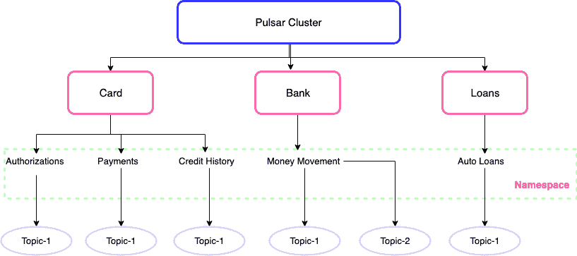

# Apache Pulsar —使用多租户的整个企业的一个集群

> 原文：<https://medium.com/capital-one-tech/apache-pulsar-one-cluster-for-the-entire-enterprise-using-multi-tenancy-ac0bd925fbdf?source=collection_archive---------4----------------------->


正如我们在[上一篇文章](/capital-one-tech/apache-pulsar-apaches-newest-pub-sub-messaging-platform-1c1ba1a6c673)中提到的， [Apache Pulsar](https://pulsar.apache.org/) 是一个新的开源分布式发布-订阅消息平台，由雅虎创建，现在是 Apache 软件基金会的一部分。Pulsar 提供了各种开箱即用的特性，我们将在本文中评估/测试多租户特性。

多租户功能允许不同的软件、应用程序或平台在共享环境中安全运行。共享环境中的每个单元被称为“租户”，我们将在下面深入讨论。

# 什么是租户？

租户可以是组织内的客户或团队，或者是生产者或消费者的分类组，需要将数据和处理与其他客户或团队隔离。租户可以管理不同区域的不同应用程序，如开发、测试或生产。

在零售店中，库存、采购、记账、订购、补货等。可能是房客。对于金融科技公司、银行、信用卡、贷款等。可能是房客。以金融科技为例，在信用卡中可以有支付、信用记录等应用。内部分为子系统或部署区域，如开发、QA 或生产。在这个例子中，支付和信用历史将形成命名空间，以便根据环境为每个子系统创建主题。



*Generic example of Multi Tenancy for a fintech org*

# 多租户有什么好处？

多租户允许企业或零售商为整个组织拥有一个全局集群，不同部门之间的数据或硬件隔离。多租户带来了几个优势:

*   **成本** —多租户允许组织规划更少的集群，这与花费在基础架构和维护上的更少资金或时间成比例。
*   **集群大小** —这取决于组织的需求，因为与本地化实例相比，从多集群环境压缩到单个企业集群会产生更大的集群。Pulsar 架构支持水平和垂直的可伸缩性，以满足这一需求。
*   **复制和弹性** —答案很简单；Pulsar 是由无状态代理设计的，由记账员提供的持久存储支持。这意味着 Pulsar 可以水平和垂直扩展，通过其内置的地理复制功能支持 n-mesh 复制。

# 我们如何实现多租户？

假设我们的零售组织中有两个部门——库存和计费。我们可以指定如下租户:

*   库存
*   演员表


这两个租户必须通过 Pulsar 与他们部门内部或部门之间的不同系统进行交互。Pulsar 支持 [TLS 或 Athenz 或 Kerberos](https://pulsar.apache.org/docs/en/security-overview/#authentication-providers) 进行认证和授权，多租户特性是使用该工具实现的。对于这个例子，我们将使用 TLS。

要使用 TLS 加密，我们需要生成信任、服务器和客户端证书。

**1。信任证书** 第一步是创建信任证书。在 https://pulsar.apache.org/docs/en/security-tls-transport/[遵循 Pulsar 文档中的说明。](https://pulsar.apache.org/docs/en/security-tls-transport/)

**2。服务器证书** 按照上述文档中的描述，为代理(Pulsar)生成服务器证书和私钥。如果您需要使用 SAN 生成，请遵循以下说明:

将以下文件另存为`csr_server.txt`

```
[req]
default_bits = 2048
prompt = no
default_md = sha256
req_extensions = req_ext
distinguished_name = dn
[ dn ]
C=US
ST=STATE
L=CITY
O=COMPANYNAME
OU=DEPT
[emailAddress=karthik@domain.com](mailto:emailAddress=karthik@domain.com)
CN = *.retailer.com
[ req_ext ]
subjectAltName = [@alt_names](http://twitter.com/alt_names)
[ alt_names ]
DNS.1 = *.abc.cloud.retailer.com
DNS.2 = *.retailer.com
DNS.3 = localhost
```

使用下面的生成服务器证书:

```
openssl req \
 -newkey rsa:2048 \
 -sha256 \
 -nodes \
 -out broker-cert.csr \
 -keyout privkey.pem \
 -outform PEM \
 -config <( cat csr_server.txt )
```

遵循 [Pulsar 文档](https://pulsar.apache.org/docs/en/security-tls-transport/)中概述的剩余步骤。

**3。类似地，您还需要生成三个客户端证书:**

*   一个用于管理 CLI 工具，如 pulsar-admin。
*   一个用于库存，CN=inventory(对于 SAN，使用上面的示例)。
*   一个用于 CN=billing 的计费(在 SAN 的情况下，使用上面的示例)。

## **现在你有以下:**

*   一个代理服务器证书。
*   一份 CLI 工具、清单和计费的客户证书。

## **按照** [**Pulsar 文档**](https://pulsar.apache.org/docs/en/security-tls-transport/#broker-configuration) **中的说明配置以下文件:**

*   `broker.conf`(服务器证书和信任库证书)
*   `client.conf` ***(pulsar-admin 使用此配置—使用各自的客户端证书)***
*   `discovery.conf`(服务器证书和信任库证书)

一旦动物园管理员、赌注登记经纪人和经纪人(`Cluster Name = Retailer`)都在启用认证和授权的情况下运行，使用`pulsar-admin`来创建租户:

```
./pulsar-admin tenants create inventory-tenant \— -admin-roles inventory — allowed-clusters retailer
```

**用于计费:**

```
./pulsar-admin tenants create billing-tenant \— -admin-roles billing — allowed-clusters retailer
```

现在，让我们考虑他们部门内部的沟通。

## **下一步是为每个租户创建名称空间。**

对于库存-ns1:

```
./pulsar-admin namespaces create inventory-tenant/ns1./pulsar-admin namespaces set-clusters inventory-tenant/ns1 — clusters retailer
```

对于计费-ns1:

```
./pulsar-admin namespaces create billing-tenant/ns1./pulsar-admin namespaces set-clusters billing-tenant/ns1 — clusters retailer
```

## **下一步是授予访问名称空间的权限。**

可以使用通配符，但不支持总括通配符。角色应该与各自的客户端证书的 CN 相匹配。

```
./pulsar-admin namespaces grant-permission inventory-tenant/ns1 \
 - actions produce,consume \
 - role 'inventory*'./pulsar-admin namespaces grant-permission billing-tenant/ns1 \
 - actions produce,consume \
 - role 'billing*'
```

## **下一步是主题创建。**

我们按如下方式创建它:

*   对于库存—主题 1
*   用于计费—主题 1

# **在云端还是 Kubernetes？**

Pulsar 有一个名为 [Proxy](https://pulsar.apache.org/docs/en/concepts-architecture-overview/#pulsar-proxy) 的内置特性，需要在云或 Kubernetes 上部署 Pulsar 时进行配置。代理本身可以提供我们在 Broker 中讨论过的身份验证和授权特性。代理还可以再次与代理通信，或者与 TLS 或非 TLS 通信。

要在代理中启用 TLS，请将服务器证书配置为`“tlsCertificateFilePath”`和`“tlsKeyFilePath”`。

设置

```
tlsEnabledWithBroker=truetlsEnabledInProxy=true
```

并将客户端证书设置为使用以下命令与 Broker 进行握手:

```
brokerClientAuthenticationPlugin=org.apache.pulsar.client.impl.auth.AuthenticationTlsbrokerClientAuthenticationParameters=tlsCertFile:<CLIENT-CERT-FILE>,tlsKeyFile:<CLIENT-KEY-FILE>brokerClientTrustCertsFilePath=<TRUST-CERT-FILE>
```

要使授权令牌能够被传递，请启用以下属性:

```
forwardAuthorizationCredentials=true
```

要在代理设置处终止 SSL，`tlsEnabledWithBroker=false`并不要求它配置客户端证书。您仍然可以将授权令牌传递给代理来验证权限。

现在，我们已经准备好测试多租户特性，分别为库存和计费编写生产者和消费者。下面是生产者和消费者的样本片段。

**Producer.java**

```
public class Producer {
    public static void main(String[] args) {
        String localClusterUrl = "pulsar+ssl://localhost:6651";
        String namespace = "inventory-tenant/ns1";
        String topic = String.*format*("persistent://%s/topic1", namespace);
        Map<String, String> authParams = new HashMap<>();
        authParams.put("tlsCertFile", "client-inventory-cert.pem");
        authParams.put("tlsKeyFile", "client-inventory-key.pem");
        Authentication tlsAuth = AuthenticationFactory
                .create(AuthenticationTls.class.getName(), authParams);
        PulsarClient client = PulsarClient.builder().serviceUrl(localClusterUrl)
                .enableTls(true)
                .tlsTrustCertsFilePath("/demoCA/cacert.pem")
                .authentication(tlsAuth)
                .build();
        Producer producer = client.newProducer()
                .topic(topic)
                .sendTimeout(10, TimeUnit.SECONDS)
                .create();
        for (int i = 0; i < 10; i++) {
            String msg = String.*format*("Inventory-message-W-%d", i);
            producer.send(msg.getBytes());
            System.*out*.println("Sending Message - -> " + msg);
        }
        producer.close();
        client.close();
    }
}
```

**Consumer.java**

```
public class Consumer {
    public static void main(String[] args) {
        String localClusterUrl = "pulsar+ssl://localhost:6651";
        String namespace = "inventory-tenant/ns1";
        String topic = String.*format*("persistent://%s/topic1", namespace);
        Map<String, String> authParams = new HashMap<>();
        authParams.put("tlsCertFile", "client-inventory-cert.pem");
        authParams.put("tlsKeyFile", "client-inventory-key.pem");
        Authentication tlsAuth = AuthenticationFactory
                .create(AuthenticationTls.class.getName(), authParams);\
        PulsarClient client = PulsarClient.builder().serviceUrl(localClusterUrl)
                .enableTls(true)
                .tlsTrustCertsFilePath("/demoCA/cacert.pem")
                .authentication(tlsAuth).build();\
        Consumer consumer = client.newConsumer()
                .topic(topic)
                .subscriptionName("my-sub")
                .subscriptionType(SubscriptionType.Exclusive)
                .subscribe();
        while (true) {
            Message msg = consumer.receive();
            System.*out*.println("Received message: " + StringUtils.newStringUtf8(msg.getData()));
            consumer.acknowledge(msg);
        }
    }
}
```

如果客户端证书在库存/计费之间切换，测试应用程序生成/消费将抛出`AuthorizationException`，表明生成者/消费者无权在`<tenant>/ns1/topic1`上生成/消费消息，即使名称空间和主题匹配。

# **结论**

Apache Pulsar 是一个强大的发布-订阅模型，构建在分层架构上，开箱即用，具有地理复制、多租户、零重新平衡时间、统一队列和流、持久性等功能。

多租户是一种特性，组织可以利用它来最大限度地减少成本、工作量和维护等。多租户将帮助应用程序在共享环境中安全地工作。在这篇文章中，我们配置了多个应用程序来使用 TLS 传输加密共享一个集群。

测试并填写您的反馈。

***脉动快乐！***

# 本系列的相关文章

[Apache Pulsar——对 Apache 最新发布-订阅消息平台](/capital-one-tech/apache-pulsar-apaches-newest-pub-sub-messaging-platform-1c1ba1a6c673)
[的简要介绍——Apache Pulsar——地理复制和混合部署模式，以实现同步复制](/capital-one-tech/apache-pulsar-geo-replication-and-hybrid-deployment-model-to-achieve-synchronous-replication-35f30e8b0f2)

*披露声明:2019 首创一。观点是作者个人的观点。除非本帖中另有说明，否则 Capital One 不隶属于所提及的任何公司，也不被这些公司认可。使用或展示的所有商标和其他知识产权是其各自所有者的财产。*