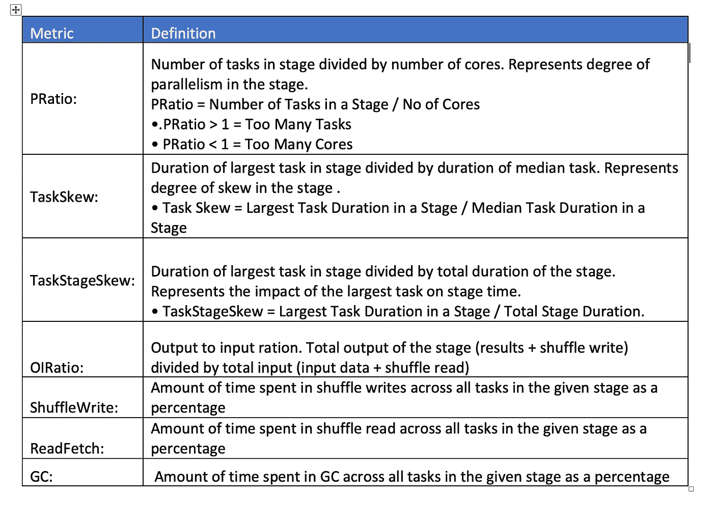

# 使用 Sparklens 的 Apache Spark 性能工程

> 原文：<https://medium.com/walmartglobaltech/apache-spark-performance-engineering-using-sparklens-62c2da5bfc2?source=collection_archive---------2----------------------->

Image by [jestermaroc](https://pixabay.com/users/jestermaroc-1131603/?utm_source=link-attribution&utm_medium=referral&utm_campaign=image&utm_content=1610815) from [Pixabay](https://pixabay.com/?utm_source=link-attribution&utm_medium=referral&utm_campaign=image&utm_content=1610815)

这篇博客是由西瓦库玛的合著的

Apache Spark 是用于大规模数据处理和转换的最受欢迎的开源计算引擎之一。有效利用计算资源(驱动程序+执行器)、缓解任务/数据不对称以及解决高垃圾收集问题，对于 Spark 作业以最佳性能运行以节省时间和成本至关重要。

有各种数据分析工具可以帮助收集和分析 Spark 作业指标，并通过为决策和性能调整提供详细分析来增加价值。

**什么是侧写员？**
在软件工程中，概要分析通常被称为“程序概要分析”、“软件概要分析”、“应用概要分析”等。它是动态程序分析的一种形式，例如，测量程序的空间(内存)或时间复杂性、特定指令的使用，或者函数调用的频率和持续时间。

最常见的是，分析信息有助于开发团队识别程序优化、成本节约和有效利用可用资源的机会，更具体地说，是性能工程。

**有哪些不同的火花剖析仪？**

我们分享了一些可用的火花分析器。
*火花*([https://github.com/qubole/sparklens](https://github.com/qubole/sparklens))
*火花测量*([https://github.com/LucaCanali/sparkMeasure](https://github.com/LucaCanali/sparkMeasure))
*火花线*([https://github.com/groupon/sparklint](https://github.com/groupon/sparklint))
*大象博士*([https://github.com/linkedin/dr-elephant](https://github.com/linkedin/dr-elephant))
*火花镜*([https://github.com/ibm-research-ireland/sparkoscope](https://github.com/ibm-research-ireland/sparkoscope)

在这篇博客中，我们将关注 Sparklens。

**什么是火花？**

Sparklens 是一个开源剖析工具，内置了用 Scala 编写的 Spark 调度模拟器。它可以用于“任何”火花应用。它是在 Qubole 开发和维护的。

Sparklens 主要帮助破译 Spark 作业指标，以了解 Spark 作业的可扩展性限制，并确定有效调整我们的 Spark 作业的各种机会。

它还有助于了解给定 Spark 应用程序使用提供给它的计算资源的效率。也许更多的执行器或者更多的驱动内存会让你的应用运行得更快，但也可能不会。Sparklens 可以通过查看应用程序的一次运行来帮助回答这个问题。

**如何使用 Sparklens？**

要为您的 Spark 作业/应用启用 Sparklens，我们需要向 spark-submit 或 spark-shell 添加以下附加配置参数:

> —packages qu bole:sparklens:0 . 1 . 2-s _ 2.11
> —conf spark . extra listeners = com . qu bole . sparklens . qubolejoblistener

默认情况下，使用 Sparklens 配置提交的每个 Spark 作业都将启用 Sparklens 报告。我们可以使用以下方法访问它们。

**如何查看/访问 Sparklens 报告？**
在云环境中，有 3 种不同的方式访问 Sparklens 报告。
**纱线资源管理器**
导航至资源管理器链接，访问 Spark 应用程序日志，查看与应用程序日志一起打印的 Sparklens 报告。

Figure 1: Resource Manager Log with Sparklens report

**PHS 服务器日志**
PHS(持久历史服务器)日志将 Sparklens 报告的详细信息存储在应用历史日志中。理想情况下，我们将使用 PHS 日志来分析 Sparklens 报告。

***注:*** *持久化历史服务器是一个持久化集群，在 GCP 数据处理环境中全天候可用。它用于存储您的数据处理环境中触发的所有应用程序/作业的应用程序日志。*

**GCS 存储桶位置**
每个应用程序 ID 的 Sparklens 报告作为 Json 文件存储在为开发/生产配置的 GCS 存储桶中。它可以被下载和分析。Sparklens 数据的 GCS 桶位置在图 1 中突出显示。

**Sparklens UI**
Sparklens 报告可上传至 Sparklens 报告门户网站，以图表形式查看报告。
[http://sparklens.qubole.com/](http://sparklens.qubole.com/)

Figure 2:Sparklens Report in UI

**Sparklens 指标:**

Sparklens 基于 Spark 应用程序日志生成多个指标。我们现在将浏览 Sparklens 报告的一些关键指标。

**关键路径:**

关键路径是我们的应用程序完成所需的最少时间，不考虑添加到我们工作中的执行者的数量/无限数量。

关键路径=在驱动程序中花费的所有时间+每个阶段中最大任务花费的时间。

Figure 3: Critical Path Representation . Source: Qubole Blog

Figure 4: Critical Path data from Sparklens Actual Report from a Spark Job

从上面的指标中，我们可以注意到，实际 Spark 作业的总挂钟(执行)时间是 16 分 09 秒，但是作业的关键路径是 10 分 46 秒。因此，我们有机会调整该作业，以便为该作业节省 5 分钟以上的时间。

理想路径是指如果我们拥有完美的并行性且没有偏斜，那么任务执行所需的时间。在实际场景中，很难满足基于业务和数据场景的理想路径要求。

> **关键路径指标的关键要点:**
> 在理想的应用中，与执行者挂钟时间相比，驱动器挂钟时间应相对较少，如果驱动器挂钟时间较长，则分析并确定减少驱动器计算任务的选项。
> 我们无法通过增加执行器数量来提高驱动程序的执行速度。
> 除非我们通过重新划分数据来改变任务处理的数据，否则我们无法让任何阶段中最慢的任务运行得更快。
> ·Spark 应用程序的运行速度不能超过其关键路径，无论有多少执行器。
> 通过
> 减少驱动程序侧的计算
> 为给定内核提供足够的任务
> 减轻任务偏差
> 根据需要减少执行程序的数量。

**模型模拟器指标:**

Figure 5:Model Simulation Metrics

模型模拟器估计 Spark 应用/作业的运行时间，模型误差是模型估计运行时间和实际运行时间之间的偏差。
Model simulator 还根据不同的执行器数量和集群利用率来估计作业的运行时间。如果我们计划在减少的执行器数量和基于用例场景的运行时间的少量增加之间进行权衡，我们可以使用这个度量。

例如:在上面图 4 中的 Sparklens 报告中，我们可以注意到，随着执行程序容量的减少(80 % : 160 个执行程序)，预计的运行时间增加了一点，但是如果它适合我们的用例，那么我们可以用减少的执行程序容量来运行 Spark 作业。

**每阶段执行指标:**

Figure 6: Metrics Aggregated for each Stage in Spark Job

根据 Sparklens 的阶段级聚合指标，我们可以注意到，阶段 ID: 54 占总执行时间的 27 %,它的任务数最高，为 111110。我们可以评估阶段，寻找任何调整的机会。

Figure 7: Skew Metrics & Parallelism Ratio aggregated at Stage level for a Spark Job

**每个阶段的关键指标定义:**

Per Stage Key Metrics Definitions

**总结:**

Sparklens 为开发团队提供了详细的指标来分析应用程序日志，并确定成本和时间优化的机会。在这篇博客中，我们只强调了关键指标。请浏览参考资料，了解 Sparklens 报告生成的其他指标的详细信息。

Sparklens 没有强调任何需要缓解以获得更好性能的代码问题。相反，它通过总结和强调有效分析的关键指标来帮助开发团队避免他们在优化 Spark 工作时遵循的多次反复试验的方法。

Sparklens 使用 Spark 作业的单次执行生成报告，它还有一个可视化的 UI 界面来分析指标。数据工程领导者和使用 Apache Spark 处理大规模数据的团队可以计划利用任何数据分析工具，如 Sparklens，以实现有效的性能工程。快乐学习！！

**参考文献:**

[https://www . qu bole . com/blog/introducing-qu boles-spark-tuning-tool/](https://www.qubole.com/blog/introducing-quboles-spark-tuning-tool/)

https://www.youtube.com/watch?v=0a2U4_6zsCc**qu bole Spark meet**:

**第五届大象大会** (Qubole Sparklens:了解 Spark 应用的可伸缩性极限—Rohit Karlupia)[https://www.youtube.com/watch?v=SOFztF-3GGk](https://www.youtube.com/watch?v=SOFztF-3GGk)

[https://github.com/qubole/sparklens](https://github.com/qubole/sparklens)