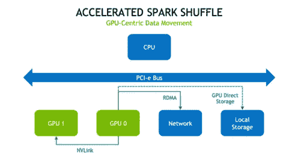

# 阿帕奇火花！接下来呢？(是 GPU 吗..)

> 原文：<https://medium.com/walmartglobaltech/apache-spark-what-next-is-it-gpu-33ce4a3851c1?source=collection_archive---------2----------------------->

[source](https://miro.medium.com/max/2000/1*lVKnWhRIkmbqq1WE13ml2Q.png)

决策是任何企业的关键。在当今高度数字化的世界中，获取丰富的信息有助于更好地做出这些关键决策。要释放如此丰富的信息，关键是要有一个集成的平台，它有助于为预测、物流和库存优化以及场景规划提供极具价值的商业智能，从而提高高质量决策的速度。

在广阔的数字化世界中构建精确的优化解决方案是一个迭代过程，以发现适合决策的结果。这通常是死记硬背和“循环中最快的胜利”游戏，因为你迭代得越快，就越容易探索最佳解决方案并获得好的答案。

在数字化世界中搅动如此巨大的数据海洋需要强大的计算工具。随着时间的推移，工具变得越来越快，但由于电子在物质中运动的物理限制，速度是有限的。这就是像由 GPU(图形处理单元)驱动的 RAPIDS 这样的技术正在突破这一速度障碍的地方。

Rapids 是几个开源项目的保护伞。RAPIDS 大大提高了每一步迭代的速度，并提供了一种通用的信息格式，从而减少了不同系统之间交换数据的负担。

在用户方面，RAPIDS 复制了 Python、cuDF API 来简化基于 Rapids 的平台的过渡。它支持接口，如炽燃 SQL，急流火花等。用于数据处理。这里我们要讨论的是基于 GPU 的 RAPIDS-Spark 大数据处理。

# 这就是我们兴奋的地方

1.  带火花的急流的出现
2.  你为什么需要火花急流？
3.  用 GPU 加速火花
4.  架构是否有助于 SPARK RAPIDS 比 SPARK-CPU 表现更好？
5.  火花急流的关键进展
6.  基于用例以及限制的调优

# 火花与急流一起出现

RAPIDS Accelerator for Apache Spark 通过 RAPID 库利用 GPU 来加速处理。

RAPIDS Accelerator for Apache Spark 结合了 RAPIDS cuDF 库的强大功能和 Spark 分布式计算框架的规模。RAPIDS Accelerator 库还内置了一个基于 UCX (Unified Communication X)的加速洗牌，可以对其进行配置以利用 GPU 到 GPU 的通信和 RDMA(远程直接内存访问)功能。

# 为什么我们需要火花滩？

人工智能在分析领域的日益普及产生了对新框架的需求，以利用 GPU 快速、经济高效地处理数据，RAPIDS 通过更快的迭代和更频繁的部署来提高模型准确性，从而帮助 ETL(提取、转换和加载)流程实现这一目标。此外，以下属性有助于为 ETL 管道选择 RAPIDS spark。

1.  GPU 加速的数据处理
2.  易于与现有 Spark-CPU 流水线集成。从 Spark-CPU 到 SPARK-RAPIDS 的代码迁移成本几乎为零。
3.  使用 Spark-Rapids 全面降低查询处理成本

Tested Spark-Rapids performance (using nvidia-tesla-v100 GPU type) in one of the use case and found 66% performance improvement for ETL processing which deals with almost 67 billion records residing on cloud Platform.

# 用 GPU 加速火花

Rapids 是一套使用 GPU 来加速数据处理的软件库。对于快速 GPU 优化算法，它使用低级 CUDA 代码，同时仍然拥有简单易用的 SPARK-SQL 和数据帧 API。

[source](https://www.nvidia.com/content/dam/en-zz/Solutions/deep-learning/deep-learning-solutions/data-science/apache-spark-3/apache-spark-accelerated-data-science-pipeline-1cC-L@2x-f.png)

Rapids 的独特之处在于，它完全集成了 Spark-sql API，这些 API 可以快速通过 GPU 加速到 Rapids。SQL 插件试图产生与 Apache Spark 完全相同的结果。在一些情况下，特定的函数会有一些差异，但大多数情况下都会获得预期的结果。

# 架构是否有助于 SPARK RAPIDS 比 SPARK-CPU 表现更好？

RAPIDS 由 GPU 机器驱动，而 Spark2.0 基于 CPU 工作。GPU 具有高度并行的结构，这使得它在用于可以并行分区和处理的数据时比 CPU 更有效。更具体地说，GPU 经过高度优化，可以执行浮点运算、矩阵运算等高级计算。

CPU 和 GPU 之间计算能力的差异背后的原因是 GPU 专门用于计算密集型和高度并行的计算，这正是你在大数据上执行单个指令所需要的。GPU 的设计更多的是数据处理，而不是数据缓存和流量控制。如果一个问题可以并行处理，通常意味着两件事:第一，对每个元素执行相同的问题，这需要不太复杂的流程控制；第二，数据集是海量的，问题具有高运算强度，这降低了对低延迟存储器的需求。

[source](https://assets-global.website-files.com/5debb9b4f88fbc3f702d579e/5e08f35d7436081481e15d61_e7b08ad97410491586d63028740b90c1.png)

上图展示了 CPU 和 GPU 在结构上的区别。缓存是为数据缓存而设计的；控件是为流量控制而设计的；ALU(算术逻辑单元)是为数据处理而设计的。

# SPARK RAPIDS 的特性有助于提高性能

Apache Spark 3.0 中的一些关键改进有助于实现透明的 GPU 加速:

*Apache Spark 3.0 的 RAPIDS 加速器:*

Apache Spark 的 RAPIDS 加速器建立在 NVIDIA CUDA 和 UCX 之上，通过 Spark SQL 和 DataFrame APIs 以及 Spark shuffle 实现，应用程序可以利用 GPU 并行性和高带宽内存速度，而无需更改代码

*急流加速火花数据帧&火花 SQL:*

RAPIDS 通过 Spark SQL 和 DataFrames 提供 GPU 加速的内存高效的列数据处理和查询计划。当 Spark 查询执行时，它会经历以下步骤。

[source](https://developer-blogs.nvidia.com/wp-content/uploads/2020/06/accelerated-spark-sql-query-execution-plan-1.png)

通过使用*spark . rapids . sql . enabled = TRUE，*启用 GPU 功能，对于具有聚合函数和比较运算符的不同查询，SQL 性能有所提高。

**如上图所示，当查询处理大约 3000 多万条记录时，性能提高了 80%。160 GB。*

***在第一个 sql 中，一些操作不是 100%兼容。这些不兼容性中有许多是大多数查询不会遇到的情况，或者不会对结果输出产生任何有意义的差异，但是操作落在 CPU 上，这在这种情况下会降低性能。通过单独启用这些操作，或者使用名为****spark . rapids . SQL . incompatible leops . enabled、*** *的参数来启用这些操作，可以极大地提高查询的性能，但结果会因用例而异。随着时间的推移，RAPIDS-SPARK 希望不兼容运营商的数量会减少。更多信息可在* [*网址*](https://nvidia.github.io/spark-rapids/docs/configs.html) *中找到。*

*急流加速火花洗牌:*

加速 spark shuffle 实施基于 GPU 加速的统一通信 X (UCX)库，可显著优化 spark 进程之间的数据传输。UCX 公开了一组抽象的通信原语，它们充分利用了可用的硬件资源和负载，包括 RDMA、TCP(传输控制协议)、GPU、共享内存和网络原子操作

[source](https://developer-blogs.nvidia.com/wp-content/uploads/2020/06/spark-shuffle-diagram-1-1024x564.png)

为了加速洗牌操作，可以使用以下参数:

*spark . rapids . SQL . shuffle . spill threads，*

*spark . rapids . shuffle . transport . maxreceiveinflightbytes，*

*spark . rapids . shuffle . ucx . use wake up*

*Using above parameters, in recent research done by us, we found extra 23–29 % performance improvement with accelerated shuffle operation in RAPIDS spark, for this use-case input record count was more than 35 million and size of data was 167 GB*

*Spark 中的 GPU 感知调度:*

在 Apache Spark 3.0 中，GPU 现在是一种可调度的资源。这允许 Spark 为执行器调度指定数量的 GPU，您可以指定每个任务需要多少 GPU。Spark 将这些资源请求传递给底层集群管理器、Kubernetes、YARN 或 standalone。您还可以配置一个发现脚本来检测集群管理器分配了哪些 GPU。

# 基于用例以及限制的调优

除了上述特性之外，在调优过程中还有一些要点需要考虑。

*遗嘱执行人人数:*

RAPIDS 加速器插件只支持 GPU 和执行器之间的一对一映射。

*每个执行者的任务数量:*

如果每个集群节点都有 24 个 CPU 核心和 4 个 GPU，那么设置 spark.executor.cores=6 将运行每个执行器，每个执行器有 6 个核心和 6 个并发任务，假设每个任务有一个核心的默认设置，即:spark . task . CPU = 1。

*每个 GPU 的并发任务数:*

当任务共享 GPU 时，每个执行器的并发任务数量可以进一步限制。这有助于避免 GPU 内存不足错误，同时仍允许作业中未在 GPU 上执行的部分完全并发。另一方面，将此值设置为高可能会导致 GPU 内存不足错误或运行时性能不佳。

配置键:*spark . rapids . SQL . concurrentgputasks*

*共享内存:*

在 GPU 上分配内存可能是一项开销很大的操作。RAPIDS 使用一个名为 RMM (RAPIDS 内存管理)的池分配器来减少这种开销。如果池耗尽，将会分配更多内存并添加到池中。大多数时候这是一个巨大的胜利，但是如果你需要与其他不知道 RMM 的库共享 GPU，这可能会导致内存问题。

configuration key:*spark . rapids . memory . GPU . pooling . enabled*

*位置等待:*

它控制 Spark 应该等待多长时间以获得更好的任务局部性。当任务完成得比这个设置更快时，Spark 调度程序可能会在一个阶段中不利用集群中的所有执行器，如果将这个设置为 0，查询将会获得显著的性能提升。

配置键: *spark.locality.wait*

*柱状批量大小:*

它控制 GPU 处理期间多个批次的拼接过程的上限。将该值设置得太低会导致大量的 GPU 处理开销和任务执行速度变慢。将该值设置得太高会导致 GPU 内存不足错误。如果在读取查询输入分区后，任务由于 GPU 内存不足错误而失败，请尝试将其设置为较低的值。

配置密钥:spark . rapids . SQL . reader . batchsizerows

# 结论

如果有人想在 GPU 上移动他们的计算密集型数据管道，那么 SPARK-RAPIDS 可能是一个很好的选择，正如我们在本文中强调的那样。用户必须确保当前 ETL 管道中使用的函数/操作与 SPARK-RAPIDS 兼容，如果函数/操作不兼容，那么执行将退回到 CPU，整体性能可能会下降一点，我们可能不会获得预期的节省。我们将在下一篇文章中展示 SPARK RAPIDS GPU 执行的一部分何时以及如何落在 CPU 上，以及当前有哪些选项来处理这些问题。SPARK RAPIDs 发展迅速，因此今天不兼容的功能/操作可能明天就会兼容。

# **参考文献:**

[https://rapids.ai/](https://rapids.ai/)

[https://nvidia.github.io/spark-rapids/](https://nvidia.github.io/spark-rapids/)