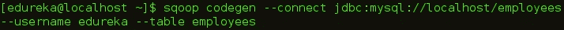

# 使用 Apache Sqoop 在 HDFS 和 RDBMS 之间导入/导出数据

> 原文：<https://medium.com/edureka/apache-sqoop-tutorial-431ed0af69ee?source=collection_archive---------3----------------------->


Apache Sqoop Tutorial - Edureka

在开始这篇 Apache Sqoop 教程之前，让我们后退一步。你还记得数据摄取的重要性吗，正如我们在之前的博客 ***Apache Flume*** 中所讨论的。现在，正如我们所知，Apache Flume 是一个用于非结构化数据源的数据摄取工具，但是组织将其运营数据存储在关系数据库中。因此，需要一种可以从关系数据库导入和导出数据的工具。这也是 Apache Sqoop 诞生的原因。Sqoop 可以轻松地与 Hadoop 集成，并从 HDFS 上的关系数据库中转储结构化数据，从而增强了 Hadoop 的能力。这就是为什么 Apache Flume 是 ***Hadoop 生态系统*** 的重要组成部分。

最初，Sqoop 由 Cloudera 开发和维护。后来，在 2011 年 7 月 23 日，它被阿帕奇孵化。2012 年 4 月，Sqoop 项目被提升为 Apache 的顶级项目。

在这篇 Apache Flume 教程博客中，我们将讨论:

*   Sqoop 简介
*   为什么选择 Sqoop
*   Sqoop 特性
*   Flume vs Sqoop
*   Sqoop 架构和工作
*   Sqoop 命令

我们将从介绍 Apache Sqoop 开始这个 Apache Sqoop 教程。接下来，我们将了解使用 Apache Sqoop 的优势。

# Sqoop 简介


通常，应用程序使用 RDBMS 与关系数据库进行交互，因此这使得关系数据库成为生成大数据的最重要来源之一。这种数据以关系结构存储在 RDB 服务器中。在这里，Apache Sqoop 在 ***Hadoop 生态系统*** 中扮演着重要的角色，在关系数据库服务器和 HDFS 之间提供可行的交互。

因此，Apache Sqoop 是 ***Hadoop 生态系统*** 中的一个工具，用于在***【HDFS】***(Hadoop 存储)和关系数据库服务器(如 MySQL、Oracle RDB、SQLite、Teradata、Netezza、Postgres 等)之间传输数据。Apache Sqoop 将数据从关系数据库导入到 HDFS，将数据从 HDFS 导出到关系数据库。它在 [Hadoop](https://www.edureka.co/blog/hadoop-tutorial?utm_source=medium&utm_medium=content-link&utm_campaign=apache-sqoop-tutorial) 和外部数据存储(如企业数据仓库、关系数据库等)之间高效地传输批量数据。

> 这就是 Sqoop 得名的原因——“SQ**SQ**L to Had**OOP**T34]Hadoop to SQL”。

此外，Sqoop 用于将数据从外部数据存储导入 Hadoop 生态系统的工具，如***Hive***&***h base***。

现在，我们知道什么是 Apache Sqoop。因此，让我们继续学习 Apache Sqoop 教程，理解为什么组织广泛使用 Sqoop。

# 为什么选择 Sqoop？

对于 Hadoop 开发者来说，在数据被加载到 HDFS 之后，真正的游戏才开始。他们玩弄这些数据，以便获得隐藏在 HDFS 存储的数据中的各种洞察力。

因此，对于这个分析，驻留在关系数据库管理系统中的数据需要转移到 HDFS。为从关系数据库向 HDFS 导入和导出数据而编写 ***MapReduce*** 代码的任务是无趣的&乏味的。这就是 Apache Sqoop 来拯救他们并消除他们的痛苦的地方。它自动执行导入&导出数据的过程。

Sqoop 通过提供导入和导出数据的 CLI 简化了开发人员的工作。他们只需提供基本信息，如数据库认证、来源、目的地、操作等。它负责剩下的部分。

Sqoop 在内部将命令转换成 MapReduce 任务，然后通过 HDFS 执行这些任务。它使用 YARN 框架来导入和导出数据，这在并行性之上提供了容错。

在这篇 Sqoop 教程博客中，我们将了解 Sqoop 的关键特性，然后我们将继续讨论 Apache Sqoop 架构。

# Sqoop 的主要特性

Sqoop 提供了许多显著的特性，例如:

> **满载** : Apache Sqoop 可以通过一条命令装载整个表。您还可以使用一个命令从数据库中加载所有的表。
> 
> **增量** **加载** : Apache Sqoop 还提供了增量加载的功能，每当表被更新时，就可以加载表的一部分。
> 
> **并行**
> 
> **导入** **结果** **的****SQL****查询**:您也可以导入 HDFS SQL 查询返回的结果。
> 
> **压缩**:您可以通过使用 deflate(gzip)算法和–compress 参数，或者通过指定–Compression-codec 参数来压缩您的数据。也可以在 **Apache Hive** 中加载压缩表。
> 
> **连接器** **用于** **所有** **专业** **RDBMS** **数据库** : Apache Sqoop 提供了多个 RDBMS 数据库的连接器，几乎覆盖了整个圆周。
> 
> **Kerberos** Sqoop 支持 Kerberos 认证。
> 
> **将** **数据** **直接** **加载到** **HIVE/HBase** 中:您可以将数据直接加载到 **Apache Hive** 中进行分析，也可以将您的数据转储到 HBase 中，这是一个 NoSQL 数据库。
> 
> **支持** **Accumulo** 的 **:也可以指示 Sqoop 导入 Accumulo 中的表，而不是 HDFS 的目录。**

该架构为 Apache Sqoop 提供了这些优势。现在，我们知道了 Apache Sqoop 的特性，让我们继续了解 Apache Sqoop 的架构和工作方式。

# Sqoop 架构和工作

让我们使用下图来了解 Apache Sqoop 的工作原理:


导入工具将单个表从 RDBMS 导入到 HDFS。在 HDFS，表中的每一行都被视为一条记录。

当我们提交 Sqoop 命令时，我们的主任务被分成子任务，这些子任务由单独的 Map 任务在内部处理。Map 任务是子任务，它将部分数据导入 Hadoop 生态系统。总的来说，所有地图任务都会导入全部数据。


导出也以类似的方式工作。

导出工具将一组文件从 HDFS 导出回 RDBMS。作为 Sqoop 输入的文件包含记录，这些记录在表中称为行。

当我们提交作业时，它被映射到地图任务中，这些任务从 HDFS 带来大量数据。这些块被导出到结构化数据目标。结合所有这些导出的数据块，我们在目的地接收整个数据，在大多数情况下，目的地是 RDBMS (MYSQL/Oracle/SQL Server)。

在聚合的情况下，需要减少阶段。但是，Apache Sqoop 只是导入和导出数据；它不执行任何聚合。映射作业根据用户定义的数量启动多个映射器。对于 Sqoop 导入，将为每个映射器任务分配一部分要导入的数据。Sqoop 在映射器之间平均分配输入数据以获得高性能。然后，每个映射器使用 JDBC 创建与数据库的连接，并获取由 Sqoop 分配的数据部分，并根据 CLI 中提供的参数将其写入 HDFS 或配置单元或 HBase。

现在我们已经了解了 Apache Sqoop 的架构和工作方式，让我们来了解一下 Apache Flume 和 Apache Sqoop 之间的区别。

# Flume vs Sqoop

Flume 和 Sqoop 的主要区别在于:

*   Flume 只将非结构化数据或半结构化数据引入 HDFS。
*   而 Sqoop 可以将结构化数据从 RDBMS 或企业数据仓库导入和导出到 HDFS，反之亦然。

现在，在我们的 Apache Sqoop 教程中，是时候学习 Apache Sqoop 命令了。

# Sqoop 命令

## Sqoop —导入命令

Import 命令用于将关系数据库中的表导入 HDFS。在我们的例子中，我们将把表从 MySQL 数据库导入到 HDFS。

正如您在下图中看到的，我们在雇员数据库中有雇员表，我们将把它导入到 HDFS。


导入表格的命令是:

```
sqoop import --connect jdbc:mysql://localhost/employees --username edureka --table employees
```


正如您在下图中看到的，在执行此命令后，地图任务将在后端执行。


代码执行后，您可以检查 HDFS 的 Web UI，即数据导入的 localhost:50070。


## Sqoop —导入目标目录的命令

您也可以使用下面的命令将该表导入到 HDFS 的特定目录中:

```
sqoop import --connect jdbc:mysql://localhost/employees --username edureka --table employees --m 1 --target-dir /employees
```

Sqoop 从大多数数据库源并行导入数据。 *-m* 属性用于指定要执行的映射器数量。

Sqoop 从大多数数据库源并行导入数据。您可以通过使用 *-m* 或*–num-mappers*参数来指定用于执行导入的映射任务(并行进程)的数量。这些参数中的每一个都采用一个与要使用的并行度相对应的整数值。

您可以独立于目录中的文件数量来控制映射器的数量。导出性能取决于并行度。默认情况下，Sqoop 将在导出过程中并行使用四个任务。这可能不是最佳选择，您需要尝试自己的特定设置。额外的任务可能提供更好的并发性，但是如果数据库已经在更新索引、调用触发器等方面遇到瓶颈，那么额外的负载可能会降低性能。


您可以在下图中看到，映射器任务的数量为 1。


导入 MySQL 表时创建的文件数等于创建的映射器数。


## Sqoop —带有 Where 子句的导入命令

您可以使用 Sqoop 导入工具中的“where”子句导入表的子集。它在各自的数据库服务器中执行相应的 SQL 查询，并将结果存储在 HDFS 的目标目录中。您可以使用以下命令通过' *where* 子句导入数据:

```
sqoop import --connect jdbc:mysql://localhost/employees --username edureka --table employees --m 3 --where "emp_no &gt; 49000" --target-dir /Latest_Employees
```


## Sqoop —增量导入

Sqoop 提供了一种增量导入模式，该模式可用于仅检索比先前导入的一组行更新的行。Sqoop 支持两种类型的增量导入: *append* 和 *lastmodified* 。您可以使用–incremental 参数来指定要执行的增量导入的类型。

当导入一个表时，您应该指定 *append* 模式，在该表中，新行随着行 id 值的增加而不断增加。用*–check-column*指定包含行 id 的列。Sqoop 导入校验列的值大于用*–最后一个值*指定的值的行。

Sqoop 支持的另一种表更新策略称为 *lastmodified* 模式。当源表的行可能被更新时，应该使用这种方法，每次更新都会将 last-modified 列的值设置为当前时间戳。

运行后续导入时，您应该以这种方式指定*–最后值*，以确保您只导入新的或更新的数据。这是通过将增量导入创建为保存的作业来自动处理的，这是执行重复增量导入的首选机制。

首先，我们插入一个新行，它将在我们的 HDFS 中更新。


增量导入的命令是:

```
sqoop import --connect jdbc:mysql://localhost/employees --username edureka --table employees --target-dir /Latest_Employees --incremental append --check-column emp_no --last-value 499999
```


您可以在下图中看到，使用更新的数据创建了一个新文件。


## Sqoop —导入所有表

您可以将所有表从 RDBMS 数据库服务器导入到 HDFS。每个表数据存储在单独的目录中，目录名与表名相同。数据库中的每个表都必须有一个主键字段，这是强制性的。从数据库导入所有表的命令是:

```
sqoop import-all-tables --connect jdbc:mysql://localhost/employees --username edureka
```


## Sqoop —列出数据库

您可以使用 Sqoop 列出关系数据库中存在的数据库。Sqoop list-databases 工具针对数据库服务器解析并执行“显示数据库”查询。列出数据库的命令是:

```
sqoop list-databases --connect jdbc:mysql://localhost/ --username edureka
```


## Sqoop —列表

您还可以使用 Sqoop 列出 MySQL 数据库服务器中特定数据库的表。Sqoop list-tables 工具解析并执行“显示表格”查询。在数据库中列出表格的命令是:

```
sqoop list-tables --connect jdbc:mysql://localhost/employees --username edureka
```


正如我们上面讨论的，您还可以将数据从 HDFS 导出到 RDBMS 数据库。目标表必须存在于目标数据库中。这些数据作为记录储存在 HDFS。这些记录被读取、解析并用用户指定的分隔符分隔。默认操作是使用 insert 语句将输入文件中的所有记录插入到数据库表中。在更新模式下，Sqoop 生成 update 语句，将现有记录替换到数据库中。

因此，首先，我们创建一个空表，我们将在其中导出数据。


将数据从 HDFS 导出到关系数据库的命令是:

```
sqoop export --connect jdbc:mysql://localhost/employees --username edureka --table emp --export-dir /user/edureka/employees
```


## Sqoop — Codegen

在面向对象的应用程序中，每个数据库表都有一个数据访问对象类，它包含初始化对象的“getter”和“setter”方法。Codegen 自动生成 DAO 类。它基于表模式结构用 Java 生成 DAO 类。

```
sqoop codegen --connect jdbc:mysql://localhost/employees --username edureka --table employees
```



您可以在上面的图像中看到生成代码的路径。让我们走这条路，检查创建的文件。


我希望这篇文章能给你带来信息和附加值。

如果你想查看更多关于人工智能、Python、道德黑客等市场最热门技术的文章，你可以参考 Edureka 的官方网站。

请留意本系列中解释大数据其他各方面的其他文章。

> 1. [Hadoop 教程](/edureka/hadoop-tutorial-24c48fbf62f6)
> 
> 2.[蜂巢教程](/edureka/hive-tutorial-b980dfaae765)
> 
> 3.[养猪教程](/edureka/pig-tutorial-2baab2f0a5b0)
> 
> 4.[地图缩小教程](/edureka/mapreduce-tutorial-3d9535ddbe7c)
> 
> 5. [HBase 教程](/edureka/hbase-tutorial-bdc36ab32dc0)
> 
> 6. [HDFS 教程](/edureka/hdfs-tutorial-f8c4af1c8fde)
> 
> 7. [Hadoop 3](/edureka/hadoop-3-35e7fec607a)
> 
> 8.[大数据教程](/edureka/big-data-tutorial-b664da0bb0c8)
> 
> 9.[水槽教程](/edureka/apache-flume-tutorial-6f7150210c76)
> 
> 10. [Oozie 教程](/edureka/apache-oozie-tutorial-d8f7bbbe1591)
> 
> 11. [Hadoop 生态系统](/edureka/hadoop-ecosystem-2a5fb6740177)
> 
> 12.[HQL 顶级配置单元命令及示例](/edureka/hive-commands-b70045a5693a)
> 
> 13. [Hadoop 集群搭配亚马逊 EMR？](/edureka/create-hadoop-cluster-with-amazon-emr-f4ce8de30fd)
> 
> 14.[大数据工程师简历](/edureka/big-data-engineer-resume-7bc165fc8d9d)
> 
> 15. [Hadoop 开发人员-工作趋势和薪水](/edureka/hadoop-developer-cc3afc54962c)
> 
> 16. [Hadoop 面试问题](/edureka/hadoop-interview-questions-55b8e547dd5c)

*原载于 2014 年 10 月 9 日 www.edureka.co*[](https://www.edureka.co/blog/hadoop-tutorial/)**。**