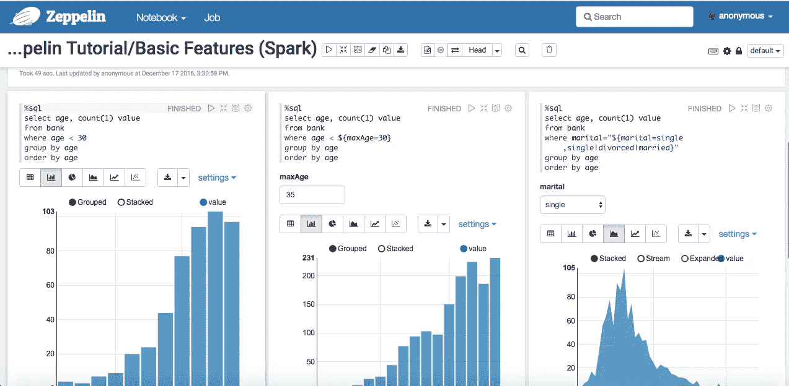
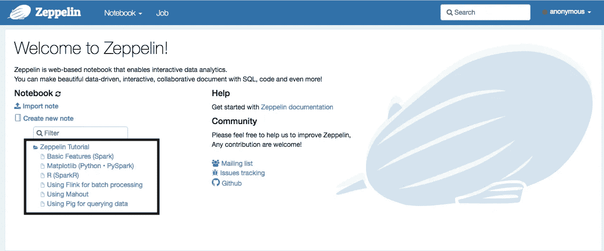
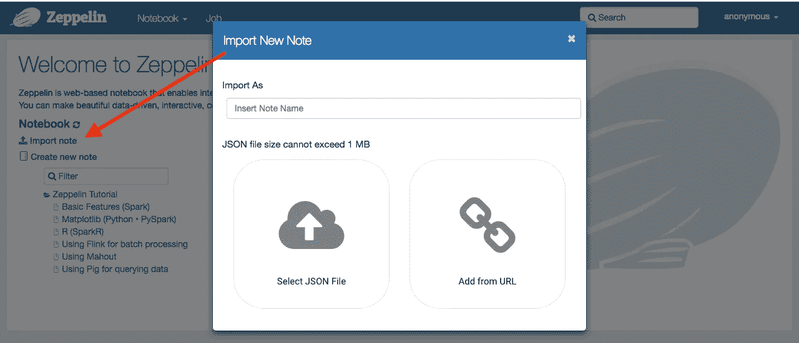
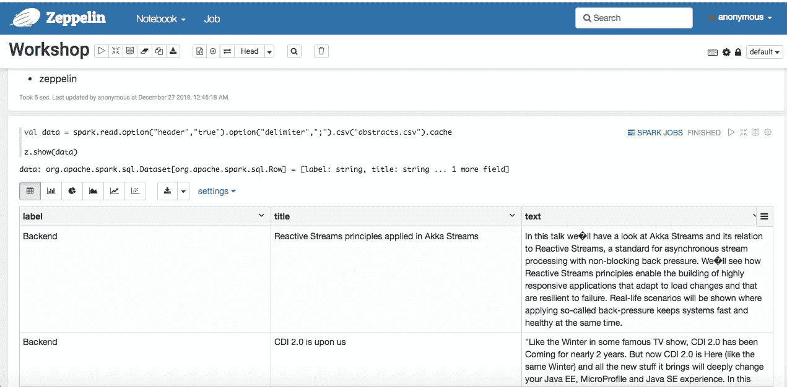
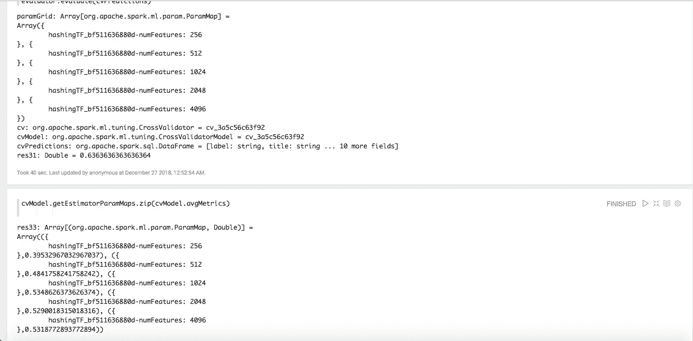

# 阿帕奇齐柏林飞艇:通往天堂的阶梯！

> 原文：<https://medium.com/oracledevs/apache-zeppelin-stairway-to-notes-haven-28ec413a185a?source=collection_archive---------0----------------------->

*笔记适用于 Zeppelin 行话中的笔记本

这篇文章是我的@JavaAdventCalendar 文章的再博客，来自[https://www . javaadvent . com/2018/12/Apache-zeppelin-stairway-to-notes-haven . html](https://www.javaadvent.com/2018/12/apache-zeppelin-stairway-to-notes-haven.html)。

# 介绍

继续上一篇文章，[关于 AI、ML、DL 和 Java 的两年生活](/@neomatrix369/two-years-in-the-life-of-ai-ml-dl-and-java-6bfe6eb8182a)，在那里我表达了我的动机。我提到了我们的讨论，其中一个讨论是，你可以在 JuPyteR 笔记本上用 Python，R，Julia 这样的语言来写。大多数人不知道除了 Python、SQL 之外，你还可以写 Java 和 Scala 在 [Apache Zeppelin](http://zeppelin.apache.org) 笔记本的帮助下。因此，我确实承诺分享一些这方面的东西，以扩大每个人的认识。虽然已经过了一段时间，但我还是把我的想法整合到了这篇文章中，展示了我们如何使用支持 Java 和 Scala 的[*Apache Zeppelin*](https://zeppelin.apache.org/)*来完成类似的操作。这个项目本身是用 Java 编写的，它的开放架构意味着 Zeppelin 可以支持任何东西，只要为那个东西提供了一个解释器。*

# 首先，首先…

万一我已经失去了你们中的一些人，这里是我所说的 JuPyteR 笔记本和用不同语言写笔记本的意思，见[https://www.youtube.com/watch?v=Rc4JQWowG5I](https://www.youtube.com/watch?v=Rc4JQWowG5I)并且也看看 JuPyteR 笔记本支持的[内核列表](https://github.com/jupyter/jupyter/wiki/Jupyter-kernels)。但是在这篇文章中，我们将讨论 Apache Zeppelin，如何让它工作，以及如何在 Zeppelin 环境中使用一些注释。

# 有趣的是…

所以让我们看看我们是如何做到的，首先下载并安装 Apache Zeppelin。

# 下载和安装

**下载**

转到[下载页面](https://zeppelin.apache.org/download.html)，有多个选项可供选择，推荐两个选项:

*   下载包含解释器的整个二进制文件
*   下载一个网络安装程序，然后下载解释器(你可以选择你需要的，或者对所有的[解释器](https://zeppelin.apache.org/docs/0.8.0/usage/interpreter/installation.html)使用`--all`标志)

在我们的例子中，我从[下载二进制包部分](https://zeppelin.apache.org/docs/0.8.0/quickstart/install.html#downloading-binary-package)下载了 **net-install 解释器包**。

**安装**

```
$ cd /opt/zeppelin-0.8.0-bin-netinst
$ ./bin/install-interpreter.sh --all
```

对于另一种类型的存档或安装选项，请参见[快速启动页面](https://zeppelin.apache.org/docs/0.8.0/quickstart/install.html)上的说明。

**运行**
根据下载的二进制类型，按照[快速启动页面](https://zeppelin.apache.org/docs/0.8.0/quickstart/install.html#starting-apache-zeppelin)上的说明进行操作。

尽管在我们的例子中，我不得不跑:

```
$ cd /opt/zeppelin-0.8.0-bin-netinst
$ ./bin/zeppelin.sh
```

由于我很好奇在另一个 JDK 下运行 Zeppelin 是什么，而不是通常的 Oracle 或 OpenJDK JDK 或 JRE，我决定尝试 GraalVM JRE，所以我将`JAVA_HOME`切换到指向我机器上的`/path/to/GraalVM/jre`。GraalVM JDK 与 JRE 捆绑在一起，可以像任何 Java 供应商的 JRE 一样独立使用。

当 Zeppelin 运行时，会显示这些消息(您可以看到`JAVA_HOME`设置已被选中):

```
Pid dir doesn&#039;t exist, create /opt/zeppelin-0.8.0-bin-netinst/run
GraalVM 1.0.0-rc7 warning: ignoring option MaxPermSize=512m; support was removed in 8.0
SLF4J: Class path contains multiple SLF4J bindings.
SLF4J: Found binding in [jar:file:/opt/zeppelin-0.8.0-bin-netinst/lib/interpreter/slf4j-log4j12-1.7.10.jar!/org/slf4j/impl/StaticLoggerBinder.class]
SLF4J: Found binding in [jar:file:/opt/zeppelin-0.8.0-bin-netinst/lib/slf4j-log4j12-1.7.10.jar!/org/slf4j/impl/StaticLoggerBinder.class]
SLF4J: See [http://www.slf4j.org/codes.html#multiple_bindings](http://www.slf4j.org/codes.html#multiple_bindings) for an explanation.
SLF4J: Actual binding is of type [org.slf4j.impl.Log4jLoggerFactory]
Dec 25, 2018 1:34:23 AM org.glassfish.jersey.internal.inject.Providers checkProviderRuntime
WARNING: A provider org.apache.zeppelin.rest.NotebookRepoRestApi registered in SERVER runtime does not implement any provider interfaces applicable in the SERVER runtime. Due to constraint configuration problems the provider org.apache.zeppelin.rest.NotebookRepoRestApi will be ignored.
Dec 25, 2018 1:34:23 AM org.glassfish.jersey.internal.inject.Providers checkProviderRuntime
Dec 25, 2018 1:34:23 AM org.glassfish.jersey.internal.inject.Providers checkProviderRuntime
[---- snipped ----]
WARNING: The (sub)resource method getNoteList in org.apache.zeppelin.rest.NotebookRestApi contains empty path annotation.
```

**运行(续)**
一旦完成上述所有步骤，并且 Zeppelin 已成功启动，执行以下操作:

*   打开[http://localhost:8080/#/](http://localhost:8080/#/)
*   然后看看[下的文档探索 Zeppelin UI](https://zeppelin.apache.org/docs/0.8.0/quickstart/explore_ui.html)
*   然后是[http://localhost:8080/#/notebook/2 a94m 5j 1z](http://localhost:8080/#/notebook/2A94M5J1Z)的教程笔记本



# 小实验

为了查看一些数字，我决定使用 **Zeppelin 教程/基本功能(Spark)笔记本**来检查使用 GraalVM JDK/JRE 和另一个 JDK/JRE 运行时的性能差异，结果如下:

***JDK***

*   `./bin/zeppelin.sh`48.26 秒用户 25.63 秒系统 28% cpu 4:20.15 总计(手动启动和停止脚本)
*   第一段
*   耗时 47 秒。最后更新由匿名于 2018 年 12 月 25 日，凌晨 2:18:36。
*   其后的每个段落(从左到右的列):
*   耗时 44 秒。最后更新由匿名于 2018 年 12 月 25 日，凌晨 2:18:44。(过时)
*   花了 10 秒钟。最后更新由匿名于 2018 年 12 月 25 日，凌晨 2:18:47。(过时)
*   花了 6 秒钟。最后更新由匿名于 2018 年 12 月 25 日，凌晨 2:18:50。(过时)

***甲骨文 JDK8***

*   `./bin/zeppelin.sh`37.64 秒用户 25.73 秒系统 29% cpu 3:38.49 总计(手动启动和停止脚本)
*   第一段
*   耗时 54 秒。最后更新由匿名于 2018 年 12 月 25 日，凌晨 2:12:16。
*   其后的每个段落(从左到右的列):
*   耗时 43 秒。最后一次由匿名更新于 2018 年 12 月 25 日凌晨 2:12:24。(过时)
*   花了 13 秒。最后一次由匿名更新于 2018 年 12 月 25 日凌晨 2:12:29。(过时)
*   花了 6 秒钟。最后更新由匿名于 2018 年 12 月 25 日，凌晨 2:12:31。(过时)

我的观察是，性能差异是微不足道的，尽管对于不同类型的操作，结果会在两者之间有所不同，因此需要更多的观察。除非另有说明，否则最好留在 GraalVM JRE 上，以便在我们进行的过程中看到更多这样的变化。

***注:*** *段落是齐柏林隐语中的代码块，注是一个笔记本在齐柏林世界中的简称。因此，笔记有一个或多个段落。*

还有许多其他教程(示例)笔记可以使用，请参见 Zeppelin 教程下的主页(见截图):



# 导入便笺

从主页([http://localhost:8080/#/](http://localhost:8080/#/)，见下文)，我们可以选择超链接文本 [Import Note](https://www.javaadvent.com/2018/12/apache-zeppelin-stairway-to-notes-haven.html) ，它允许我们从磁盘或 URL 导入笔记(Zeppelin 行话中的笔记本)。



在我们的例子中，我将来自[https://github . com/mmatloka/machine-learning-by-example-workshop](https://github.com/mmatloka/machine-learning-by-example-workshop)(确保使用了到`json`文件原始内容的链接，即[https://raw . githubusercontent . com/mmatloka/machine-learning-by-example-workshop/master/workshop . JSON](https://raw.githubusercontent.com/mmatloka/machine-learning-by-example-workshop/master/Workshop.json))的注释添加到 Zeppelin 中，并尝试运行，但在尝试运行前几段时出现了各种错误。

在寻找为什么我会得到这些错误的答案时，我偶然发现了一个论坛，然后采纳了论坛上有人的建议，那里有类似的错误消息。这是一个解决问题的方法[https://issues.apache.org/jira/browse/ZEPPELIN-3586](https://issues.apache.org/jira/browse/ZEPPELIN-3586)。

# 我们上次失败了，所以让我们再试一次…

其中一个解决方案是让`SPARK_HOME`指向 Spark 的一个独立实例，而不依赖 Apache Zeppelin 安装中的嵌入式`spark interpreter`。作为一种变通方法，在[https://gist . github . com/conker 84/4 ffc 9 a2 f 0125 c 808 B4 dfcf 3 b7d 70 b 043 # file-zeppelin-docker file](https://gist.github.com/conker84/4ffc9a2f0125c808b4dfcf3b7d70b043#file-zeppelin-dockerfile)提供了一个指向 Dockerfile gist 的链接。我扩展了该脚本以包含 GraalVM JRE，并添加了必要的配置以使其对 Zeppelin 和 Spark 可见:

*齐柏林飞艇-码头文件*

```
FROM apache/zeppelin:0.8.0
# Workaround to &quot;fix&quot; [https://issues.apache.org/jira/browse/ZEPPELIN-3586](https://issues.apache.org/jira/browse/ZEPPELIN-3586)
RUN echo &quot;$LOG_TAG Download Spark binary&quot; && \
wget -O /tmp/spark-2.3.1-bin-hadoop2.7.tgz [http://apache.panu.it/spark/spark-2.3.1/spark-2.3.1-bin-hadoop2.7.tgz](http://apache.panu.it/spark/spark-2.3.1/spark-2.3.1-bin-hadoop2.7.tgz) && \
tar -zxvf /tmp/spark-2.3.1-bin-hadoop2.7.tgz && \
rm -rf /tmp/spark-2.3.1-bin-hadoop2.7.tgz && \
mv spark-2.3.1-bin-hadoop2.7 /spark-2.3.1-bin-hadoop2.7
ENV SPARK_HOME=/spark-2.3.1-bin-hadoop2.7
### My modified steps here on:
RUN rm -fr /usr/lib/jvm/java-1.8.0-openjdk-amd64 /usr/lib/jvm/java-8-openjdk-amd64
RUN wget [https://github.com/oracle/graal/releases/download/vm-1.0.0-rc10/graalvm-ce-1.0.0-rc10-linux-amd64.tar.gz](https://github.com/oracle/graal/releases/download/vm-1.0.0-rc10/graalvm-ce-1.0.0-rc10-linux-amd64.tar.gz)
RUN tar xvzf graalvm-ce-1.0.0-rc10-linux-amd64.tar.gz
RUN mv graalvm-ce-1.0.0-rc10/jre /usr/lib/jvm/graalvm-ce-1.0.0-rc10
ENV JAVA_HOME=/usr/lib/jvm/graalvm-ce-1.0.0-rc10
ENV PATH=$JAVA_HOME/bin:$PATH
RUN java -version
RUN rm graalvm-ce-1.0.0-rc10-linux-amd64.tar.gz
RUN rm -fr graalvm-ce-1.0.0-rc10
CMD ["bin/zeppelin.sh"]
```

并创建了两个小型 bash 脚本来帮助构建 docker 映像并从映像运行容器。

*构建 docker 映像*

```
docker build -t zeppelin -f Zeppelin-Dockerfile .
```

*运行 docker 容器*

```
docker run --rm \ -it \ -p 8080:8080 zeppelin
```

**注意:**docker 镜像名为`zeppelin:latest`，大小约为 4.45GB。

***以上脚本可以在***[***https://github . com/neo matrix 369/awesome-ai-ml-dl/tree/master/examples/Apache-zeppelin***](https://github.com/neomatrix369/awesome-ai-ml-dl/tree/master/examples/apache-zeppelin)***找到，请随时对其进行改进并创建拉请求返回到 repo 中。***

如果你不想这样做，你可以尝试使用 https://github.com/dylanmei/docker-zeppelin 的[](https://github.com/dylanmei/docker-zeppelin)**。我是 Apache Zeppelin，它也使用这个容器。**

*我对上述内容不太感兴趣，因为整个过程花费了 45 分钟，其中 35 分钟用于下载几兆字节的 Spark。下载 GraalVM JDK 轻而易举，用我的高速 DSL 连接不到 5 分钟。*

*应用上面相同的步骤加载 Michal Matloka 的工作室笔记本(`workshop.json`)并运行笔记本中的段落，它工作得非常好，当然没有任何错误。感谢 Michal Matloka 为我们提供了这样一个例子，让我们一起玩，一起学。*

*从一个`.csv`文件加载数据集:*

**

*通过参数`avgMetrics`产生最终结果——平均交叉验证指标为`CrossValidator.estimatorParamMaps`中的每个`paramMap`按各自的顺序排列。*

**

*得分*53.18%*——可能仍需要一点调整和微调来获得更高的得分，但这是一个不同的讨论，与我们当前关于 Zeppelin notes 的主题无关。*

# *警告*

*不知何故，Zeppelin 不喜欢带有这种缩进的代码布局:*

```
*val indexToString = new IndexToString().setInputCol("prediction").setOutputCol("predictionLabel").setLabels(stringIndexer.labels)*
```

*因此，当我移除缩进以将函数调用链连接在一起时:*

```
*val indexToString = new IndexToString().setInputCol("prediction").setOutputCol("predictionLabel").setLabels(stringIndexer.labels)*
```

*我能够很好地运行这些段落。我不得不对所有的段落都这样做，以防止任何来自齐柏林飞艇的错误。否则你会在所有段落中得到这样的信息:*

```
*:1: error: illegal start of definition.setInputCol(&quot;prediction&quot;).setOutputCol("predictionLabel")^*
```

# *摘要*

*我喜欢齐柏林飞艇的原因是:*

*   *你有一个干净直观的界面(工作时必须有棱角)*
*   *您可以编写自定义解释器，并扩展可接受的语言列表*
*   *编写自己的可视化工具*
*   *实时显示每个段落的执行进度*
*   *实时计算并显示每一段的执行时间*
*   *在任何适用的地方，数据表都可以被可视化为多个视图，然后返回到数据表——所有这些都是延迟完成的(仅在被选中时执行，并保持结果不变)*

*虽然，执行可能会显得比 JuPyteR 笔记本慢。IPython 笔记本中的许多功能都没有了，这也意味着作为一个开源项目，它通过贡献留下了很多改进的空间——为拉取请求选择您最喜欢的功能。*

*总而言之，这是一个让 Java/JVM 开发人员感觉宾至如归的好地方，对于熟悉 Python 和 R 以及 Java 和 Scala 的开发人员来说，可以使用 Zeppelin 进行原型、ML 培训和实验工作。*

**请关注这个空间，并分享您的评论、反馈或任何有助于我们学习和成长到*[*@ theneomatrix 369*](http://twitter.com/@theNeomatrix369)，*您可以通过* [*关于我的页面*](http://neomatrix369.worpress.com/aboutme) *了解更多关于我的信息。**