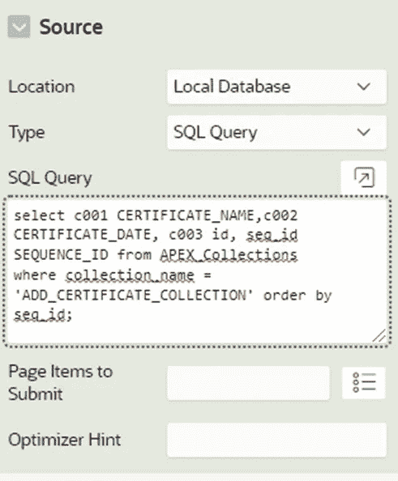

# 使用 APEX 集合动态添加/删除表单中的输入框并将数据保存到数据库

> 原文：<https://medium.com/oracledevs/apex-collections-to-dynamically-add-delete-input-boxes-in-a-form-and-save-the-data-to-the-database-a72e43678ad3?source=collection_archive---------0----------------------->

# 概观

APEX 交互式网格以可搜索、可定制报告的形式为用户提供一组数据。在可编辑的交互式网格中，用户还可以直接在页面上添加、修改和删除数据集。另一方面，定制这些交互式网格的外观可能有点棘手。

在本文中，我们将采用另一种方法:您将看到如何通过单击按钮来动态添加/删除表单中的输入框，并将表单数据保存到数据库中。

输入框中的数据临时存储在集合中，并显示为报告。用户可以对这个集合进行更新，然后调用最后一个进程将这些更改应用到数据库。

**注意:**如果您还没有注册，您可以[立即注册 Oracle 云免费层帐户](https://signup.cloud.oracle.com/?language=en)。如果你对如何开始学习 OCI 感兴趣，注册是第一步，没有必要跟着这篇文章走。

# 设置

在本例中，我们将使用 APEX 集合来管理用户完成的认证。

**先决条件:**一个存储表单数据的数据库表。

**第一步:创建收藏**

在 APEX 页面上，转到区域前的**预渲染- >，并创建一个新流程来创建集合。在本例中，我们将创建两个集合。**

*   ADD_CERTIFICATE_COLLECTION —使用 CREATE_COLLECTION_FROM_QUERY_B 过程初始化 ADD_CERTIFICATE_COLLECTION，该过程将从数据库表中提取数据并将其存储在集合中。它还将临时存储添加的证书。
*   DELETE_CERTIFICATE_COLLECTION —将临时存储需要从数据库表中删除的证书。

*有关 CREATE_COLLECTION_FROM_QUERY_B 过程的更多详细信息，请参考*[*https://docs . Oracle . com/CD/e 37097 _ 01/doc . 42/e 35127/GUID-22 CEC 93 f-1cf-48AF-BE89-a973a 3022 B 36 . htm # AEA pi 730*](https://docs.oracle.com/cd/E37097_01/doc.42/e35127/GUID-22CEC93F-1CCF-48AF-BE89-A973A3022B36.htm#AEAPI730)

**第二步:创建报告**

创建一个以添加证书集合为来源的经典报告

Sample query

**步骤 3:使用输入字段创建一个新的经典报告模板。报告模板的每一行还有一个删除按钮，用于删除证书。**

要创建新的经典报告模板，请转到**共享组件** > **模板**并复制“值属性对—行”模板。

在这个新创建的模板上，用如下所示的 HTML 代码更新**行模板>行模板** **1** 。该代码将在报告的每一行显示认证名称、完成日期和删除按钮。

**第 4 步:创建一个“添加”按钮，向页面添加新的证书。该按钮将打开一个弹出窗口，其中包含添加新证书的表单。**

**第五步:创建一个保存表单的按钮。向该按钮添加一个动态操作，将上述表单中的数据推送到 ADD_CERTIFICATE_COLLECTION。**

示例代码:

**第 6 步:创建一个删除动态动作来删除证书。**

*   使用 APEX_COLLECTION。从“添加证书集合”中删除项目的 DELETE_MEMBERS 过程
*   使用 APEX_COLLECTION。将项目添加到 DELETE_CERTIFICATE_COLLECTION 的 ADD_MEMBER 过程

**第七步。转到页面设计器- >处理并创建两个进程，用于插入和删除数据库中的项目。**

要插入的示例代码:该代码检查“ADD_CERTIFICATE_COLLECTION”中的项目是否已经存在于数据库中，如果不存在，则插入该项目。

# 加入对话！

如果你对甲骨文开发人员在他们的自然栖息地发生的事情感到好奇，请加入我们的公共休闲频道！我们不介意成为你的鱼缸🐠