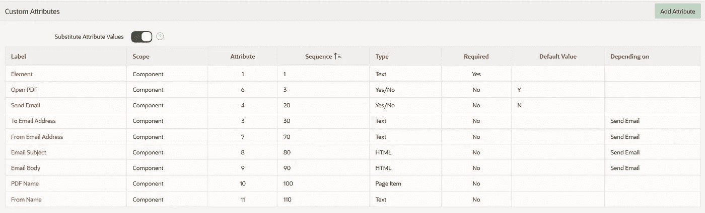
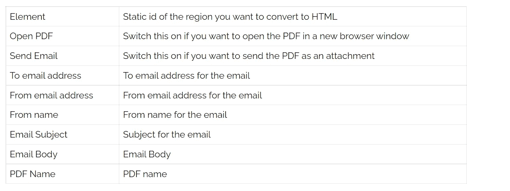
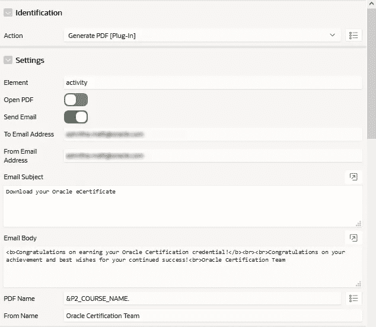

# 从页面内容生成 PDF 的 APEX 插件

> 原文：<https://medium.com/oracledevs/apex-plugin-to-generate-a-pdf-from-the-page-content-b1185d3d3264?source=collection_archive---------0----------------------->

# 概观

许多 APEX 应用程序要求用户能够下载 PDF 格式的页面内容。

Oracle Application Express (APEX)只需点击几下鼠标就可以为您的表单和报表创建 PDF 文件，但是从页面内容生成 PDF 并不容易。这个插件从 HTML 内容生成一个 PDF，并让您选择通过调用 APEX 进程将其作为电子邮件附件发送。

# 关于插件

插件允许应用程序 Express 框架通过定制项目类型、区域类型、流程和动态操作进行扩展。一旦定义，基于插件的组件就像标准的 Application Express 组件一样被创建和维护。插件使开发人员能够创建高度定制的组件，以增强其应用程序的功能、外观和用户友好性。

生成 PDF 插件是一个动态动作插件，它从 HTML 内容生成 PDF。

该插件使用 HtmlToPdfConverter 工具包从 HTML 生成 pdf。它将 APEX 区域的静态 ID 作为参数，并将该区域内的内容转换为 PDF。它还为您提供了一个将它作为电子邮件附件发送的选项，并且能够设置以下参数。该插件调用 APEX 进程将生成的 PDF 作为附件发送。

收件人电子邮件地址

来自电子邮件地址

从名称

电子邮件主题

电子邮件正文

PDF 附件名称

Plugin Attributes

# **如何安装**

1.  从 GitHub repo 下载 dynamic _ action _ plugin _ generate _ pdf . SQL 插件文件(以下链接)。
2.  导入插件文件，进入应用->共享组件->插件->导入，导入文件 dynamic _ action _ plugin _ generate _ pdf . SQL
3.  将 html2pdf JS (html2pdf.bundle.js)文件上传到共享组件->图像-> js 文件夹

# 插件设置

该插件具有以下自定义属性

Custom Attributes

Plugin Settings

# 如何使用

1.  在 APEX 页面中，创建一个包含要转换为 PDF 的内容的区域。更新静态 ID。
2.  创建一个按钮，添加一个动态动作点击这个按钮，并选择动作生成 PDF 插件。
3.  如上所述填写参数。

# APEX 电子邮件流程

生成 PDF 插件使用 APEX 流程将生成的 PDF 作为电子邮件附件发送。该插件将页面中的 HTML 转换为 base64 字符串，然后传递给 APEX 进程。然后 APEX 进程将字符串转换为 blob，并将其作为附件发送。

要创建此 APEX 流程，请转到您的应用程序->共享组件->应用程序流程->新建，并填写以下详细信息

名称:发送记录电子邮件

序列:1

要点:Ajax 回调

使用 GitHub repo 中 apex-process-send-email.sql 中的代码更新源代码。

# 开源代码库

https://github.com/Ora-CustomApps/APEX-GeneratePDF-Plugin(私人回购，联系我获取)