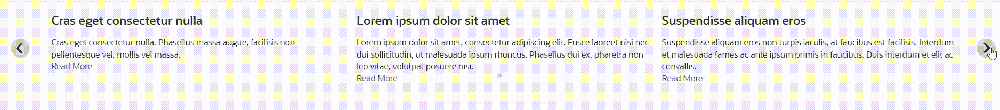
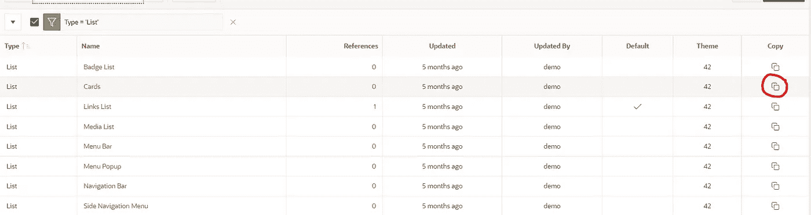
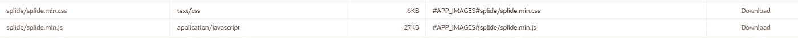

# 使用 Splide 的 APEX 滑块

> 原文：<https://medium.com/oracledevs/apex-slider-using-splide-57617ad06c1e?source=collection_archive---------1----------------------->

# 概观

Oracle Application Express(Oracle APEX)是一款针对 Oracle 数据库的快速 web 应用开发工具。您可以仅使用 web 浏览器和有限的编程技能来设计和部署既快速又安全的专业应用程序。

APEX 有许多内置的拖放区域，可用于在应用程序中构建页面。一个这样的区域是基于静态或动态列表显示值的列表区域。可以使用自定义列表模板自定义这些列表的外观。在这篇文章中，我们将概述如何通过创建自定义列表模板并将其与 Splide 集成来构建滑块。

# 关于 Splide

Splide 是一个轻量级的、灵活的和可访问的滑块/转盘，用 TypeScript 编写，没有依赖性。关于 Splide 的更多细节，请参考[https://splidejs.com/.](https://splidejs.com/.)

# 设置

**创建动态列表:**

在本例中，我们将使用 SQL 查询创建一个动态列表，并使用该列表创建一个滑块。

*有关创建动态列表的更多详细信息，请访问*[*https://docs . Oracle . com/en/database/Oracle/application-express/21.1//htm db/creating-dynamic-lists . html # GUID-1b 67 a3 c8-39FA-4868-9532-f 68 afcd 74651*](https://docs.oracle.com/en/database/oracle/application-express/21.1//htmdb/creating-dynamic-lists.html#GUID-1B67A3C8-39FA-4868-9532-F68AFCD74651)

要创建动态列表，请转到共享组件->导航->列表->创建列表，并在此处编写您的 SQL 查询或 PL/SQL 代码。下面是动态列表的 PL/SQL 代码示例。

**将列表添加到您的页面:**

要将此列表添加到您的页面，请转到 APEX 应用程序的页面设计器，并将列表区域拖放到您的页面。

将源更新到您刚刚创建的动态列表。当您现在运行该页面时，它应该显示一个区域，其中列表项一个放在另一个下面。

为列表区域创建自定义模板:

若要为此列表创建自定义模板，请转到“共享组件”->“模板”，并将模板筛选为 Type =“列表”(操作->筛选器-> Type =“列表”)。复制卡模板以创建新模板。

**包括顶点中的 Splide**

为了在我们的应用程序中包含 Splide，我们将把 Splide JS 和 CSS 文件导入到 APEX 应用程序中。

*(参考*[*https://splidejs.com/guides/getting-started/*](https://splidejs.com/guides/getting-started/)*了解可用于包含这些文件的其他选项)*

从 https://github.com/Splidejs/splide/releases/latest/下载最新的软件包

将 dist/js 目录中的 splide.min.js 和 dist/css 目录中的 splide.min.css 上传到 APEX 应用程序->共享组件->静态应用程序文件

**更新自定义列表模板**

现在转到您在 Shared Components -> Templates 下创建的定制模板，更新行模板并包含上面的文件。

要在新列表模板上执行这些操作:

1.  转到 JavaScript 选项卡，添加对您上传的 JS 文件的引用。此外，添加以下代码，以便在页面加载时执行，从而在您的应用程序中初始化 Splide。

2.转到级联样式表选项卡，并添加对您上传的 CSS 文件的引用。

3.在列表条目选项卡之前，更新代码，如下所示

4.模板定义选项卡，并使用以下代码更新当前和非当前列表模板

5.第一个条目选项卡的模板定义，并使用以下代码更新当前和非当前列表模板

6.在列表条目选项卡之后，用下面的代码更新列表模板

您可以使用 Splide 选项自定义滑块的外观。参考 https://splidejs.com/guides/options/的[，了解可用选项列表。](https://splidejs.com/guides/options/)

请加入我们的公共休闲频道的对话，让我们知道你的想法！