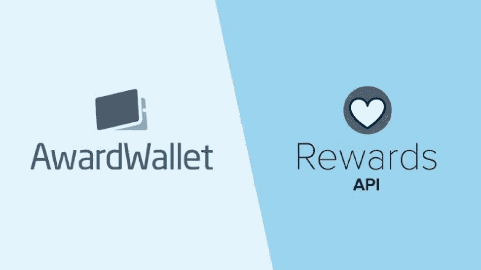
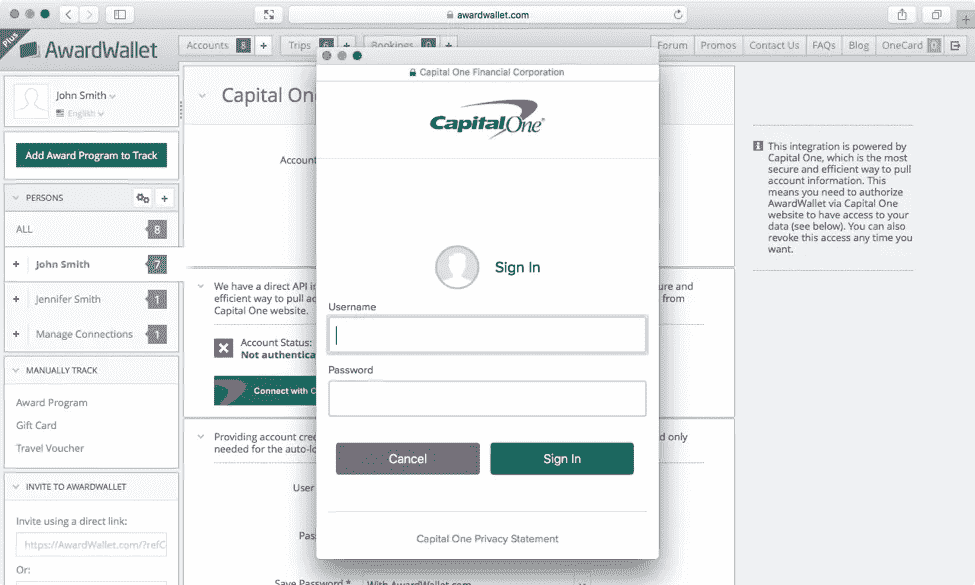
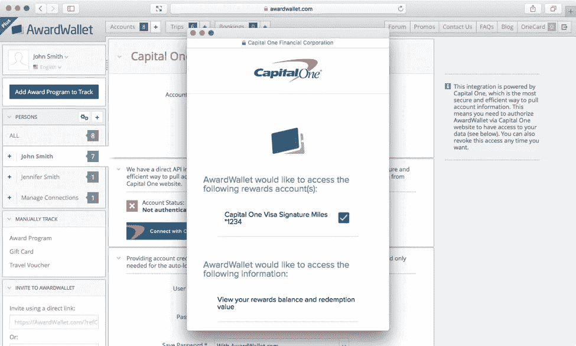
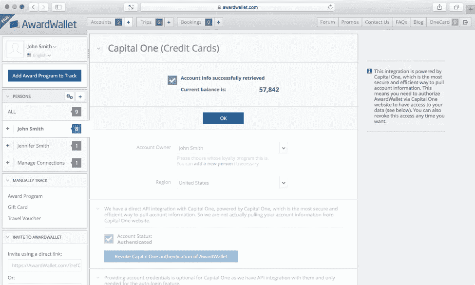
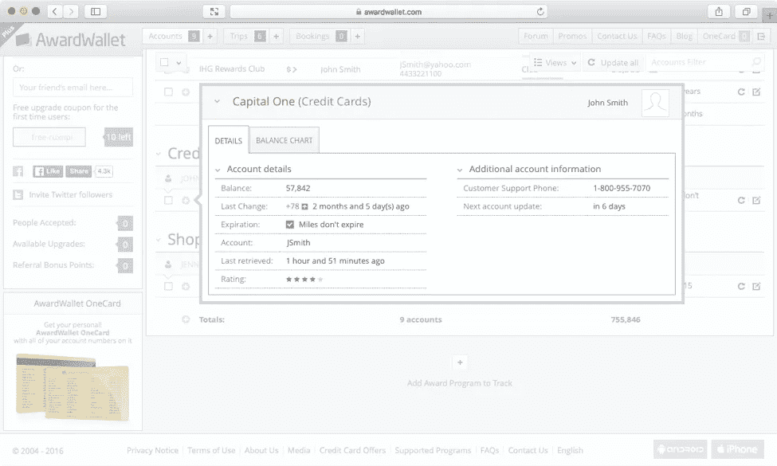

# API 案例研究:AwardWallet.com 积分奖励 API

> 原文：<https://medium.com/capital-one-tech/api-case-study-awardwallet-com-integration-of-rewards-api-d0603cdd4cf8?source=collection_archive---------3----------------------->

**案例分析一览:**

*   API:奖励 API
*   行业:互联网(差旅管理、忠诚度计划)
*   公司:AwardWallet，LLC
*   公司规模:11-50 名员工
*   当前用户群:420，000 多名客户
*   地点:【https://AwardWallet.com 
*   时间表:4 天

## 背景

[AwardWallet](https://awardwallet.com/) 是忠诚度账户和旅行计划跟踪领域的领导者。AwardWallet 的用户重视他们通过忠诚度计划获得的奖励，包括零售、金融和旅游。用户希望 AwardWallet 提供一种简单、安全的方式来跟踪各种奖励账户。超过 420，000 人信任 AwardWallet 来跟踪他们的余额，从通过购买游戏来跟踪他们的奖励的学生，到观看他们的零售忠诚度和金融忠诚度计划的家庭，以及拥有 20+旅行奖励帐户的出差族。这相当于跟踪超过 887 亿积分/英里，价值 17.7 亿美元。

AwardWallet 最近将 DevExchange Rewards API 集成到他们的网站中，以获取用户的 Capital One rewards 余额信息。该 API 允许用户让 AwardWallet 访问他们的奖励信息，而无需访问他们的整个在线银行档案。

## API 选择

AwardWallet 在检查了 Rewards API 的几个关键标准后，选择使用该 API:(1)该 API 将提供一种安全机制，无需存储消费者凭证，(2)无论何时执行查询，AwardWallet 都将从 Capital One 接收到标准的结构化响应，(3)当对面向消费者的接口进行更新时，只要 API 一致，就不会影响他们检索数据的能力。

## 履行

AwardWallet 通过 DevExchange 获得了对 Rewards API 的访问权，他们在那里注册了一个帐户，提供了基本的应用程序信息(徽标、重定向 URL、描述等)。)，并收到一个客户机 ID 和 API 密钥作为回报。利用这些信息，AwardWallet 开发团队很快在测试服务器上实现了这个 API，然后将其推广到生产环境中。实施在四天内完成，据 AwardWallet 报告，如果其中一天不是假日，可能需要三天。

我们向 AwardWallet 询问了他们对这一体验的反馈，以下是他们不得不说的话:
*“我们在注册过程中确实遇到了一个小麻烦:确认电子邮件没有送达。但是 DevExchange 团队很快就修复了这个问题。之后的体验非常顺利。我们能够注册两个不同的概要文件，一个用于测试，一个用于生产。我们有一个由三名熟悉 API 的开发人员组成的团队。实际的 API 实现很快，花费大部分时间的部分是 AwardWallet.com 上的 UI 更改，以适应注册帐户时的 OAuth2 身份验证。”*

## 应用编程接口的应用——用户流

奖励钱包体验:用户登录
*当用户发起连接时，他们被要求验证他们的账户*。

AwardWallet 体验:用户同意
*用户被要求批准 AwardWallet 访问其奖励账户信息的请求。*

AwardWallet 体验:更新成功
*验证帐户后，用户会收到一条确认消息，表明他们的奖励帐户信息已成功存入。*

AwardWallet 体验:帐户详情
*一旦快速设置完成，用户现在可以通过 AwardWallet 跟踪他们的 Capital One 奖励。*

## 支持

为了全面测试使用 DevExchange 平台 API 的体验，AwardWallet 在整个实施过程中与 Rewards API 产品团队密切合作。作为一家采用“设计思维”方法的公司，这种实施是由 Rewards API 的产品经理 Roger Hahn 和 AwardWallet 的创始人 Alexi Vereschaga 合作实现的。考虑到潜在的早期采用者，Hahn 联系了 Vereschaga，以了解他的团队在与奖励系统集成时面临的挑战，以及推动 AwardWallet 用户体验所需的数据。Rewards API 产品团队将 AwardWallet 和其他潜在消费者的见解和建议融入到 API 的设计中。其结果是 API 公开了最相关的用户信息，同时易于理解和使用。

Vereschaga 对支持的反馈:
*“最终，整个文档非常出色。一开始，文档中有一些错误，我们向 Rewards API 团队指出了这些错误，他们很快就解决了。为 Rewards API 提供的文档比我们收到的其他 API 版本要好。对于其他合作伙伴，我们在访问他们的 API 时遇到了延迟，并且没有文档。就 Rewards API 技术团队的支持和响应而言，他们获得了 A+。我们不可能要求更好的支持。”*

## 结果

AwardWallet 能够在他们的网站上报告 API 实现的许多好处，他们列出了三个关键好处，将 Rewards API 排在他们以前使用过的其他 API 之上:它(1)更安全，(2)工作更快，以及(3)更可靠。

AwardWallet 还报告了早期用户反馈:*“我们收到了来自用户的积极反馈，尤其是他们喜欢 Capital One 账户现在被追踪的方式。”*

*声明:本博客中的观点是作者/受访者的观点，不一定是 Capital One 的观点。除非本帖中另有说明，否则 Capital One 不属于所提及的任何公司，也不被其认可。使用或展示的所有商标和其他知识产权都是其各自所有者的所有权。这篇博文是 2016 Capital One。*