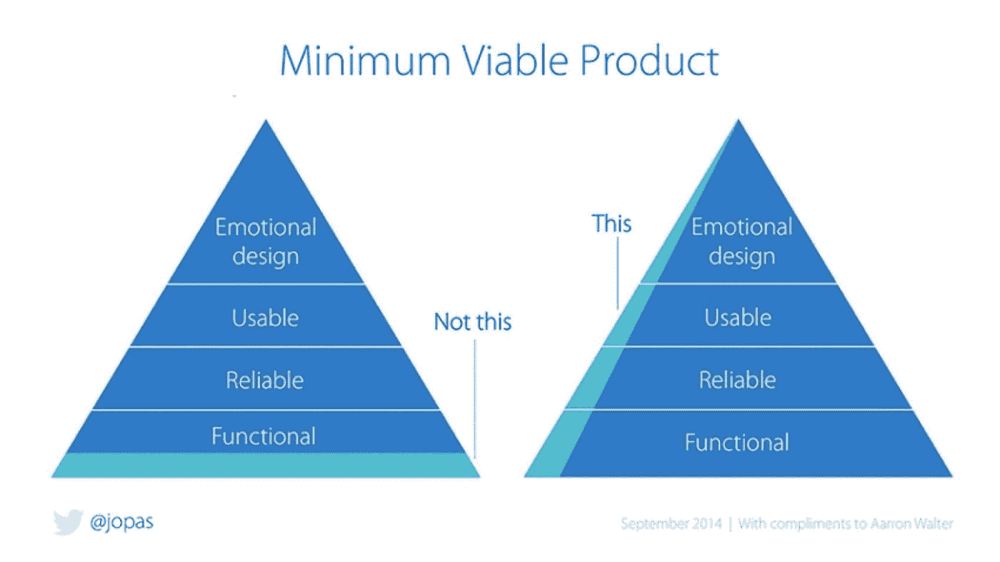
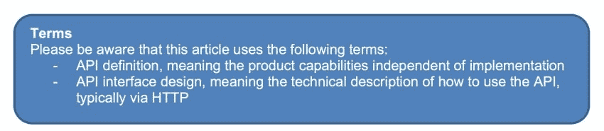
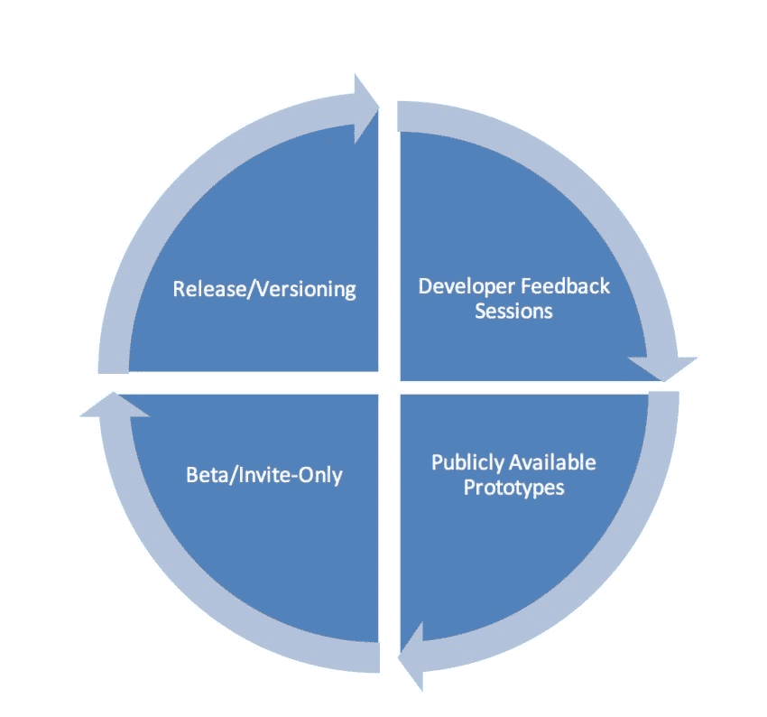

# 使用反馈循环的 API 设计

> 原文：<https://medium.com/capital-one-tech/api-design-using-feedback-loops-37048d3d131e?source=collection_archive---------0----------------------->

我们通常认为 API 定义是从描述文件开始的。这种方法的挑战在于，API 生产者在实际确定 API 需要什么功能之前，经常会忽略资源名称和方法。这可能会在设计确切的接口时造成很多混乱，因为细节和高级概念是同时讨论的。

许多组织选择通过向市场发布一个“MVP”来快速、轻松地取胜，目的是从那里建立那些概念。虽然这可能对传统产品有效(我认为这是有问题的，但已经成为一种被接受的方法)，但对于 API 来说，这是一个更大的挑战，因为它们在依赖于它们的应用程序中扮演着重要的角色。如果你要提供一个既令人满意又稳定的 API，你需要确保你的初始 API 版本是功能性的、可靠的和可用的。API 的丧钟是不断发布突破性的变化或更新，要求应用程序开发人员返工他们的应用程序。

*Minimum Viable Product: Build a slice across, instead of one layer at a time. Diagram courtesy of Jussi Pasanen, with acknowledgements to Aarron Walter, Ben Tollady, Ben Rowe, Lexi Thorn and Senthil Kugalur.*

更有效的方法是使用精益方法中的一些相同原则来鼓励持续(和早期)学习。这允许您在深入研究如何实现这些功能的细节之前，细化所需的和期望的功能。通过一些调整来适应 API 空间，您可以应用类似的原则来实现相同的最终目标——理解对客户的价值，并根据反馈循环不断地重新调整。

# 反馈回路的好处

在提交代码或路线图之前，花时间在市场上测试您的产品想法可能是一项巨大的时间和金钱投资。但是这种投资在很多方面都有回报。让我们来看看这种方法的一些好处:

*   首先规划功能允许您战略性地考虑您的发布计划和您的潜在合作伙伴。当您首先致力于 API 的内部工作时，您会被技术而不是策略所束缚。
*   通过收集关于您的路线图和功能的反馈，您可以更灵活地改变这两者，因为您还没有致力于 API 设计和代码。您还可以对 API 接口的寿命更有信心，因为您已经做了很多前瞻性的思考。
*   您的潜在 API 消费者对您的版本更感兴趣，因为他们提供了方向和战略思想来帮助您形成产品。你正在建立他们所要求的，他们知道这一点。

# 建立反馈回路的风险

如果我们不承认在你的产品准备好之前把你的 API 概念放在那里是有风险的，这是不诚实的。根据您的组织对风险的厌恶程度，这些是应该认真考虑的风险。

*   你必须接受一定程度的透明度。当你在重复这个概念并收集反馈时，你必须向公众展示你的想法。我们将进一步讨论降低这种风险的方法。
*   如果您要求对您的 API 概念进行反馈，您需要准备好对反馈做出反应。在这个阶段，你的产品经理需要敏捷的思维，你的组织需要对计划的变化做出反应。
*   为了质量，你可能不得不牺牲速度。我们将讨论收集反馈并对其做出反应的各种方法，但它们都需要时间，并且有可能花费比您所能接受的更长的时间来发布。但是你也可以放心，你将把一个开发者真正想要的 API 推向市场。

# 建立反馈回路的技术

根据 API 的复杂性和发布的紧迫性，您可以使用任意数量的技术来获得对 API 的反馈。理想的情况是，给定时间和资源，您将结合多种技术，每种技术都旨在更深入地阐明和巩固您的 API 概念。

请记住，反馈回路正是——它旨在成为迭代设计周期的一部分。让我们来看看一些反馈循环，它们可以帮助您为您的消费者设计具有正确价值的正确 API。

# 开发者焦点小组

当你在“试探”一个想法时，这些对话是非常宝贵的。你可以在构思周期的任何时候主持这些——你的 API 概念可能只是一个想法的萌芽，没有关于方法或限制的真正细节。事实上，最好不要展示任何已知的限制，这样你就可以更自由地交谈。以下是组织开发人员焦点小组的一些技巧:

*   为了保持对话，这种聚会的理想规模是不超过 30 人。
*   确保你包括各种各样的参与者——企业开发人员、初创企业开发人员、产品经理，他们都来自各种垂直行业。
*   准备好展示你的概念，鼓励诚实的反馈。不说服，不辩解；这是一个听力练习。用问题、问题和更多问题来探索反馈。
*   带一个记录员——你想把注意力集中在谈话上；让其他人做笔记。
*   根据反馈评估和重新评估你的目标市场(例如，也许初创企业对这种能力更感兴趣，所以他们不必自己构建)。
*   倾听信息提炼——哪些措辞/词语最有助于参与者理解该功能？他们对你的描述和定位的第一情绪反应是什么？这不仅仅是一个获得对您想要构建的 API 的反馈的机会，也是一个如何在以后定位它的机会。

# 公开可用的原型

理想情况下，在焦点小组会议之后，你会看到你认为的 API 的第一个版本，但是是原型形式。这个原型的目标是通过在操场环境中公开 API 接口和一些模拟数据，从概念走向现实。让开发人员调用 API，鼓励对界面设计和有效载荷构造的反馈。当您使 API 原型可用时，需要考虑一些事情:

*   你的 API 设计应该尽可能的简洁。虽然您不想在接口上投入太多时间以至于不愿意改变它，但是您也希望确保您没有暴露内部路径或资源名称，并且您已经提供了足够的安全性来增强对您设计 API 的能力的信心。
*   提供一些健壮的模拟数据。开发人员希望看到您的 API 在错误条件下以及正常条件下的表现。他们希望看到一个完整的有效负载，让他们真正了解如何在真实的开发环境中使用 API。
*   如果您有协作工具，请使用它们。市场上有几个工具允许人们对你的 API 描述进行评论，并参与论坛讨论。通过一个工具从你的观众那里收集信息意味着你可以把所有的反馈保存在一个地方并且永久保存。如果您可以通过提供 API 描述的更新版本供开发人员试验来迭代工具本身，那就更好了。
*   将您的草稿文档与原型一起发布。API 文档不是一个单独的交付物，它是 API 本身的一部分。在原型开发阶段，您可以获得对您提供的文档的实时审查，这样您也可以对其进行迭代。如果您可以在 GitHub 上提供文档，您甚至可以鼓励您的消费者提交带有文档更正和增强的 PRs。
*   观看它的运行。现在是时候举办一些非正式的黑客大会和更多的焦点小组了。每当您迭代原型以整合反馈时，您可以召集一组人来验证方向。

# 测试版/仅限受邀者

好了，在你写一行代码之前，你已经从焦点小组那里得到了关于这个概念的反馈。您构建了实现虚拟 API 和第一稿文档的原型，并根据消费者的反馈迭代这些原型。

现在是生产的时候了。这才是你真正需要评估自己风险承受能力的地方。如果您的 API 不涉及安全信息或关键任务功能，您可以将其部署到生产环境中，并将其开放供一般用途。

然而，如果你在一个更加厌恶风险的环境中，你可以通过向有限的受众提供 API 来继续你的缓慢进展。这为您提供了另一个机会来收集反馈，并在更广泛地使用之前进行改进。以下是邀请阶段的一些通用指南，可以帮助您确保您的 API 是可靠的，并且符合市场需求:

*   对你允许访问的 API 消费者要有选择性。到目前为止，您已经测试了概念、界面设计和市场定位。你知道你的目标市场和路线图。预先确定您希望提供访问的开发人员社区的规模，并保持警惕，以确保它保持在该范围内。
*   决定您想要如何构建这个社区——您想要联系参与早期迭代的特定开发人员吗？或者，您是否希望有一个公开的注册表单，用于选择您的初始社区？
*   准备好在第一次真实世界试验的基础上做出改变。你可能会觉得你已经做了足够多的迭代。但是请记住，这是开发人员第一次尝试使用您的 API 构建有意义的生产就绪应用程序。他们会发现以前没有发现的事情— Oauth 问题、文档不准确、速率限制、性能问题等。开诚布公，考虑他们的反馈。
*   为此阶段设置预定义的时间范围。处于测试阶段会上瘾。对于许多 API 提供者来说，这很容易做到。但是你已经做了你的功课——你已经做了焦点小组，原型，现在是测试版。确保您有一个全面发布的目标日期，并与您的社区充分接触，为满足该日期做好准备。

# 版本控制

不要。开玩笑的。

严肃地说，您预先进行迭代工作的原因之一是为了避免过多的版本控制。关于这一点有许多哲学，你可以决定你自己的版本策略。但是当你计划这个的时候，有一些重要的事情要考虑。开发人员在业务上依赖于您的 API。当你对你的 API 进行版本控制时，你就冒着迫使他们对他们的应用程序进行版本控制的风险，他们可能有时间也可能没有资源去做。遵循一些简单的原则，让他们轻松一些:

*   交流，交流，交流。在你实施版本变更之前给出足够的警告，并且非常清楚更新他们的应用程序的要求。对你的新版本的基本原理保持透明。
*   确保为那些不能立即(或永远)升级的开发人员提供向后兼容的选项。
*   保持对以前版本的支持。

# API 质量很重要，但并不容易

API 已经成为开发堆栈的重要组成部分。拥有一个规范的产品管理方法来定义、设计和部署它们是至关重要的。不要害怕提前花时间用正确的界面构建正确的功能，从长远来看，这将增强您的产品。

*披露声明:这些观点是作者的观点。除非本帖中另有说明，否则 Capital One 不属于所提及的任何公司，也不被其认可。使用或展示的所有商标和其他知识产权都是其各自所有者的所有权。本文为 2018 首都一。*