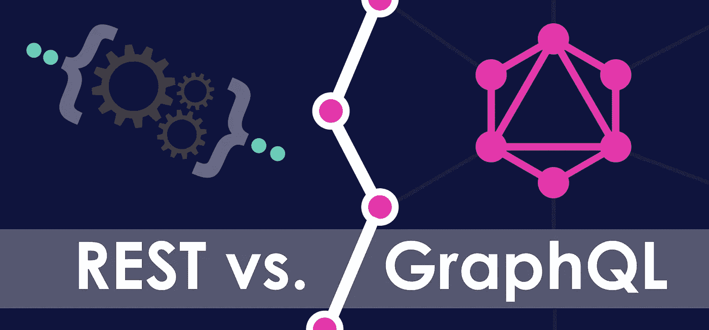
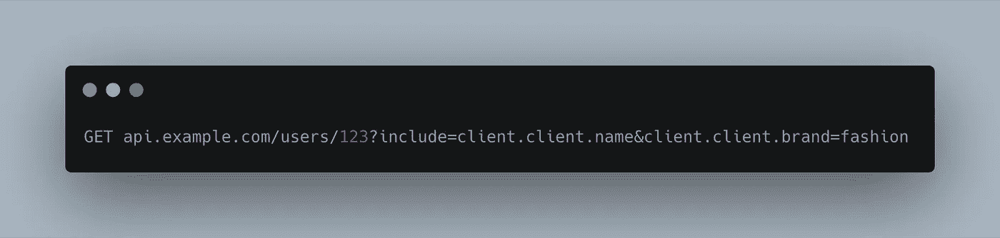
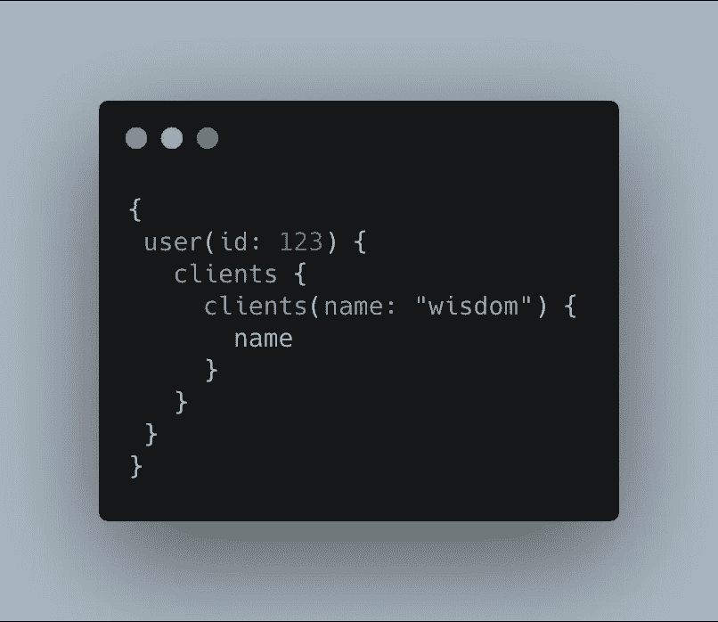

# API 开发:Rest 与 GraphQL

> 原文：<https://medium.com/quick-code/api-development-rest-vs-graphql-c54c530b5dec?source=collection_archive---------0----------------------->



Source: codingthesmartway

什么是休息？

REST ( **表述性状态转移)**是一种架构模式，它定义了一组用于创建 Web 服务的约束。一个 **RESTful API** (RESTful web 服务或 REST API)——构建于表述性状态转移( [REST](https://searchmicroservices.techtarget.com/definition/REST-representational-state-transfer) )技术之外。

RESTful API 是一个应用程序编程接口( [API](https://searchmicroservices.techtarget.com/definition/application-program-interface-API) )，它使用 HTTP 请求来获取、上传、发布和删除数据。随着云的使用越来越多，API 开始公开 web 服务。REST 是构建允许用户与云服务连接和交互的 API 的合理选择。



**什么是 GraphQL？**

GraphQL 是一种 API 查询语言，也是一种用现有数据完成这些查询的运行时语言。GraphQL 为 API 中的数据提供了完整且易于理解的描述，使客户能够准确地要求他们需要的东西，使 API 更容易随时间发展，并支持强大的开发工具。GraphQL 也是一种开源技术。 *GraphQL 由脸书于 2012 年开发，用于内部开发，但后来于 2015 年上市*。



**REST 和 GraphQL 的区别**

*   **相似:**两者都有资源的概念，都可以为那些资源指定 id。
*   **相似:**两者都可以通过带有 URL 的 HTTP GET 请求获取。
*   **类似:**两者都可以在请求中返回 JSON 数据。
*   **不同:**在 REST 中，你调用的端点就是那个对象的身份。在 GraphQL 中，身份与获取身份的方式是分开的。
*   **不同:**在 REST 中，资源的形状和大小是由服务器决定的。在 GraphQL 中，服务器声明哪些资源是可用的，客户机询问它当时需要什么。

**注:**REST API 已经成为部署 API 和推出开发者平台的公司事实上的标准。REST 的美妙之处在于，使用其他人的 API 的开发人员不需要任何特殊的初始化或库。请求可以简单地通过通用软件如 cURL 和网络浏览器发送。

**REST 和 GraphQL(普罗斯/CONS)**

# 1.数据提取

假设我想构建一个显示博客作者信息的应用程序。我希望它显示作者的名字和作者写的博客文章以及作者最近写的三个博客主题。

## 休息

在表示状态转移(REST)中，我们调用一个端点来请求我们需要的数据。然后，服务器用响应来回应:

```
/blog/author/<id>
```

这个端点将获取作者的信息。然后，我需要另一个端点来访问博客文章。

```
/blog/author/<id>/posts
```

最后，我需要另一个端点来获取博客主题。

```
/blog/author/<id>/topics
```

CONS: **多次网络通话——休息**

在使用 REST 获取所需数据的同时，您将进行典型数量的网络调用查询。REST 端点失去控制，因为我们的数据需要扩展。这会导致多个网络调用，并导致响应时间变慢。

【REST 的上取和下取问题

往往有了 REST，最终会得到不需要的数据。例如，当调用*博客/作者/ < id >* 端点时，您将获得关于作者的所有数据。您可以获得类似于*创建日期、更新日期、年龄、性别*等数据。但是我们需要的只是作者的名字。这是一个在 REST 中过量提取的经典例子。

在提取不足的情况下，您可以注意到，仅仅调用*blog/author/<id>*并不足以检索我们正在寻找的内容。为了获得作者写的最后三篇文章，我们必须调用另一个端点*blog/author/<id>*/posts。这种情况称为提取不足。

# GraphQL

猜猜使用 GraphQL 会发生什么？ ***您编写一个查询来查询您想要的内容*** ，然后您会得到您想要的内容。

> *没有多个网络调用来获取 GraphQL 中的数据*

如果您看到实际的查询和收到的响应，这将更有意义。

**GraphQL 查询请求**

这就是我们的查询看起来的样子。我们传递需要响应的字段。我们正在寻找作者的名字，最近写的三篇博文，以及他们写的最后三个主题。该查询旨在询问我们到底需要什么。

```
{
  author (id: 6) {
    name 
    posts (last: 3) {
      title
    }
    topics (last : 3) {
     name
    }
  }
}
```

**GraphQL 查询响应**

这是我们从服务器上得到的信息。

```
{
  "data" : {
    "author" : {
      "name" : "Adhithi Ravichandran",
      "posts" : [
        { title: "React vs. Vue : A Wholesome Comparison"},
        { title: "React Lifecycle Methods: A Deep Dive"},
        { title: "5 Essential Skills A Frontend Developer Should Possess"}
      ],
      "topics" : [
        { name: "React and Vue"},
        { name: "React"},
        { name: "General"}
      ]
    }
  }
}
```

GraphQL:没有到服务器的多次往返，没有数据的上取和下取。

# 2.客户端的快速产品开发


当使用 REST APIs 时，使用 API 的客户团队倾向于等待后端团队完成他们的 API 开发，然后开始使用它们。通常，前端团队会因为等待后端团队的 API 而导致开发缓慢。我曾多次遇到这种情况，前端开发人员被束缚住手脚，直到后端交出他们 API 的工作版本。

*这导致开发缓慢，并且极大地依赖后端团队来更快地交付，以便客户团队可以开始他们的工作来消费 API。*

在 GraphQL 中，前端、后端或任何其他客户端都有并行开发，而不会停止开发。

> *GraphQL:团队并行工作，带来快速的产品开发*

前端团队可以使用 API 的模拟版本，也可以使用像 [GraphQL Faker](https://github.com/APIs-guru/graphql-faker) 这样的库创建假数据。编码可以完全用模拟数据完成，测试也可以编写。当后端团队准备好 API 时，模拟 API 可以与真正的 API 交换。

**graph QL 的 CONS**

## 贮藏

缓存内置在 HTTP 规范中，RESTful APIs 能够利用它。与缓存相关的 GET vs POST 语义被很好地定义，使得浏览器缓存、中间代理和服务器框架能够遵循。可以遵循以下准则:

*   GET 请求可以被缓存
*   GET 请求可以保留在浏览器历史记录中
*   GET 请求可以加入书签
*   GET 请求是幂等的

GraphQL 不遵循 HTTP 规范进行缓存，而是使用单个端点。因此，开发人员有责任确保为可以缓存的非可变查询正确实现缓存。必须为缓存使用正确的密钥，这可能包括检查主体内容。

虽然您可以使用像 Relay 或 Data loader 这样理解 GraphQL 语义的工具，但这仍然不能涵盖像浏览器和移动缓存这样的东西。

## 暴露给任意请求

虽然 GraphQL 的一个主要优点是使客户能够查询他们需要的数据，但这也是有问题的，特别是对于开放 API，组织无法控制第三方客户的查询行为。必须非常注意确保 GraphQL 查询不会导致代价高昂的连接查询，这会降低服务器性能，甚至会造成服务器 DDoS。RESTful APIs 可以被约束以匹配所使用的数据模型和索引。

# 查询的严格性

GraphQL 消除了在 API 之上定制查询 DSL 或副作用操作的能力。例如，Elastic search API 是 RESTful 的，但也有一个非常强大的 Elastic search DSL 来执行高级聚合和度量计算。这种聚合查询可能更难在 GraphQL 语言中建模。

## 不存在的监控

RESTful APIs 的优势在于它像网站一样遵循 HTTP 规范。这使得许多工具能够探测 URL。对于 GraphQL APIs，除非您支持将查询作为 URL 参数放置，否则您可能无法利用此类工具，因为大多数 ping 工具不支持 HTTP 和请求主体。

除了 ping 服务，很少有 SaaS 或开源工具支持 API 分析或对 API 调用进行更深入的分析。客户端错误在 GraphQL API 中显示为 200 OK。预计会出现 400 个错误的现有工具将无法工作，因此您可能会错过 API 上发生的错误。然而与此同时，给予客户更多的灵活性需要更多的工具来捕捉和理解 API 的问题。