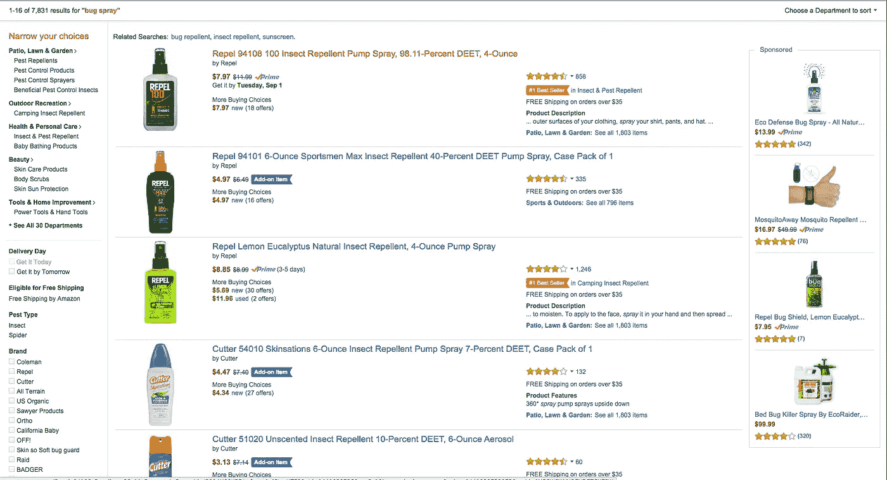
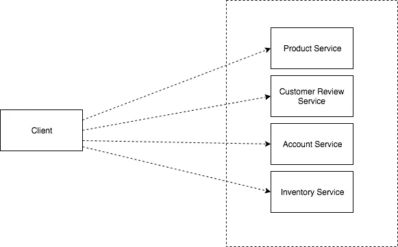
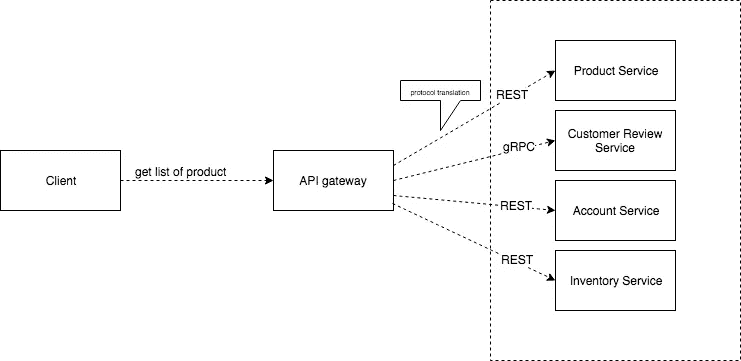

# API 网关第 1 部分

> 原文：<https://medium.easyread.co/api-gateway-part-1-7901ba703f9?source=collection_archive---------2----------------------->

## 了解 API 网关的工作原理

Photo by [Piyush Wadhwa](https://unsplash.com/@piyushwadhwa?utm_source=medium&utm_medium=referral) on [Unsplash](https://unsplash.com?utm_source=medium&utm_medium=referral)

> *警告—请喝咖啡以获得更好的体验*

API 网关系列列表

*   API 网关第 1 部分(*你在这里)*
*   [API 网关第二部分](https://medium.com/easyread/api-gateway-part-2-7264ee5be187)

想象你正在建立一个网上商店。您的应用功能:

*   命令
*   产品详细信息
*   产品清单

基于上述所有功能，您可以获得以下服务:

*   产品服务
*   订单服务
*   估价服务
*   账户服务
*   顾客评论服务
*   库存服务

因为您的应用程序使用微服务架构，并且数据分布在多个服务上。假设你打开主页，搜索杀虫剂。您的应用程序的 UI 需要产品数据、客户评论数据、库存数据的列表，可能还需要帐户数据来显示产品列表页面(如下图)。

因此，显示产品列表的代码需要从**产品服务**、**账户服务**、**客户评论服务**和**库存服务**中获取信息。

在这个设计中，客户端应用程序扮演着 **API composer** 的角色。它调用多个服务并组合结果。
那么，有什么问题呢？？？？虽然这个方法看起来很合理，但它有一些严重的问题。

## 由于客户端发出多个请求，用户体验不佳

客户端必须发出多个请求来检索数据，并且需要按顺序执行请求。它要求客户端开发人员编写潜在复杂的 **API 组合代码**。

## **缺乏封装**

服务的开发者有时会添加新的服务，甚至可能会更改 API。但是，如果关于服务的知识是在客户端编写的，那么更改服务的 API 可能会很困难，并且可能会破坏现有的客户端。

## 对客户端不友好的协议

一些服务可能使用 gRPC，或者 AMQP 消息协议。这类协议在内部工作良好，但是可能不容易被移动客户端使用。或者，某些协议的机制可能很难适应某些客户端平台。

# 解决办法

如何设计和创建 API 网关？我将在第二部分讨论它

# 谢谢你

我要再次感谢我所有的读者，我希望我会带着更多有趣的话题回来。