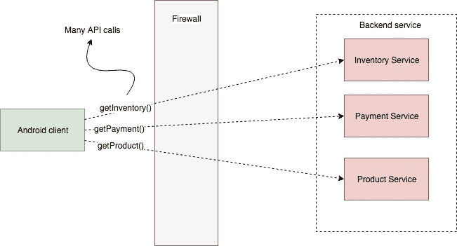
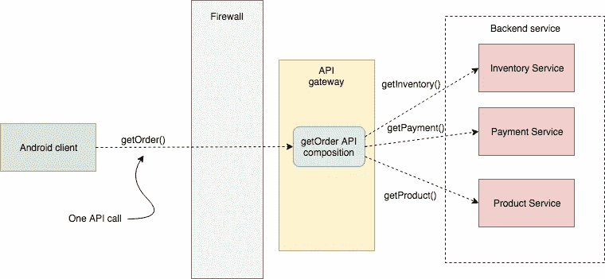
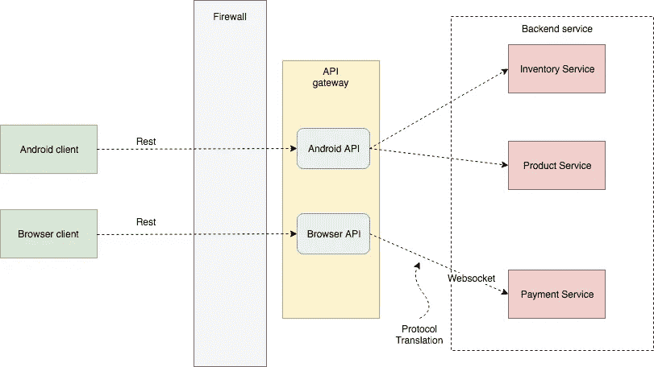
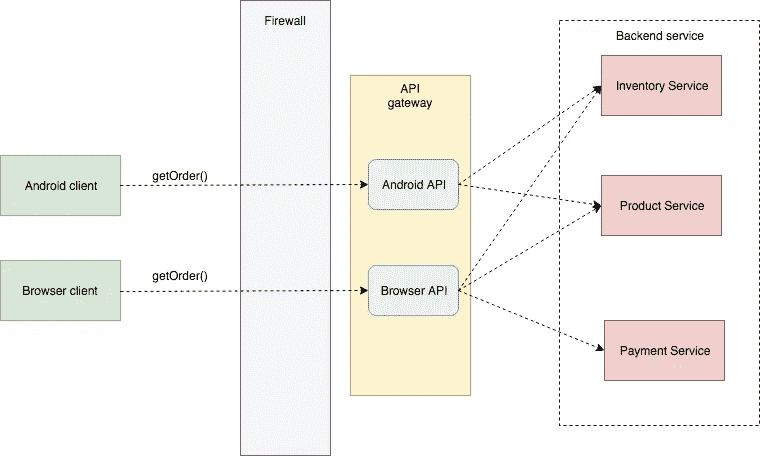
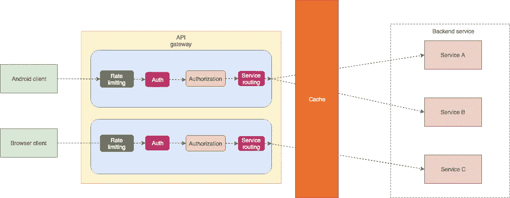

# API 网关第 2 部分

> 原文：<https://medium.easyread.co/api-gateway-part-2-7264ee5be187?source=collection_archive---------0----------------------->

## 了解 API 网关的工作原理

Photo by [Piyush Wadhwa](https://unsplash.com/@piyushwadhwa?utm_source=medium&utm_medium=referral) on [Unsplash](https://unsplash.com?utm_source=medium&utm_medium=referral)

API 网关系列列表

*   [API 网关第 1 部分](https://medium.com/easyread/api-gateway-part-1-7901ba703f9)
*   API 网关第二部分*(你在这里)*

API Gateway 是一种服务，它是从外部进入应用程序的入口点。它负责请求路由、API 合成和其他功能，比如身份验证。所有外部客户端首先转到 API 网关，然后路由到适当的服务。API gateway 还可以在客户端友好协议(如 HTTP 和 WebSockets)和服务使用的客户端不友好协议之间进行转换。

## 请求路由

API 网关的关键功能之一是请求路由。API gateway 通过将请求路由到相应的服务来实现一些 API 操作。当收到请求时，API 网关查询路由映射，该映射指定将请求路由到哪个服务。

## API 成分

API 网关还提供 API 组合。我将用一些例子来解释它。

Illustration before used API gateway with API composition

如上图所示，android 客户端进行多个 API 调用。

Illustration after used API gateway with API composition

如上图所示，API 网关提供 API 组合，使 android 客户端能够使用单个 API 请求高效地检索数据。

## 协议翻译

API 网关也提供协议翻译。它可能向外部客户机提供 RESTful API，即使应用程序服务在内部使用混合协议，包括 REST 和 gRPC。当需要时，一些 API 操作的实现在 RESTful 外部 API 和基于 gRPC 的内部 API 之间进行转换。

## API 网关为每个客户端提供特定于客户端的 API

单一 API 的问题是不同的客户通常有不同的需求。例如，`getOrder` API 操作会返回产品数据、支付数据、库存数据。在某些情况下，并非所有的客户端都需要所有的数据。假设移动客户端只需要数据的子集。解决方案是 API 网关为每个客户端提供自己的 API。例如，API 网关为 android、ios 和浏览器客户端提供不同的`getOrder` API。

## 实现边缘功能

可能实现的 edge 函数示例:

*   身份验证—验证发出请求的客户端的身份
*   授权—验证客户端是否被授权执行该特定操作
*   速率限制—限制每秒来自特定客户端和/或所有客户端的请求数量
*   缓存—缓存响应以减少对服务的请求数量
*   请求记录—记录请求

Illustration of API Gateway with some edge function

API 网关必须可靠。实现这一点的一种方法是在一个负载均衡器后面运行多个 gateway 实例。如果一个实例失败，负载平衡器会将请求路由到其他实例。此外，当 API 网关调用服务时，服务总是有可能很慢或不可用。解决方案是 API 网关在调用服务时使用断路器模式。

## API 网关的一些示例

*   AWS API 网关:由 AWS 提供。您配置 API 网关，AWS 处理所有其他事情，包括伸缩。不支持 API 组合，只支持 HTTP(S ),重点是 JSON。
*   孔:基于 NGINX HTTP 服务器。已经提供了一些 API 网关边缘功能。
*   特拉菲克:用戈兰语写的。已经提供了一些 API 网关边缘功能。

## 参考

克里斯·理查森。“微服务模式。”由 Marina Michaels，Christian Mennerich，Aleksandar Dragosavljevic 和 Corbin Collins 编辑。曼宁出版公司，2019。

## 谢谢你

我要再次感谢我所有的读者，我希望我会带着一个更有趣的话题回来。