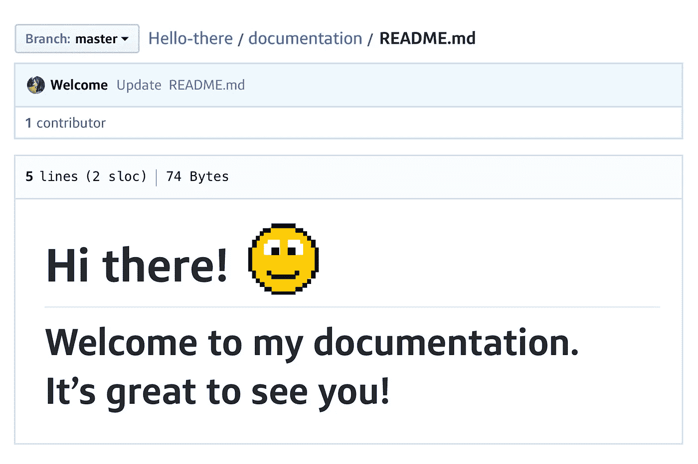

# API 好客:用文档欢迎开发人员

> 原文：<https://medium.com/capital-one-tech/api-hospitality-welcoming-developers-with-documentation-a4d4ba6320e1?source=collection_archive---------8----------------------->

## 什么是 API 款待？

好客是让客人感到受欢迎的艺术。作为人类，我们被教导如何欢迎他人，微笑，说我们很高兴见到他们。作为开发人员，我们试图通过为用户提供友好的用户界面和文档来做同样的事情。然而，有一类用户经常被忽略——通过 API 与我们的产品进行交互的人。我认为这是因为我们假设，既然他们也和我们一样是开发人员，他们会理解我们所做的事情。

这种假设往往是错误的。那么，你如何将 API 好客融入到你的流程中呢？这和你的文档有什么关系？

## 以原料药闻名的公司的共同特征

当 API 解决了重要或常见的问题，并且易于理解和使用时，公司就会因 API 而出名。许多人对具体细节有自己的看法，这里有一些让我印象深刻。

*   **轻松玩转**——拥有真实(非真实)数据的沙盒是最好的广告。你让人们看到如果他们跳过你的圈圈，他们能得到什么。 [Stripe](https://stripe.com/docs) 和 [Twilio](https://www.twilio.com/docs/) 都是这一步的好例子。
*   易于集成——我曾经花了两周时间试图让一个早期版本的 Swagger 处理我的数据。我不知道我做错了什么！有人指出我需要托管一个网络服务器。既然他们已经在 [OpenAPI](https://www.openapis.org/) 中用简单托管解决了这个问题，那么鼓励人们在不设置 Apache 的情况下试用它就容易多了。
*   **最大限度减少痛点** —有没有漂亮的数据架构这种东西？我们都只是在幕后积累东西。但是当人们过来的时候，如果你的数据设计已经合理化了端点，他们就不需要看到脏盘子了。
*   **优雅=漂亮 x 有用**

这通常可以归结为他们邀请用户并与之交流的欢迎方式。这通常始于(但很少止于)他们的文档。

## 人们为什么要使用 API 文档？

每个阅读 API 文档的人都已经对你的产品感兴趣了。他们正在寻找一种方法，让它与他们正在建造的东西一起工作。API 文档是一种以一致的方式描述应用程序和数据的方式。当人们用乐高积木搭建时，他们有一个特定的术语来描述鞋钉的数量和深度，这样其他人就可以可靠地复制这个搭建。

这意味着相对容易理解他们想要做什么，不像最终用户，他们可能有一堆不同的目标或优先级。API 用户希望:

*   以适当的安全级别进行连接。
*   一致地获取或放置数据。
*   确认他们的请求已经完成。
*   准确地传递状态。

例如， [Kin Lane 最近发布了](https://apievangelist.com/2017/07/11/when-you-publish-a-google-sheet-to-the-web-it-als-becomes-an-api/)关于使用面向公众的 Google Sheets 和 JSON 以编程方式访问表中信息的有趣方法。我认为这非常有趣，可以解决我的一个问题，即我有工作表中的调查数据，但只能生成静态报告。我发现自己希望有人能给我一个例子，告诉我这是如何工作的，这样我就能更好地理解它。

但金是一名博客作者，并不从事撰写正式文档的工作。Google 目前还没有记录这一点，因为这不是一个有意的接口。有人可能会说，很多 API 都是这样开始的——对客户来说是一次性的，是副作用。那么，如果谷歌使谷歌表单的这一方面易于使用，记录下来，使 URL 更漂亮，会有更多的人使用它吗？大概吧。如果他们创造的工具能让下一代用户更容易使用，那会怎么样？

这些假设步骤中的每一步都将使数据的使用变得更容易、更友好。

## API 文档为什么会失败？

如果这么简单，为什么人们会发现这么多 API 文档很难使用或者缺少本质信息？

*   认证是困难的——即使我们有标准，安全性也是困难的，问题始终是可用性。
*   数据设计不是从用户的角度出发的。
*   端点不是以统一的方式书写的。
*   有些东西被遗漏了。
*   文档是自动生成的，没有被关注。
*   索引/搜索缺乏分析。

换句话说，对潜在用户来说，API 的价值要么被错误地构思，要么被错误地表达。或者两者都有。

## 一个 API 的真正价值是什么？

当我们邀请人们来我们家参加聚会时，我们会得到单独交谈和联系所带来的快乐。好客的 API 也是如此——我们为人们提供了一个机会，让他们做出我们没有时间、能力或商业理由去创造的东西。我们从丰富的产品生态系统中受益，我们的合作伙伴从我们的工作和获得我们的“好东西”中受益。

这就是为什么 API 通常很重要。但是为什么你的 API 特别重要呢？你提供的价值是什么？为什么您的应用程序或数据集如此重要？你需要了解这些答案，才能合理的服务你的用户。

为了有好的文档，你需要很好的理解你的 API 的价值，否则你将会传达错误的问题。在试图理解这一点时，需要考虑一些事情:

*   模块化——如果你在一个已知的结构上构建东西，那么很容易做到一致和可重复。
*   **效率**——为什么要重复别人已经做过的工作？此外，许多应用程序可以在相同的工作级别上使用几种不同类型的数据。
*   **易用性**——找一个理解 REST 和 SOAP 理论的人相对容易，比教一个人你自己独特的数据架构要容易得多。

人们使用你的 API 是因为你让他们免于重新发明轮子，而不是因为你的 API 有内在价值。价值是与上下文相关的，API 越难使用，价值就越低。你有没有着眼于这一点对你的 API 进行微调？

*   **测试** —确保呼叫实际上对内部用户以外的用户有效。这是一件非常容易被忽略的事情，对于集成商来说非常痛苦
*   **故障排除** —当出现问题时，给人们提供有用的错误信息，以及他们可以尝试解决的问题。
*   **映射路径** —研究您如何使用 API，然后基于 beta 用户或以前的 API 使用创建并记录几个附加路径。从外部的角度来看会帮助你找到你从内部忽略的东西。

## 我们如何让 API 更友好？

那么，我们如何利用这一点来创建构建友好 API 的路线图呢？一个受欢迎且可用的 API 的元素是什么？

*   **文档—** 优先考虑文档。考虑雇人来编写它们，或者至少建立文档的架构，以便它能够很好地与根据 API 规范自动生成的文档一起工作。花些时间介绍你的 API 的概念以及如何使用它。
*   **一致性—** 当你构建你的 API 时，要使它内部一致。不要改变使用大写字母的方式或任何关于命名模式的方式。选择一种风格，记录下来，然后坚持下去。一致性就像聚会有干净的地板一样。没有人想在他们预期的走道中间被一个惊喜的搁脚凳绊倒。
*   人类从具体的例子中学到的东西比从抽象的描述中学到的东西要多。你可以尽可能多地阅读如何从瓶子里取出葡萄酒软木塞，但看别人做更有意义——最有意义的是自己动手。瓶子握在手中的方式以及拔出软木塞所需的扭动，很难用文字来表达。每个好的例子都给 API 用户机会让你的工具适合他们的手和他们的目的。
*   **清晰的沟通—** 关于软件，你知道的一件事就是它会改变。然而，一旦人们在你的 API 上构建了应用程序，他们就指望它保持相对稳定。因此，你需要承诺在事情发生变化时告诉他们，最好是在事情发生变化之前。把这想象成派对邀请函的更新。如果最初的邀请指定了鸡尾酒礼服，而地点改变了，现在你在公园举行一次休闲野餐，人们需要知道新的着装规范和地点。你不能等到他们出现才告诉他们新的事情。造成尴尬或破损是好客的反义词。
*   **版本化—** 版本化表示已经做出了更改，但是您需要在做出更改之前很久就发出消息来警告用户。如果你正在做某种认证，你可能有一些 API 用户的联系信息，你可以使用这些信息。请记住，使用当前 API 的人可能不是编写它或输入他们联系信息的人。你可能需要想出如何与一群全新的人交流。

## 摘要

合适的和受欢迎的 API 之间的区别就像走进一个空的会议中心和一个满是标志的会议中心之间的区别，人们告诉你你来对地方了。重要的是体验和交流，而不仅仅是裸露的位置。理解你发出的邀请，让人们容易接受。

文档工具很棒，但是相对于对用户及其需求的考虑，它们是次要的。一旦你开始考虑让 API 体验变得友好，并为此投入资源，你就能更好地为用户服务。考虑您的价值主张，以及如何通过友好、可用、热情和开放的 API 吸引集成开发人员和付费人员。

*声明:这些观点仅代表作者个人观点。除非本帖中另有说明，否则 Capital One 不属于所提及的任何公司，也不被其认可。使用或展示的所有商标和其他知识产权都是其各自所有者的所有权。本文为 2018 首都一。*