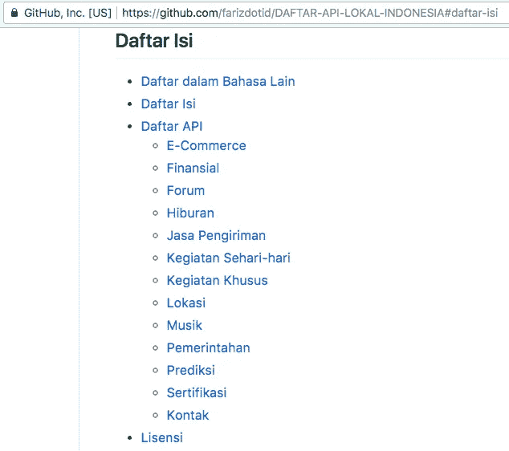

# API — Lagi cari API publik di Indonesia?

> 原文：<https://medium.easyread.co/api-lagi-cari-api-publik-di-indonesia-abe3899877f?source=collection_archive---------0----------------------->

## Berikut daftar API publik yang tersedia di Indonesia

Sebelumnya sungkem dulu sama mas [Fariz Dotid](https://medium.com/u/6d96bad7ff4f?source=post_page-----abe3899877f--------------------------------) . Terima kasih banyak telah mengumpulkan api publik yang tersedia di Indonesia.

Lagi ada proyek yang butuh top-up listrik (token PLN), cari sana-kemarin ga ketemu.

> Kepikirannya sih bakal kerja sama PLN secara resmi (wah, repot ini).

Alhasil, dapat saran dari temen cari di Github nemu deh :D

Yuk kita berbondong-bondong **star, fork & follow** [github](https://github.com/farizdotid) -nya mas [Fariz Dotid](https://medium.com/u/6d96bad7ff4f?source=post_page-----abe3899877f--------------------------------) , teman-teman.

Kunjungi juga website-nya di [sini](http://farizdotid.com/) , ada banyak tutorial menarik mengenai ***Android Development*** .

Finaly, here it is the Public API to consume and it’s available for Indonesia industry, company, etc:

 [## farizdotid/DAFTAR-API-LOKAL-INDONESIA

### DAFTAR-API-LOKAL-INDONESIA - Berisi API tentang Data Indonesia

github.com](https://github.com/farizdotid/DAFTAR-API-LOKAL-INDONESIA/blob/master/README.md) 

***Happy, coding guys!!!***