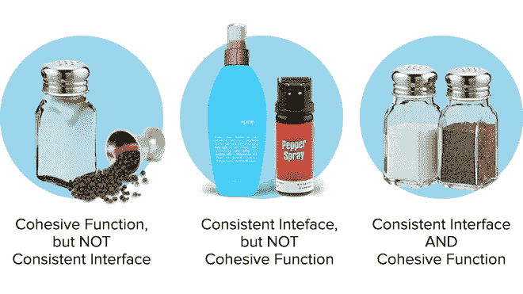

# API 生命周期治理最佳实践

> 原文：<https://medium.com/capital-one-tech/api-lifecycle-governance-best-practices-56a1ebbb4f1b?source=collection_archive---------0----------------------->

一个公司构建 API 的方式是其组织的反映。如果一个公司是孤立的，那么该公司生产的 API 将是同样分散的；一组作品中的物品在形式或功能上与另一组作品几乎没有相似之处。任何 API 生命周期治理工作的目标都是为了更好的程序效率而促进一致性和内聚性。

在这次采访中，Capital One 数字产品和 API 平台高级经理 Matthew Reinbold 阐述了 API 生命周期和治理的最佳实践。

## 请告诉我们 Capital One 针对 API 的治理体系，以及该体系的哪些方面运行良好。

治理的工作是确保一致性和内聚性。我们必须确保 Capital One 中的所有东西都以相同的方式运行。作为比喻，我们来说说盐和胡椒。如果你有一个有凝聚力的设计，但缺乏界面的一致性，这就像你在吃饭时拿到一个盐瓶和胡椒粒一样。界面没有一致性。你有一个摇壶，然后你必须用某种方式粉碎胡椒粒——这很奇怪，一点也不方便用户。但它很有凝聚力，因为你会在一顿饭中期待盐和胡椒。如果你有界面的一致性，但是东西没有内聚性，那就像是盐雾和胡椒喷雾。在这个例子中，你有一个接口的一致性；他们都是喷雾剂。但是它们一点都不连贯。他们不在一起工作。当你既有一致的接口又有内聚的接口时，那就是盐和胡椒瓶了。

治理的责任是确保我们的 API 接口具有一致性和内聚性。在这样做的时候，我们可以让开发人员有使用一个的经验，并在使用另一个时利用这种经验。它加速发展能力。

## 作为一个团队推出 DevExchange 是什么感觉？

将 DevExchange 付诸实施的努力绝对令人疲惫不堪，但是，我从未与一个让我感到更兴奋的团队合作过。Capital One 的员工重新激发了我对平台的兴趣。我真的对我们已经拥有并将共同制作的东西感到兴奋。

## 你认为以这种方式作为一个团队一起工作会产生更好的产品吗？

哦，当然。拥有一个如此投入且与愿景一致的团队是一回事。但是当他们对自己所做的事情也充满热情时，就会在工作中表现出来。这意味着人们会多走一步，讨论甚至是荒谬的边缘案例，因为他们对此充满热情。

## 对于刚刚接触 API 设计治理的人，你有什么建议？

开始时不知道所有事情也没关系。迭代并变得更好是可以的。人们永远不可能从一开始就考虑到每一个边缘情况和细微的皱纹。

API 设计治理并不是要有大量的标准来让开发人员不知所措。即使有可能为今天制定完美的政策，它也不一定能为明天提供完美的指导。更重要的是创建支持变化的系统。接受策略可能需要随着新需求或业务现实的发现而发展。然后努力创造那些动态系统。API 开发人员需要遵守的规则列表并不是最终目标。政策是一个动态、健康过程的副产品，而不是目的地。

## 总之…

所有部门使用相同的语言和使命合作得越好，工作效率就越高。要了解有关 Capital One 方法的更多信息，请访问 DevExchange 网站，包括 [API 产品](https://developer.capitalone.com/products)页面。

*欲了解更多关于 Capital One 的 API、开源、社区活动和开发者文化，请访问我们的一站式开发者门户 DevExchange。*