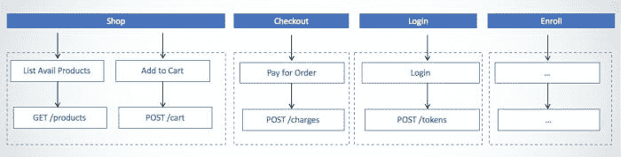
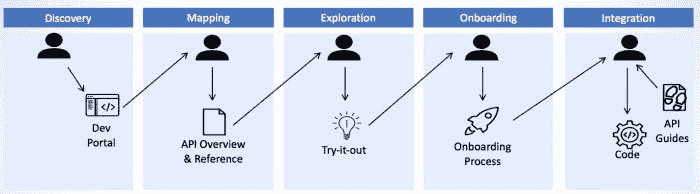
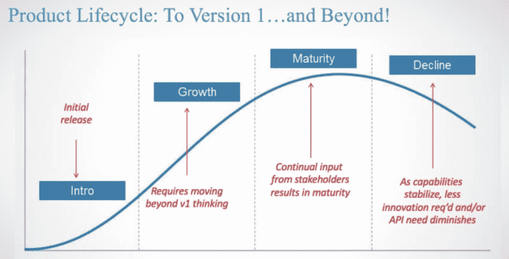

# API 产品所有权是 API 采用的关键

> 原文：<https://medium.com/capital-one-tech/api-product-ownership-is-key-for-api-adoption-6a12c64b2c83?source=collection_archive---------0----------------------->

优秀的 API 可以帮助开发人员做非凡且必要的事情，通常只需付出有限的努力。他们解决对商业领袖和开发者都很重要的问题。实现 API 的采用要求我们通过超越技术细节和思考如何使用它们来掌控我们的 API。

在过去的十年里，我已经帮助许多不同公司的团队将他们对 API 的思考方式转变为一种更加以产品为中心的观点。现在，我想和你分享一些关于基于产品的思考如何显著改进你的 API 产品的见解。

# 解决开发人员关心的问题

许多团队关注错误的问题，导致交付的 API 产品无法引起目标受众的共鸣。如果你在前进的过程中没有验证你的假设，那么你最终会为错误的受众构建错误的东西。

为了避免这种错误，规划出 API 以及它如何适应常见的使用场景是有帮助的。这个映射练习应该捕获预期的工作流，以及您的 API 如何解决部分或全部工作流步骤。

下图显示了一个电子商务应用编程接口如何帮助驱动访问者通过典型的网站工作流程:购物，结帐，登录，和/或注册一个常客计划。每个步骤都映射到工作流中的一个或多个步骤:

在整个 API 发现过程中，记住开发人员的旅程也很重要，从开发人员第一次发现对您的 API 的需求，到他们开始探索，并最终与您的 API 集成。您的 API 文档是否解决了旅程中每一步遇到的各种问题，从 API 提供的功能到如何将其集成到解决方案中。

下图显示了 API 消费者发现您的 API 并确定它是否能解决您的问题的过程。

确保你的 API 清楚它试图解决的问题，以及*没有试图解决的问题。一个只做一件事并且通过清晰的焦点做得很好的 API 远远胜过一个加载了许多不相关的特性却不能解决一个问题的 API。*

在你扩展你的 API 的范围之前，变得高度专注于理解问题，然后首先解决那个特定的问题。界限可以创造清晰度，帮助你理解:

*   **消费界限** —谁在互动，他们期望什么结果。
*   **技术界限** —减轻风险或解决所需特定技能的特定技术。
*   **功能边界**——流程和沟通应该如何流动
*   **监管界限** —规章制度如何推动产品考量。

# 关注结果而非终点

能力使某人能够实现他们以前无法实现的事情。特征是允许他们实现那些结果的单独的步骤和/或机制。作为 API 产品所有者，我们必须能够区分我们正在帮助我们的目标受众实现的目标(功能)和帮助他们实现目标的特性(API 端点)。如果你在不知道你的受众想要达到什么目的之前就过于关注 API 设计，你的 API 产品将会失败。

对于构建在数据库之上的 API 来说，情况往往就是这样，因为 API 只是关注数据交付，而不是 API 能为消费者做什么的预期结果。例如，假设我们上面的电子商务例子提供了直接映射到内部数据库表的 API:products、product_inventory 和 orders。我们将不得不在创建订单之前自己检查可用库存，而不是购物然后结账。相反，电子商务 API 只列出库存中可用的产品，并可以在订单创建时添加额外的库存检查。

# 产品所有权至关重要

一旦你的 API 交付到生产中，你作为 API 产品所有者的工作才刚刚开始。API 就像任何其他产品一样——它们必须在产品生命周期中运行，随着时间的推移，产品会逐渐成熟。

大多数产品所有者发现，在产品的第一个版本之外，还有另外一个充满机会的世界。要到达这个阶段并真正投入这种开发心态，您必须始终关注下一个版本。定义您的 API 产品路线图，持续交付，并寻求利益相关方的意见。在第一次发布之后，来自利益相关方的持续反馈对于获得牵引力和成熟度至关重要。

# 加速您的 API 交付

你的 API 到达开发者手中的时间越长，你的反馈循环就越长。然而，仓促的 API 往往需要改变，这将迫使消费者适应或死亡。许多年前，一些流行的社交媒体网站 API 就是这种情况。随着 API 的改变，应用程序所有者会意识到失败的应用程序，通常是每周一次。API 产品团队如何平衡对速度和优秀设计的需求？

我推荐一种设计优先的方法，该方法确定要交付的功能，然后设计 API 来满足这些功能。一旦设计完成，API 就可以跨多个版本快速交付。

为了加速交付过程并创建一个紧密集中的反馈循环，请考虑以下几点:

1.  使用跨职能资源建立一个 API 交付团队——开发人员、QA、技术作者和其他端到端交付 API 所必需的角色。
2.  利用 API 定义格式，例如 [OpenAPI 规范](https://github.com/OAI/OpenAPI-Specification)，将 API 设计传达给每个相关人员。
3.  利用模仿工具，这些工具允许在编码开始之前对 OpenAPI 定义进行早期实验。API 设计变更的成本低得多的时间点。
4.  让利益相关者尽早参与进来，并经常通过共享设计文档和模型来验证理解和意图。
5.  持续地交付 API，而不是一次性地交付，使用涉众的反馈来根据他们的需求确定交付时间表的优先级。

记住:一旦发布，就很难改变 API 设计。使用这个加速的交付过程来加速您的学习和早期的涉众反馈，以避免在您的 API 发布后需要进行剧烈的设计变更。

# 结论

产品所有权对于增加 API 的采用是必不可少的，因为它使团队从考虑技术转移到为开发者和商业领袖解决问题。当与关注开发者的需求而不是数据库表和基于结果的关注相结合时，你的 API 将准备好解决各种各样的问题。

# 相关:

*   [在 Web APIs 和消息流之间选择](/capital-one-developers/choosing-between-rest-web-apis-and-message-streaming-8e2f4813a058)
*   [设计进化事件流的 5 个原则](/capital-one-developers/5-principles-for-designing-evolvable-event-streams-f32e90dcbb79)
*   [事件流:补充 API 设计的另一种架构风格](/capital-one-developers/event-streaming-an-additional-architectural-style-to-supplement-api-design-703c4f801722)

k

**披露声明:** *以上观点均为说话人观点。除非本帖中另有说明，否则 Capital One 不属于所提及的任何公司，也不被其认可。使用或展示的所有商标和其他知识产权均为其各自所有者所有。本文为 2018 首都一。*