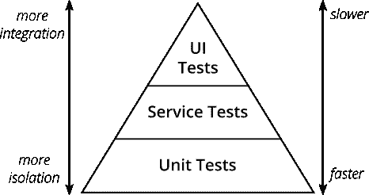
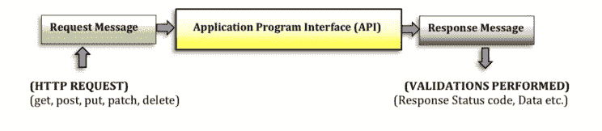

# 放心的 API 测试自动化

> 原文：<https://medium.com/globant/api-test-automation-with-rest-assured-and-json-server-9b429e7934ce?source=collection_archive---------0----------------------->


Photo by [Jonathan Borba](https://unsplash.com/@jonathanborba?utm_source=medium&utm_medium=referral) on [Unsplash](https://unsplash.com?utm_source=medium&utm_medium=referral)

对 API 测试需求的增加导致了[放心库](https://rest-assured.io/)的流行，它已经在全球的测试自动化框架中被广泛采用。在本文中，我们将指出 API 自动化的一些好处，并讨论一些使用该库创建 RESTful web 服务自动化测试的实例。

# 为什么选择 API 自动化？

API 自动化对于确保您的 API 按预期运行并满足客户的需求至关重要。API 的自动化测试可以减少手动测试所需的时间，并减少相关的工作量，从而确保更顺利的实现。以下是 API 自动化的一些好处:

*   早期缺陷检测:早期检测导致更快的缺陷解决和交付。
*   关注功能:业务逻辑与外观和感觉的分离。
*   业务层的可靠性:拥有稳定的 API 接口增加了自动化的稳定性。
*   降低成本:使用自动化节省的测试时间降低了成本。
*   [*Shift-Left*](https://www.lambdatest.com/blog/shift-left-testing-approach/) :通过遵循 Shift-Left 测试方法，API 自动化帮助验证功能，即使 UI 仍然需要准备好。测试与开发并行，而不是在开发之后。
*   合同验证:由于测试已经自动化，合同中的变更可以很容易地被识别。
*   软件行为和客户体验的改进减少了响应时间，并促进了与其他应用程序的交互。

## 测试自动化金字塔

测试自动化金字塔是一个概念，它建议自动化测试应该被组织成三层:单元测试、服务测试和 UI 测试。UI 测试用于测试用户界面，单元测试用于验证单个功能或代码单元的功能，而服务测试用于测试应用程序的 API 层。应该经常编写和运行服务测试，以提供快速反馈，并确保 API 更改不会破坏现有功能。



The Test Automation Pyramid

放心用于创建服务测试；它不适用于单元测试或 UI 测试。

# REST API 自动化流程

基本的 API 自动化流程包括自动化向 API 发送 HTTP 请求和验证来自 API 的响应的过程。这不仅可以通过放心来实现，还可以通过其他各种工具和框架来实现，比如 [Selenium](https://www.selenium.dev/) 、 [JMeter](https://jmeter.apache.org/) 和 [Postman](https://www.postman.com/) 。



# 放心

放心的主要目的是简化 REST APIs 的测试和验证。它提供了一种领域特定语言(DSL)来简单直接地编写测试和断言。这有助于确保 API 按预期运行，并允许开发人员在问题变成问题之前快速识别问题。

它使用 [Gherkin](https://cucumber.io/docs/gherkin/) 语法(Given，When，Then)来支持使用 HTTP 方法(如 GET、POST、PUT、PATCH 和 DELETE)创建请求。这将使你的测试更具可读性，更容易理解。

它还提供了内置的状态代码验证，并使用 [Hamcrest 匹配器](http://hamcrest.org/JavaHamcrest/javadoc/1.3/org/hamcrest/Matchers.html)和 [Groovy](https://groovy-lang.org/) 语法，使用 [JsonPath](https://www.javadoc.io/doc/io.rest-assured/json-path/latest/io/restassured/path/json/JsonPath.html) 或 [XmlPath](https://www.javadoc.io/doc/io.rest-assured/xml-path/latest/io/restassured/path/xml/XmlPath.html) 来检查响应正文内容。此外，它还可以处理不同的认证机制，如[基础](https://www.ibm.com/docs/en/cics-ts/5.4?topic=concepts-http-basic-authentication)、 [OAuth](https://oauth.net/1/) 、 [OAuth2](https://oauth.net/2/) 和[证书](https://www.yubico.com/resources/glossary/what-is-certificate-based-authentication/)。

# 创建项目

对于示例项目，我们将从`[jsonplaceholder.typicode.com](http://jsonplaceholder.typicode.com)`中提取数据。首先，我们发送一个简单的 GET 请求并验证响应状态代码。之后，我们将执行一些使用请求参数查询数据的例子。

首先，我们[创建一个简单的 Maven 项目](https://maven.apache.org/guides/getting-started/)。为此，在文件系统中的任意位置创建一个新目录，在其中启动一个 shell 并运行以下 Maven goal 命令:

```
mvn archetype:generate -DgroupId=com.mycompany.app -DartifactId=my-app -DarchetypeArtifactId=maven-archetype-quickstart -DarchetypeVersion=1.4 -DinteractiveMode=false
```

现在，您可以从最近创建的项目中替换`pom.xml`文件的原始内容，如下所示:

```
<project  xmlns:xsi="http://www.w3.org/2001/XMLSchema-instance"
  xsi:schemaLocation="http://maven.apache.org/POM/4.0.0 http://maven.apache.org/xsd/maven-4.0.0.xsd">
  <modelVersion>4.0.0</modelVersion>

  <groupId>com.mycompany.app</groupId>
  <artifactId>my-app</artifactId>
  <version>1.0-SNAPSHOT</version>

  <properties>
    <maven.compiler.source>1.8</maven.compiler.source>
    <maven.compiler.target>1.8</maven.compiler.target>
    <junit.jupiter.api>5.6.0</junit.jupiter.api>
    <rest.assured>5.3.0</rest.assured>
  </properties>

  <dependencies>
    <dependency>
     <groupId>org.junit.jupiter</groupId>
      <artifactId>junit-jupiter-api</artifactId>
     <version>${junit.jupiter.api}</version>
      <scope>test</scope>
    </dependency>
    <dependency>
      <groupId>io.rest-assured</groupId>
      <artifactId>rest-assured</artifactId>
      <version>${rest.assured}</version>
      <scope>test</scope>
    </dependency>
  </dependencies>
</project>
```

创建的项目必须在目录`/src/test/java`中有一个名为`AppTest.java`的文件；如果不存在，请创建它。

# 代码重用

您可以利用`@BeforeAll` 注释以及放心的全局变量来放置公共代码，这些代码将在以后编写的每个测试中执行。

我们将使用[放心请求和响应规范](https://www.dezlearn.com/rest-assured-request-and-response-specifications/)来避免可重用配置的代码重复。

*构建器类* `RequestSpecBuilder` [](https://www.javadoc.io/doc/io.rest-assured/rest-assured/latest/io/restassured/builder/RequestSpecBuilder.html)和`ResponseSpecBuilder`分别用于实现`RequestSpecification`和`ResponseSpecification`接口。`RequestSpecification`允许您指定请求的外观，而`ResponseSpecification`对响应也是如此。

在我们的例子中，我们为请求设置了`Base URI`、`Port`和`Content Type` ，为响应设置了`Response Time`和`Content Type`的期望值。

在下面代码片段的最后两行，我们使用了`RestAssured.requestSpecification` 和`RestAssured.responseSpecification` 来使之前的配置全局化，这样我们就不需要在之后的每个请求中指定它们。

此时，`AppTest.java`的配置将如下所示:

```
public class AppTest {
    RequestSpecification requestSpec;
    ResponseSpecification responseSpec;

    @BeforeAll
    public static void setup() {

        requestSpec = new RequestSpecBuilder()
                .setBaseUri("https://jsonplaceholder.typicode.com")
                .setContentType(ContentType.JSON)
                .build();

        responseSpec = new ResponseSpecBuilder()
                .expectResponseTime(Matchers.lessThan(5L), TimeUnit.SECONDS)
                .expectContentType(ContentType.JSON)
                .build();

        RestAssured.requestSpecification = requestSpec;
        RestAssured.responseSpecification = responseSpec;
    }
}
```

# 创建第一个测试用例

下面的代码片段展示了使用放心的 API 的一个最基本的测试。它只是对我们的端点执行一个 GET 请求，并检查它是否以状态代码 200 响应，这意味着请求已经成功。

```
@Test
public void testGetPosts() {

    RestAssured
        .given()
        .when()
            .get("/posts")
        .then()
            .assertThat()
            .statusCode(HttpStatus.SC_OK);
}
```

因为我们已经在设置方法中定义了我们的`BaseUri`，这里我们调用`get()`方法，将`/posts`端点作为参数传递。

# 参数化 GET 请求

GET 请求中可以使用两种类型的参数。

## a)路径参数

在这种情况下，参数值是请求的 URL 的一部分。路径参数是端点本身的一部分，不是可选的。下面的代码在`https://jsonplaceholder.typicode.com/posts/1`端点上执行一个 GET 请求。

```
@Test
public void testGetPostByIdUsingPathParam() {

    int pathParam = 1;
    String partialExpectedTitle = "provident";

    RestAssured
        .given()
            .pathParam("id", pathParam)
        .when()
            .get("posts/{id}")
        .then()
            .assertThat()
            .statusCode(HttpStatus.SC_OK)
            .body("title", Matchers.contains(partialExpectedTitle));
}
```

## b)查询字符串参数

查询字符串参数出现在问号(？)在端点中。参数及其值后面的问号称为查询字符串。其中，每个参数都列在另一个参数的后面，用&符号分隔。查询字符串参数的顺序无关紧要。

对于我们的例子，我们将使它变得简单，传递一个参数:`https://jsonplaceholder.typicode.com/comments?email=Veronica_Goodwin@timmothy.net`。

```
@Test
public void testGetPostByIdUsingQueryParam() {

    int queryParam = "Veronica_Goodwin@timmothy.net";
    String expectedTitle = "fugit labore quia mollitia quas deserunt nostrum sunt";

    RestAssured
        .given()
            .queryParam("email", queryParam)
        .when()
            .get("/comments")
        .then()
            .assertThat()
            .statusCode(HttpStatus.SC_OK)
            .body("name", Matchers.equalTo(expectedTitle));
}
```

# 总结

在本文中，您简要介绍了什么是放心，以及它如何在 API 测试环境中为您提供帮助。

我认为它是 web 服务测试的强大工具。它的语法简单易懂，文档非常优秀，许多在线资源可以帮助您入门。

暂时就这样了。在下面的文章中，我们将讨论一个更详细的例子，使用放心测试不同的 HTTP 请求方法。