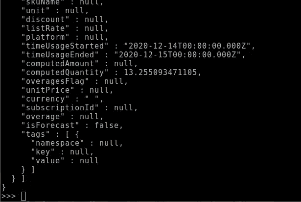

# OCI 申报用 API

> 原文：<https://medium.com/oracledevs/apis-for-reporting-in-oci-5fac2dc2791f?source=collection_archive---------0----------------------->


Oracle 云通过 API 进行了全面的设置。

最简单的情况可能是确定客户端时钟偏差:

```
$ curl -s --head [https://iaas.ap-sydney-1.oraclecloud.com](https://iaas.ap-sydney-1.oraclecloud.com) | grep Date
```


但是在本文中，我们将研究更高级的报告方法。

可以从 Oracle 云获得成本分析报告，将检查三种方法:

— OCI 控制台

— OCI 命令行工具

—Python API

所有方法都可以在 Oracle 自由层中使用。

# 来自 OCI 控制台的报告

您可以从控制台获得成本分析的概述。

从“显示”下拉菜单中选择“成本”选项。


该报告分为两个部分—图形和表格:


计算出的金额明细在表格中逐项列出。

计算的金额也以当地货币指定。例如新加坡元。


对于计算的数量，从“显示”下拉菜单中选择“使用”选项。


您将得到一个类似如下的表格:


所以从控制台获得这些信息很好。

但是，从 OCI 命令行获取此信息可能更方便。

# 从命令行报告

对于 Linux 工作站(如 Fedora)，安装 OCI 命令行工具如下:

```
bash -c "$(curl -L [https://raw.githubusercontent.com/oracle/oci-cli/master/scripts/install/install.sh](https://raw.githubusercontent.com/oracle/oci-cli/master/scripts/install/install.sh))"
```

你会收到一些选项提示，但你可以直接“输入”它们。

安装完成后，您可以在工作目录中激活 Python 虚拟环境:

```
$ source activate
```

然后测试 oci:

```
oci iam compartment list -c ocid1.tenancy.oc1..<tenantID>
```

如果您的工作站时间不同，您可能会收到以下警告。

> 警告:您的计算机时间:2021–06–11t 08:37:19.308803+00:00 与服务器时间:2021–06–11t 08:54:45+00:00 相差超过 5 分钟。这可能会导致连接到服务的身份验证错误。

否则，您将得到以下输出，这也证明 oci 命令行工具正在工作。


要停止使用 CLI，请在终端中运行以下命令。

```
$ deactivate
```

## **来自 OCI 命令行的成本分析**

从过滤器开始。过滤器需要采用 JSON 格式。

```
{
  "tenantId": "ocid1.tenancy.oc1..<tenantID>",
  "timeUsageStarted": "2020-12-01T17:00:00.000000-07:00",
  "timeUsageEnded": "2020-12-29T00:00:00Z",
  "granularity": "DAILY",
  "groupBy": [],
  "compartmentDepth": null,
  "filter": null,
  "nextPageToken": "string"
}
```

将 JSON 放在一个名为 simplerequestsummerzedusagesdetails . JSON 的文件中

然后使用 OCI 进行如下查询:

```
oci raw-request --http-method POST --target-uri https://usageapi.ap-sydney-1.oci.oraclecloud.com/20200107/usage 
--request-body file://~/oci-python-sdk/examples/SimpleRequestSummarizedUsagesDetails.json 
--config-file ~/.oci/config
```

您将得到一个长输出，如下所示:


然而，从 Python 中获取同样的信息会更方便。

# 来自 Python 的报告

官方 Python 安装文档在这里:

 [## 安装— oci 2.39.1 文档

### Oracle 建议您使用 virtualenv 在虚拟环境中运行 SDK。这允许您隔离…

docs.oracle.com](https://docs.oracle.com/en-us/iaas/tools/python/2.38.3/installation.html) 

首先从 Github 克隆 OCI Python SDK，如下所示:

```
$ git clone [git@github.com](mailto:git@github.com):oracle/oci-python-sdk.git
```


然后激活 Python 虚拟环境:

```
$ cd oci-python-sdk
$ python3 -m venv .
$ source ./bin/activate
```

然后安装 OCI 软件包。

```
$ pip install oci
```


对于身份验证，您还需要设置。oci 目录，并确保私钥在~/中。oci/config 文件。

现在一切都安装好了，在 python3 中做一个快速测试

```
$ python3
```

输入以下命令:

```
>>> import oci
>>> config = oci.config.from_file("~/.oci/config", "DEFAULT")
>>> identity = oci.identity.IdentityClient(config)
>>> user = identity.get_user(config["user"]).data
>>> print(user)
```

您应该会得到类似如下的输出:


## 使用 Python 进行成本分析

下载使用报告的基本脚本在以下文档中定义:

 [## 访问成本和使用报表

### 成本和使用报告是每天生成并存储在对象存储中的逗号分隔值(CSV)文件…

docs.oracle.com](https://docs.oracle.com/en-us/iaas/Content/Billing/Tasks/accessingusagereports.htm) 

下面还列出了该脚本:

```
import oci
import os

# This script downloads all of the cost, usage, (or both) reports for a tenancy (specified in the config file).
#
# Pre-requisites: Create an IAM policy to endorse users in your tenancy to read cost reports from the OCI tenancy.
#
# Example policy:
# define tenancy reporting as ocid1.tenancy.oc1..aaaaaaaaned4fkpkisbwjlr56u7cj63lf3wffbilvqknstgtvzub7vhqkggq
# endorse group group_name to read objects in tenancy reporting
#
# Note - The only value you need to change is the group name. Do not change the OCID in the first statement.

reporting_namespace = 'bling'

# Download all usage and cost files. You can comment out based on the specific need:
prefix_file = ""                     #  For cost and usage files
# prefix_file = "reports/cost-csv"   #  For cost
# prefix_file = "reports/usage-csv"  #  For usage

# Update these values
destintation_path = 'downloaded_reports'

# Make a directory to receive reports
if not os.path.exists(destintation_path):
    os.mkdir(destintation_path)

# Get the list of reports
config = oci.config.from_file(oci.config.DEFAULT_LOCATION, oci.config.DEFAULT_PROFILE)
reporting_bucket = config['tenancy']
object_storage = oci.object_storage.ObjectStorageClient(config)
report_bucket_objects = object_storage.list_objects(reporting_namespace, reporting_bucket, prefix=prefix_file)

for o in report_bucket_objects.data.objects:
    print('Found file ' + o.name)
    object_details = object_storage.get_object(reporting_namespace, reporting_bucket, o.name)
    filename = o.name.rsplit('/', 1)[-1]

    with open(destintation_path + '/' + filename, 'wb') as f:
        for chunk in object_details.data.raw.stream(1024 * 1024, decode_content=False):
            f.write(chunk)

    print('----> File ' + o.name + ' Downloaded')
```

将脚本保存在~/oci-python-sdk/examples/中。

运行该脚本，所有报告都将保存到~/OCI-python-SDK/examples/downloaded _ reports 目录中。

然后解压缩并检查任何报告，使用:

```
$ gunzip 0001000000428365.csv.gz
$ less 0001000000428365.csv.gz
```

## 使用 Python 和请求进行成本分析

对于 Python，可以使用本地的 urllib.request 模块作为 HTTP 客户端来查询 API。

[https://docs . python . org/3/library/urllib . request . html # module-urllib . request](https://docs.python.org/3/library/urllib.request.html#module-urllib.request)

但是，对于更高级别的 HTTP 客户端接口，建议使用 Requests 包。

 [## 请求:HTTP for Humans 请求 2.25.1 文档

### 版本 2.25.1 .(安装)Requests 是一个优雅而简单的 Python HTTP 库，是为人类而构建的…

docs.python-requests.org](https://docs.python-requests.org/en/master/) 

> **Requests** 是一个优雅而简单的 Python HTTP 库，为人类而建。

请求库也用于 Github 中 OCI Python SDK 的官方示例:

[https://github . com/Oracle/OCI-python-SDK/blob/master/examples/](https://github.com/oracle/oci-python-sdk/blob/master/examples/healthchecks_example.py)

作为脚本运行或交互运行。

```
import requests
from oci.config import from_file
from oci.signer import Signer

config = from_file()
auth = Signer(
tenancy=config['tenancy'],
user=config['user'],
fingerprint=config['fingerprint'],
private_key_file_location=config['key_file'],
pass_phrase=config['pass_phrase']
)

endpoint = 'https://usageapi.ap-sydney-1.oci.oraclecloud.com/20200107/usage'body = {
  'tenantId': 'ocid1.tenancy.oc1..aaaaaaaayjcxmo3mjpcu37iecerrlm5fdnreegpa3awvzvursmeyabyawvwq',
  'timeUsageStarted': '2020-12-01T00:00:00Z',
  'timeUsageEnded': '2020-12-29T00:00:00Z',
  'granularity': 'DAILY'
}

response = requests.post(endpoint, json=body, auth=auth)
response.raise_for_status()
```

为 Post 请求添加超时，这是防止客户端无限期挂起的最佳做法。

```
response = requests.post(endpoint, json=body, auth=auth**,** timeout=5**)**
```

然后以 JSON 格式显示输出，不进行文本格式化:

```
print(response.json())
```


但是要以易读的文本格式显示 JSON 中的输出，请使用以下代码:

```
print(response.text)
```



使用 Oracle 云，有许多选项可以报告成本分析。

*Paul Guerin 是一名专注于 Oracle 数据库的国际顾问。此外，他还出席了一些世界领先的甲骨文会议，包括甲骨文 2013 年世界开放大会。自 2015 年以来，他的工作一直是 IOUG 最佳实践技巧小册子以及 AUSOUG、Oracle Technology Network、Quest 和 Oracle Developers (Medium)出版物的主题。2019 年，他被授予 My Oracle 支持社区最有价值贡献者。他是一名 DBA OCP，并将继续参与 Oracle ACE 计划。*