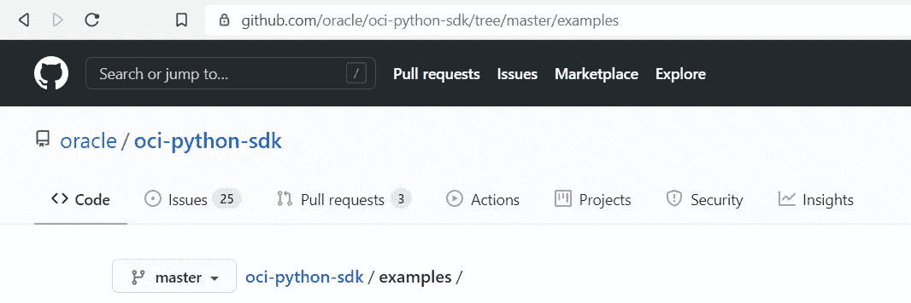

# 用于 OCI 用户管理的 API

> 原文：<https://medium.com/oracledevs/apis-for-user-management-in-oci-4b2a46c7ebf?source=collection_archive---------1----------------------->


API 不仅仅用于接收关于端点的信息。

API 也可以完成其他任务——使用 Python。

因为我们将使用 Python，所以从 Github OCI Python SDK 页面开始。

[](https://github.com/oracle/oci-python-sdk/tree/master/examples) [## oracle/oci-python-sdk

### 面向 Python 的 Oracle 云基础设施 SDK。通过在…上创建帐户，为 oracle/oci-python-sdk 开发做出贡献

github.com](https://github.com/oracle/oci-python-sdk/tree/master/examples) 

这里有许多 Python 示例脚本。



通过反复试验，我们发现一些示例适用于 Oracle 自由层。

例如，使用 get _ all _ instance _ IP _ addresses _ and _ DNS _ info . py 脚本可以很容易地显示一些关于 IP 地址和 DNS 的基本信息。

```
$ cd ~/oci-python-sdk/examples$ python3 get_all_instance_ip_addresses_and_dns_info.py <OCID of instance>
```


但是有了 API，你也可以做一些真正的工作！

Oracle 免费层的真正工作！

## **在 Oracle 自由层创建一个用户**

所有的 Python 脚本都在这里:

```
$ cd ~/oci-python-sdk/examples
```

下面的脚本 raw_request.py 就是一个例子

```
import requests
from oci.config import from_file
from oci.signer import Signerconfig = from_file()
auth = Signer(
tenancy=config['tenancy'],
user=config['user'],
fingerprint=config['fingerprint'],
private_key_file_location=config['key_file'],
pass_phrase=config['pass_phrase']
)endpoint = 'https://identity.ap-sydney-1.oraclecloud.com/20160918/users/'body = {
'compartmentId': config['tenancy'],  # root compartment
'name': 'TestUser',
'description': 'Created with a raw request'
}response = requests.post(endpoint, json=body, auth=auth)
response.raise_for_status()print(response.json()['id'])
```

按如下方式运行脚本:

```
$ python3 raw_request.py
```

上面将创建一个名为“TestUser”的用户，并返回 OCID。

可以验证该用户是否存在于控制台中。


## 在 Oracle 自由层中创建一个组和一个用户

也可以运行这个脚本 user_crud.py 在 Oracle Cloud 中创建一个用户和组。

```
import oci
from oci.identity.models import AddUserToGroupDetails, CreateGroupDetails, CreateUserDetails# Default config file and profile
config = oci.config.from_file()
compartment_id = config["tenancy"]
# Service client
identity = oci.identity.IdentityClient(config)# Get and set the home region for the compartment. User crud operations need
# to be performed in the home region.
response = identity.list_region_subscriptions(compartment_id)
for region in response.data:
    if region.is_home_region:
        identity.base_client.set_region(region.region_name)
        breakuser_name = "python-sdk-example-user"
group_name = "python-sdk-example-group"print("Creating a new user {!r} in compartment {!r}".format(
    user_name, compartment_id))request = CreateUserDetails()
request.compartment_id = compartment_id
request.name = user_name
request.description = "Created by a Python SDK example"
user = identity.create_user(request)
print(user.data)print("Creating a new group {!r} in compartment {!r}".format(
    group_name, compartment_id))request = CreateGroupDetails()
request.compartment_id = compartment_id
request.name = group_name
request.description = "Created by a Python SDK example"
group = identity.create_group(request)
print(group.data)print("Adding new user to the new group")
request = AddUserToGroupDetails()
request.user_id = user.data.id
request.group_id = group.data.id
membership = identity.add_user_to_group(request)
print(membership.data)
```

使用以下命令运行脚本:

```
$ python3 user_crud.py
```

将创建一个名为 python-sdk-example-group 的组:


还将在该组中创建一个用户，并将其命名为 python-sdk-example-user:


Oracle 免费层中的用户管理再简单不过了！

*Paul Guerin 是一名专注于 Oracle 数据库的国际顾问。此外，他还出席了一些世界领先的甲骨文会议，包括甲骨文 2013 年世界开放大会。自 2015 年以来，他的工作一直是 IOUG 最佳实践技巧小册子以及 AUSOUG、Oracle Technology Network、Quest 和 Oracle Developers (Medium)出版物的主题。2019 年，他被授予 My Oracle 支持社区最有价值贡献者。他是一名 DBA OCP，并将继续参与 Oracle ACE 计划。*