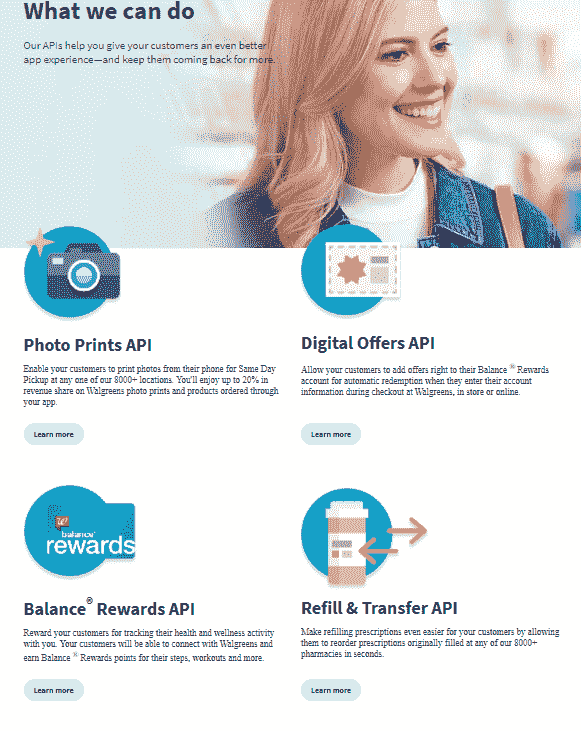
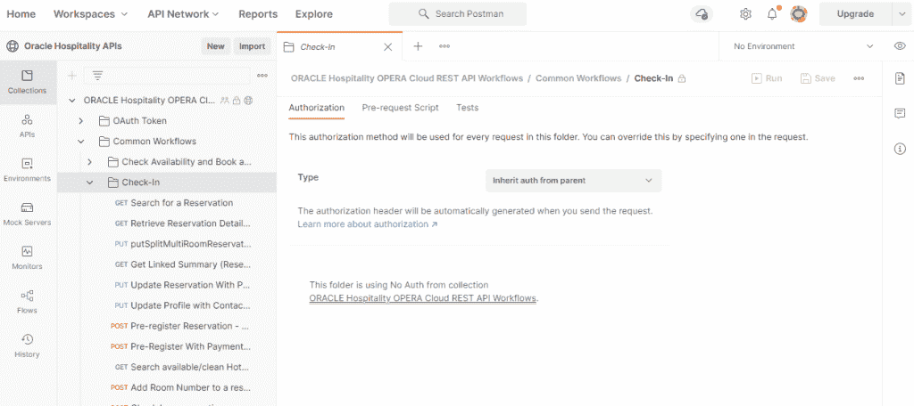
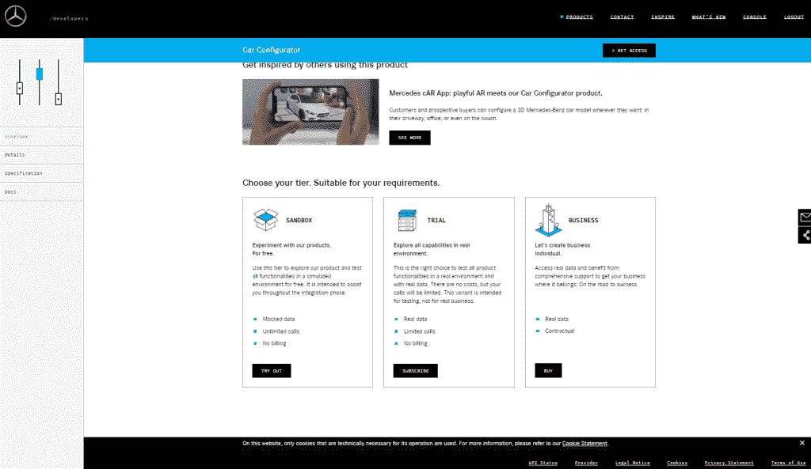

# API 不仅仅是一个有效负载规范——优秀 API 的例子

> 原文：<https://medium.com/oracledevs/apis-more-than-a-payload-spec-examples-of-good-apis-81734407c531?source=collection_archive---------0----------------------->

我在许多会议上发表过演讲，包括 [APIWorld](https://apiworld.co/) 关于 API 定义如何超越有效载荷规范，提供条款和条件的细节等等。你可以在这里看到演讲[(更多关于我的演讲](https://www.slideshare.net/philwilkins56/api-more-than-payload-2021-update)[在这里](https://blog.mp3monster.org/about/presenting-activities/))。

当我谈到好的 API 时，偶尔会出现的一个问题是，我是否有好的 API 的例子，来反映我提出的观点。一个非常有效的问题，对此我没有更多的例子，因此写了这篇文章。

因此，简单的答案是指向一篇关于[北欧 API](https://nordicapis.com/5-examples-of-excellent-api-documentation/)(此处为)的优秀文章，该文章解决了这个问题，并解释了他们为什么对 API 进行评级。但是这是一个有点懒惰的回答，公平地说，所提供的例子来自那些 API 被认为是商业收入的主要或重要贡献者的组织。因此，我研究了 API 不一定被企业视为主要收入来源的领域。通过提供的例子，我们描述了我们认为好的或不好的地方。希望通过这些例子，你会明白为什么要在演讲中强调重点。以下是我的评论…

美国的 Walgreen's 为照片打印等多项服务提供了大量 API。这使得应用程序开发者可以将照片从智能手机直接发送到商店进行打印。

开发人员站点具有强大的自助服务能力，尽管这方面的工作交给了第三方。其中一些条款和条件不太清楚。有大量关于服务的信息和对照片等数据的期望。

具有讽刺意味的是，有效载荷信息本身比它应有的要弱，一些假定要得到的操作是 POST。描述了调用 Walgreens 的 JSON 属性的定义，但没有描述返回值。像速率限制这样的约束被公布。但是使用 API 的步骤已经列出，并且提供了多种语言的代码示例。

一个用于打印照片的 [Postman 集合](https://www.postman.com/api-evangelist/workspace/walgreens/overview)存在，但是其他 API 服务不包含在内。

***注*** *:写这篇文章以来，门户网站*[*https://developer.walgreens.com/*](https://developer.walgreens.com/)*一直返回一个 502 错误*

# 甲骨文酒店( [OHIP](https://www.oracle.com/uk/industries/hospitality/integration-platform/) )

Oracle Hospitality 迁移到 SaaS 模式后，需要彻底改革集成机制。酒店套房有 3000 个 API。服务偏向 B2B 而不是 B2C。

从审查的文档来看，API 文档相当完整——整个套件中有 3000 个 API。支持诸如整合酒店员工人力资源解决方案到迁移第三方门卡钥匙系统等活动。使用文档受到这样一个事实的影响，即它被迫适应 Oracle 更广泛的内容管理，这并不适合嵌入其他解决方案，如 [GitHub](https://Github.com) 、 [Postman、](https://www.postman.com/)和[apary](https://Apiary.io)。

Apiary 的使用特别有效，因为它为不同的语言提供了非常动态的文档、测试端点和代码片段(但从简化连接过程的意义上来说，它不是 SDK，等等)。).比如[云活动 API](https://operacloudactivityapi.docs.apiary.io/) 和养蜂场文档完整列表[这里](https://www.oracle.com/industries/hospitality/integration-platform/)。此外，还有 [Postman Collections](https://github.com/oracle/hospitality-api-docs/tree/main/postman-collections) (更多[此处为](https://www.postman.com/hospitalityapis/workspace/oracle-hospitality-apis/overview))展示了 API 使用的常见用例以及支持文档。

如果你想吹毛求疵，有一些小的吹毛求疵。一些键标识符似乎被重新定义，而不是使用共享定义。可以澄清使用日期的方式，它们是月-日(即美国格式)还是日-月(如英国等国家所做的)。

奔驰汽车处于市场的高端，竞争促使制造商提供可以通过人们的智能手机交付的漂亮功能。考虑到可能以车辆盗窃为目的劫持特征的敏感性，看到至少汽车的某些方面对 API 是可见的是令人惊讶的(但也是令人愉快的)。开发者网站还为一系列其他潜在用途提供了 API，包括图像目录、汽车制造商和其他类似服务——让经销商能够使用自己的应用。

看看车周围的 API(需要注册)。文档内容丰富，不仅提供了关于 API 的信息，还提供了可能的用例。这样，他们就提供了有关如何访问的信息，以及为不同的使用层提供了什么。虽然没有列出确切的费用(大概直到你向奔驰注册一个项目)。

认证机制是有据可查的——鉴于我对安全性的观点，这一点很重要。再看汽车状态 API，API 文档丰富清晰。没有测试端点，而是生活系统可以使用合成车辆身份，这是一个很好的接触。并非在所有情况下都描述了提供和返回的值，但是我们发现了大量详细描述返回值的示例。批评的一点是，所有数据值都被视为字符串，即使文档详细说明了这些值是数字或者可以显示为枚举。如果这仅限于一个方面，我会说我在吹毛求疵，然而，每个属性都是这样的。

该站点提供了示例请求和响应，并很好地使用了 HTTP 响应代码。这些例子只使用了 CURL，没有提供代码片段来帮助，也没有 SDK 的证据。文档确实揭示了推送服务的一些幕后实现细节(见评论[此处](https://developer.mercedes-benz.com/products/connect_your_fleet/docs#_connect_to_the_push_api_consume_vehicle_signals)关于 Kafka)，这不是我们推荐的，但却是必要的，因为 Mercedes 允许你连接到特定的主题。在 [GitHub](https://github.com/Daimler/kafka-integration-samples) 上提供了这方面的代码示例。

可以访问服务状态和可用性更新，相关的 API 状态信息链接到 API 状态，这是一种很好的方式(您可以在屏幕截图的底部看到一般状态链接。

# 结论

虽然这些例子没有一个是完美的，但梅赛德斯和甲骨文 OHIP 公司的例子无疑是非常好的，原因各不相同。甲骨文的 OHIP API 对开发人员非常友好，技术上也很强大(这并不奇怪，因为这个领域的产品总监已经贡献并撰写了关于 API 的书籍——见[此处](https://amzn.to/3EZONY9))正如你所料，梅赛德斯在用例方面有着非常好的用户体验，一切都在一个站点内。将这些放在一起，您的 API 很可能会出现在未来的 Nordic APIs 文章中。