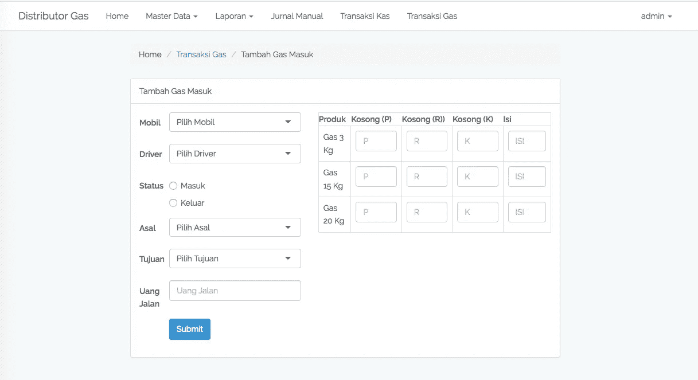
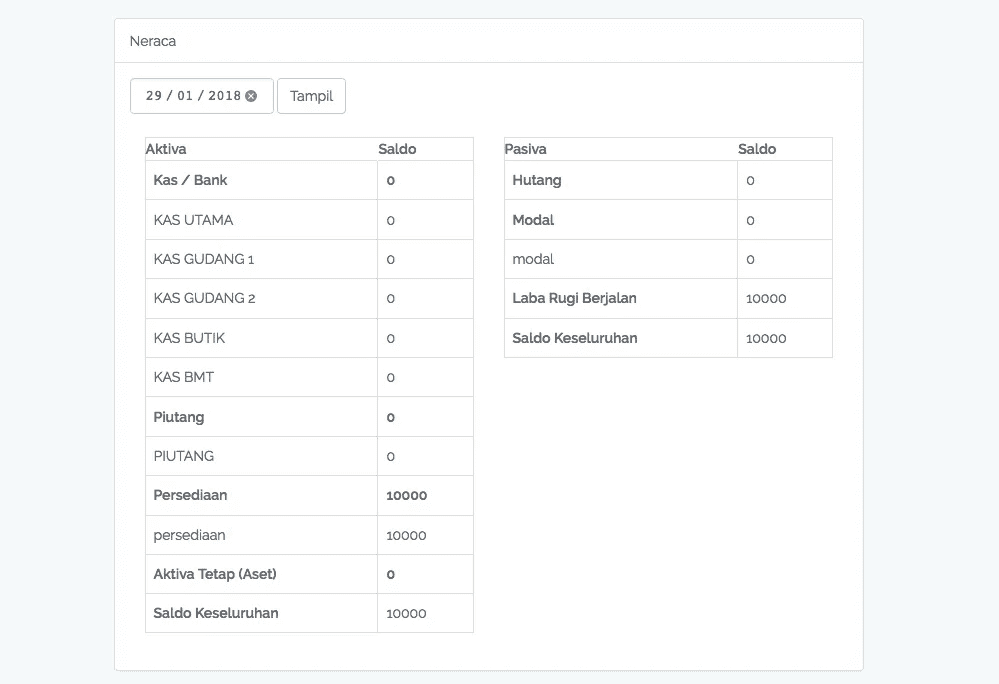
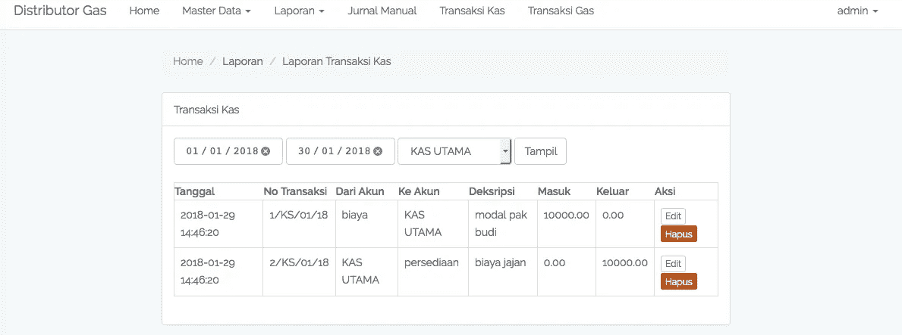

# Aplikasi Distributor Gas [SPA] (Laravel + Vue js)

> 原文：<https://medium.easyread.co/aplikasi-distributor-gas-spa-laravel-vue-js-944a0169c653?source=collection_archive---------0----------------------->

Hai! udah lama gak sharing code. kali ini saya baru ngerjain projek kecil untuk aplikasi distributor gas.

Jadi aplikasi ini digunakan oleh distributor gas, untuk mengatur masuk keluar nya gas. bahkan sampai ke keuangan nya yaitu akuntansinya.

Fitur-fitur yang ada:

*   Kelola Masuk dan Keluar gas beserta mobil nya.
*   Kelola kas harian (cashflow)
*   Kelola Jurnal yang nanti hubungannya dengan akuntansi
*   Laporan keuangan berupa buku besar, laba rugi sampai ke neraca nya.
*   FULL Single Page Application. jadi gak akan ada lagi loading page berkali-kali, yeay 😄

Untuk backendnya saya pakai laravel dan untuk frontend nya pakai vue js. dan kerennya aplikasi ini saya buat full spa. rencana nya mau nyoba pwa. tapi waktunya mepet, belum jago pwa hehe.

Aplikasi ini cocok banget buat kalian yang mau starting project yang ada keuangannya. Karena di dalamnya udah ada sistem keuangan sederhana, tapi powerfull karena sudah bisa menghasilkan laporan neraca dan laba rugi.

Karena kalau ngomongin “Laporan Keuangan” , laporan neraca dan laba rugi itu yang paling krusial.

dan akuntasi nya akan sangat mudah dimengerti, belajar 5 menit aja soal akuntansi di aplikasi ini, maka akan langsung mengerti akuntansi sederhana yang ada di aplikasi.

Tapi saya sangat gak gak recommended kalau kalian makai source code ini tanpa di oprek-oprek sama kalian sendiri. Karena saya sharing source code ini untuk bisa teman-teman pelajari dan untuk saya sendiri belajar.

Karena mungkin ada banyak kekurangan disana-sani dalam saya membuat aplikasi, jadi kalau ada yang kurang langsung bilang aja ke saya, akan langsung di perbaiki.

Apalagi belum ada unit testing nya hehe.

Tapi tenang, akan saya lanjutkan dengan membuat unit test , lengkap dengan browser test nya.

Berikut daftar package php dan javascript yang saya pakai:

composer :

*   yajra/laravel-auditable

npm :

*   laravel-vue-pagination
*   vue-router
*   vue-simple-spinner
*   vue-swal
*   vue2-selectize

ini penampakkan nya :

Transaksi Gas

Laporan Neraca

Transaksi Kas

Jika kalian merasa hal ini bermanfaat silahkan beri claps 👏 👏 sebanyak mungkin hehe, dan jangan lupa di share ke temen-temen nya mungkin ada yang butuh buat bahan belajar ngoding.

Oiya mungkin ada yang baru denger vue js, boleh datang ke [artikel ini](https://medium.com/easyread/reaksi-pertama-saat-coba-vue-js-4c2c1fbbd75a) tentang kesan pertama saya saat pakai vue js.

 [## Reaksi Pertama saat coba Vue js

### Sampai beberapa waktu yang lalu saya gak ngerti kenapa javascript bisa jadi bahasa pemrograman no 1 paling banyak di…

medium.com](https://medium.com/easyread/reaksi-pertama-saat-coba-vue-js-4c2c1fbbd75a) 

atau kalau kalian udah ngoprek dikit vue js dan mau nyoba crud SPA dengan vue js bisa kunjungin [artikel ini](https://medium.com/@haidarafifmaulana/laravel-vue-crud-pagination-search-sweetalert-selectize-spinner-d1e81960f9a4) , ada source code nya bisa kalian coba.

 [## Laravel Vue Crud (Pagination+Search+SweetAlert+Selectize+Spinner)

### Crud, Operasi dasar yang harus dikuasai oleh programmer untuk menyelesaikan masalah pengolahan data sederhana.

medium.com](https://medium.com/@haidarafifmaulana/laravel-vue-crud-pagination-search-sweetalert-selectize-spinner-d1e81960f9a4) 

Happy Coding 💻 💻 😄

**Untuk source code nya bisa kalian** [***download disini***](http://eepurl.com/diVLTY) **.**

*Artikel ini di tulis oleh* [*Haidar Afif Maulana*](https://medium.com/u/631846fabf4?source=post_page-----944a0169c653--------------------------------) *, beliau adalah proffesional Full Stack Developer sejak 2014, beliau sering menulis artikel mengenai Software Engineering dan Programming. Follow profilnya untuk mendapatkan update-an terbaru artikel-artikel beliau.*

*Jika anda merasa artikel ini menarik dan bermanfaat, bagikan ke lingkaran pertemanan anda, agar mereka dapat membaca artikel ini.*