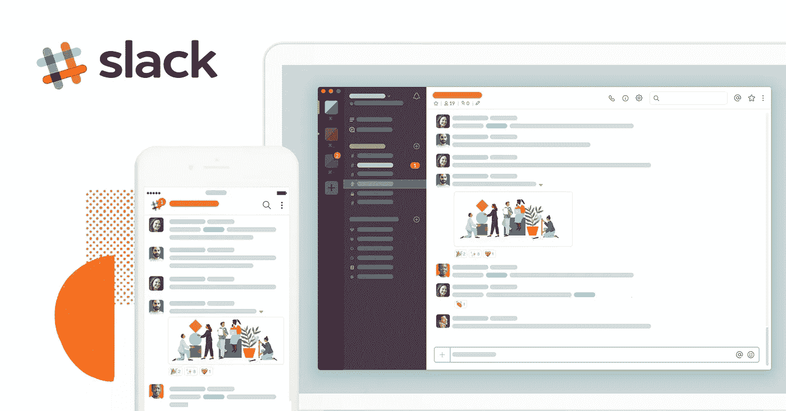
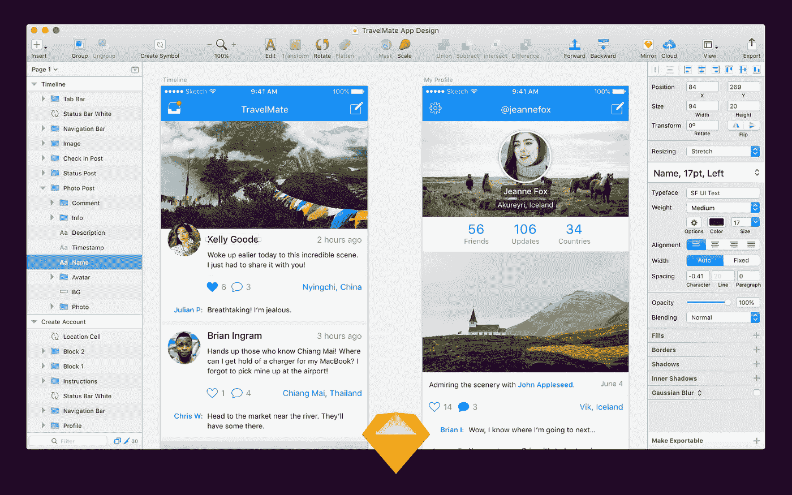

# Aplikasi Penunjang Pekerjaan Product Manager

> 原文：<https://medium.easyread.co/aplikasi-penunjang-pekerjaan-product-manager-4c934243f40d?source=collection_archive---------4----------------------->

Pekerjaan seorang Product Manager (PM) sehari-harinya sangat dinamis. Rapat dengan pemangku kepentingan ( *stakeholders* ), rapat harian dengan para engineer, membuat detail spesifikasi produk, memantau data, merencanakan operasional produk, dan tugas-tugas lainnya yang beragam. Terkadang variasi tipe tugas tersebut membuat PM seperti kewalahan karena perlu menangani banyak hal sekaligus.

Untuk mengatasi kewalahan yang nyata ini, saya belajar dari buku *Getting Things Done* karya David Allen yang menyatakan bahwa kita seharusnya tidak mengandalkan diri sendiri dalam hal apapun selain menyelesaikan masalah dan berpikir kreatif. Keperluan lainnya harus kita alihdayakan ( *outsource* ) ke sebuah ekosistem yang baik. Untuk itu, saya menggunakan beberapa aplikasi yang membantu saya untuk melakukan pekerjaan saya sehari-hari yang ingin saya ceritakan kali ini. Aplikasi-aplikasi ini ada beberapa yang memang digunakan oleh perusahaan saya sehingga saya otomatis menggunakannya, namun ada juga yang saya gunakan atas inisiatif pribadi karena aplikasi tersebut efektif untuk saya. Semoga daftar aplikasi ini juga dapat membantu Anda dalam menjadi lebih produktif di dalam pekerjaan harian Anda.

Tampilan antarmuka Slack (sumber: [Slack](https://a.slack-edge.com/b47f5/marketing/img/features/unfurl_why_slack.png))

## Slack

[Slack](https://slack.com/) adalah aplikasi komunikasi yang menurut saya sangat ideal untuk keperluan kerja, terutama di bidang teknologi. Saya merasa menggunakan Slack jauh lebih mudah dan nyaman ketimbang Microsoft Lync yang saya gunakan sewaktu magang. Ada banyak fitur yang memang didesain untuk keperluan kerja seperti *channel* , *file upload* , dan integrasi ke aplikasi-aplikasi produktivitas lainnya. Fitur-fitur ini memudahkan kolaborasi antar tim sehingga mengurangi jumlah rapat karena komunikasi jadi mungkin dilakukan secara *asynchronous* .

Di samping itu, saya juga menyukai penggunaan Slack di kantor untuk memisahkan dunia kerja dan dunia pribadi. Tentunya saya tidak mau keesokan hari dimarahi atasan karena tidak membalas chat WhatsApp sekalipun terpantau online di malam hari.

Walaupun begitu, saya tahu kalau penggunaan Slack yang terlalu intensif akan menjadi kontraproduktif karena kita terus-terusan terdistraksi oleh pesan yang masuk; terutama yang mempunyai OCD terhadap notifikasi masuk seperti saya. Oleh karena itu, bijaklah menggunakan Slack dengan tidak menyalakannya ketika kita sedang fokus bekerja.

Tampilan antarmuka Confluence (sumber: [Atlassian](https://3kllhk1ibq34qk6sp3bhtox1-wpengine.netdna-ssl.com/wp-content/uploads/01-Activity-1.png))

## Confluence

[Confluence](https://www.atlassian.com/software/confluence) adalah aplikasi buatan Atlassian yang ditujukan untuk pendokumentasian. Confluence mempunyai format serupa Wikipedia sehingga memungkinkan kita untuk membuat dokumentasi yang jelas dan terstruktur ketimbang jika kita menggunakan Google Docs atau Microsoft Word. Confluence juga memiliki berbagai macam tipe dokumen untuk keperluan yang berbeda-beda, seperti *product requirement* atau *meeting notes* .

Bagi saya pribadi, Confluence memudahkan saya untuk mencari dan menambahkan informasi apapun yang berkaitan dengan pekerjaan dengan jauh lebih rapi. Confluence juga menjadi titik tengah dari sebuah tim karena merupakan platform yang ideal untuk menjadi *single source of truth* (SSOT). Semua dokumentasi anggota tim — yang sebenarnya masing-masing mungkin bekerja dengan platform yang berbeda — terdokumentasi di Confluence.

Tampilan antarmuka Jira (sumber: [Atlassian](https://wac-cdn.atlassian.com/dam/jcr:9d8911e0-e1c6-4957-b1f2-dfa02a8568f6/Group%205.png?cdnVersion=jx))

## Jira

Jira juga adalah aplikasi buatan Atlassian yang berfokus pada manajemen proyek. Jira mempunyai banyak pilihan untuk pengelolaan tugas dalam sebuah proyek, mulai dari hanya sekedar sebuah daftar tugas hingga papan Scrum yang membuat pengelolaan sprint menjadi jauh lebih mudah. Untuk pengelolaan proyek ini Jira menawarkan fitur laporan yang memudahkan kita untuk memantau efisiensi proses eksekusi proyek. Jira juga mempunyai fitur Service Desk yang sangat berguna untuk tim-tim yang “berada di tengah”, misalnya tim IT atau tim infrastruktur sistem.

Bagi saya Jira sangat superior ketimbang aplikasi lainnya dalam hal manajemen proyek. Walaupun begitu, fitur Jira yang terlalu banyak memang awalnya memberi kesan intimidatif dan membuat kita butuh waktu untuk dapat menggunakannya dengan baik.

Tampilan antarmuka Todoist (sumber: [Todoist](https://support.todoist.com/hc/article_attachments/360000763689/HC_-_Favorite_a_project__small_.gif))

## Todoist

Untuk mengelola tugas sehari-hari, saya lebih memilih untuk menggunakan Todoist walaupun sebenarnya Jira bisa digunakan untuk keperluan yang sama. Alasannya: Todoist mempunyai tampilan yang sederhana, berbanding terbalik dengan Jira. Saya pernah mencoba aplikasi sejenis lainnya — Trello, Any.do, Microsoft To-do, atau Wunderlist — tetapi menurut saya tidak ada yang sepraktis Todoist.

Mengapa Todoist bekerja dengan baik untuk saya? Saya mampu membuat sebuah tugas lengkap dengan informasi pelengkapnya dalam satu kalimat: “task @label #project at time”. Fitur ini sangat membantu ketika saya harus membuat suatu tugas dengan cepat di tengah rapat atau percakapan. Todoist juga mempunyai gamifikasi dalam bentuk karma yang menciptakan kesan adiksi untuk secara konsisten menambahkan tugas-tugas ke Todoist sehingga saya jarang lupa menambahkan tugas-tugas saya. Todoist juga terintegrasi dengan Slack dan aplikasi penunjang produktivitas seperti Pomodone yang membuat pekerjaan menjadi lebih optimal.

Tampilan antarmuka Bear (sumber: [The Verge](https://i0.wp.com/wptavern.com/wp-content/uploads/2017/06/Screen-Shot-2017-10-08-at-10.50.16-PM.png?ssl=1))

## Bear

Banyak orang menggunakan Evernote atau OneNote, namun saya tidak merasa nyaman menggunakan kedua aplikasi tersebut. Keduanya terasa terlalu penuh dan tampilan antarmukanya pun tidak terlalu baik.

Kemudian saya menemukan aplikasi Bear dan saya jatuh hati. Aplikasi ini mempunyai tampilan antarmuka yang baik secara visual dan fokus kepada intinya: ingin mencatat dengan mudah dan cepat. Aplikasi ini mempunyai pilihan pemformatan yang sangat baik dan praktis (karena cukup menggunakan keyboard), kapabilitas untuk menambahkan *task* , dan fitur pembuatan folder otomatis berdasarkan tagar yang diketik di catatan tersebut. Fitur-fitur ini sangat membantu saya terutama di tengah rapat yang memaksa saya untuk mengambil catatan secepat mungkin.

Bear mempunyai versi premium yang memungkinkan sinkronisasi di banyak perangkat dan fitur ekspor dokumen dengan biaya US$ 2/bulan, menurut saya biaya yang sangat layak dengan pengalaman pengunaan yang ditawarkan. Yang sangat disayangkan adalah aplikasi ini hanya tersedia di perangkat Apple (iPhone, iPad, dan Mac).

Balsamiq Mockups (sumber: [Balsamiq](https://media.balsamiq.com/img/support/docs/m4d/b3/ui-overview.png))

## Balsamiq Mockups

Balsamiq adalah aplikasi untuk membuat desain kasar (lo-fi) dan *wireframe* produk yang akan kita kembangkan. Balsamiq membuat proses ideasi desain tahap awal menjadi sangat mudah karena cara penggunaannya yang sangat sederhana, hanya tinggal klik dan tempatkan komponen-komponen yang sudah disiapkan. Kesederhanaan ini sangat membantu PM yang tidak mempunyai kemampuan menggunakan aplikasi desain untuk ikut berkontribusi dalam proses desain dan *user research.*

Tampilan antarmuka Sketch (sumber: [Sketch](https://www.sketchapp.com/images/pages/press/sketch-press-kit/app-screenshots/sketch-screenshot-promo@2x.jpg))

## Sketch

Jika desain kasar sudah jadi, maka proses desain med-fi hingga hi-fi akan dilakukan oleh desainer tatap muka, yang di perusahaan saya menggunakan aplikasi Sketch. Sama seperti Balsamiq, Sketch sangat mudah digunakan dan mempunyai fitur sosial sehingga memungkinkan kolaborasi yang mudah antara desainer, engineering, dan produk.

## Google Apps

Saya sengaja menaruh Google Apps di bawah dan tidak memberikan gambar karena rasanya semua orang mengetahui Google Docs, Sheets, Slides, dan aplikasi-aplikasi Google lainnya yang memang ditujukan untuk produktivitas. Manfaat dari aplikasi-aplikasi ini juga tentunya tidak perlu dipertanyakan lagi. Kalau untuk saya pribadi, kelebihan Google Apps ini adalah fitur kolaborasi instannya yang sangat berguna ketika kita perlu melengkapi sebuah dokumen bersama-sama secara *real time* .

# Aplikasi alternatif

Aplikasi-aplikasi di bawah ini adalah aplikasi yang serupa dengan aplikasi-aplikasi di atas, yang bisa dijadikan alternatif karena terkadang pembedanya hanya di soal selera.

Tampilan antarmuka Asana (sumber: [Asana](https://asana.com/guide/videos))

## Asana

Asana adalah kompetitor langsung dari Jira sebagai aplikasi untuk memantau tugas-tugas. Asana mempunyai tampilan yang bersih dan mudah dipakai, terbalik dengan Jira yang terkesan “mengintimidasi” mereka yang baru pertama kali menggunakannya. Saya pribadi menyukai Asana karena penggunaannya sangat cepat dan mempunyai fitur timeline, dua hal yang tidak ada di Jira.

Sayangnya, secara fitur keseluruhan Asana masih tertinggal dari Jira. Misalnya, Asana tidak mempunyai fitur *sprint* dan tidak memaksimalkan penggunaan papan Kanban, dua hal yang sangat umum digunakan di berbagai *startup* . Jira juga mempunyai fitur Service Desk dan integrasi dengan Confluence dan platform lainnya yang sangat membantu.

Walaupun begitu, jika pekerjaan sehari-hari Anda tidak membutuhkan fitur ala *sprint* ataupun Service Desk, menurut saya Asana bisa jadi lebih baik dari Jira. Saya sendiri masih menggunakan Asana (karena kantor memang menyediakan) untuk kolaborasi dengan tim yang tidak bersifat teknis.

## Notion

Notion mempunyai ide yang menarik, yaitu membuat sebuah platform yang menggabungkan semua hal yang berkaitan dengan manajemen proyek. Notion memungkinkan penggunanya untuk melakukan pendokumentasian *project* atau notulen rapat, pengelolaan *task* , dan pembuatan catatan di dalam aplikasinya. Secara biaya, tentunya menggunakan Notion akan lebih ekonomis ketimbang menggunakan Confluence + Jira + Bear/Evernote sekaligus.

Walaupun begitu, menurut saya Notion masih perlu berbenah dari sisi *user experience* karena mempunyai *learning curve* yang tinggi. Selain itu juga Notion mempunyai biaya langganan personal yang lebih mahal ketimbang Bear, dan versi gratisannya pun memiliki limitasi jumlah data (yang mereka sebut sebagai block). Sementara untuk memanfaatkan semua fiturnya — terutama untuk kolaborasi — membutuhkan semua anggota tim untuk juga menggunakannya, yang akan sulit jika perusahaan sudah terlebih dahulu menggunakan platform lain.

## Simplenote

Saya tahu, hal yang disayangkan dari Bear adalah hanya tersedia di perangkat Apple. Yang lebih disayangkan lagi adalah, tidak ada aplikasi Windows yang nyaman untuk digunakan sebagai aplikasi penyimpan catatan. Evernote dan OneNote sudah terlalu *cluttered* dan juga tidak memiliki tampilan yang nyaman dipandang.

Jadi untuk pengguna Windows yang hanya ingin cepat-cepat mencatat, Simplenote mungkin bisa jadi pilihan. Simplenote — sesuai namanya — memang sangat simpel, dimana tampilan antarmukanya hanya berisi daftar catatan dan isi catatan yang sedang aktif. Simplenote tidak mempunyai banyak fitur, namun bagi Anda yang hanya ingin mencatat tanpa perlu keperluan macam-macam, Simplenote dapat menjadi pilihan yang praktis.

*Nah* , kira-kira itulah beberapa aplikasi yang dapat menunjang pekerjaan seorang PM. Tetapi aplikasi di atas tidak hanya berguna bagi PM saja. Mungkin kamu juga dapat mencoba berbagai aplikasi di atas untuk menunjang pekerjaan kamu sehari-hari. Selamat mencoba!