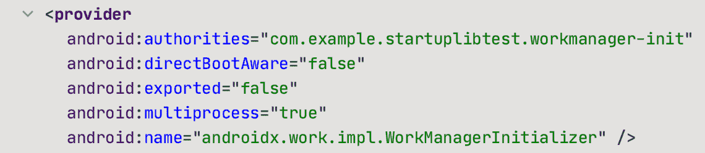

# 应用程序启动，第 1 部分

> 原文：<https://medium.com/androiddevelopers/app-startup-part-1-34f57b65cacd?source=collection_archive---------0----------------------->


Illustration by [Virginia Poltrack](https://twitter.com/VPoltrack)

## 内容提供商和自动初始化

最近开始玩 [AndroidX App 创业](https://developer.android.com/topic/libraries/app-startup)库。几周前，它[达到了 1.0](https://developer.android.com/jetpack/androidx/releases/startup#1.0.0) ，所以我认为是时候弄清楚为什么、何时以及如何使用它了。

我意识到的第一件事是，它的名字 *App Startup* ，可能意味着比它实际拥有的更广泛的功能。该库并不关注一般的创业问题(至少目前是这样)；它特别针对最小化由于内容提供者而自动发生的初始化的影响。

现在也许你和我一样，从来没有想过库是如何初始化的。也许这是因为很多事情都是在幕后发生的。具体来说，您在您的`build.gradle`文件中添加一行，将一个库作为依赖项包含进来，这样就完成了(除了调用该库中的 APIs 否则您为什么要添加它呢？).

但是许多库不仅仅是等待被调用的方法包；它们通常需要首先进行初始化，这可能需要很长时间。更糟糕的是，特别是在隐藏陷阱方面，这些库通常在启动时加载和初始化，因为它们使用了[内容提供者](https://developer.android.com/guide/topics/providers/content-providers)。

# 尽情分享[提供商]

内容提供商是 Android 在应用程序之间共享应用程序数据*的方式。例如，手机上的联系人通过内容提供商共享，允许其他应用程序访问用户的联系人(当然，假设用户授予他们权限)。同样，您可以让其他应用程序访问您的应用程序创建的数据。也许你的应用程序管理着一个甜甜圈评级数据库，这似乎是非常重要的信息，其他应用程序可能需要，呃，经常使用。*

> 每当使用任何声明内容提供者的应用程序启动时，内容提供者被自动创建和运行

内容提供者的一个重要的，也许是不明显的问题是，每当使用任何声明内容提供者的应用程序启动时，它们就会自动创建和运行。请注意，不仅用户可以启动应用程序，访问应用程序中服务的系统也可以启动应用程序，或者当作业调度程序启动代表应用程序运行的重复作业时，等等。所有这些都引发了内容提供商的开销和他们产生的工作。当有人请求访问该提供者时，系统需要该功能，因此它在启动时自动运行内容提供者。

这个细节对于使用这些库的开发人员来说并不明显，因为它是如何发生的细节隐藏在自动生成的代码中。特别是，您必须查看[合并清单](https://developer.android.com/studio/build/manifest-merge)文件，看看这是如何发生的。

# 明显性

我与 Android 应用程序清单的大部分交互都是单独与为我创建的`Manifest.xml`文件进行的，我编辑该文件以添加附加活动、服务和权限等内容。但是这个清单文件不是给系统的最终文件；它只是提供特定于应用程序的信息作为实际“合并”清单的输入。合并的文件是从您的`Manifest.xml`文件创建的，还有工具获取的其他信息，包括您的应用程序使用的库中的清单。正是在这个最终的合并清单中，我们看到了库内容提供商正在发生什么。

我们来看一个具体的例子。并不是所有的库都有内容提供者(尽管这很常见)，所以我们来看一个有内容提供者的库: [WorkManager](https://developer.android.com/jetpack/androidx/releases/work) 。为了在我的项目中使用`WorkManager`，我将这个依赖项添加到我的应用程序的`build.gradle`文件中:

```
implementation "androidx.work:work-runtime-ktx:2.4.0"
```

在我同步并构建了应用程序之后，我运行了一些启动计时(稍后会详细介绍)，来比较我在这个变化前后的启动持续时间。我注意到我的应用程序比以前多花了 70 毫秒的时间来启动……而且这还没有调用`WorkManager`中的任何功能。我所做的只是添加了上面的依赖关系。

额外启动延迟的原因在合并的清单文件中找到，我可以在查看`Manifest.xml`时通过点击 Android Studio 编辑器窗口左下角的合并清单选项卡来查看:


The tabs at the bottom of the editor window for Manifest.xml control whether you are seeing your application manifest file or the final merged manifest

在这个合并版本的清单中，我看到 including `WorkManager`在清单中放入了更多的信息，包括这个提供者块:



This provider was in the merged manifest file after adding WorkManager as a dependency

出于对这个提供者的好奇，我点击了它的第一行，这方便地将我带到了`WorkManager`的清单文件，其中包含以下内容:

```
<application>
    <provider
        android:name="androidx.work.impl.WorkManagerInitializer"
        android:authorities="${applicationId}.workmanager-init"
        android:directBootAware="false"
        android:exported="false"
        android:multiprocess="true"
        tools:targetApi="n" />
    <!-- ... and a bunch of other stuff ... -->
</application>
```

所发生的是，合并的清单文件合并了组成应用程序的所有部分的清单文件，包括现在我作为依赖项添加的,`WorkManager`库的清单文件。由于合并后的清单中现在有了一个内容提供者，所以当我的应用程序启动时，系统会自动创建并运行它。

好了，现在我知道我是如何让库加载并运行内容提供者的了。但是这有什么影响呢？

# 测量启动

我最近给[发了一篇文章](/androiddevelopers/testing-app-startup-performance-36169c27ee55)，[测试应用启动性能](/androiddevelopers/testing-app-startup-performance-36169c27ee55)，详细介绍了如何测量一个应用的启动时间。我用这种方法测量了添加`WorkManager`依赖项前后我的应用程序的启动时间，发现`WorkManager`平均给我的应用程序增加了 67 毫秒的启动时间。

请注意，正如在[启动测试文章](/androiddevelopers/testing-app-startup-performance-36169c27ee55)中所述，我锁定了我的 Pixel 2 时钟，因此这可能比真实用户在该设备上看到的持续时间更长……但可能没有低端设备上的用户体验的时间长。还要注意(正如那篇文章中所描述的)，我可能不需要锁定时钟，因为系统通常在应用程序启动时以最大频率运行时钟。但是为了获得一致的结果，锁定时钟通常是性能测试中的一个好习惯。此外，锁定时钟往往会产生更长的持续时间(从较慢的频率)，这有助于在短时间内减少数据中的噪声。

还要注意，这个持续时间不仅仅是由于内容提供商本身。内容提供商创建内容可能需要相当长的时间，但比我看到的 67 毫秒更接近 1-2 毫秒。相反，除了创建和运行内容提供者来执行实际初始化库的工作之外，这是库花费在*加载*和*初始化*的总时间。

因此，简单地将这个库添加到我的项目中似乎导致了将近 70 毫秒的启动时间。在一个真正的应用程序中，我可能会使用多个库，许多库在启动时都有自己的内容提供者，这会导致启动时更多的延迟，因为所有的东西都被初始化了。

当然，问题是我是否能做些什么来减轻这种打击。而答案当然是…回来看[第二部](/androiddevelopers/app-startup-part-2-c431e80d0df)！*(剧透:在* [*Part 2*](/androiddevelopers/app-startup-part-2-c431e80d0df) *中，我会讨论如何使用 AndroidX App 启动库来懒洋洋地加载库)*。

# 续接[第二部分](/androiddevelopers/app-startup-part-2-c431e80d0df)