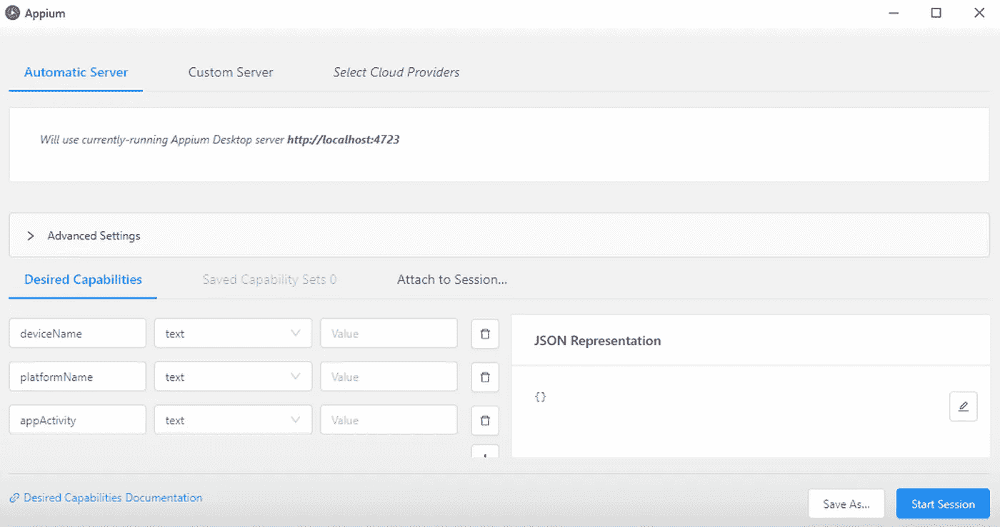
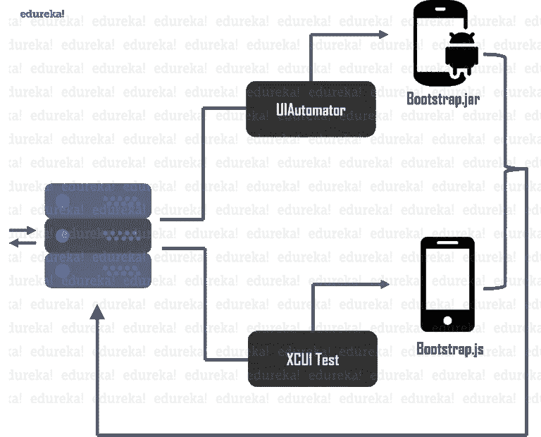
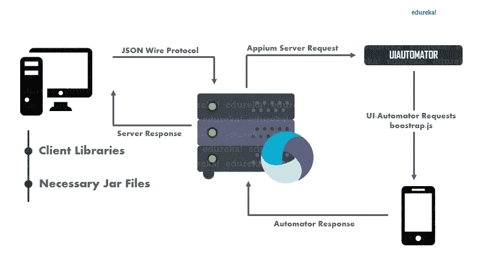
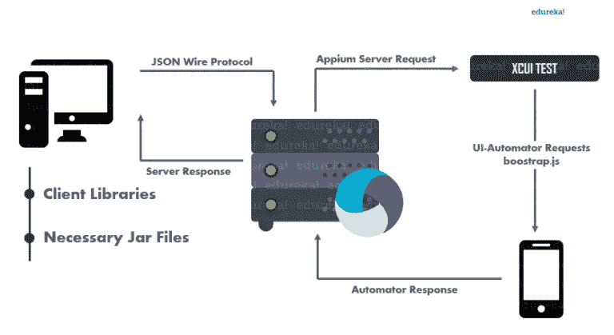

# 建筑的解构

> 原文：<https://medium.com/edureka/appium-architecture-505f70bf3484?source=collection_archive---------0----------------------->

Appium Architecture — Edureka

了解一个工具的内部工作方式和架构会有很大帮助，尤其是如果你每天都在使用这个工具的话。错误修复和故障排除变得轻而易举，您可能会经常发现自己以新的和创造性的方式使用相同的平凡工具。在本文中，我将写关于 Appium 的架构，这是一个在移动应用程序自动化测试领域广泛使用的工具。

在这个 Appium architecture 博客中，您将浏览以下主题

1.  什么是 Appium？
2.  应用概念
3.  JSON 有线协议
4.  建筑应用
5.  Android 上的应用
6.  iOS 上的应用程序

# 什么是 Appium？

Appium 是一个开源的、跨平台的自动化测试工具。它目前致力于为运行在 Android 和 iOS 上的移动应用程序提供无缝自动化[测试体验。](https://www.edureka.co/blog/mobile-application-testing?utm_source=medium&utm_medium=content-link&utm_campaign=appium-architecture)

Appium 是一个服务器，使用 [node.js 编写。](https://www.edureka.co/blog/nodejs-tutorial?utm_source=medium&utm_medium=content-link&utm_campaign=appium-architecture)几年前，Appium 是一个只有 CLI 的工具，它主要是使用节点包管理器安装的。归功于开发团队最近的开发，Appium 发布了一个基于 GUI 的桌面应用程序，可以安装在各种 Linux 发行版、微软 Windows 和 MAC OSx 上。目前发布的 Appium 可以从 [Appium 官网](http://appium.io/)下载。

值得一提的是，Appium 是一款跨平台应用:

*   Appium 可以用来测试移动应用程序，无论它们运行在 iOS 还是 Android 上。
*   Appium 可用于测试混合、本地和网络应用
*   Appium 可以在 Windows、Linux 和 MAC 上运行

现在让我们回顾一下关于 Appium 的一些关键概念，这将有助于您轻松理解它的架构。

# 应用概念

在下一节中，我们将讨论三个关键概念，它们是 Appium 架构的固有概念。

## Appium 客户端-服务器架构

Appium 的核心是一个用 node.js 编写的服务器。该服务器使用客户端-服务器架构工作。根据客户端-服务器架构，客户端连接到服务器以利用服务器上托管的任何服务。客户端和服务器之间的任何通信都是以响应和请求的形式进行的。

在 Appium 中，客户端向 Appium 服务器发送关于自动化的请求。服务器以自己独特的方式处理请求，然后用测试结果或日志文件来响应。

## 应用程序会话

所有“测试”都封装在一个会话中完成。鉴于 Appium 是一个简单的基于客户端和服务器的机制，这一点非常明显。客户端向服务器发送 post 请求**，也称为会话请求**。这些请求以 JSON 对象格式携带信息，并且使用 JSON Wire 协议执行通信。

## 期望的能力

Appium 在 iOS 和 Android 上的工作方式不同。既然它是一个“跨平台”工具，那么必须存在一种机制来区分两个操作系统的会话请求。这个特殊的问题陈述也在 JSON 对象的帮助下得到解决，这些对象被称为*期望的能力，*，如下图所示。

期望的功能是区分 Android 应用程序测试会话的建立和 iOS 应用程序测试会话的建立的键值对信息。像这样的论点-

*   *平台名称*
*   *设备名称*
*   *appPackage*
*   *appActivity*

对于服务器来说，区分两个操作系统变得相当容易。

了解了这些关键概念之后，让我们来看看 JSON Wire 协议。

## JSON 有线协议

JSON Wire 协议是用于客户机和服务器之间通信的机制。它是由 web 驱动程序开发人员开发的。根据他们的说法，该协议是一组标准化的端点，使用 RESTful API 向客户端公开。这允许 webdriver 与服务器和客户机建立通信以执行自动化。

Appium 使用的是 mobile JSON Wire 协议，是 Selenium JSON Wire 协议的扩展。它用于控制不同的手机行为，而不仅仅是建立一个通信流。

现在让我们深入研究 Appium 架构。

# 建筑应用

好的，正如我所承诺的，如果你已经通读了上面讨论的概念，那么掌握这个架构将是轻而易举的事情。为了使它更简单，让我以一种简单明了的方式记下这个架构:

*   客户端使用会话与服务器通信，其中通信过程的关键元素与帮助对象一起发送。通信由移动 JSON 有线协议处理。
*   服务器使用 *desiredCapabilites* 参数来区分 iOS 请求和 Android 请求。
*   Appium 服务器然后处理对相应 UI 自动机的请求，如下面的 **Appium 架构图**所示。
*   然后，测试会话的结果被传递给服务器，然后使用移动 JSON Wire 协议以日志的形式返回给客户机系统。

Appium 在 Android 和 iOS 的执行方面略有差异。让我们看一看。

# Android 上的应用

Android 上的 Appium 使用 UIAutomator 框架来实现自动化。UIAutomator 是 android 为自动化目的构建的框架。那么，让我们来看看 Appium 在 Android 上的确切工作方式。

1.  Appium 客户端(c/Java/Python/etc)连接 Appium 服务器，通过 JSON Wire 协议进行通信。
2.  Appium Server 随后会为客户端创建一个自动化会话，并检查客户端所需的功能。然后，它与各个供应商提供的框架(如 UIAutomator)相连接。
3.  然后，UIAutomator 将与运行在模拟器/仿真器/真实设备中的 bootstrap.jar 进行通信，以执行客户端操作。
4.  在这里， **bootstrap.jar** 扮演 TCP 服务器的角色，我们可以用它来发送测试命令，以便在使用 UIAutomator 的 Android 设备上执行操作。

下面的 **Appium android 架构**图直观地展示了上述步骤。

# iOS 上的应用程序

在 iOS 设备上，Appium 使用苹果的 XCUI 测试 API 与 UI 元素进行交互。XCUITest 是苹果 XCode 附带的自动化框架。

1.  Appium 客户端(c/Java/Python/etc)连接 Appium 服务器，通过 JSON Wire 协议进行通信。
2.  然后，Appium Server 为客户端创建一个自动化会话，并检查客户端所需的功能，并与各个供应商提供的框架(如 XCUI Test)连接。
3.  XCUI 测试然后将与 bootstrap.js 通信，bootstrap . js 运行在模拟器/仿真器/真实设备中，用于执行客户端操作。
4.  **Bootstrap.js** 将在我们正在测试的应用程序上执行动作。执行完命令后，客户端将消息发送回 Appium 服务器，其中包含所执行命令的日志详细信息。

下面的 **Appium iOS 架构**图直观地展示了上述步骤。

这就把我们带到了本文的结尾。如果你想查看更多关于 Python、DevOps、Ethical Hacking 等市场最热门技术的文章，那么你可以参考 [Edureka 的官方网站。](https://www.edureka.co/blog/?utm_source=medium&utm_medium=content-link&utm_campaign=appium-architecture)

请留意本系列中的其他文章，它们将解释软件测试的各个方面。

> 1.[移动应用测试](/edureka/mobile-application-testing-51140ebe4a87)
> 
> 2.[软件测试工具](/edureka/software-testing-tools-ebd9ebac6f29)
> 
> 3.[软件测试的类型](/edureka/types-of-software-testing-d7aa29090b5b)
> 
> 4. [Appium 教程](/edureka/appium-tutorial-28e604aebeb)
> 
> 5. [Appium 工作室教程](/edureka/appium-studio-tutorial-8a13ee9662d6)
> 
> 6. [JMeter 教程](/edureka/jmeter-tutorial-774856163ee9)
> 
> 7.[使用 JMeter 进行负载测试](/edureka/load-testing-using-jmeter-3da837c11a02)
> 
> 8.[自动化测试教程](/edureka/automation-testing-tutorial-157d269e60db)
> 
> 9.[什么是功能测试？](/edureka/what-is-functional-testing-complete-guide-to-automation-tools-183e42ad517a)
> 
> 10.[功能测试与非功能测试](/edureka/functional-testing-vs-non-functional-testing-a08bc732fbdd)
> 
> 11. [JMeter vs LoadRunner](/edureka/jmeter-vs-loadrunner-c1ab63acd935)
> 
> 12.[回归测试](/edureka/regression-testing-b913b7064824)
> 
> 13.[性能测试生命周期](/edureka/performance-testing-life-cycle-d4242d39a5aa)
> 
> 14. [JMeter 插件](/edureka/jmeter-plugins-1bceec7f6226)

*原载于 2019 年 5 月 9 日*[*https://www.edureka.co*](https://www.edureka.co/blog/appium-architecture/)*。*