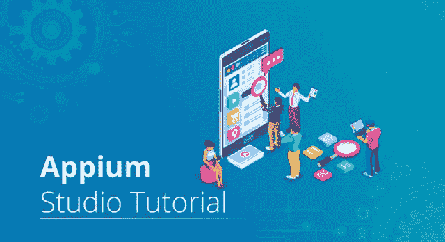
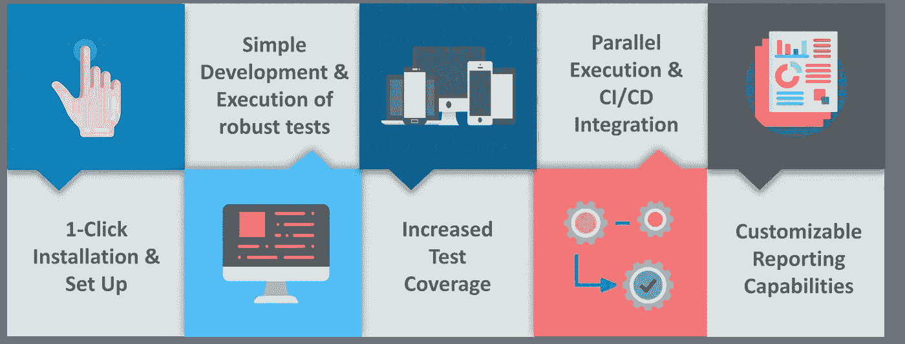
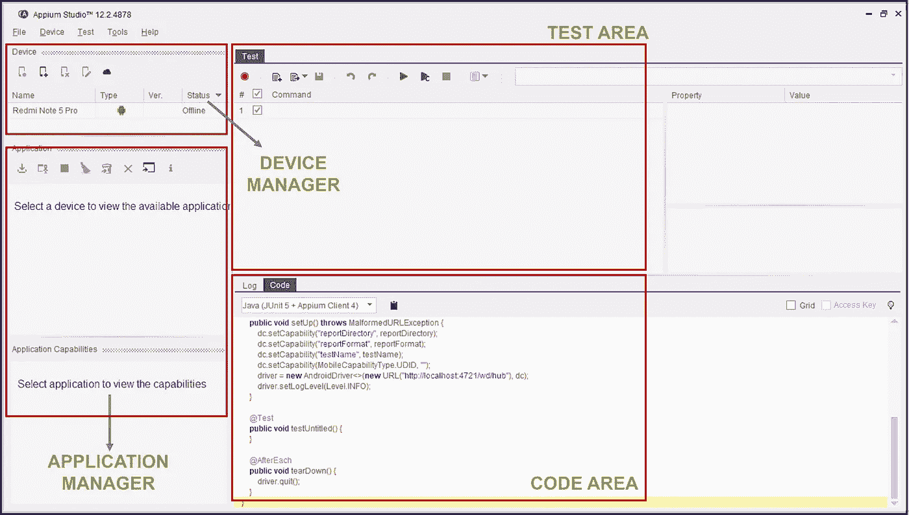
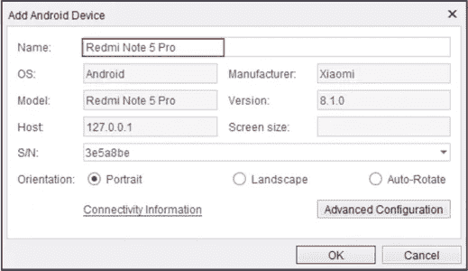
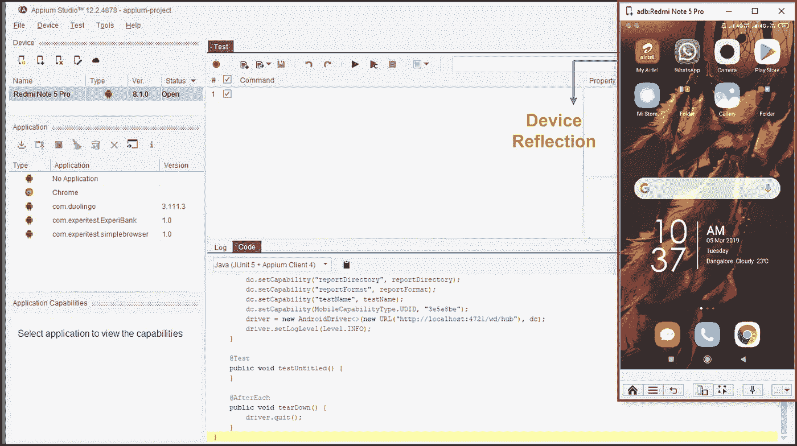
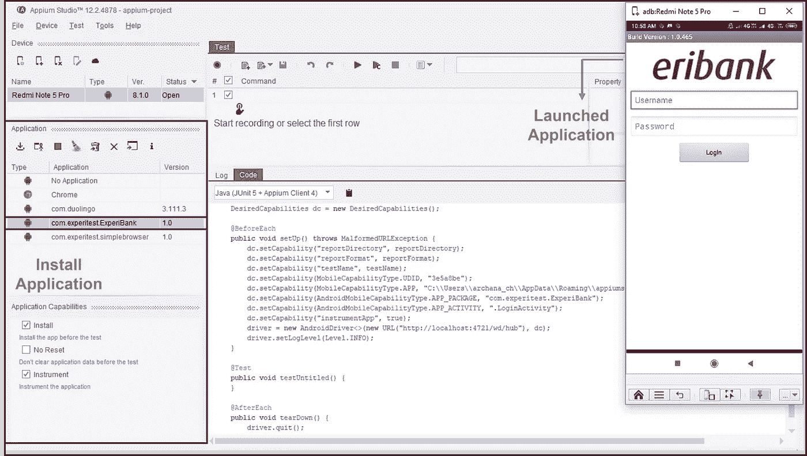
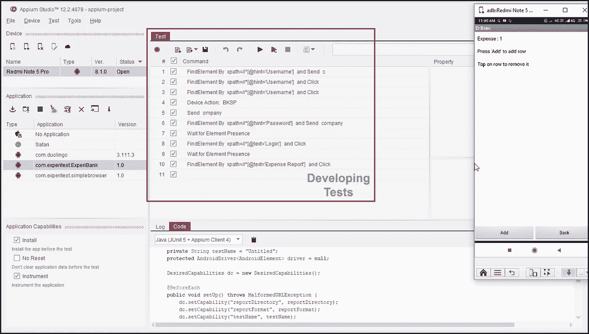

# Appium Studio 教程-安装和使用 Appium Studio 的完整指南

> 原文：<https://medium.com/edureka/appium-studio-tutorial-8a13ee9662d6?source=collection_archive---------0----------------------->

企业不断受到连接、人工智能和自动化的驱动。增加收入和改善客户体验已经成为企业的首要任务。移动和网络应用是这些战略目标的核心。有很多软件测试工具用于 web 和移动测试自动化。它们在功能、平台和使用条款方面有所不同。在这个 Appium Studio 教程中，我们将探索 app ium Studio——一个相当新的移动自动化测试工具。

让我们来看看本 Appium Studio 教程涵盖的主题:

*   Appium 工作室是什么？
*   使用 Appium 的挑战
*   Appium Studio 的功能
*   如何安装使用 Appium Studio？

# Appium Studio 是什么？

Appium Studio 是由 Experitest 创建的 IDE，旨在使用 Appium\Selenium WebDriver API 进行移动测试自动化开发和执行。

这是一个适用于 Android 和 iOS 的 Appium 的商业增强版，是一个适合大规模企业部署的开源工具。简而言之，它解决了 Appium 测试中存在的核心挑战。此外，帮助组织在更短的时间内发布高质量的移动应用。

# 使用 Appium 的挑战

Web 和移动应用程序是客户和企业相互交流的主要方式。移动测试自动化使公司能够通过网站和移动应用程序不断为客户创造新的体验。Appium 是一款流行的开源测试自动化工具，专为移动应用而构建。然而，它也带来了一些挑战，例如:

*   在本地设置 Appium 可能是一个挑战
*   当应用程序需要与设备的摄像头、麦克风或 NFC 芯片交互时，它需要进行测试。Appium 通常不支持这些类型的测试。
*   Appium 不支持并行测试执行
*   Appium 用户通常需要花费大量时间将 Appium 软件连接到第三方报告系统。因此，大部分时间报告是不一致的，并且容易被破坏。

这就是 Appium Studio 的用武之地。它使 Appium 测试更好、更流畅。它减少了开发和执行基于 Appium 的移动测试自动化程序的工作量和成本。支持更快交付更高质量的移动应用。

# Appium Studio 的功能

为了应对我们之前讨论的挑战，Appium 开源的增强版本 Appium Studio 应运而生。Appium Studio 的功能分为两大类:

*   第一个是可视化测试开发工具，它为用户提供了测试记录器、设备反射和 object spy 等特性。
*   接下来是 Appium 执行引擎，是专门为移动设计的。该引擎支持测试执行、应用外测试和并行执行。

这种功能组合有助于 Appium Studio 解决 Appium 的许多限制。

***Appium Studio 的最佳特色包括:***

## **快速&轻松设置和编写脚本**

设置和安装 Appium 既复杂又耗时。然而，建立 Appium 工作室非常容易。事实上，只需点击一下鼠标就可以安装。

## **将本地自动化扩展到企业环境**

Core Appium 工具旨在少数设备上进行本地测试。另一方面，Appium Studio 上的项目可以扩展到包括成百上千的设备和测试。

## **增加对海上团队至关重要的远程能力**

在 Appium Studio 中，测试开发人员可以连接到 SeeTestCloud，并随时随地进行测试。SeeTestCloud 提供了对新发布的设备和操作系统版本的访问，包括操作系统测试版。

## **功能增强**

Appium Studio 使自动化应用程序本身以外的测试成为可能。使用核心的 Appium 自动化是不可能的。例如，假设您有一个涉及发送确认短信的验证过程。有了 Appium，您必须手动提取验证码，但是有了 Appium Studio，您可以自动化这个过程。

## **完全可定制的报告**

Appium Studio 包括一个完全可定制的报告工具。这样，分析测试结果就变得简单多了。

在 Appium Studio 教程的剩余部分，我们将了解如何安装和设置它，以便您可以开始您的移动测试自动化。

# 如何安装和使用 Appium Studio？

Appium Studio 有两种型号:

1.  **Appium Studio** —这是一个可与您现有测试环境集成的免费下载工具。您可以使用通过 USB 电缆连接到您的计算机的真实本地设备来开发 Appium 测试。
2.  **Appium Studio for Eclipse**——这是一个可免费下载的 Eclipse 插件，您可以使用它直接从 Eclipse 在真实的移动设备上开发、执行和调试 app ium 测试。您甚至可以从 SeeTestCloud 访问最新版本的设备进行测试。

在本文中，我们将了解如何安装 Appium Studio，以便您可以将其与您的测试环境集成。首先，让我们看看先决条件和系统要求。

## 最低硬件要求:

*   英特尔 i5 或 i7 处理器
*   1 GB 可用硬盘空间
*   8 GB 内存
*   1 个可用的 USB 2.0 端口和 USB 电缆

## Windows 操作系统和软件要求:

*   微软视窗 Vista (64 位)、视窗 7 (64 位)、视窗 8 或更高版本
*   。Net Framework 3.5 或更高版本

# 安装和使用 Appium Studio

**第 1 步:**安装&设置

以下是从 Experitest 的文档中获取的关于如何安装和设置 Appium Studio 的截图。

所以，就这么简单。它预先打包了所有必需的工具和依赖项。即使在干净的机器上，您也不必安装任何额外的组件。

**第二步:**使用可视化界面

视觉界面提供即时的视觉反馈。这样，您可以跟踪您正在做的事情，并且可以立即识别错误。Appium Studio 可视界面中的主要区域是设备管理器、应用程序管理器、测试区域、日志/代码区域、设备反射和对象窥探。

**第三步:**连接设备

您可以使用 Appium Studio 在本地连接的设备上工作，也可以使用 Experitest 移动设备云中的一系列远程设备工作:参见测试数字保证实验室。使用 Appium Studio 提供的设置连接到设备并配置详细信息。

**第四步:**使用设备反射

成功连接到设备会打开完全可控的设备反射。你可以执行一些操作，比如点击屏幕访问系统和第三方应用，使用滑动和手势等等。通过设备反射，您还可以访问重要的测试和测试开发工具，如 object spy、设备日志等。

**第五步:**安装&打开应用程序

下一步是安装或上传您想要在本地或云上测试的应用程序。您可以使用应用程序管理器管理所有与应用程序相关的功能，如安装、启动、检测、清除数据、卸载、签名和语言文件管理。

打开应用程序时，Appium Studio 会自动识别所需的功能并填充功能区域。根据您想要自动化的测试场景，您可以选择或者取消选择这些功能。

步骤 6: 开发和执行测试

在设备反射和其他工具的帮助下，在 Appium Studio 中编写测试脚本变得非常容易。测试可以通过记录器或名为 Object Spy 的工具来创建。这两者都可以用于本机、web 和第三方应用程序。

您可以在 Appium Studio 中执行带有或不带有测试功能的测试，或者只运行特定的命令。您实际上可以看到在设备反射上执行的测试。

这就是在移动设备上成功执行测试的标准流程。移动应用测试相当重要。在生产过程中，应用程序中的一个简单的错误会给产品所有者带来巨大的经济损失，它的错误本质甚至会恶化用户体验。这就把我们带到了本 Appium Studio 教程的结尾。我希望你发现它信息丰富，并有助于增加你的知识价值。

如果你想查看更多关于 Python、DevOps、Ethical Hacking 等市场最热门技术的文章，你可以参考 Edureka 的官方网站。

请留意本系列中的其他文章，它们将解释软件测试的各个方面。

> 1.[移动应用测试](/edureka/mobile-application-testing-51140ebe4a87)
> 
> 2.[软件测试工具](/edureka/software-testing-tools-ebd9ebac6f29)
> 
> 3.[软件测试的类型](/edureka/types-of-software-testing-d7aa29090b5b)
> 
> 4. [JMeter 教程](/edureka/jmeter-tutorial-774856163ee9)
> 
> 5.[使用 JMeter 进行负载测试](/edureka/load-testing-using-jmeter-3da837c11a02)
> 
> 6.[什么是功能测试？](/edureka/what-is-functional-testing-complete-guide-to-automation-tools-183e42ad517a)
> 
> 7.[自动化测试教程](/edureka/automation-testing-tutorial-157d269e60db)
> 
> 8.[功能测试与非功能测试](/edureka/functional-testing-vs-non-functional-testing-a08bc732fbdd)
> 
> 9. [JMeter vs LoadRunner](/edureka/jmeter-vs-loadrunner-c1ab63acd935)
> 
> 10.[回归测试](/edureka/regression-testing-b913b7064824)
> 
> 11.[性能测试生命周期](/edureka/performance-testing-life-cycle-d4242d39a5aa)
> 
> 12. [JMeter 插件](/edureka/jmeter-plugins-1bceec7f6226)
> 
> 13. [Appium 建筑](/edureka/appium-architecture-505f70bf3484)
> 
> 14.[如何在网站上使用 JMeter 进行压力测试？](/edureka/stress-testing-using-jmeter-e6b3c64299d0)

*原载于 2019 年 3 月 6 日 www.edureka.co***。**