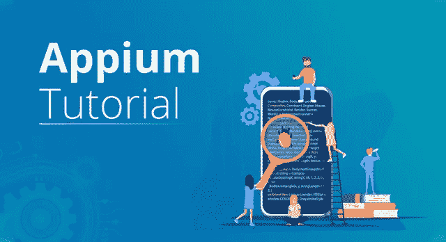
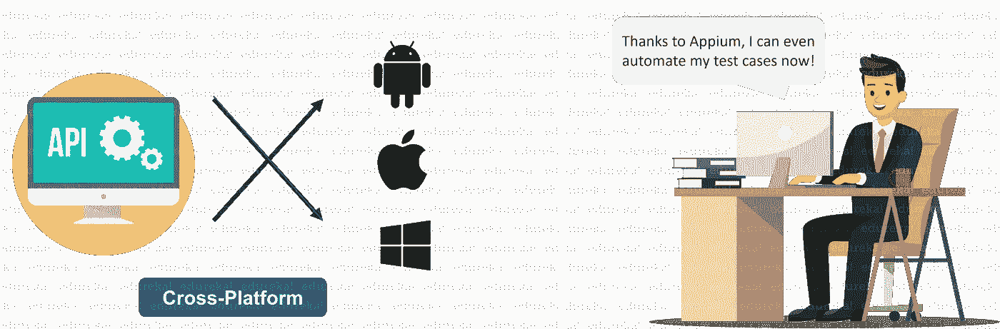
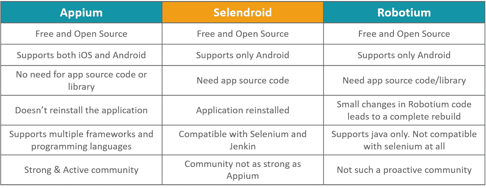
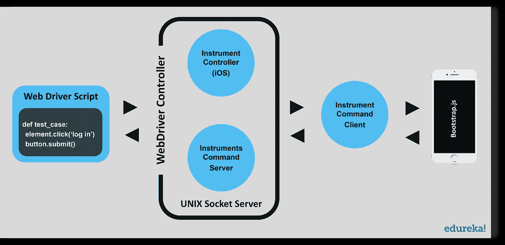
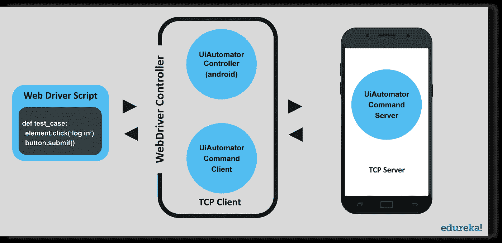
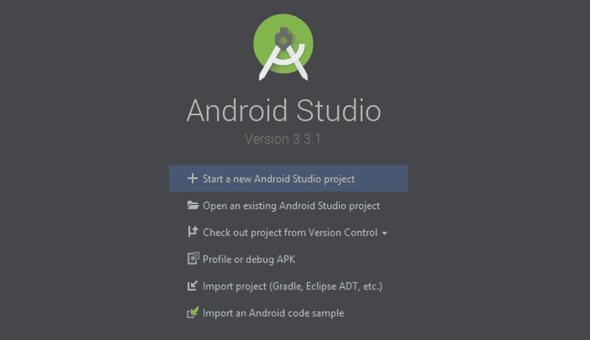
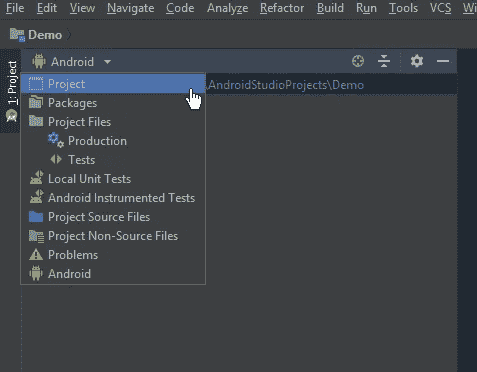
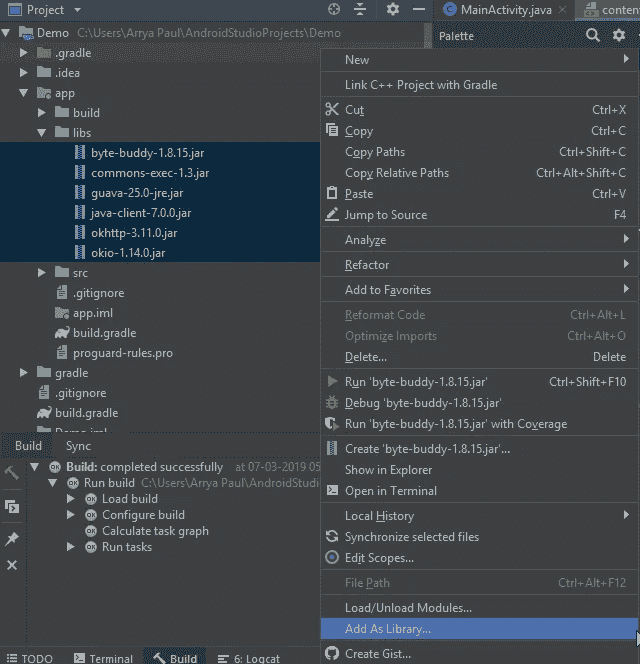
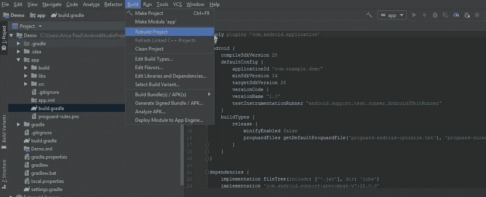

# Appium 教程——安装和使用 Appium 的完整指南

> 原文：<https://medium.com/edureka/appium-tutorial-28e604aebeb?source=collection_archive---------0----------------------->

自动化是新的爵士乐。一系列事情实现了自动化，包括电子邮件、谷歌表单、网络抓取甚至软件测试。在这个 Appium 教程中，我将写一篇关于 Appium 的文章，app ium 是一个在移动应用测试自动化测试行业中很受欢迎的工具，原因有很多。以下是本应用教程中讨论的主题:

*   什么是 Appium？
*   应用哲学
*   移动应用的类型
*   Appium vs Selendroid vs Robotium
*   建筑应用
*   使用 Android Studio 安装 Appium

让我们从工具本身的快速介绍开始我们的 Appium 教程。

# 什么是 Appium？

Appium 是一个开源的、跨平台的自动化测试工具。它用于自动化本地、混合和 web 应用程序的测试用例。该工具主要关注 Android 和 iOS 应用程序，并且仅限于移动应用程序测试领域。最近，几个更新回来，Appium 还宣布，他们将支持 windows 桌面应用程序的测试。

Appium 由 sauce labs 开发和维护。目前，Appium 版本 1.10 正在分发。Appium 最初是一个基于命令行的测试服务，可以使用 node.js 安装。在他们最新的版本中，名为“Appium desktop ”,他们发布了一个强大而精致的工具，具有直观的图形用户界面。Appium desktop 附带了一个应用程序元素检查器，我们将在本 Appium 教程的后面进行介绍。

# 应用哲学

Appium 是移动测试自动化领域的一颗新星。当谈到移动测试自动化时，在许多方面，业界仍然在寻找最佳的方法。有了 Appium，他们从早期的自动化解决方案中吸取了教训，这些解决方案并没有像他们希望的那样好。Appium 的四点哲学很好地总结了其中的一些经验:

1.  你不应该为了自动化而重新编译或者以任何方式修改你的应用程序。
2.  您不应该局限于特定的语言或框架来编写和运行您的测试。
3.  当谈到自动化 API 时，移动自动化框架不应该重新发明轮子。
4.  一个移动自动化框架应该是开源的，无论是在精神上还是实践上，无论是在名义上！

# 移动应用的类型

正如第一段所讨论的，你一定已经意识到 Appium 有能力处理各种各样的应用。让我们了解不同类型的应用程序。

## 本机应用程序

牢记某个平台而开发的应用程序被称为本机应用程序。本地应用程序是使用特定的软件开发工具包开发的，并且倾向于关注性能。如果开发预算不成问题，本地应用通常是一个不错的选择。本地应用的一些优势如下

*   完美的表现
*   他们通常看起来精致优雅
*   本地应用与设备硬件无缝集成
*   大多数本地应用程序都有一个直观的用户界面/UX

本地应用的一些例子包括 Spotify、Snapchat、Pinterest、Skype。

## 网络应用

在原生应用程序的概念出现之前，这类应用程序曾经非常有名。Web 应用顾名思义，运行在浏览器上。由于它们运行在浏览器上，它们通常不需要任何复杂的安装，从预算角度来看，开发过程也很便宜。由于应用程序不是为特定的平台开发的，所以像 HTML/CSS/JavaScript 这样的基于 web 的开发语言被用于它们的开发。

以下是网络应用的优势列表

*   降低开发成本
*   更易于维护
*   网络应用不需要得到应用市场的批准
*   没有安装或用户更新

成功的 web 应用程序包括 Ali Express、Flipkart Lite 和 Washington Post。

## 混合应用

混合应用程序融合了本地应用程序和 web 应用程序的优点。虽然这些应用程序可以从 play store 下载，并且还可以访问设备的所有功能；它们实际上是内部的 web 应用程序。它们是使用简单的 web 开发语言如 HTML 和 CSS 开发的。这使得它们可以在任何平台上运行。

以下是混合应用的优势列表——

*   他们只需要管理一个代码库
*   应用程序开发不需要太长时间
*   易于扩展到另一个平台
*   像本地应用程序一样访问完整的设备功能

混合应用的一些例子是 OLA、Basecamp、Instagram、Yelp 等

# Appium vs Selendroid vs Robotium

现在，让我们在本文中讨论 Appium 的架构和设计。

# 建筑应用

Appium 是一个用 node.js 编写的 HTTP 服务器，它为 iOS 和 Android 等不同平台创建和处理多个 WebDriver 会话。Appium 在设备上启动一个“测试用例”,生成一个服务器并监听来自主 Appium 服务器的代理命令。测试人员编写测试脚本，通过将它们作为请求发送到 Appium 服务器，在设备或仿真器上执行。像 iOS 和 Android 这样的每个供应商都有不同的方式和机制在设备上运行测试用例。所以 Appium 入侵它，在监听来自 Appium 服务器的命令后运行这个测试用例。

## **app ium 在 iOS 中的工作方式:**

在 iOS 上，Appium 将命令代理给在 Mac Instruments 环境中运行的 UIAutomation 脚本。苹果提供了一个名为“instruments”的应用程序，用于执行许多活动，如分析、控制和构建 iOS 应用程序，但它也有一个自动化组件，我们可以在使用 UIAutomation APIs 与应用程序 UI 交互的 [JavaScript](https://www.edureka.co/blog/top-10-javascript-frameworks?utm_source=medium&utm_medium=content-link&utm_campaign=appium-tutorial) 中编写一些命令。Appium 利用这些相同的库来自动化 iOS 应用程序。

在上图中，我们可以看到 iOS 自动化环境中 Appium 的架构。如果我们谈论一个命令生命周期，它是这样的，Selenium web driver 从代码中选择一个命令，并通过 HTTP 请求以 JSON 的形式发送给 Appium 服务器。Appium 服务器了解 iOS 和 Android 等自动化环境，并将该命令发送到仪器命令服务器，该服务器将等待仪器命令客户端(以 node.js 编写)来获取该命令，并在 iOS 仪器环境中的 bootstrap.js 中执行该命令。一旦命令被执行，命令客户端将消息发送回 Appium 服务器，appi um 服务器在其控制台中记录与命令相关的所有内容。这个循环一直持续到所有命令都被执行。

## **app ium 如何在 Android 中工作:**

Android 的情况也差不多，Appium 代理设备上运行的 UIAutomator 测试用例的命令。UIAutomator 是 Android 的原生 UI 自动化框架，支持从命令行直接在设备中运行 JUnit 测试用例。它使用 Java 作为编程语言，但 Appium 将使它可以在任何 WebDriver 支持的语言上运行。

在上面的图表中我们可以看到，这里我们用 bootstrap.jar 代替了 bootstrap.js，它代表了我们用 Java 编译时的测试用例。一旦启动，它就会产生一个 TCP 服务器。在这里，TCP 服务器位于设备内部，客户端位于 Appium 进程中，这与 iOS 中的方式正好相反。

# 使用 Android Studio 安装 Appium

没有安装指南,*应用教程*是不完整的。下面是如何使用 android studio 安装 Appium 的方法。

1.  下载以下内容-

*   [安卓工作室](http://developer.android.com/sdk/installing/index.html)
*   【Java 的 Appium Jar 文件
*   [最新 Appium 客户端库](http://docs.seleniumhq.org/download/)
*   [应用服务器](https://appium.io/)
*   [Java](http://www.oracle.com/technetwork/java/javase/downloads/index.html)

2.在你的系统上安装 Java。不要忘记设置环境变量！

3.通过运行安装程序在您的系统上安装 Android Studio，然后创建一个新项目。

4.提取客户端库。将它们与 Appium jar 文件一起单独保存在一个文件中。

5.切换到 Android studio 中的项目视图。

6.现在选择您在步骤 4 中提取的文件，并放入 app 目录下的 lib 文件夹中。然后将它们全部选中并添加为库。

7.一旦你将文件添加为一个库，你应该会在 app 文件夹中看到一个 *build.gradle* 文件。双击它，然后重新构建您的项目。一旦项目重建成功，这意味着你已经在你的 Android studio 系统上安装了 Appium。

这就把我们带到了本 Appium 教程的结尾。如果你想查看更多关于 Python、DevOps、Ethical Hacking 等市场最热门技术的文章，那么你可以参考 [Edureka 的官方网站。](https://www.edureka.co/blog/?utm_source=medium&utm_medium=content-link&utm_campaign=appium-tutorial)

请留意本系列中的其他文章，它们将解释软件测试的各个方面。

> 1.[移动应用测试](/edureka/mobile-application-testing-51140ebe4a87)
> 
> 2.[软件测试工具](/edureka/software-testing-tools-ebd9ebac6f29)
> 
> 3.[软件测试的类型](/edureka/types-of-software-testing-d7aa29090b5b)
> 
> 4. [JMeter 教程](/edureka/jmeter-tutorial-774856163ee9)
> 
> 5.[使用 JMeter 进行负载测试](/edureka/load-testing-using-jmeter-3da837c11a02)
> 
> 6.[什么是功能测试？](/edureka/what-is-functional-testing-complete-guide-to-automation-tools-183e42ad517a)
> 
> 7.[自动化测试教程](/edureka/automation-testing-tutorial-157d269e60db)
> 
> 8.[功能测试与非功能测试](/edureka/functional-testing-vs-non-functional-testing-a08bc732fbdd)
> 
> 9. [JMeter vs LoadRunner](/edureka/jmeter-vs-loadrunner-c1ab63acd935)
> 
> 10.[回归测试](/edureka/regression-testing-b913b7064824)
> 
> 11.[性能测试生命周期](/edureka/performance-testing-life-cycle-d4242d39a5aa)
> 
> 12. [JMeter 插件](/edureka/jmeter-plugins-1bceec7f6226)
> 
> 13. [Appium 架构](/edureka/appium-architecture-505f70bf3484)
> 
> 14.[如何在网站上使用 JMeter 进行压力测试？](/edureka/stress-testing-using-jmeter-e6b3c64299d0)

*原载于 2019 年 3 月 8 日*[*【www.edureka.co*](https://www.edureka.co/blog/appium-tutorial/)*。*