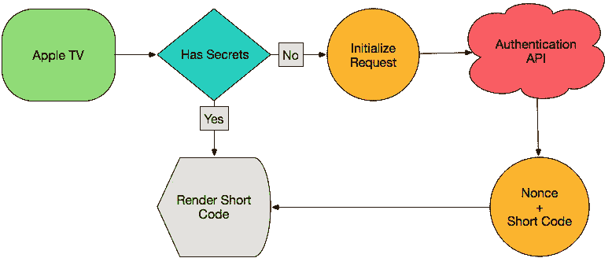
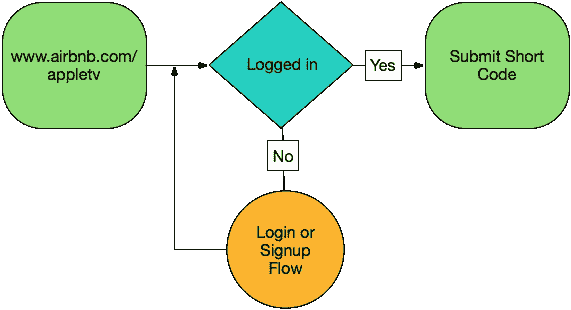

# Apple TV 鉴定

> 原文：<https://medium.com/airbnb-engineering/apple-tv-authentication-a156937ea211?source=collection_archive---------1----------------------->

由内森·巴克斯特 & [迈克尔·巴赫德](https://twitter.com/michaelbachand)

**更新:**2020 年 3 月 3 日 Airbnb 日落版 Airbnb Apple TV app。

新款苹果电视为开发者和消费者打开了一个充满可能性的世界。但是，当涉及到文本输入时，它仍然有许多不足之处。因此，当我们开始为 Apple TV 设计 Airbnb 时，很明显，要求一个人输入他们的电子邮件地址和密码不是我们想要提供的令人愉快的体验。此外，Airbnb 允许用户通过脸书和谷歌等第三方服务进行身份认证。因此，尽管在 tvOS 9.2 中输入用户名和密码比语音输入更容易，但这种策略只能解决我们用户群的一部分。

当有人已经安装了 Airbnb 移动应用程序时，有一些聪明的方法可以让我们无需任何输入就可以实现身份验证(参见[凭证](https://github.com/rsattar/Voucher)，它有助于在兄弟 iOS 应用程序存在的情况下进行“无钥匙”身份验证)。然而，由于我们不能指望我们所有的 Apple TV 用户手边都有 Airbnb 移动应用程序(更不用说最新版本了)，我们决定首先需要设计一个通用的认证策略，适用于任何 Airbnb 用户。通过建立这一坚实的基础，我们将能够投资于额外的身份认证策略，为我们特定的用户群子集提供更无缝的体验。

# **概述**

当一个人想要登录 Airbnb Apple TV 应用程序时，该应用程序会向他们提供一个短代码，他们可以在 www.airbnb.com/appletv[的浏览器中输入该代码。一旦输入了代码，Airbnb 应用程序就能够从我们的 API 中检索一个认证令牌，它可以使用该令牌来进行后续的 API 请求。](http://www.airbnb.com/appletv)

这种身份验证策略可以分为三个阶段。首先，Apple TV 应用程序初始化一个认证请求，并由服务器提供秘密。接下来，这个人会看到这个简单的秘密，并使用它通过一个经过身份验证的 web 会话来批准请求。最后，Apple TV 应用程序将其秘密交换为可用于未来请求的授权令牌。我将详细介绍每个阶段，包括一个简单的基于 Sinatra 的实现的代码示例。

# 第一阶段

我们的第一阶段负责初始化我们的认证尝试。我们从对客户的零信任开始。该应用程序向我们的身份验证 API 发出请求，请求新的身份验证代码。它接收回新生成的随机数和短代码。

现时是这里真正的秘密；它可以被认为是一个密码。为此，使用密码安全的伪随机数发生器( [CSPRNG](https://en.wikipedia.org/wiki/Cryptographically_secure_pseudorandom_number_generator) )至关重要。许多普通的 RNG 容易受到攻击[【PDF】](https://media.blackhat.com/bh-us-12/Briefings/Argyros/BH_US_12_Argyros_PRNG_WP.pdf)，如果 RNG 受到威胁，整个系统的安全性就会崩溃。为此，我们利用了 Ruby 标准库中的 **SecureRandom.uuid** 。

对于短代码，我们优先考虑易用性。我们的字符集是大写字母数字，去掉了任何容易混淆的符号。这给我们留下了总共 26 个字符。六个字符的短码则有 26⁶，或 308915776，可能的值。因为这些代码有几秒到几分钟的生命周期，即使被猜到也不会提供任何直接的帐户接管途径，这为我们的目的提供了足够的随机性。同样，我们使用 **SecureRandom** 作为我们的数字生成器，以防范可预测的随机数。

在服务器端，我们使用一个过期的数据存储(特别是 Redis)来存储与身份验证尝试相关的数据。我们的数据由短代码加密，有效载荷只包含一个使用 bcrypt 生成的 nonce 散列。避免存储明文机密非常重要，这样，如果数据存储遭到破坏，就不会自动破坏所有帐户。

# 第二阶段

我们的第二阶段身份验证负责将身份验证尝试与活动帐户关联起来。阶段 1 中生成的短代码显示给用户，并提示他们转到激活 URL([www.airbnb.com/appletv](http://www.airbnb.com/appletv))以完成该过程。

基于 web 的激活页面需要经过身份验证的会话，以便将短代码链接到帐户。如果此人未登录，他们将被推至登录或注册流程。他们通过身份验证后，将返回到激活页面。激活页面包含一个提示输入短代码的简单表单。提交后，会显示一条成功消息，用户交互完成。

在这个系统中，短代码相当于用户名。在服务器上，我们在 Redis 中查找存储的短代码，并更新有效负载以包含用户的 ID，从而建立到帐户的链接。只有已经建立可信身份的客户端才能访问该端点，因此我们可以有效地对其应用速率限制，以防止滥用猜测短代码的尝试。

# 第 3 阶段

Apple TV 应用程序在阶段 1 中接收到秘密后，它开始轮询服务器以查看它们是否已被授权。每个轮询请求包括短码和随机数。轮询频率由服务器提供，以便在必要时可以调节负载。每个轮询请求都用于刷新生成的身份验证令牌的生命周期。因为服务器控制轮询间隔和密钥过期时间，所以它可以确保过期时间足够长，以防止在用户仍然参与该过程时超时。

在服务器上，每个请求都会导致在 Redis 中查找短代码。如果随机数的散列与有效载荷中的值匹配，那么我们检查相关联的 ID。

如果没有 ID，则重置到期时间，并且不会发生任何其他事情。如果我们找到一个 ID，那么我们从 Redis 中删除短代码，并为相关用户生成一个会话。此时，此人已经成功登录。Apple TV 现在可以像任何其他经过认证的客户端一样与我们的 API 进行交互。

在 Airbnb，我们的目标是设计令人惊喜的软件。构建一个不需要输入密码的登录流是我们试图避开的一个小方法，让您可以继续前进。这也是我们可以与面临这一共同挑战的其他人分享的东西。在[https://github.com/airbnb/apple-tv-auth](https://github.com/airbnb/apple-tv-auth)查看此工作流的示例实现。

## 在 [airbnb.io](http://airbnb.io) 查看我们所有的开源项目，并在 Twitter 上关注我们:[@ Airbnb eng](https://twitter.com/AirbnbEng)+[@ Airbnb data](https://twitter.com/AirbnbData)