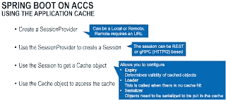

# 应用程序容器云服务(ACCS):使用 Spring Boot 应用程序的应用程序缓存

> 原文：<https://medium.com/oracledevs/application-container-cloud-service-accs-using-the-application-cache-from-a-spring-boot-6d3ec795b9e3?source=collection_archive---------0----------------------->

[Spring Boot](https://technology.amis.nl/2018/01/24/getting-started-with-spring-boot-microservices-why-and-how/) 让你快速开发微服务。应用程序容器云服务(ACCS)允许您轻松托管 Spring Boot 应用程序。 [Oracle 提供了基于 Coherence 的应用缓存](https://blogs.oracle.com/developers/caching-with-oracle-application-container-cloud)，您可以从部署到 ACCS 的应用中使用。为了使用来自 Spring Boot 的应用程序缓存，Oracle 为 T4 提供了一个开源的 Java SDK T5。在这篇博文中，我将给出一个例子，说明如何通过这个 SDK 使用 Spring Boot 的应用程序缓存。你可以在这里找到示例代码。

# 使用应用程序缓存 Java SDK

**创建应用缓存**

您可以使用 web 界面轻松创建应用程序缓存的新实例。一个实例可以包含多个缓存。一个应用程序可以使用多个缓存，但只能使用一个缓存实例。多个应用程序可以使用相同的缓存实例和缓存。请注意，应用程序和应用程序缓存部署在同一个区域，以便实现连接。另外，不要在缓存名称中使用“-”字符，因为 LBaaS 配置将会失败。

使用 Java SDK Spring Boot 应用程序通常使用定义抽象层的架构。外部资源通过控制器公开。控制器使用服务。这些服务提供执行特定任务的操作。服务使用存储库作为它们的连接/数据访问对象。实体是 POJO，例如作为控制器中的 REST 进行交换/持久化和公开。为了连接到缓存，存储库似乎是一个不错的位置。使用哪个存储库(像数据库或应用程序缓存存储库这样的持久后端)可以由服务来处理。每个操作都可能不同。例如，Get 操作可能会直接使用缓存存储库(如果它找不到自己的数据，可以使用其他来源)，而您可能希望在持久后端和缓存中都执行 Put 操作。参见[中的示例](https://github.com/MaartenSmeets/springboot/blob/master/accs-cache-sample/src/main/java/nl/amis/smeetsm/springboot/person/PersonService.java)。

为了访问缓存，首先需要建立一个会话。会话可以从会话提供者处获得。会话提供者可以是本地会话提供者或远程会话提供者。本地会话提供程序可用于本地开发。它可以用指示高速缓存中项目的有效期的期满来创建。当开发/测试时，你可以试着将它设置为“永不过期”,否则你可能找不到你想要的条目。我没有进一步研究这个问题，也没有为它创建服务请求。我也不知道这是否只是本地会话提供者的问题。样本代码[见此](https://github.com/MaartenSmeets/springboot/blob/master/accs-cache-sample/src/main/java/nl/amis/smeetsm/springboot/person/PersonCacheRepositoryImpl.java)或[见此](https://github.com/abhirockzz/app-container-cloud-cache-example/blob/master/src/main/java/com/oracle/cloud/acc/cache/dcs/CacheREST.java)。

创建会话时，您还需要指定要使用的协议。当使用 Java SDK 时，你可以(目前)从和 [REST](https://en.wikipedia.org/wiki/Representational_state_transfer) 中选择。例如，在 Node.js 代码中没有 SDK 的情况下，GRPC 可能更难实现，但是我没有尝试过。我没有比较这两种协议的性能。另一个区别是应用程序使用不同的端口和 URL 连接到缓存。你可以在这里看到如何从 ACCS 环境变量[中确定正确的 URL /协议。](https://github.com/abhirockzz/app-container-cloud-cache-example/blob/master/src/main/java/com/oracle/cloud/acc/cache/dcs/CacheREST.java)

ACCS 应用程序缓存 Java SDK 允许您在创建缓存对象时添加加载程序和序列化程序类。当在缓存中找不到值时，将调用 Loader 类。这允许您获取不在缓存中的对象。序列化程序是必需的，因此对象可以通过 REST 或 GRPC 进行传输。你可以做如下的事情。

**注射**

请注意，在使用 Spring Boot 时，您不希望通过直接执行以下操作来创建对象的实例:Class bla = new Class()。您希望让 Spring 通过使用@Autowired 注释来处理这个问题。

但是请注意，在实例的构造函数执行之后，@Autowired 注释会将实例分配给变量。如果希望在构造函数之后、执行其他方法之前使用@Autowired 变量，应该将它们放在@PostConstruct 注释方法中。参见[这里的](https://technology.amis.nl/2018/02/22/java-how-to-fix-spring-autowired-annotation-not-working-issues/)。具体实现样本[见此](https://github.com/MaartenSmeets/springboot/blob/master/accs-cache-sample/src/main/java/nl/amis/smeetsm/springboot/person/PersonCacheRepositoryImpl.java)。

**连通性**

应用程序缓存可以在特定时间重启(例如修补、扩展等维护)，并且可能会由于其他原因出现连接问题。为了解决这个问题，一个好的做法是通过实现重试来使连接处理更加健壮。例如，参见此处的。

# 将 Spring Boot 应用程序部署到 ACCS

**创建可部署的**

为了将应用程序部署到 ACCS，您需要创建一个特定格式的 ZIP 文件。在这个 ZIP 文件中，至少应该有一个 manifest.json 文件，它描述了如何启动应用程序。这里可以阅读更多[。如果您有特定于环境的属性、绑定信息(比如使用哪个缓存)和环境变量，那么您可以创建一个 deployment.json 文件。除了这些元数据文件，当然还需要应用程序本身。对于 Spring Boot，这是一个包含所有依赖项的大 JAR 文件。你可以用 spring-boot-maven-plugin 创建这个文件。ZIP 本身最容易用 maven-assembly-plugin 编写。](https://docs.oracle.com/en/cloud/paas/app-container-cloud/dvcjv/creating-meta-data-files.html)

**部署到 ACCS**

有两种主要的方法(除了直接使用 API，比如 CURL)可以部署到 ACCS。可以手动完成，也可以使用开发者云服务。这里的描述了开发者云服务的流程[。这更快(例如，允许在 Git 提交时重新部署)并且更灵活。下面全面描述了手动程序。需要记住的一件重要事情是，如果您多次以相同的名称部署相同的应用程序，您可能会遇到应用程序没有被新版本替换的问题。在这种情况下，你可以做两件事。每次都用不同的名字部署。但是，应用程序的名称反映在 URL 中，这可能会给应用程序的用户带来问题。另一种方法是在重新部署之前从存储云服务中删除文件，这样您就可以确保可部署的是 ACCS 的最新版本。](http://www.oracle.com/webfolder/technetwork/tutorials/obe/cloud/apaas/deploy-app-dcs/deploy-app-dcs.html)

**手动**

创建新的 Java SE 应用程序。

上传之前创建的 ZIP 文件

# 参考

Oracle 云应用缓存客户端 Java SDK 简介

*   [https://blogs . Oracle . com/developers/introducing-application-cache-client-Java-SDK-for-Oracle-cloud](https://blogs.oracle.com/developers/introducing-application-cache-client-java-sdk-for-oracle-cloud)

使用 Oracle 应用容器云进行缓存

*   [https://blogs . Oracle . com/developers/caching-with-Oracle-application-container-cloud](https://blogs.oracle.com/developers/caching-with-oracle-application-container-cloud)

使用应用程序缓存在 ACCS 上完成工作示例 Spring Boot(一旦解决服务请求)

*   [https://github . com/MaartenSmeets/spring boot/tree/master/accs-cache-sample](https://github.com/MaartenSmeets/springboot/tree/master/accs-cache-sample)

使用应用程序缓存 Java SDK 的示例。申请是基于球衣

*   [https://github . com/abhirockzz/app-container-cloud-cache-example](https://github.com/abhirockzz/app-container-cloud-cache-example)

*原载于 2018 年 3 月 14 日*[*javaoraclesoa.blogspot.com*](http://javaoraclesoa.blogspot.nl/2018/03/application-container-cloud-service.html)*。*