# 通过 OneOps 在 OpenStack 上部署应用

> 原文：<https://medium.com/walmartglobaltech/application-deployment-on-openstack-via-oneops-9c08e561530b?source=collection_archive---------4----------------------->

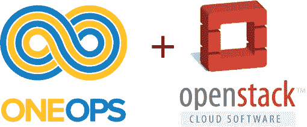

[**OneOps**](http://www.oneops.com/) 是一个面向 [DevOps](https://en.wikipedia.org/wiki/DevOps) 的多云和开源编排平台，具有以下主要优势:

*   **DevOps 编排**:集成流行的开源或免费 DevOps 工具，并在一个漂亮的 web UI 上编排它们。
*   **模型驱动的应用程序模板**:一旦创建了一个模板，就可以无限制地重用和部署“最佳实践”。
*   **云不可知**:支持在主要公共云和私有云上部署
*   **卓越运营**:*自动驾驶*应用程序-扩展、修复甚至替换不健康的实例。还与 web UI 上的监控和警报功能完全集成。**
*   **推广 DevOps 文化:将开发人员、质量保证人员和运营人员聚集在一起，加速产品交付，降低运营成本。**

**[**OpenStack**](http://www.openstack.org) 是一个开源软件云计算平台，主要用于部署类似亚马逊 Web Service (AWS)的基础设施即服务(IaaS)解决方案，已经成为业界构建私有云事实上的*标准。***

**OneOps 可以在主要的公共云提供商、私有云(如 OpenStack)甚至裸机上部署和管理应用程序。在本文中，我们将看到如何通过 OneOps 在 OpenStack 上部署一个简单的数据库应用程序( [MySQL](https://www.mysql.com/) )。**

**由于本文将用作 POC(“概念验证”)或演示目的，因此我将使用 100%“免费”、公开的兼容解决方案。**

*   **[**TryStack**](http://trystack.org/) 作为 OpenStack 的提供者，因为这是试用 OpenStack 最简单免费的方式。**
*   **OneOps(全合一流浪汉)，唯一的要求就是下载 [VirtualBox](https://www.virtualbox.org/wiki/Downloads) 和[流浪汉](https://www.vagrantup.com/downloads.html)。**

**在 Trystack.org 已经有很多关于建立 OpenStack 的文章，我发现[这篇](https://edwardsamuel.wordpress.com/2014/10/25/tutorial-creating-openstack-instance-in-trystack/)非常简洁明了。**

**只有两件事值得注意:**

*   **务必填写专用网络的 DNS(8.8.8.8 ),否则 OpenStack VM 无法解析所有域名。**
*   **分配一个浮动 IP(但此时不需要与计算实例相关联)**

**[这里](https://github.com/oneops/setup)提供了安装 OneOps 的步骤，如下:**

```
**git clone [https://github.com/oneops/setup](https://github.com/oneops/setup) 
cd setup/vagrant-centos7
vagrant up**
```

***流浪起来*将在本地虚拟机上创建一个 OneOps 的最小安装。接下来，我们可能希望 SSH 进入虚拟机，并在终端中跟踪 OneOps 部署日志。这样做的目的是:万一在应用程序部署期间出现错误，我们将知道发生了什么。**

```
**vagrant ssh 
sudo -s 
cd /opt/oneops/inductor 
inductor tail**
```

**打开本地网络浏览器，进入 [http://localhost:9090，](http://localhost:9090)注册一个新用户，创建一个“组织”。**

**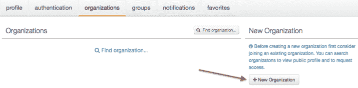**

**Add a new organization**

**然后创建新的云。**

**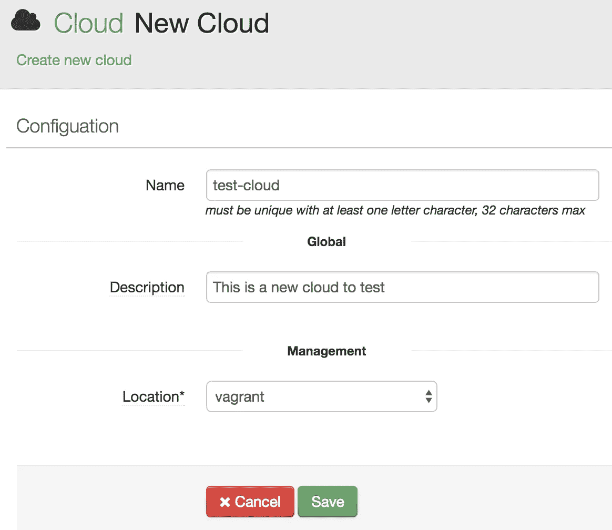**

**Create a new cloud**

**确保从“位置”下拉列表中选择“流浪者”。之后，我们将开始在新的云中添加一些必需的服务。**

**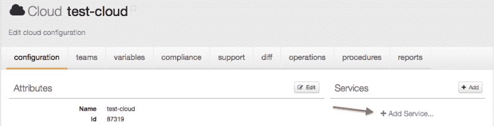**

**Add a service to the cloud**

## **计算服务**

**计算服务提供了计算的基础模块，如 CPU、内存、本地存储、网络等。因为我们计划使用 OpenStack(由[trystack.org](http://trystack.org/)提供)作为我们的计算主干，所以在“计算”类别下选择“nova (public/oneops)”。见下图示例。**

**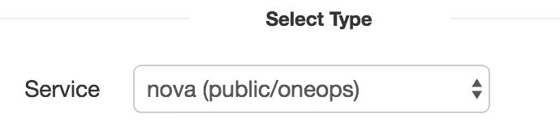**

**Choose “nova” as compute service**

**然后配置如下几个参数:**

****API 端点**:该值应该来自[Trystack.org](http://trystack.org/)。登录[Trystack.org](http://trystack.org/)，进入“计算”——>“访问&安全”——>“API 访问”，找到“身份”的值，复制&粘贴然后追加“/令牌”。因此，API 端点将看起来像“[http://8.43.86.2:5000/v2.0/tokens](http://8.43.86.2:5000/v2.0/tokens)”**

**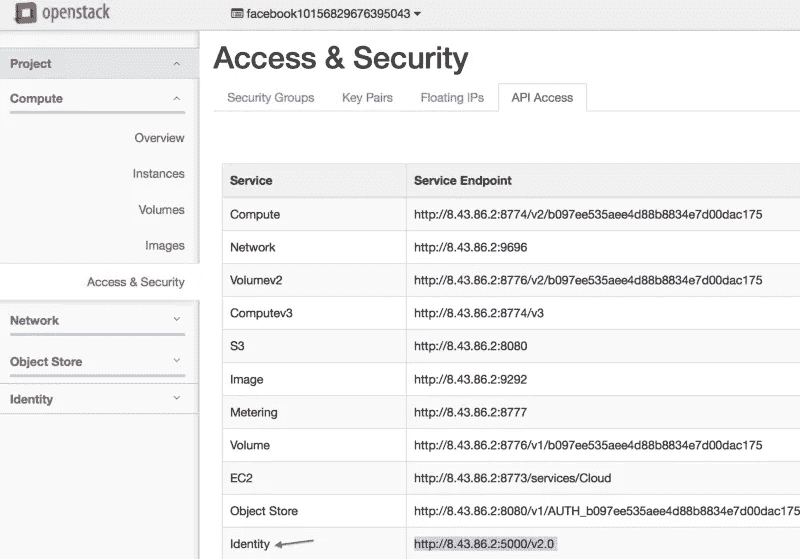**

**Get API Endpoint from Trystack.org**

****租户/用户名**:这些值是你的[Trystack.org](http://trystack.org/)用户名。例如，facebook10156829676395043**

****

**Get Tenant/Username**

****密码**:可以从您的【Trystack.org】账户设置[中获得。“设置”->“API 密码”- >“请求 API 密码”。显示密码后，您可能会自动注销，必须重新登录。](http://trystack.org/)**

**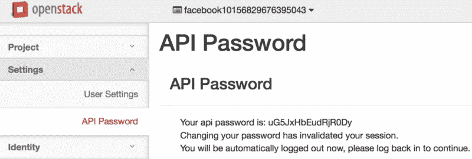**

**Get API Password from Trystack.org**

**整个“身份验证”部分将如下所示:**

**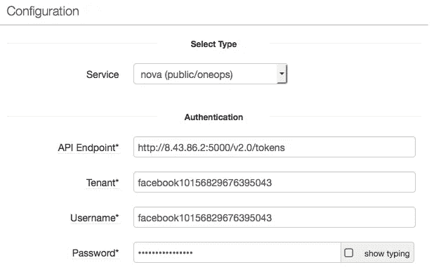**

**“Autentication” section**

**接下来我们将转到“位置”部分，我们只需要指定以下两项:**

*   **地区:“新星”**
*   **公网类型:选择“浮动”**

**“位置”部分可能类似于:**

**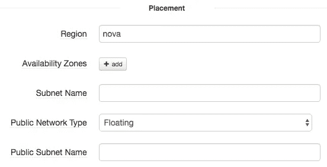**

**“Placement” Section**

**在“映射”部分，查找“图像映射”。在本演示中，我们将使用“centos-7.0”，并填写“centos-7.0”的映像 ID。图像 ID 可以在你登录后的 Trystack.org 上找到:“计算机”->“图像”。找到“CentOS7”然后点击。**

**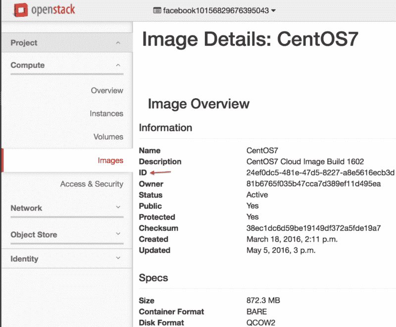**

**Get CentOS 7 Image ID**

**从 Trystack.org[复制 ID 值并粘贴到 OneOps:](http://trystack.org/)**

**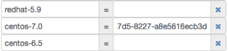**

**Input the image ID into OneOps**

**在“操作系统”部分，**

*   **操作系统类型:选择“CentOS 7.0”。**注**撰写本文时，OneOps 可能只支持 Ubuntu 14.04 和 CentOS 7.0。**
*   **初始用户名:“centos”。如果使用 Ubuntu 14.04，这个值应该是“Ubuntu”。**

**总体而言，它将如下所示:**

**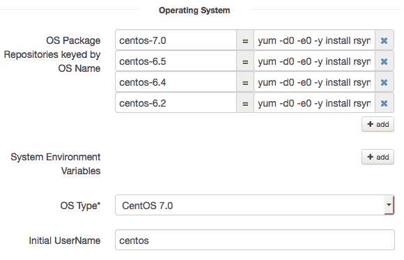**

**到目前为止，我们已经完成了**计算服务**。保存配置，让我们添加 DNS 和 GDNS 服务。**

## **DNS 服务**

**DNS 服务对于通过 OneOps 部署的大多数应用程序非常有用，因为(1)将基于 DNS 服务创建一个 FQDN，它将在 OneOps 管理的所有应用程序中唯一标识一个应用程序，(2) FQDN 可以有效地充当应用程序的一致“入口点”(DNS 负载平衡)，无论在 FQDN 后面添加、删除或替换了多少实例。用户只需要连接到 FQDN，请求将被路由到工作实例。FQDN 的一个很好的例子是“www.google.com”。**

**要向 OneOps 添加 DNS 服务，我们需要首先找到(1)域名和(2)DNS 提供商。**

****域名**:有很多网站提供免费域名。你可以选择你喜欢的，但是在这里我将选择[http://www.freenom.com](http://www.freenom.com)并且以下步骤基于它:**

**创建新域(如 oneops-demo.ml)后，单击“管理域”->“管理工具”->“名称服务器”->“使用自定义名称服务器(在下面输入)”。为此域输入两个名称服务器。在这里，我们将使用 Rackspace 名称服务器如下，我会解释为什么。**

*   **DNS1。STABLETRANSIT.COM**
*   **DNS2。STABLETRANSIT.COM**

**保存上面的新名称服务器。举个例子，**

**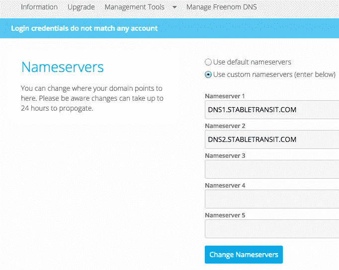**

**Use custom name servers**

**现在我们已经注册了一个新的免费域名，并为其建立了域名服务器。接下来，我们将找到一个 DNS 提供商。**

****DNS 提供商** : Rackspace 为每个账户(【https://www.rackspace.com/en-us/cloud/dns】T2)提供免费的 DNS，所以我们只需要注册一个 Rackspace 账户，如果我们没有的话。**

**登录 Rackspace 帐户后，选择“网络”->“云 DNS”->“创建域”。域名将是刚刚创建的域名(例如 oneops-demo.ml)。两个名称服务器将自动添加:(1)dns1.stabletransit.com(2)dns2.stabletransit.com，域名后，在 Rackspace 中创建。**

**请参见以下示例:**

**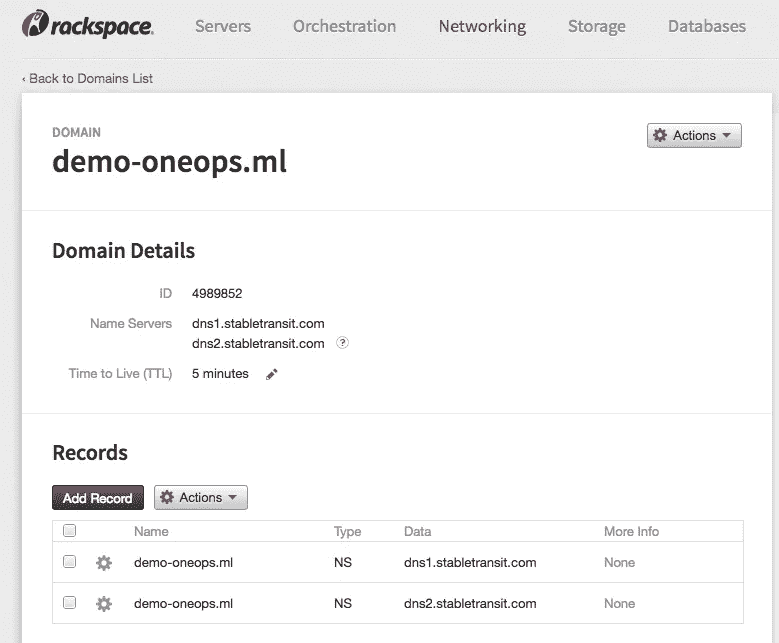**

**Add a DNS provider in Rackspace**

**现在让我们回到 OneOps:创建一个由“rackspace-dns”支持的 DNS 服务，然后指定以下参数:**

*   ****用户名**:这是 Rackspace 登录的用户名**
*   ****API Key** :来自 Rackspace 的“账户设置”页面**
*   ****Zone** :目前，这可以是任何字符串(例如 oneops-demo.ml)。对于生产用例，它将被仔细配置。**
*   ****云 DNS ID** :填充一些字符串，但这对于现在来说并不重要。**

## **GDNS 服务**

**添加具有上述相同配置的 GDNS 服务(再次为“rackspace-dns”)。请注意，在生产中使用时，GDNS 的配置可能与 DNS 不同。**

## **镜像服务**

**OneOps 上的一些开源应用需要从某个公共镜像下载二进制(例如[https://www.apache.org/dist/](https://www.apache.org/dist/))。镜像服务是将各种“下载”链接组织到一个中心位置。现在，我们可以添加一个默认的镜像服务，无需任何定制。**

# **通过 OneOps 在 OpenStack 上部署应用**

**这里我们选择 MySQL 作为要部署的应用程序。创建 MySQL 设计后，在“设计”阶段需要进行几项配置更新:**

1.  **计算:应该启用“需要公共 IP”**
2.  **数据库:输入您首选的 MySQL 登录密码**
3.  **用户:单击“+”按钮并添加一个新的用户实例:(1)本地工作站的登录名“Username”，(2)复制并粘贴 SSH 公共密钥(例如。ssh/id_dsa.pub)到“授权密钥”。因此，在部署完成后，您可以从本地机器直接 SSH 到 OpenStack VM。**

**提交设计并创建“单一”环境，然后进行部署。部署计划可能如下所示:**

**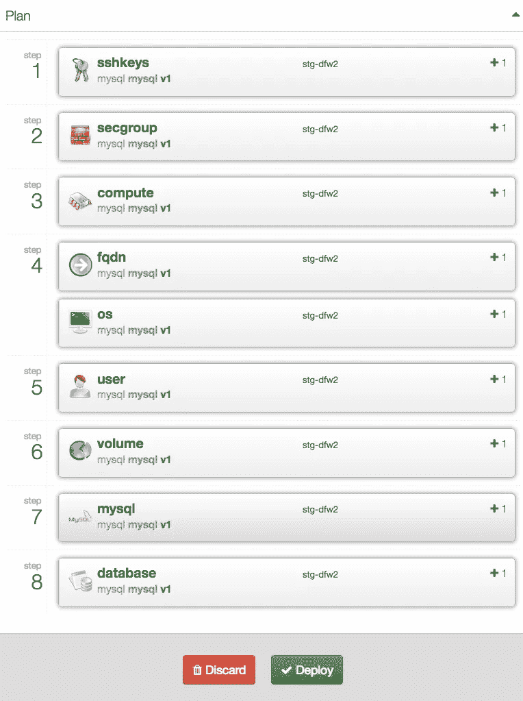**

**MySQL deployment plan**

**部署完成后，打开一个本地终端，SSH 到 open stack VM“SSH your _ local _ log in @ float _ IP”。登录 mysql 客户端“mysql -u myuser”，然后开始输入一些 mysql 命令(比如显示数据库；).**

```
**[root@mysql-87316–1–90827 test-user]# mysql -u myuser 
Welcome to the MySQL monitor. Commands end with ; or \g. 
Your MySQL connection id is 10 
Server version: 5.5.49 MySQL Community Server (GPL)Copyright (c) 2000, 2016, Oracle and/or its affiliates. All rights reserved.Oracle is a registered trademark of Oracle Corporation and/or its affiliates. Other names may be trademarks of their respective owners.Type ‘help;’ or ‘\h’ for help. Type ‘\c’ to clear the current input statement.mysql> show databases; 
+ — — — — — — — — — — + 
| Database | 
+ — — — — — — — — — — + 
| information_schema | 
| test | 
+ — — — — — — — — — — + 
2 rows in set (0.01 sec)mysql>**
```

**现在我们已经通过 OneOps 在 OpenStack 上部署了一个 MySQL 实例。**

# **接下来呢？**

**MySQL 部署可以通过更多生产驱动的实践来完成，例如集群、高可用性、监控。同时，我希望介绍其他有趣的应用程序模板，以帮助观众认识到 OneOps 的巨大价值。敬请关注！**