# KNN 和离群点检测在产品类型分类中的应用

> 原文：<https://medium.com/walmartglobaltech/application-of-knn-and-outlier-detection-to-product-type-classification-fc3df5c4cca5?source=collection_archive---------2----------------------->

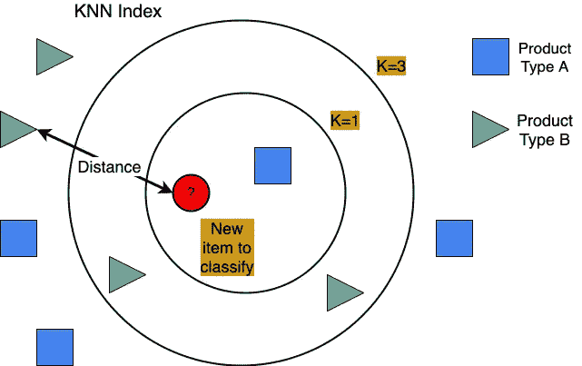

# **简介**

图像分类——从一组类别中给输入图像分配一个标签的任务——是监督机器学习中的经典任务之一，具有大量实际应用。特别地，图像分类已经广泛应用于电子商务中以提取产品类型。无论顾客是在寻找一件女式衬衫还是一台电视机，产品类型在整个网上购物体验中都起着重要作用。如果产品类型不对，客户很难浏览目录并快速找到合适的产品。

然而，在现代电子商务中，准确有效地将产品分类一直是一个重大挑战。我们可以从两个角度看待这些挑战。首先，对于真实世界的大规模分类任务，收集训练数据并确保数据集平衡是一项挑战。其次，我们需要理解分类法的本质。电子商务目录中的产品类型数量通常非常大。特别是我们有很多所谓的长尾产品类型，产品数量相对较少。在另一个极端，我们有流行的产品类型，但不够精细。产品类型分类是动态的，并且随着时间的推移而发展，由于所有这些因素，无论何时发生变化，重新训练新的模型几乎是不可能的。

有哪些替代方案？像图像这样的其他形式可能会有所帮助。这里有几个例子，一张图胜过千言万语。左边是标题中带有“裙子”的产品，右边是标题中带有“坦克”的产品。虽然文本输入中的差异可能是细微的，但是分类模型从图像输入中学习差异相对更容易。

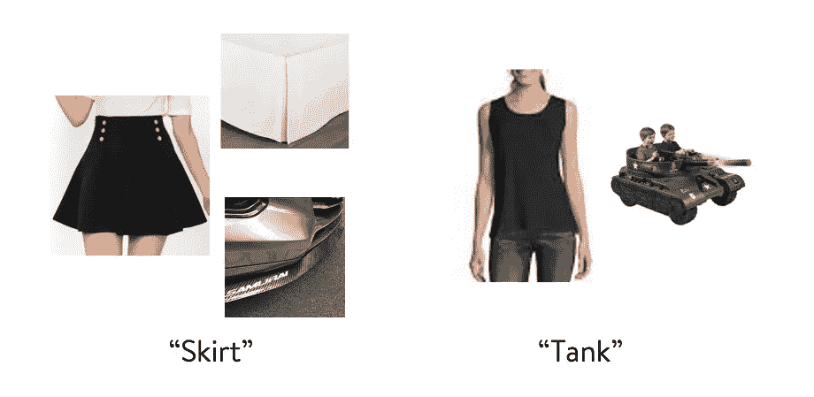

在这篇博客中，我们描述了一个解决方案，考虑到任何电子商务目录中不同的分类精度水平，不管它们当前的精度水平如何，这个解决方案都应该是可行的；并且考虑到每天上传的新产品的高流量和类别的动态性质，应该提高准确性水平，同时减少模型训练的成本和时间。我们将讨论以下主题:首先，我们将回顾基于图像的分类的优点和缺点。然后，我们提出基于 KNN 的分类作为我们的关键改进。作为我们整体建议的一部分，我们将展示结合 KNN 和异常值检测的影响。接下来，我们将深入验证。最后，我们将讨论大规模探测管道。

# **图像分类审查**

自 2012 年以来，图像分类领域出现了快速创新。下面的时间线显示了通过 ImageNet 数据集中的前 5 名错误测量的分类准确度的进展。EfficientNet 是一个重要的里程碑，因为它旨在有效地扩展网络。关键思想是它在所使用的参数方面更有效，并且它使用更少的训练标签达到相同或更好的结果。沃尔玛使用其中一些模型架构来训练其特定领域的神经网络。

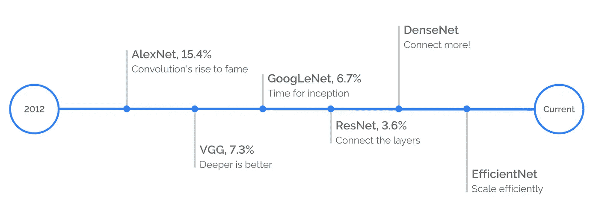

Reference: [The evolution of image classification explained](https://stanford.edu/~shervine/blog/evolution-image-classification-explained)

尽管图像模型已经走过了漫长的道路，并且我们肯定利用图像模型进行分类，但是对于现实世界中的大规模分类任务，如果我们仅仅依靠图像模型，精度将不会令人满意。此外，如果我们由于分类漂移而重新训练图像模型，我们不仅会受到建模成本的限制，还会受到人工编辑更大的成本和时间的限制。这就引出了基于 k 近邻(KNN)分类的关键思想。

# **KNN 分类**

基于 KNN 的方法依赖于基于内容的相似性。下图显示了我们如何通过使用深度学习神经网络来提取图像签名。每个乘积由嵌入向量表示，嵌入向量的维数可以是 1，024 到 4，096。我们基于高维嵌入空间中的欧几里德距离来定义视觉相似性。相似的产品应该具有接近正常欧几里德距离的嵌入。

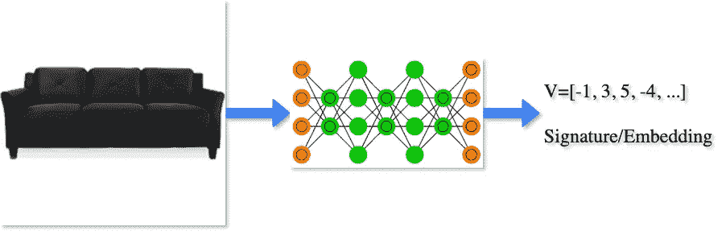

基于 KNN 的分类方法非常简单。基于欧几里德嵌入距离，通过其 K 个最近邻居的多数投票对查询样本进行分类。[研究](https://ieeexplore.ieee.org/abstract/document/1053964)表明，随着 KNN 指数中数据点的数量和 K 值的增加，KNN 方法的错误率接近最优贝叶斯错误率。

现在让我们更详细地介绍一下 KNN 方法。

*   嵌入生成:给定用于图像分类任务的黄金数据集，我们首先通过在大型计算机视觉数据集上预训练的神经网络模型(例如 [ImageNet](https://ieeexplore.ieee.org/abstract/document/5206848/) )为每个图像生成其语义嵌入。
*   索引:从上一步骤生成的图像嵌入向量将被索引到支持高效 KNN 搜索的数据库中。
*   搜索:在预测时间，当新图像到达时，我们将首先通过用于构建 KNN 搜索索引的相同预训练模型生成其嵌入，然后找出其 *k* 最近邻居。
*   加权多数投票:受深度学习社区中广泛使用的 [Softmax](https://en.wikipedia.org/wiki/Softmax_function) 函数的启发，将一个真实向量映射到一个单纯形多面体(也称为概率分布)，我们选择加权函数为 *exp(-d)* ，其中 *d* 为欧几里德距离，这样越靠近查询向量的邻居对决策的影响越大。对于每个标签，我们将来自共享相同标签的邻居的权重相加作为投票结果。收集最多投票的标签将脱颖而出成为预测的类别，其投票作为标准化后的置信度。

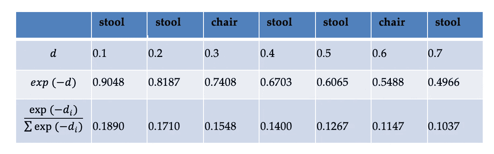

Example: *class* ***stool*** *predicted with score 0.7304 (= 0.1890 + 0.1710 + 0.1400 + 0.1267 + 0.1037)*

在实践中，我们还可以在置信度上设置一个阈值，以便在我们有足够的置信度时才输出预测。这样，我们就可以灵活地在召回率和准确率之间取得最佳平衡。

为了优化 K 的值，我们选择了一个用家具图像训练的模型。家具是第一批被深入研究的细分市场之一，因为它对在线客户参与度有潜在影响。此外，对于这个细分市场，我们投资了高质量的精选产品类型，可以用作 KNN 黄金数据。我们要击败的目标是一款拥有同样高质量标签的 DenseNet 车型。最终，我们使用 KNN 方法的召回精度来确定 K 的最佳值。当 K 的最佳值为 7 时，我们确定 Softmax 分数的阈值为 0.8。这为我们提供了比 DenseNet 模型稍好的性能。明确地说，KNN 用于嵌入的图像模型比 DenseNet 模型具有更低的性能。改进来自 KNN 分类算法，以及高质量的黄金数据集。

# **异常值检测**

作为我们总体建议的一部分，我们现在考虑将 KNN 和异常值检测结合起来。在数据收集阶段使用异常值检测是一种常见的技术。好处是以无人监督的方式清理训练数据，并且结果应该易于解释。隔离森林的思想是离群值比类内数据更容易隔离。我们选择隔离森林是因为

*   它不是基于空间邻近性，因此没有基于点的距离计算
*   它可以是有人监督的，也可以是无人监督的
*   它可以扩展到更高的维度
*   这很容易解释

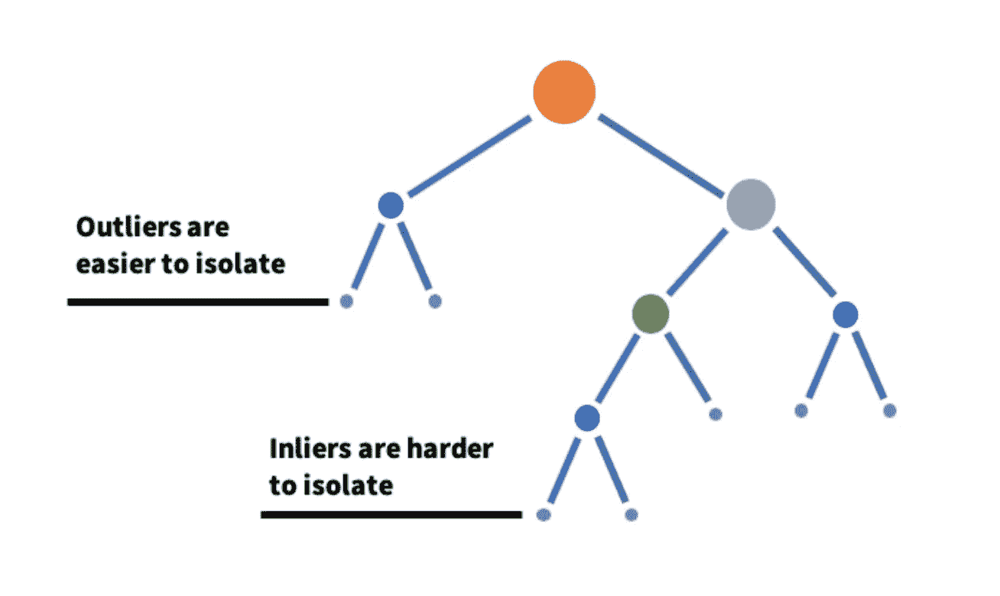

Reference: [Detecting and preventing abuse on LinkedIn using isolation forests](https://engineering.linkedin.com/blog/2019/isolation-forest)

下表显示了异常值检测的潜在影响。我们为酒吧凳子构建了一个数据集，为扶手椅和重点椅构建了另一个数据集。两者都含有少量错误的产品类型标签(不到 10%)。在其他一切都相同的情况下，我们通过改变估计的异常值百分比，使用隔离林做了两个实验。对于第一个实验，我们将估计的异常值百分比设置为 25%；对于第二个实验，我们将估计的异常值百分比设置为 15%。该表显示了错误标签的召回百分比。

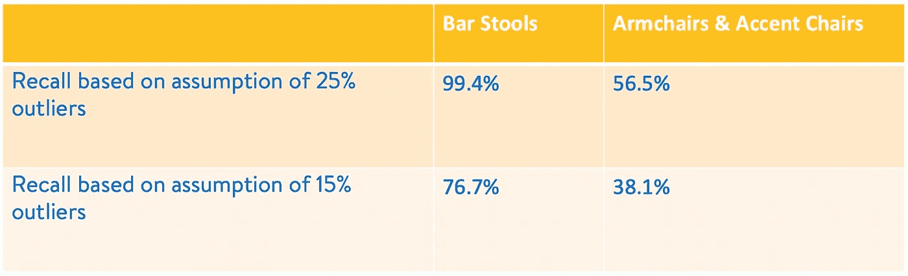

直觉上，召回率随着估计的异常值百分比的增加而增加。此外，对于更同质的产品类型，如酒吧凳子，获得比扶手椅和重点椅相对更好的回忆是有益的。需要进行更多的实验来确定估计异常值的最佳阈值。

# **验证**

在验证这一节中，我们将展示我们的错误分类检测方法的价值。重要的是要认识到，在一天结束时，我们需要通过不同的方式进行确证。我们的想法不是挑选一个单一的赢家，而是看看如何将每种方法的优势结合起来检测错误分类。为了得到最好的结果，我们比较了三种方法，使用文本模型，图像模型和 KNN 分类。基于文本的模型是基于目录数据训练的预生产模型。图像模型是在目录图像上训练的有效网络模型。对于 KNN 嵌入，我们提出以下问题:在 ImageNet 这样的通用数据集上训练的预训练的最新模型与在特定领域图像上训练的模型相比如何？为了公平比较，在其他条件相同的情况下，我们选择了预先训练的 EfficientNet 模型和内部训练的 EfficientNet 模型。

在下图中，重叠区域表示由多个模型检测到的错误分类，具有相同的预测产品类型。例如，在左边的文氏图中，使用预先训练的 EfficientNet 模型作为 KNN 嵌入的基础，我们发现 3.2%的商品被所有三个模型归类为相同的产品类型。需要明确的是，这 3.2%是错误分类的，三个模型都有支持。类似地，在右边的维恩图中，我们发现，如果我们将 KNN 嵌入的主干切换为使用在目录图像上训练的 EfficientNet 模型，则 3.8%的项目被错误分类，这三个模型都支持。

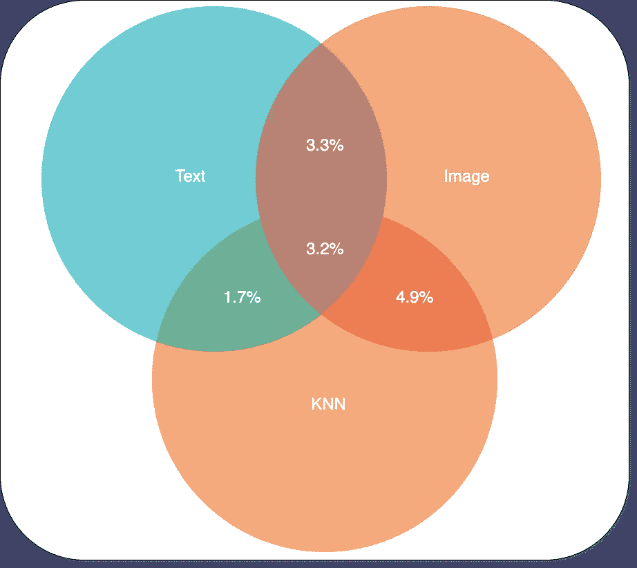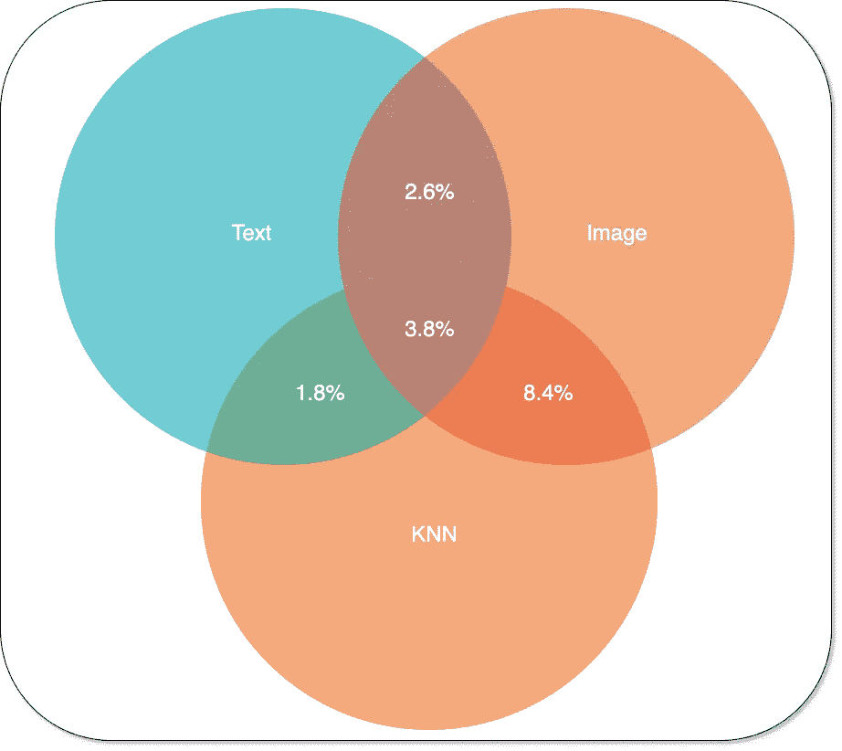

**Left**: Pretrained EfficientNet Model; **Right**: EfficientNet Trained Over Catalog

对于比简单的百分比协议计算更稳健的测量，我们求助于科恩的 kappa。这项技术由雅各布·科恩于 1960 年首次发表于 T2。Cohen 的 kappa 没有涉及太多细节，但考虑到了协议偶然发生的可能性。在错误分类检测的背景下，科恩的 kappa 基本上是一个*分数，表示一对模型给出的错误分类评级中有多少共识。*

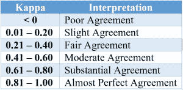

对于每种产品类型，我们基于错误分类标签的一致性来计算成对 kappa。然后，将数字分数映射到一个桶中，以供人工解释。例如，让我们说文本和 KNN 可能有 0.29 的 kappa 分数，或公平协议水平，对于背心，但 0.95，或几乎完美的水平，蓝光和 DVD 播放器。

为了便于理解成双成对的模式协议，让我们以电视节目为例，如 [*《美国达人》*](https://en.wikipedia.org/wiki/America%27s_Got_Talent) 。你可以像选秀节目的评委一样，思考文本、图像和 KNN 的不同分类方法。产品类型的空间类似于人才类别的空间。对于每一类才艺表演，我们根据评委的一致意见计算两人一组的 kappa。最后，我们在 X 轴上绘制了成对协议的级别，在 Y 轴上绘制了每个级别上类别的分数。

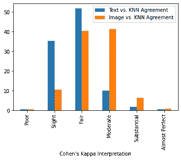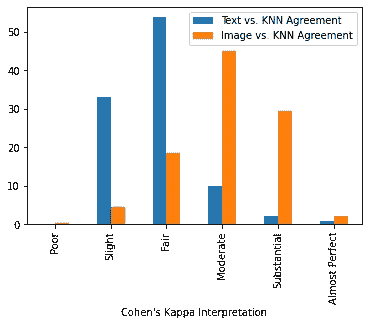

**Left**: Pretrained EfficientNet Model; **Right**: EfficientNet Trained Over Catalog

根据成对模型协议，当使用针对 KNN 嵌入的目录图像训练的 EfficientNet 模型时，我们可以看到图像和 KNN 之间更高水平的协议(上图右侧)。在某种程度上，KNN 本质上是基于嵌入之间的相似性，这种更高层次的共识是可以预期的。然而，我们不一定想要几乎总是意见一致的法官，对吗？完全不同的方法的动机是检测错误的产品类型，否则会被遗漏。尽管 KNN 方法依赖于图像模型性能，但是 KNN 方法的优势似乎并不依赖于图像模型的领域特定因素。这表现在文本和 KNN 之间的一致程度与用于 KNN 嵌入的图像模型无关。这是个好消息，因为我们不需要依赖通过目录图像训练的模型；对于 KNN 来说，使用预训练模型似乎已经足够好了。

# **大型检测管道**

最后但同样重要的是，让我们简单地谈谈我们的大规模检测管道。这是一个支持分布式推理的通用架构。这条管道有三个组成部分。首先在左侧，我们支持来自云、本地或流数据源的数据源。在中间，我们使用 Kafka 这样的流媒体平台来编排数据流，并支持多租户用例。右侧是服务堆栈，由流消费者、模型推理服务器和 KNN 搜索服务组成，配置在单个节点上。服务堆栈是部署的基本单元，它被调整以最大化单台机器上的吞吐量。该管道还设计为通过动态添加更多服务单元来进行水平扩展。

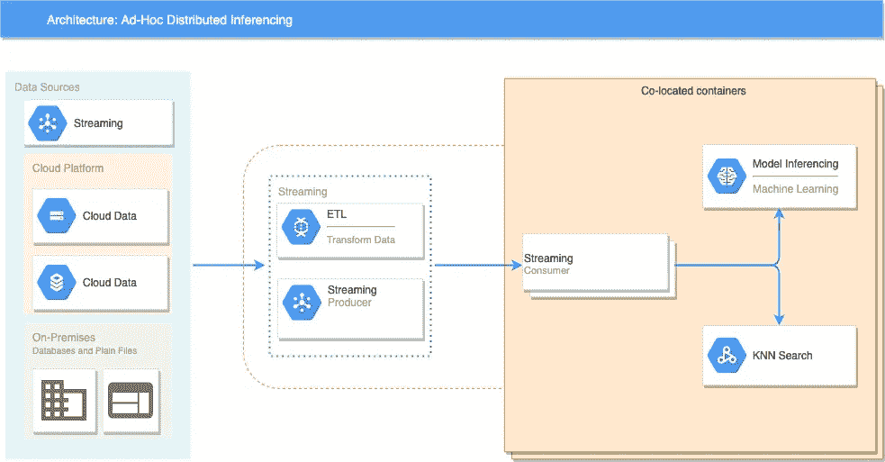

# **总结**

总之，关键思想是首先为标记图像生成语义嵌入，然后在新图像到达的推理时间，我们在嵌入空间中找到其最近的邻居，并进行加权多数投票来预测其标签。我们已经在生产中成功地应用了这种方法，根据它们的图像提取沃尔玛商店和在线杂货项目的产品类型，并发现我们的方法非常能够标记和修复我们当前生产目录中具有有问题产品类型标签的项目。

# 确认

这项工作是沃尔玛全球技术公司的目录和搜索团队正在进行的联合项目。特别感谢[马修·穆](https://www.linkedin.com/in/matthew-mu/)的倡议和[布莱恩·西曼](https://www.linkedin.com/in/brian-seaman-78710a25/)的指导。