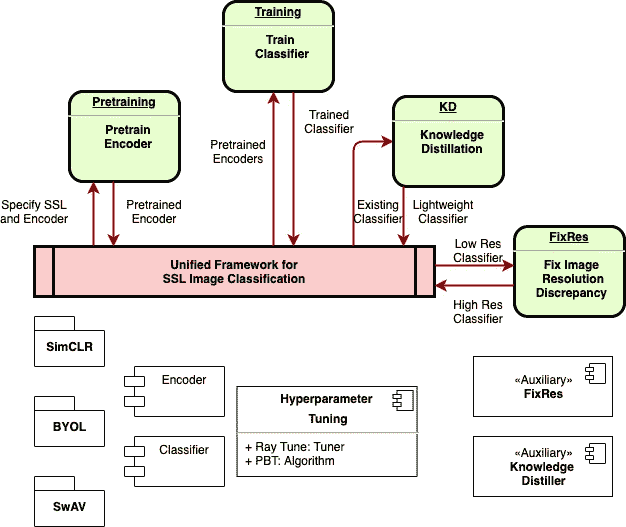
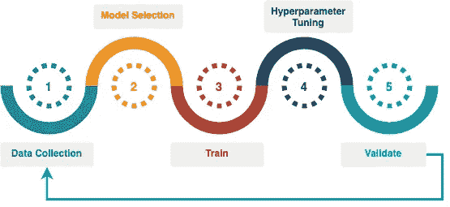
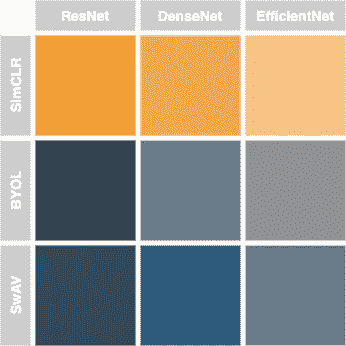
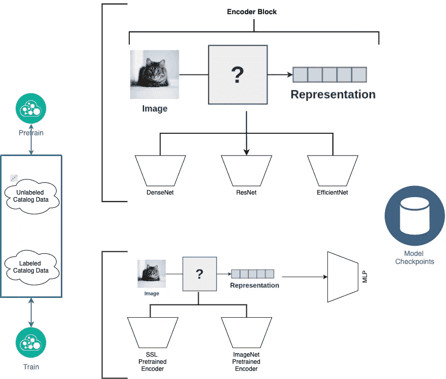
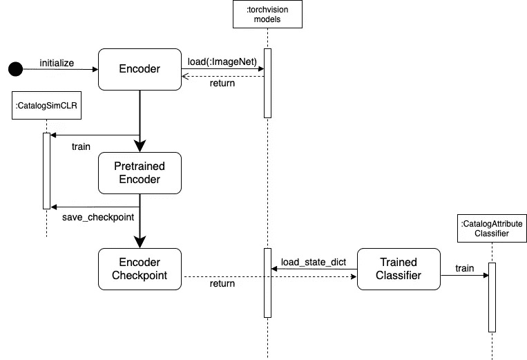
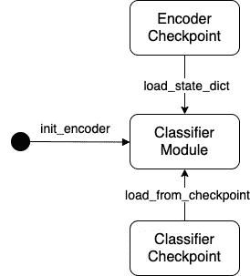
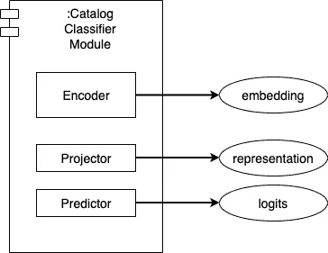
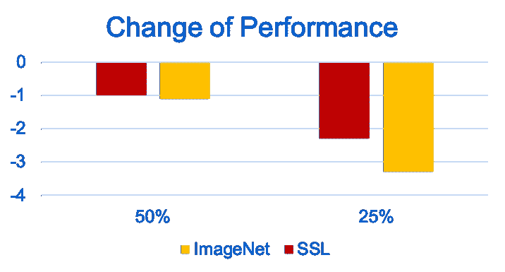

# 半监督神经网络在电子商务图像分类中的应用

> 原文：<https://medium.com/walmartglobaltech/application-of-semi-supervised-neural-net-to-ecommerce-image-classification-b3e21288bae2?source=collection_archive---------0----------------------->

**A Unified Framework of Semi-Supervised Neural Net with Application to eCommerce Image Classification**

# **背景**

电子商务图像分类的监督学习所面临的挑战是有据可查的。由于对大量训练数据的需求，电子商务用例经常受到数据标注的抑制性成本和时间的限制。在下面的培训流程中，*数据收集*是我们发现自己花费高达 90%的预算和时间的步骤。此外，错误的标签，以及标签数据中的不平衡和偏见，会妨碍监督学习的质量。尽管从一个域中的监督训练中学习到的特征可以被转移到不同的域，但是监督学习适合于对其进行训练的任何数据的模型，因此不具有作为其显式或隐式目标的一般化图像表示。

Workflow for Supervised Image Classification

受监督的模型不仅训练起来很昂贵，而且这些特意构建的模型也不可重用。相比之下，半监督学习(SSL)允许我们使用未标记数据以及标记数据，并学习无标记图像特征的表示。[最近的研究](https://ai.facebook.com/blog/high-performance-self-supervised-image-classification-with-contrastive-clustering/)表明，SSL 方法可以更好地表现图像特征，并显著减少下游任务的数据标记量。在 ImageNet 上预训练的最新[半监督模型](https://paperswithcode.com/paper/self-supervised-pretraining-of-visual)在多个下游任务上甚至超过了监督预训练模型。图像分类只是众多可以受益于 SSL 的计算机视觉问题之一。电子商务目录中大量未标记的图像数据是一种尚未开发的资源，大量存在。利用半监督图像分类为了提高图像分类的效率和性能，我们构建了一个即插即用平台，该平台使用未标记数据统一了神经网络编码器的预训练，并自动搜索这些 SSL 编码器以执行图像分类任务。

我们的最终设计目标是:

> 使用 SSL 和 SoTA 神经架构对带有未标记沃尔玛目录图像的模型进行预训练
> 
> 利用预先训练的 SSL 神经网络库实现一类具有更好性能的下游分类任务
> 
> 使预训练 SSL 神经网络的嵌入成为沃尔玛目录图像相似性搜索的新标准

# **实际挑战**

我们的方法受到了最近 SSL 图像分类研究的启发，其中大多数研究都使用 ResNet 作为神经网络。ResNet 是研究出版物中流行的参考模型，但它很少是电子商务用例的最佳模型。在研究社区中，ResNet 模型通常使用 ImageNet 数据进行预训练和评估。因此，我们非常担心半监督方法在 ResNet 上的过度拟合，以及它们的结果在 ImageNet 数据上的过度拟合。

另一个挑战是，扩展这些 SSL 方法的无数开源实现来支持 ResNet 之外的神经网络是不可行的。对于要发表的研究，附带的开源实现包含一次性技术，以挤压有时微小的性能改善。一些实现被设计成使用大量的计算资源作为达到其报告的性能的最低要求。总的来说，这些因素使得使用它们的实现不切实际，并且不可能将它们的结果转化为电子商务应用领域。

所有 SSL 方法的成功都有两个共同的因素。第一个是对大规模数据集进行预处理。第二是使用具有巨大学习能力的模型。为了给你一个我们在这里讨论的感觉，神经网络真的又深又宽，有高达 1B 参数；并且未标记的预训练数据集的大集合可以容易地超过 1B 图像。因此，预训练所需的计算资源是巨大的。例如，对于 120 万幅图像的训练集，使用原始 TensorFlow 实现在单个 GPU 上训练 SimCLR 每个时期需要大约 40 小时。当我们试图将发布的结果转化为电子商务领域的真实世界设置时，我们必须小心谨慎。

# **我们的方法**

在这篇博客中，我们将讨论统一框架的开发，它包括

1.  标准化编码器多阶段培训的核心库
2.  SSL 预训练编码器和成品监督编码器的共享库
3.  通过自动搜索最佳编码器和可扩展的超参数调整，内置对图像分类任务的支持
4.  通过设计补充核心库的辅助技术

SSL Pretrained Encoders

首先，任何神经网络都可以插入到一组最先进的 SSL 程序中进行预训练，其中神经网络的选择独立于 SSL 方法的选择。鉴于[efficient](https://github.com/lukemelas/EfficientNet-PyTorch)和 [DenseNet](https://pypi.org/project/densenet-pytorch/) 是支持的神经网络的例子， [SimCLR](https://arxiv.org/abs/2006.10029) 、 [BYOL](https://arxiv.org/pdf/2006.07733v1.pdf) 和 [SwAV](https://arxiv.org/abs/2006.09882) 是实现的 SSL 方法的例子。

在神经网络被预训练之后，它们被提取并在 SSL 模型库中可用，以供下游分类任务使用。一旦编码器经过预训练并成为模型库的一部分，它们就不再依赖于预训练过程中使用的元素。这意味着他们是真正的一流候选人，能够完成任何迁移学习任务。这些经过预训练的编码器的一般特性使编码器搜索自动化，从而优化下游分类任务的性能。

接下来，对于任何下游分类任务，我们不是手动搜索最佳预训练编码器，而是利用技术来自动搜索，这些技术基于模型库定义的搜索空间、所需的特定分类性能以及各种超参数调整算法中的搜索策略。

1.  首先，搜索空间不仅限于来自我们 SSL 预训练模型库的编码器，还包括通过 ImageNet 训练的现成监督模型。
2.  然后，根据用例需求指定性能目标，以及搜索的资源预算(例如，根据 GPU 时间)。
3.  最后，我们可以自由地使用任何超参数调整算法进行自动搜索。作为一个参考实现，该框架已经与先进的分布式调优库 [Ray Tune](https://towardsdatascience.com/how-to-tune-pytorch-lightning-hyperparameters-80089a281646) 集成，并且可以很容易地扩展到与其他调优库一起工作，如[Weights&bias](https://wandb.ai/site/articles/pytorch-lightning-with-weights-biases)。

该框架是进一步提高图像分类性能的辅助技术的基础。一个例子是知识提取，其中作为教师使用的分类器可以帮助训练建立在轻量级编码器之上的分类器。学生分类器的性能与教师的性能不相上下，有时甚至更好，其好处是推理成本更低。

# **多阶段图像分类**

让我们看看 SSL 预训练编码器如何用于沃尔玛目录图像分类。首先，在预训练期间，我们使基于 ResNet 的实现适应其他神经网络。编码器的预训练是在标准库中实现的，这样任何神经网络都可以插入到该过程中，以学习表示来自未标记目录图像的图像特征。然后，在下游分类器的训练期间，我们可以从一组稳定的预训练 SSL 编码器以及 ImageNet 预训练编码器中挑选一个编码器，并将其插入训练过程。该框架通过设计支持两者，并最大限度地减少两者之间的阻抗不匹配。我们的目标是，在除了起始编码器权重之外的一切都相同的情况下，我们可以公平地比较 SSL 预训练编码器与 ImageNet 预训练编码器的性能。

Multi-Stage Image Classification

为了确保编码器对用于预训练它们的 SSL 网络是不可知的，我们创建了由数据预处理、数据扩充、可扩展编码器和分类器以及标准训练工具组成的公共构建块。对于 SimCLR，我们构建并改编了一个基于 [PyTorch Lightning 的实现](https://pytorch-lightning-bolts.readthedocs.io/en/latest/self_supervised_models.html)。作为 PyTorch Lightning 代码的必要修复和增强示例，我们优化了 SimCLR 的[损失函数实现，以及 SimCLR 和 BYOL 共享的](https://github.com/PyTorchLightning/lightning-bolts/blob/master/pl_bolts/models/self_supervised/simclr/simclr_module.py#L256)[高斯模糊变换逻辑](https://github.com/PyTorchLightning/lightning-bolts/blob/master/pl_bolts/models/self_supervised/simclr/transforms.py#L177)。

为了使这个平台能够与所有 SSL 网络一起工作，我们需要标准化编码器的配置和嵌入方式。特别是，表示嵌入空间中的图像的编码器和 SSL 学习网络的其余部分之间的交互被隔离到少数几个定义良好的方法。为了说明编码器的封装以及编码器与图像分类器的交互，让我们先来看看序列图:

Sequence of Pretraining Encoders

1.  从 ImageNet 预训练模型初始化编码器
2.  使用 SSL 对未标记的沃尔玛目录图像进行编码器预处理
3.  最佳性能编码器检查点
4.  使用 SSL 预训练编码器初始化分类器
5.  训练和检查分类器

接下来让我们看看图像分类器的状态转换:

State of Classifiers

*   用 ImageNet 预训练模型初始化
*   用 SSL 预训练编码器初始化
*   经过培训和检查
*   从检查点还原

最后，我们来仔细看看分类器的结构:

Anatomy of Classifier

*   编码器:输出嵌入
*   投影仪:隐藏中间层中的输出表示
*   预测器:输出逻辑

# **验证和业务影响**

我们如何衡量 SSL 方法的成功？当橡胶碰到路面时，就很简单了。它归结为一类下游任务，这些任务在性能和数据效率方面都受益于 SSL。如果 SSL 真的符合它的期望，SSL 编码器可以提供更好的嵌入，从目录图像中捕获不变量，因此需要为下游任务进行少量的调整。如果我们的实现是正确的，那么编码器不仅可以跨 SSL 选择移植，而且还可以优于最初的一次性实现。

第一个比较是关于监督分类方法和 SSL 分类方法之间的分类性能。SSL 方法有利于一类属性分类任务，因为它对图像表示具有更好的泛化能力，并且关注单个图像特征(与在监督训练中使用标签作为图像相似性的代理相比)。SSL 预训练编码器在顶级准确度方面的表现高出 8%。

第二个好处是关于预训练所需的计算资源。例如，与研究报告中的原始 SimCLR 实施对于 120 万个训练数据每个时期花费 40 多个小时相比，使用相同的硬件，每个时期的时间减少了 7 到 15 倍。这是由于几个因素。首先，我们对训练工具进行标准化，以允许在反向传播之前积累较小的批次；第二，我们在预训练期间使用较小的图像分辨率，而不损害下游分类的性能。简而言之，计算资源的开销通过 SSL 编码器的一次性预训练和重新使用编码器进行一系列图像分类任务来吸收。

最后但同样重要的是，当只有一小部分标记的训练数据可用时，SSL 方法往往在更大的范围内优于监督方法。下面的图显示了当使用 25%和 50%的标记训练数据，并且保持验证数据不变时，一个示例用例的性能的负面变化。这清楚地表明，SSL 编码器比 ImageNet 预训练的编码器数据效率更高。

Data Efficiency Analysis

# **总结**

我们讨论了为什么预训练的 SSL 模型可以从大量未标记的数据中学习特定领域图像的通用表示。我们分享了预训练的 SSL 编码器如何集成到多阶段图像分类框架中，并展示了一类下游任务的示例，这些任务在更好的性能和更高的数据效率方面受益于 SSL。我们还讨论了如何设计框架组件来管理复杂性。

沃尔玛多年来一直在监督学习方面进行投资，在带标签的沃尔玛目录图像上训练一流的监督模型。我们相信，下一波计算机视觉创新来自于使用未标记的沃尔玛目录图像预训练一流的 SSL 模型。保证 SSL 预训练模型的全部好处的关键因素是库的标准化和编码器对于整个图像分类任务的可重用性。统一框架使得预先训练 SSL 模型库成为可能，这是

*   对大量未标记的特定领域数据(沃尔玛图片)进行缩放和概括表示
*   使一类影像分类任务具有更好的性能

最终，一个好的框架的标准是它是否能促进这些目标:

*   保持事情简单
*   降低成本
*   标准化和重用

# 确认

这项工作是沃尔玛全球技术公司的目录和搜索团队正在进行的联合项目。特别感谢亚历山德罗·马纳尼的一贯支持和 T2 的布莱恩·西曼的指导。