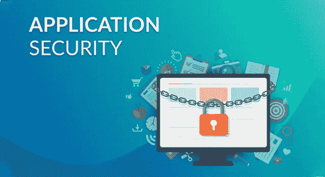
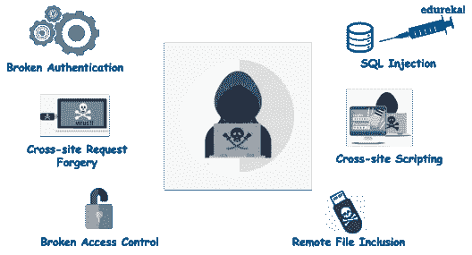

# 应用安全—应用安全综合指南

> 原文：<https://medium.com/edureka/application-security-tutorial-e6a0dda25f5c?source=collection_archive---------0----------------------->



Application Security — Edureka

网络中断、黑客攻击、计算机病毒和类似事件以各种方式影响着我们的生活，从带来不便到危及生命。Akamai 在互联网安全报告的*状态的研究中发现，从 2017 年第四季度到 2018 年 Q1，对网络应用的攻击增加了 59%。这些严峻的统计数据清楚地表明，应用程序安全性比以往任何时候都更加重要。本文将帮助您展开**应用安全**的概念。*

让我们来看看这篇应用程序安全性文章中涉及的主题:

1.  什么是网络安全？
2.  什么是应用程序安全性，为什么它很重要？
3.  应用安全核对表
4.  什么是 SQL 注入？

# 什么是网络安全？

今天，我们的整个现代生活方式，从通信到电子商务，从根本上依赖于互联网。我们用互联网换钱、玩游戏、看新闻、购物和许多其他事情。互联网通知、娱乐和连接我们。但是这种使用互联网的奢侈是有代价的——**安全**。

网络犯罪是一个全球性问题，一直占据新闻头条。它对个人的安全构成威胁，对大企业、银行和政府的威胁更大。过去一年，每天都有关于网络攻击、数据泄露和软件漏洞的新闻。但好的一面是，即使有这个有缺陷的互联网，我们也可以做一些简单的事情来保护自己免受这些攻击。这就是网络安全的由来。下面是一个快速定义:

> *“网络安全是旨在保护网络、计算机、程序和数据免受攻击、破坏或未经授权访问的技术、流程和实践的集合。”*


确保网络安全需要整个信息系统的协调努力，这包括:

*   网络安全性
*   应用程序安全性
*   信息安全
*   行动安全
*   灾难恢复
*   最终用户教育

让我们详细探讨一下应用程序安全性。

# 什么是应用程序安全性&为什么它很重要？

近年来，网络犯罪呈指数级增长，暴露了网络和移动应用程序中的各种漏洞。这些安全问题大部分是由于糟糕的编码实践造成的，这导致了糟糕的应用程序代码完整性。换句话说，黑客正在利用编码不良的应用程序中的应用层漏洞来发起攻击。

***Web 应用程序安全是保护网站和在线服务免受不同安全威胁的过程，这些威胁利用应用程序代码中的漏洞*** *。*web 应用攻击的常见目标是内容管理系统(如 WordPress)、数据库管理工具(如 phpMyAdmin)和软件即服务(SaaS)应用。

***原因，为什么网络应用似乎是最喜欢的目标，是:***

## 编码实践

*   如果代码写得不好，黑客可以利用应用层的漏洞发起攻击
*   如果代码很复杂，就会增加无人关注的漏洞和恶意代码操作的可能性

## 易于执行

*   大多数攻击可以很容易地自动化，一次不加选择地针对数千个，甚至数万或数十万个目标发起。
*   网络罪犯通过攻击应用程序获得大量报酬

因此，未能保护其 web 应用程序的组织面临着被攻击的风险。这主要是因为应用程序中存在漏洞。应用程序漏洞正在当今的网络空间制造混乱，给不同类型的攻击留下了余地。

***我们来看看几个领先的 web 应用攻击:***

## SQL 注入:

在这里，犯罪者使用恶意的 SQL 代码来操纵后端数据库，以便他/她获得敏感信息

## 跨站点脚本(XSS):

当攻击者将恶意代码直接注入应用程序，从而获得帐户访问权限、激活特洛伊木马或修改页面内容时，就会发生 XSS

## 远程文件包含:

黑客将文件注入 web 应用服务器。通过这样做，他可以在应用程序中执行恶意脚本或代码，以及窃取和操纵数据

## 跨站点请求伪造(CSRF):

当一个恶意的 web 应用程序让用户的浏览器在他登录的网站上执行一个不想要的操作时，就会导致这种情况。



这些是几种最常见的攻击类型，它们利用应用程序中的漏洞发起攻击。OWASP(开放 web 应用程序安全项目)每 3-4 年列出 10 大应用程序漏洞以及风险、影响和对策。

# 应用安全核对表

“预防胜于治疗”。大多数情况下，组织都有对策来确保安全，抵御这些攻击。这些对策可以采取软件、硬件和行为模式的形式。

## 软件对策包括:

*   ***Web 应用防火墙:*** 防火墙通常被设计为检查传入的流量以阻止攻击企图，从而补偿任何代码操纵
*   ***弹出窗口拦截器:*** 也称为弹出窗口拦截器，用于阻止弹出窗口显示在用户的 Web 浏览器中
*   ***密码术:*** 不同种类的加密和解密算法可用于保护所有数据传输
*   ***间谍软件检测程序:*** 可以安装各种间谍软件检测和间谍软件清除程序来防止网络攻击

## 硬件对策包括:

*   一种路由器，可以防止个人计算机的 IP 地址在互联网上直接可见
*   识别第三方托管内容的生物认证系统，保护您的应用程序安全
*   入侵探测器和报警器

## 行为对策包括:

*   经常从网络浏览器中删除存储的 cookies 和临时文件
*   定期安装操作系统的更新和补丁
*   定期扫描病毒和其他恶意软件
*   避免打开来自未知发件人的电子邮件和附件

今天，网络威胁是如此的常见和复杂，以至于几乎无法预防。然而，随着网络安全专家发现新的威胁和对抗新威胁的新方法，安全计划继续发展新的防御手段。

前面，我们讨论了不同类型的攻击。让我们详细研究一下其中一种攻击。

# 什么是 SQL 注入？

***SQL 注入，也称为 SQLI，是一种常见的攻击，它使用恶意 SQL 代码对后端数据库进行操作，以访问不打算显示的信息。***

成功的注入攻击可能导致未经授权查看用户列表、删除整个表，在某些情况下，攻击者还会获得数据库的管理权限，所有这些对企业来说都是非常致命的。SQL 注入通常发生在当你要求用户输入时，比如他们的用户名/用户标识，而不是名称/标识，用户给你一个 SQL 语句，你会在不知情的情况下在你的数据库上运行。

请看下面的例子:

```
txtUserId = getRequestString("UserId"); 
txtSQL = "SELECT * FROM Users WHERE UserId = " + txtUserId;
```

该代码的最初目的是创建一个 SQL 语句来选择一个具有给定用户 id 的用户。怀有恶意的用户可以输入这个:**用户 Id:** *105 或 1=1*

嗯，输入是有效的，事实上，它将返回“Users”表中的所有行，因为**或 1=1** 始终为真。这样，黑客只需插入随机数据，就可以访问数据库中的所有用户名和密码。

看似简单，实则危险！

这就把我们带到了关于什么是应用程序安全性的文章的结尾。我希望这篇文章对你有所帮助，并增加了你的知识价值。

如果你想查看更多关于人工智能、DevOps、道德黑客等市场最热门技术的文章，你可以参考 [Edureka 的官方网站。](https://www.edureka.co/blog/?utm_source=medium&utm_medium=content-link&utm_campaign=application-security-tutorial)

请留意本系列中的其他文章，它们将解释网络安全的各个方面。

> 1.[什么是网络安全？](/edureka/what-is-cybersecurity-778feb0da72)
> 
> 2.[网络安全框架](/edureka/cybersecurity-framework-89bbab5aaf17)
> 
> 3.[隐写术教程](/edureka/steganography-tutorial-1a3c5214a00f)
> 
> 4.[什么是网络安全？](/edureka/what-is-network-security-1f659407dcc)
> 
> 5.[什么是计算机安全？](/edureka/what-is-computer-security-c8eb1b38de5)
> 
> 6.[什么是密码学？](/edureka/what-is-cryptography-c94dae2d5974)
> 
> 7.[渗透测试](/edureka/what-is-penetration-testing-f91668e2291a)
> 
> 8.[道德黑客教程](/edureka/ethical-hacking-tutorial-1081f4aacc53)
> 
> 9.[关于 Kali Linux 你需要知道的一切](/edureka/ethical-hacking-using-kali-linux-fc140eff3300)
> 
> 10.[使用 Python 的道德黑客](/edureka/ethical-hacking-using-python-c489dfe77340)
> 
> 11. [DDOS 攻击](/edureka/what-is-ddos-attack-9b73bd7b9ba1)
> 
> 12.[使用 Python 的 MAC changer](/edureka/macchanger-with-python-ethical-hacking-7551f12da315)
> 
> 13 [ARP 欺骗](/edureka/python-arp-spoofer-for-ethical-hacking-58b0bbd81272)
> 
> 14. [Proxychains，Anonsurf & MacChange](/edureka/proxychains-anonsurf-macchanger-ethical-hacking-53fe663b734)
> 
> 15.[足迹](/edureka/footprinting-in-ethical-hacking-6bea07de4362)
> 
> 16.[50 大网络安全面试问答](/edureka/cybersecurity-interview-questions-233fbdb928d3)

*原载于 2018 年 12 月 14 日*[*www.edureka.co*](https://www.edureka.co/blog/application-security-tutorial/)*。*