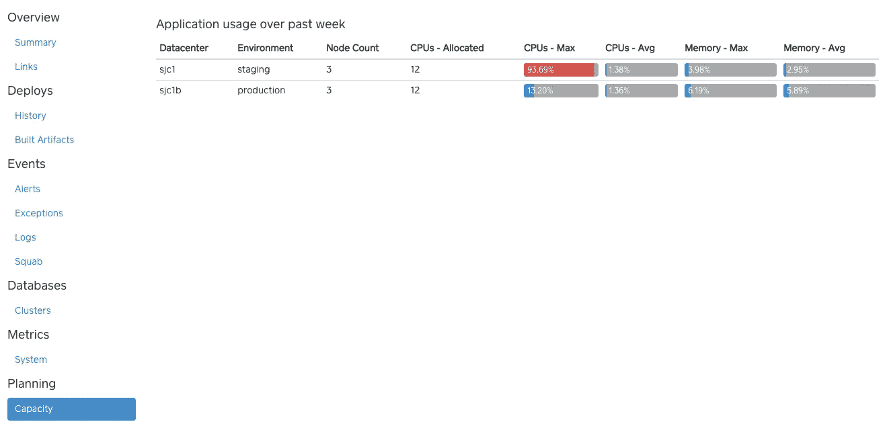
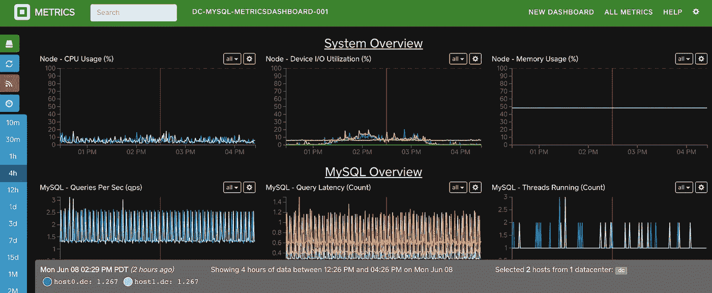
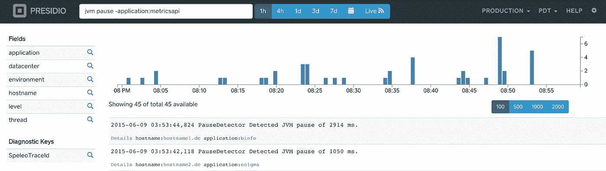
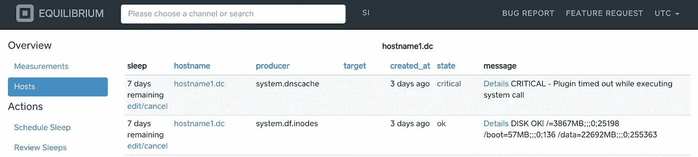
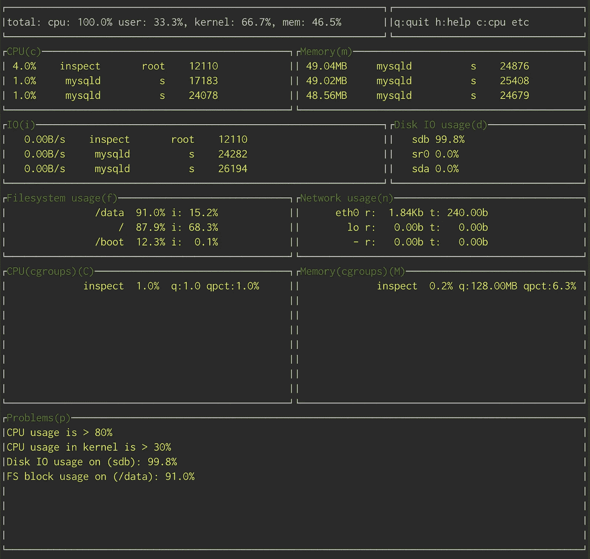

# 应用可见性

> 原文：<https://medium.com/square-corner-blog/application-visibility-84133ffd95af?source=collection_archive---------2----------------------->

## 一睹 Square 使用的各种监控和警报系统。

由 Syam Puranam 撰写。

> 注意，我们已经行动了！如果您想继续了解 Square 的最新技术内容，请访问我们在 https://developer.squareup.com/blog[的新家](https://developer.squareup.com/blog)

# 背景

Square 在过去五年经历了巨大的增长。我们的技术堆栈从少数单片 rails 应用发展到微服务架构。我们服务的变化和增长为应用可见性带来了新的挑战。在今天的博文中，我们将回顾一些指导原则，并对我们用来监控和可视化多样化服务生态系统的各种技术进行初步探讨。从今天开始，我们将开源我们服务监控和可视化堆栈的各个部分！

# 原则

我们的一些指导原则是:

*   **尽早并经常关注可用性。**采用微服务架构，收集海量信号非常容易。一个好的用户界面是从信号中提取意义的关键。
*   **确定并展示您的衡量标准中最重要的方面。我们的指导思想是，人类可以一次有效地处理很少的物品。因此，任何关于度量的问题都应该在几次尝试中得到解答。例如:**
*   按延迟或每周变化排序的前 N 名 API 指标。
*   自动化问题检测。*检查*设施表面的明显问题，以便进行系统故障排除。
*   **应用程序应该从第一天起就具有良好的指标默认覆盖率。**我们确保我们的标准应用程序容器中有良好的工具，我们的典型仪表板包括以下指标:
*   数据库
*   主机和容器
*   每个 HTTP/REST 端点的性能指标
*   用于运行服务组件的任何 JVM 的 VM 统计信息
*   **提醒需要简单且相关。**我们跟踪了大量关于警报的指标，以改善我们的呼叫体验，目标是达到零不可响应警报。
*   警报应该是紧急的和立即可操作的。
*   警报应该是一个不寻常的事件。
*   每一个警报都应该需要人类的智慧来处理。
*   每个警报都应该是可再现的。

# 应用程序

我们在 Square 使用的遵循这些原则的一些应用包括:

*   **Appdash** 快速获取应用信息的地方，包括:
*   部署信息，如哪些主机运行哪些版本，哪些版本可用等。
*   应用依赖几何
*   应用程序中的事件和异常
*   容量建模

*   **指标仪表板**查看所有平台和应用的指标。这是 metricsdashboard UI 背后的数据库的仪表板示例。

*   **Presidio** 基于 Elasticsearch 的日志搜索应用。它为应用程序开发人员提供了一个简单的界面，让他们可以找到可能暴露错误的模式，或者通过多种服务来帮助跟踪事件。

*   **平衡**我们的下一代警报系统将迅速取代我们的 Nagios 基础设施。均衡带来了相当大的易用性，并提高了可靠性和可伸缩性。它受到我们与 Nagios 合作的经验、开放源代码的现代趋势(如 Sensu)以及我们所看到的其他公司的大规模工作的影响。

今天，我们正在开源我们生态系统中一个较小但重要的项目: [inspect](https://github.com/square/inspect) 。inspect 是我们用来收集 Linux、MySQL 和 PostgreSQL 指标的库集合。该项目还包括一个用于 Linux 的命令行实用程序，可以执行基本的问题检测。

# 结论

我们希望您会发现 [inspect](https://github.com/square/inspect) 对您有所帮助，并且这篇博客文章提供了 Square 使用的各种监控和警报系统的一瞥。我们将在后续的博客文章中详细介绍这些系统。一如既往，请关注角落，获取更多更新！

# 延伸阅读:

*   关于微服务和监控重要性的优秀[文章](http://martinfowler.com/articles/microservices.html)。
*   关于[报警](https://docs.google.com/document/d/199PqyG3UsyXlwieHaqbGiWVa8eMWi8zzAn0YfcApr8Q/preview?sle=true)原则的详细考虑的报告。