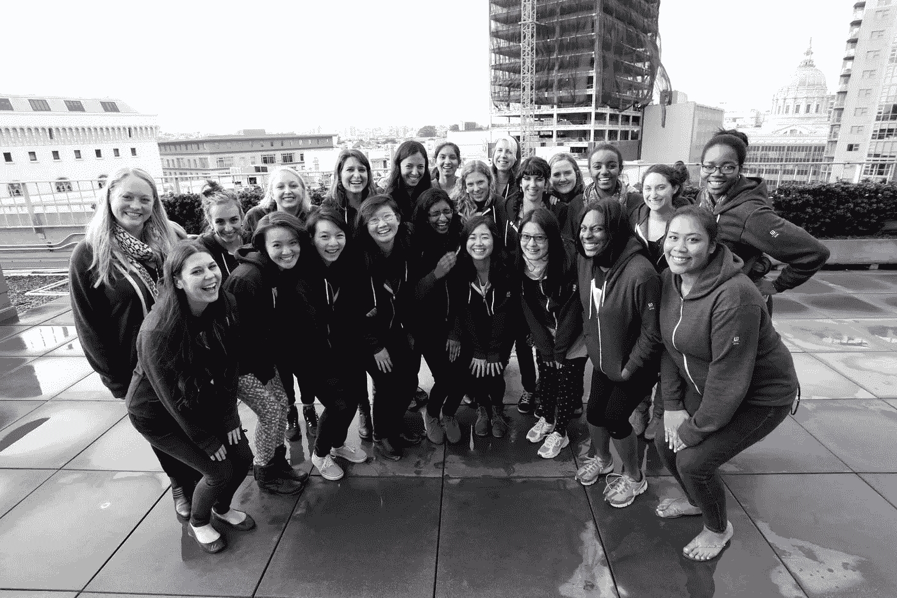

# 现在开放申请:学院代码营 6

> 原文：<https://medium.com/square-corner-blog/applications-now-open-college-code-camp-6-fcc819c45755?source=collection_archive---------3----------------------->

## 另外，代码露营者转变为广场工程师反映了大学代码营地 2

*作者写的*[艾丽莎 T5*。*](https://medium.com/u/454490e3454d?source=post_page-----fcc819c45755--------------------------------)

> 注意，我们已经行动了！如果您想继续了解 Square 的最新技术内容，请访问我们的新家[https://developer.squareup.com/blog](https://developer.squareup.com/blog)

今年一月标志着我参加 Square 的大学代码营已经两年了。回顾过去，代码营对我来说最有价值的方面是我们建立的社区。我的营友们聪明、热情、有主见，他们的兴趣从计算机科学到当妈妈再到在 NASA 实习。和让我想起自己的人在一起令人耳目一新；和我渴望成为的人在一起；和我能激励的人在一起。

Code Camp 创造了一个安全的空间，在这里我们可以谈论我们心中的任何事情，比如许多 Code camper[写的关于](https://medium.com/square-code-camp)的冒名顶替综合症。(我们的午餐绝不是闲聊。)我最喜欢的一次对话，围绕着每个人对穿礼服参加会议的看法。经过长时间的讨论，我们决定如果你想的话，你应该穿一件，即使你觉得你会很突出。为了庆祝这个决定，我们在露营的最后一天都穿上了礼服。

直到今天，我还和我的同伴们保持着联系。我在聚会、黑客马拉松和会议上遇到他们，当我在某人的家乡时，我会努力与他们联系。我们已经建立了一个了不起的女工程师网络，我很高兴成为其中的一员。我希望更多的人也能加入。因此，我很高兴地宣布，代码营应用程序今天开放。

我们邀请大学生申请参加我们在 square.com/code-camp 举办的为期五天的大学代码营。该计划将于 1 月 4 日至 9 日在旧金山举行，包括领导会议、编码研讨会和黑客马拉松，旨在将女性工程专业学生聚集在一起，围绕技术领域的女性建立一个更强大的社区。

 [## 艾丽莎

### Square 的软件工程师。领导 Square 的女性工程小组，昵称为 WomEng。

medium.com](/@arpohahau)  [## 平方码营地

### 女校友的故事和经历

medium.com](https://medium.com/square-code-camp)