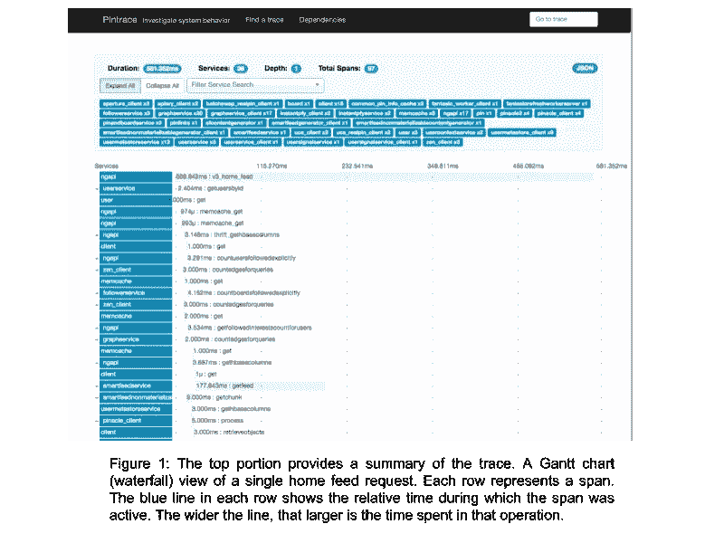
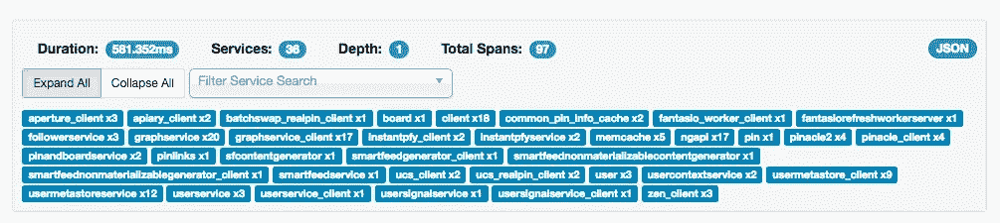
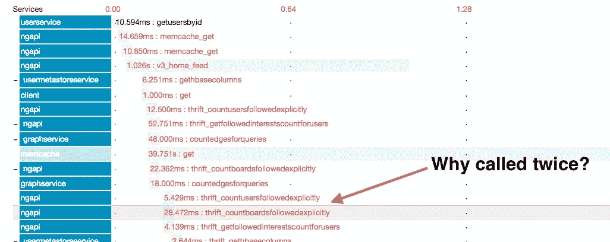
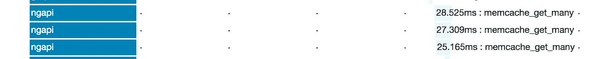

# (pin)跟踪数据的应用

> 原文：<https://medium.com/pinterest-engineering/applications-of-pin-trace-data-3b9e6dc2744b?source=collection_archive---------3----------------------->

苏曼·卡鲁莫里| Pinterest 技术主管，可见度

为了确保我们为 Pinners 提供快速体验，我们不断改进后端服务的请求延迟。今年早些时候，我们开源了 [Pintrace collector](https://github.com/openzipkin/zipkin-sparkstreaming) ，并将代码贡献给了 OpenZipkin 社区。在[之前的一篇文章](/@Pinterest_Engineering/distributed-tracing-at-pinterest-with-new-open-source-tools-a4f8a5562f6b#.nsu6yonnk)中，我们解释了 Pintrace 的架构以及我们如何跟踪后端应用。

除了使用 Pintrace 来了解和改善我们后端的延迟，我们还开发了跟踪数据的应用程序来解决一些日常问题。虽然有很多关于如何使用分布式跟踪来改善请求延迟的文献，但是关于如何以其他方式使用这些跟踪数据的文档却少得惊人。在这里，我们将分享如何使用跟踪数据来理解、调试和调优我们的后端服务。

Pintrace 已经投入生产六个多月了。目前，我们正在对一小部分生产流量进行采样(<0.5%) for tracing with negligible overhead. You can also use the Pintrace traces to answer several architectural questions easily.

Some fun facts about Pinterest backend we noticed from our traces.

*   A home feed request calls 24–48 backend services and makes 80–330 network calls.
*   A search request talks to 21–28 services and makes 75–450 network calls.
*   Our service dependency graph is fairly shallow with a max depth of 2.

We’ll share examples of how we use traces to improve the latency of our backend, as well as how we’ve made trace data a foundational substrate for all performance data at Pinterest, starting with mobile clients.

# Understanding the request timeline

Even an individual trace of a request can provide a lot of insight into the system. It can tell us what actions took place during a request and how long each took. The image below shows a trace for a single home feed request. The trace visualization page consists of trace summary and a [甘特图](https://en.wikipedia.org/wiki/Gantt_chart)可视化追踪。



## 识别与请求交互的服务

Zipkin UI 在甘特图的顶部显示跟踪的摘要。这种总结有助于获得请求执行的概况。该摘要视图提供了以下见解:

*   处理该请求花费了 581 毫秒。
*   ngapi 服务与 36 个不同的后端服务交互。
*   我们的建筑很肤浅。深度为 1 表示每个服务最多多调用一个服务。
*   我们进行了 97 次网络调用来处理跨 36 个服务的请求。(因为大多数 spans 跟踪网络呼叫)。
*   进一步细分，graph service 有 20 个跨度，相当于 20 个网络调用，因为我们只跟踪 graph service 中的网络调用。



## **识别重复计算**

跟踪中的跨度显示了请求期间发生的所有操作。然而，当相同的跨度在一个轨迹中重复时，这是重复计算或可以使用缓存或其他技术优化的计算的标志。考虑到系统组件和软件抽象之间的复杂交互，这类问题在复杂系统中是不可避免的，也不容易被发现。因此，如果一个轨迹包含相同的跨度，就值得仔细研究一下。

例如，在寻找 home feed 请求的踪迹时，我们注意到两个相同的 Thrift 调用，它们相隔几毫秒到达我们的 follower 服务后端。下图显示了带注释的跟踪截图。当我们查看进行这些调用的代码时，我们发现第二个调用是不必要的。开发人员没有意识到重复调用，因为代码中的不同方法使用相同的底层 API。通过删除重复的调用，我们将 home feed 请求的总体调用延迟缩短了 20 毫秒或 5%,并通过删除重复的调用将后端服务的负载减半。



# 性能瓶颈

## 确定花费时间最长的请求

跟踪中的每个跨度捕获执行一个操作所花费的时间。甘特图(如图 1 所示)以瀑布视图显示跨度。在此视图中，蓝色条显示了 span 在请求期间处于活动状态的相对时间。通过识别持续时间最长的区间(最宽的蓝色条)，我们可以知道请求在哪里花费了时间。

例如，在图 1 中，您可以看到 ngapi 中的整个 v3_home_feed 调用用了 581 毫秒。通过查看跨度，我们可以看到对 smartfeedservice 的 getfeed 调用用了 177ms。因此，该请求在对 smartfeedservice 的 getfeed API 调用中花费了 30%的时间。在这种情况下，这是可以接受的，因为 smartfeedservice 返回一个要在 home feed 中显示的引脚列表。

## 识别串行执行

跟踪的甘特图可视化可以清楚地显示串行执行。串行执行中的跨度显示为来自同一服务的步进模式。在图 1 中，我们可以看到 memcache_get 调用是并行执行的，因为它们同时开始。然而，在该跟踪的后面部分，我们看到从 ngapi 对 memcache 的 get_many 调用以如下图所示的步进模式执行。下图显示了串行执行的阶跃函数模式特征。


检查代码时发现了一个错误，显示我们未能使用 Python 装饰器包装 memcache get _ multi 调用，而 Python 装饰器会在一个绿色小程序中异步运行它。一旦我们通过在方法中添加 Python 装饰器进行异步调用，我们对 Memcache 的所有 get _ multi 调用现在都是并行运行的。我们通过查看新代码生成的跟踪确认了修复，如下图所示。



## 识别架构优化

通过查看跟踪，可以发现优化的机会。例如，架构师可以识别可以利用缓存或其他架构优化的调用。然而，像这样的改进需要深厚的领域专业知识，因为它们通常涉及架构变化。

例如，在图 1 的 home feed 跟踪中，我们看到 30%的时间花在识别要向用户显示的 pin 上。通过检查跟踪的其余部分(图中未显示)，我们注意到大约 40%的时间用于具体化 pin，即根据 smartfeedservice 返回的 pin ids 构建实际的 Pin。目前，这个逻辑需要调用几个服务。基于这些跟踪数据，我们已经开始寻找优化 pin 物化的方法。

跟踪还帮助我们识别代码中的性能瓶颈。例如，我们意识到我们可以更快地调用 ads API，从而减少整体延迟。我们还发现了几个机会，在这些机会中，依赖服务可以使用跟踪来缓存数据。我们正在 2017 年上半年进行这些优化。

## 使用自定义跨度理解程序执行

通用的 Python Zipkin 跟踪程序为传入和传出的网络请求(如 HTTP 和节俭调用)生成一个范围。在许多情况下，这是一个不错的选择，因为网络延迟占据了大部分请求处理时间。然而，在涉及复杂业务逻辑的情况下，仅仅捕获网络调用对于理解正在发生的事情并不是非常有用。例如，在大量使用的 v3_get_experience API 的跟踪中，我们会看到一个跨度，该跨度显示该 API 用了 300 毫秒，并有一些短的网络调用。但是这条线索并不能告诉我们为什么要打这些网络电话，或者剩余的 300 毫秒是如何度过的。

因此，我们为开发人员提供了将自定义非网络跨度添加到他们的跟踪中的能力。开发人员可以使用简单的 python 上下文管理器添加自定义范围，如下代码所示。

```
with custom_span(‘my_operation’, tags={‘key1’: ‘value1’, ‘key2’: ‘value2’}):…
```

通过用自定义跨度注释 v3_get_experiences API，我们的体验框架团队能够更深入地了解时间是如何在他们的 API 中花费的。在添加定制跨度后，团队发现了几个可以将延迟提高 20%的优化。

## 了解开发期间的性能影响

考虑到我们复杂的整体 python 前端，我们的开发人员没有好的工具来理解他们所做的新更改的性能影响。因此，我们在开发机器上自动跟踪他们的所有请求，这样他们就可以很容易地跟踪他们的代码并理解代码是如何工作的。

# 缩短分流时间

## 追踪 P99 延迟

在微服务体系结构中，理解请求缓慢的原因非常困难，因为请求路径中的任何组件都会增加延迟。对于 p99 延迟，跟踪问题更加困难，因为请求处理路径中的任何组件都可能出于各种原因增加延迟。跟踪在请求的整个执行过程中捕获请求，因此它可以识别导致速度缓慢的组件。由于我们对一小部分跟踪请求进行采样，因此捕获的跟踪可以轻松识别 p50、p75 以及有时 p90 延迟问题。由于 p99 问题很少发生，我们必须在更长的时间内搜索踪迹，以找到具有 p99 延迟的踪迹。

过去，我们使用跟踪来确定 followerservice 中 p99 延迟问题的根本原因。该团队成员搜索了持续时间超过一秒的追随者服务跨度，即追随者服务的 p99 延迟。将 p99 延迟跟踪与正常跟踪进行比较，我们能够快速确定 p99 延迟问题是由于客户端在数据库中查找的关键字比正常请求多。通过限制客户端可以查找的密钥数量修复了该问题。

# 哪个集群满足了这一请求？

为了容错，人们经常使用多个集群或者数据库和缓存的副本。在故障排除或调试期间，工程师首先要问和回答的问题是这样的:一个请求命中哪个 memcache 集群？这个请求是由主数据库还是从数据库服务的？日志通常用于回答这些问题。即使使用分布式日志搜索系统，搜索日志也会很麻烦，因为我们必须仔细梳理应用程序日志以确定请求的准确时间，然后梳理数据库或缓存日志以确定该时间前后的请求。这个过程需要人工推断事件和额外环境的因果关系。

对于这个用例，跟踪是日志的更好替代，因为它们捕获因果关系和所需的上下文，如请求期间远程服务器的主机 ip 和端口。我们还可以用关于数据库名称和执行的 sql 查询等附加信息来注释 span。为了简化调试。例如，在调查一个事件时，zen 团队想知道一个请求是来自 mysql 集群还是 hbase 集群。由于 Pintrace 捕获每个请求的网络地址和端口，他们使用这些信息进行 DNS 查找，以确定请求所服务的集群。

为了提高性能，我们在几个 memcache 集群中缓存了大量数据。在调查延迟问题时，我们想知道在请求期间缓存是否被命中，是哪一个。为了简化对这些问题的回答，我们在 memcache 跟踪代码中添加了服务于 span 请求的 memcache 集群的名称，这有助于调试几个问题。

# 延迟流水线

Pinterest 是一家数据驱动的公司，因此，[几个](/@Pinterest_Engineering/driving-user-growth-with-performance-improvements-cfc50dafadd7) [服务](/@Pinterest_Engineering/how-we-switched-our-template-rendering-engine-to-react-a799a3d540b0)测量执行一个动作所需的时间，比如加载视频或打开应用程序所需的时间。其中一些操作可能包含子操作。例如，打开应用程序将验证用户身份，发送主页订阅请求，下载图像并呈现主页订阅。目前，这种延迟信息是以自定义数据格式为每个操作捕获的，具有自己的后端数据处理作业和存储格式。

然而，我们注意到动作数据和跨度数据的数据格式之间有一些相似之处。 [Zipkin span](https://github.com/openzipkin/zipkin-api/blob/master/thrift/zipkinCore.thrift) 可以使用 span name 作为动作名称、开始时间、结束时间和键值对的映射来注释 span，从而完美地封装动作数据。类似地，每个子动作也可以表示为一个区间，区间之间的父子关系可以用于将子动作与动作相关联。通过将所有这些操作的数据格式标准化为一个跨度，我们还可以标准化用于处理这些信息的数据处理管道。

作为回应，我们启动了一个流程，将所有延迟数据标准化为 span 格式。我们还建立了一个名为延迟管道的新管道，使用 Hadoop、Spark 和 Hive 等大数据工具大规模收集、处理、存储和查询这些信息。目前，我们使用这一新管道处理一些移动客户端延迟指标。请留意一篇关于此事的新博文。

# 下一步是什么？

除了加强现有的用例，我们还看到了未来使用跟踪数据的几种方式。

*   使用 Pintrace 来提高我们后端的性能。
*   将我们的跟踪系统与我们的日志搜索和度量系统相结合。
*   估计服务请求的成本，并使用跟踪数据计算收费。
*   使用跟踪减少事件分类的时间。
*   端到端跟踪:扩展 Pintrace 来跟踪来自 web 和移动客户端的请求，一直到 Hbase 查询。
*   在 C++和 go 应用程序中启用跟踪。
*   提高所收集轨迹的数据质量。
*   改善延迟管道。

# 结论

Pintrace 开始在我们的后端服务中跟踪请求，以减少请求延迟。但是，我们很快意识到，span 模型、跟踪管道和跟踪数据为理解、调试和调优我们的系统(从移动设备、后端服务到数据库)提供了新的方法。有了这些新的用例，我们将跟踪基础设施视为除指标和日志搜索系统之外监控服务的第三个支柱。未来，我们计划进一步分析跟踪数据，以收集容量规划、计算按存储容量使用计费和估计服务请求的成本方面的信息。我们才刚刚开始。

相关阅读:[Pinterest 上的分布式追踪](/@Pinterest_Engineering/distributed-tracing-at-pinterest-with-new-open-source-tools-a4f8a5562f6b)

*鸣谢:为本项目做出贡献的人员有乔·戈登、萨姆·梅德、瑙曼·阿巴斯、孟晓巧和苏曼·卡鲁莫里。*