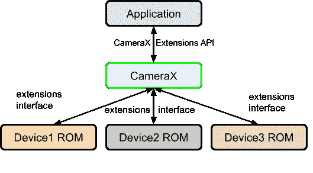
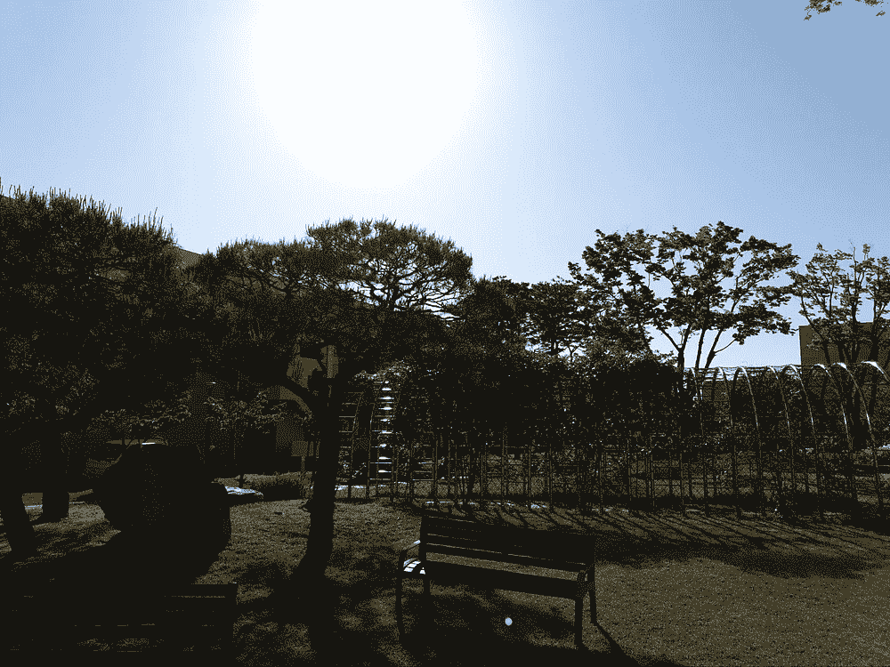
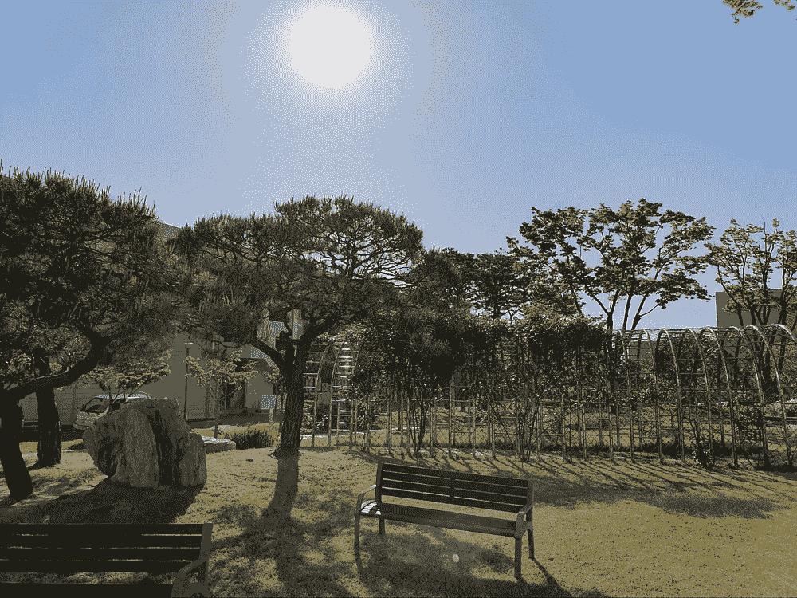

# 使用 CameraX 扩展 API 对图像应用特殊效果

> 原文：<https://medium.com/androiddevelopers/apply-special-effects-to-images-with-the-camerax-extensions-api-d1a169b803d3?source=collection_archive---------4----------------------->

[Android CameraX](https://android-developers.googleblog.com/2019/05/whats-new-with-android-jetpack.html) 旨在使相机开发更容易。随着 CameraX 的开发，相机应用程序开发人员与我们分享了他们的激情和热情，许多伟大的想法已经被构建到当前的 API 中。一个很好的例子是 CameraX 扩展 API。我们最近根据开发人员社区的意见重新构建了这些扩展，现在有了新的[扩展管理器](https://developer.android.com/reference/androidx/camera/extensions/ExtensionsManager)，你只需两行代码就可以使用这些扩展！这篇文章讲述了如何在你的应用中使用扩展 API。

# CameraX 扩展

Android 设备包含强大的相机，制造商投入大量精力在这些相机设备中构建许多尖端功能或特效。这些强大的功能过去只有设备的原生相机应用程序才能使用。借助 CameraX 扩展 API，第三方开发人员现在可以通过一个通用、简单的界面访问这些强大的相机功能。

# CameraX 扩展范围

CameraX 扩展的 1.0.0 版本包括一些最常见的内建相机特效:

*   **散景**:在人像模式下拍摄照片时，使前景人物更清晰。
*   **HDR** :用不同的自动曝光(AE)设置拍摄照片，以产生最佳效果。
*   **夜间**:在光线较暗的情况下，尤其是在夜间，获得最佳静态图像。
*   **面部修饰**:在拍摄静止图像时修饰面部肤色、几何图形等。
*   **自动**:根据周围景物自动调整最终图像。

让我们来看看在 Android 手机上通过 CameraX 扩展 API 启用和不启用特效时拍摄的一些示例照片。

# 散景模式示例

**Figure 1.** A BOKEH effect is applied to the image on the right.

# HDR 模式示例

**Figure 2.** The image on the right contains the HDR mode effect.

# 夜间模式示例

**Figure 3.** The image on the right contains the NIGHT mode effect.

视觉差异很明显。您可以使用 CameraX 扩展 API 在您自己的应用程序中制作这些图像。

现在让我们看看如何将 CameraX API 集成到您的应用程序中。

# 扩展 API

在现有的 CameraX 应用程序中，您可以通过首先包含`camera-extensions` Jetpack 库来添加 CameraX 扩展:

接下来，通过以下步骤集成扩展:

1.  获取 [ExtensionsManager](https://developer.android.com/reference/androidx/camera/extensions/ExtensionsManager) 实例。
2.  检查目标设备是否支持预期的扩展模式。
3.  得到一个分机使能的`CameraSelector`。
4.  使用扩展使能的`CameraSelector`调用 [bindToLifecycle](https://developer.android.com/reference/androidx/camera/lifecycle/ProcessCameraProvider#bindToLifecycle(androidx.lifecycle.LifecycleOwner,%20androidx.camera.core.CameraSelector,%20androidx.camera.core.UseCase...)) 。

# 获取 ExtensionsManager 实例

第一步是用它的[getInstance(Context)](https://developer.android.com/reference/androidx/camera/extensions/ExtensionsManager#getInstance(android.content.Context))API 获得一个 [ExtensionsManager](https://developer.android.com/reference/androidx/camera/extensions/ExtensionsManager) 实例。这个 API 返回一个`ListenableFuture` ，在这里我们可以使用`await()` 在 Kotlin suspend 函数中获得结果，以避免阻塞主线程。(注意:在`ListenableFuture`上使用`await()`需要依赖`androidx.concurrent:concurrent-futures-ktx: 1.1.0`。)

[扩展管理器](https://developer.android.com/reference/androidx/camera/extensions/ExtensionsManager)允许您确定设备支持，并获取特定扩展模式的扩展使能`CameraSelector` 。请注意以下几点:

*   [ExtensionsManager](https://developer.android.com/reference/androidx/camera/extensions/ExtensionsManager) 是一个进程范围的全局资源:在一个进程中只存在一个 [ExtensionsManager](https://developer.android.com/reference/androidx/camera/extensions/ExtensionsManager) 实例。
*   [ExtensionsManager](https://developer.android.com/reference/androidx/camera/extensions/ExtensionsManager) 始终存在:CameraX 提供了一个起作用的 [ExtensionsManager](https://developer.android.com/reference/androidx/camera/extensions/ExtensionsManager) 实例，不管底层设备是否支持任何扩展。

# 检查扩展模式的可用性

使用 ExtensionsManager，使用[isExtensionAvailable(camera provider，CameraSelector，int)](https://developer.android.com/reference/androidx/camera/extensions/ExtensionsManager#isExtensionAvailable(androidx.camera.core.CameraProvider,%20androidx.camera.core.CameraSelector,%20int)) 函数检查扩展的可用性:如果设备上的`CameraSelector`过滤的任何相机支持查询的扩展，则返回`true`，否则返回`false`。

# 获取支持扩展的 CameraSelector

一旦您知道设备支持扩展模式，使用[getExtensionEnabledCameraSelector(camera provider，CameraSelector，int)](https://developer.android.com/reference/androidx/camera/extensions/ExtensionsManager#getExtensionEnabledCameraSelector(androidx.camera.core.CameraProvider,%20androidx.camera.core.CameraSelector,%20int)) 函数检索扩展启用的`CameraSelector`。返回的扩展使能的`CameraSelector`包含了指定扩展模式的所有细节。

# 使用支持扩展的 CameraSelector 调用 bindToLifecycle()

最后一步是使用 [bindToLifecycle()](https://developer.android.com/reference/androidx/camera/lifecycle/ProcessCameraProvider#bindToLifecycle(androidx.lifecycle.LifecycleOwner,%20androidx.camera.core.CameraSelector,%20androidx.camera.core.UseCase...)) 将您的用例与支持扩展的`CameraSelector`绑定。启用扩展的`CameraSelector` 可以像普通的`CameraSelector`一样使用，例如使用 [DEFAULT_BACK_CAMERA](https://developer.android.com/reference/androidx/camera/core/CameraSelector#DEFAULT_BACK_CAMERA) 或 [DEFAULT_FRONT_CAMERA](https://developer.android.com/reference/androidx/camera/core/CameraSelector#DEFAULT_FRONT_CAMERA) 。当使用扩展启用`CameraSelector`绑定用例时，CameraX 直接在摄像机上启用指定的扩展模式。例如，当`Preview`被绑定时，扩展效果被应用到预览上，或者被绑定的`ImageCapture`捕获的图像上。

# 扩展 API 使用示例代码

这个扩展 API 示例的完整代码如下所示:

# 核心模块上的扩展 API 依赖关系

CameraX 扩展 API 在`camera-extensions` 库中实现，并且依赖于 CameraX 核心模块(`core,camera2,lifecycle`)。使用 CameraX 扩展时，确保使用与您正在使用的 CameraX 核心模块相同的[发布包](https://developer.android.com/jetpack/androidx/releases/camera)中的版本。例如，要使用`camera-extensions:1.0.0-alpha28`，您还必须将`camera-lifecycle, camera-core, camera-camera2` 的版本`1.0.0-alpha08`包含到应用程序的依赖列表中，因为它们是在 2021 年 8 月 18 日在同一个包中发布的。

# 扩展支持的设备

要使用 CameraX 扩展 API，设备制造商需要实现 [CameraX 供应商扩展接口](https://source.android.com/devices/camera/camerax-vendor-extensions)。你可以在 CameraX 设备页面[上找到 CameraX 扩展 API 支持设备的部分列表。请注意，这不是一个详尽的列表。如果您的设备已列出，但可用性检查返回 false，您可能需要从制造商处将您的设备更新到最新的 ROM 版本。](https://developer.android.com/training/camerax/devices)

除了支持的设备列表，从 Android 12 开始，还可以检查 Android 属性`ro.camerax.extensions.enabled` 来确定设备是否支持 CameraX 扩展。

# 旧扩展 API 移除

CameraX 在 2019 年 8 月发布了一个遗留扩展 API。这个遗留扩展 API 提供了扩展程序类，需要这些类来将扩展相关的配置应用到每个`Preview`和`ImageCapture` 用例中。传统扩展器设计可能导致开发人员错过在`Preview` 或`ImageCapture` 上启用扩展模式，并可能导致意外行为。

新的 CameraX 扩展库是在`1.0.0-alpha26`中引入的。较新的扩展 API 将扩展绑定从用例切换到目标摄像机，并且更易于使用。确保迁移以利用新的扩展 API。

我们特别感谢我们出色的 Android 相机开发人员和设备制造商，他们帮助实现了 CameraX 扩展 API！如果你想了解 CameraX 的最新发展，加入 Android CameraX 讨论组。

# 其他参考文献

*   [CameraX 扩展 API 指南](https://developer.android.com/training/camerax/vendor-extensions)
*   [扩展 API 参考](https://developer.android.com/reference/androidx/camera/extensions/ExtensionsManager)
*   [扩展测试应用](https://android.googlesource.com/platform/frameworks/support/+/androidx-main/camera/integration-tests/extensionstestapp/)
*   [CameraX 发行说明](https://developer.android.com/jetpack/androidx/releases/camera)
*   [CameraX 入门](https://developer.android.com/codelabs/camerax-getting-started#0)
*   [CameraX Github 样本](https://github.com/android/camera-samples)