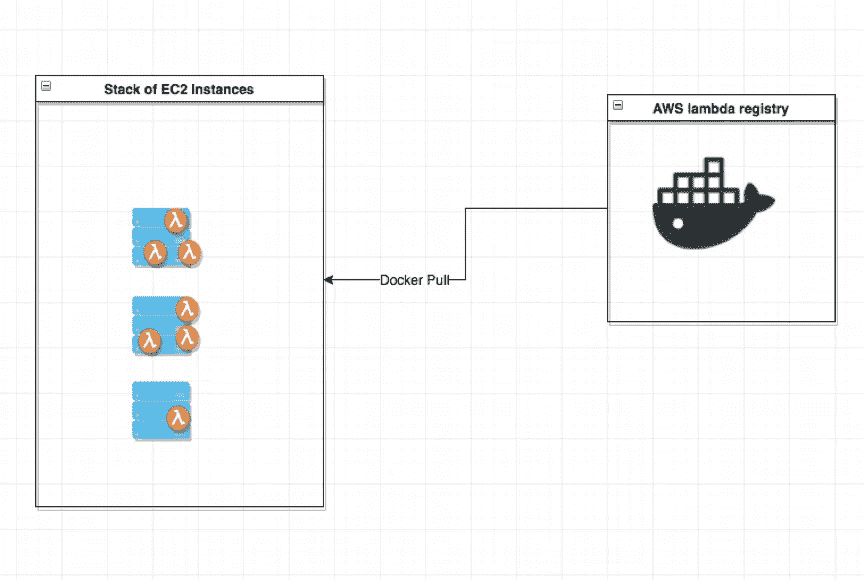
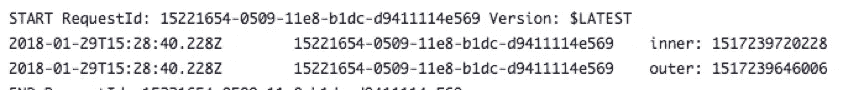
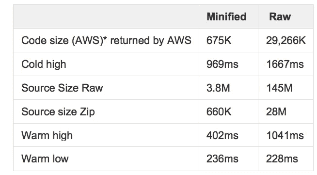
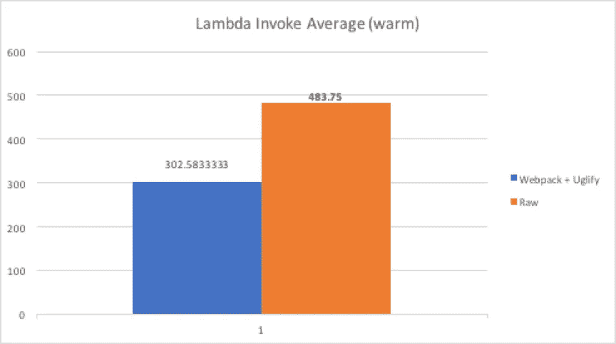
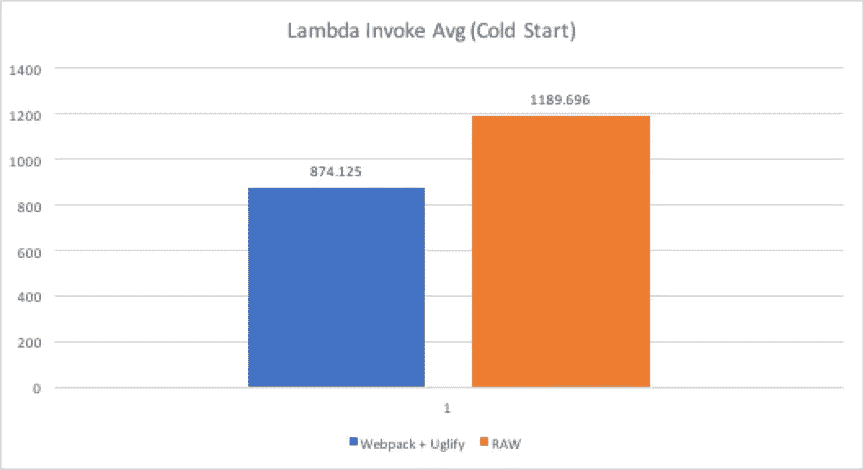

# 对 AWS Lambda 函数应用缩小化和丑化

> 原文：<https://medium.com/capital-one-tech/applying-minification-and-uglification-to-aws-lambda-functions-dbc7ad75241?source=collection_archive---------1----------------------->

## 最优化实验


AWS Lambda——或功能即服务(FaaS)——无疑是 IaaS 生态系统中的游戏规则改变者。它允许后端开发者以有竞争力的价格和效率为他们所使用的东西付费。我在 Capital One 的团队使用一些 Lambda 函数来快速启动需要弹性和可用性的功能。尽管 AWS Lambda 已经针对速度进行了高度优化，但我是一个效率狂，所以每当我在做一些事情时，我总是问自己，“我们如何才能让这个*更加*高效？”因此，在过去的几个月里，我一直在尝试优化 Lambda 函数，看看我是否在最佳地使用它们。

在优化 AWS Lambda 函数时，要记住的一点是函数调用的短暂性。以传统的 Express Node.js 应用程序为例——一旦应用程序启动，它将一直在机器上运行，直到关闭。由于我们工作的应用和技术的性质，后端工程师经常忽略前端工程师更熟悉使用的一个常见程序:*缩小和丑化*。

这可能是优化我们的 Lambda 函数效率的答案吗？

# 浅入 AWS Lambda —冷启动与热启动

如果您对 AWS Lambda 有初步的了解，您可能会对图表中显示的内容有所了解:



*Note: I realize that AWS is not using Docker Hub and has a highly customized registry but you get the point.*

这里我们有冷启动和暖启动。我们可以把冷启动想象成一个需要从 docker Hub 下载 Docker 镜像的 EC2 实例。我们可以把热启动看作是在 EC2 实例中已经下载了容器。*注意，这多少是正确的——从这个图中你不知道的是“容器”没有被重新初始化。* 
为了测试这个理论，让我们运行一个简单的节点应用程序:

```
var outer = Date.now();exports.handler = function(context, event, callback) { var inner = Date.now(); console.log(‘inner: ‘ + inner); console.log(‘outer: ‘ + outer);}
```

这是非常基本的——它在运行时获得两个变量并打印出来。
理论上，两个变量应该相等(或接近相等)。

现在，让我们通过运行以下命令来运行这个应用程序的 Docker 版本:

```
docker run lilnate22/test-lambda.
```

我们将看到，当您第一次运行这个命令时，它需要一些时间来执行，因为您需要从注册表中下载映像(冷启动)。我们还应该看到两个变量相等或接近相等的输出。

下次您运行*docker run lil Nate 22/test-lambda*时，它将接近即时(热启动)，因为它已经下载到您的机器上了。这是非常基本的东西。*但是当我们在 AWS 中做同样的事情会发生什么呢？*

来试试吧！复制上面的代码，创建一个新的空白 Nodejs 6.10 lambda 函数。当您运行新创建的函数时，应该会花费稍长的时间(因为 AWS 必须“下载”)。在第一次初始化时，您会看到内部和外部计时几乎相等。*但是我们再做一次会怎么样呢？*



wait a minute….why are they different?

提示在于这样一个事实，即 **AWS 只在热状态运行期间执行处理函数内部的代码。**即*里面的任何东西 exports.handler = function()* 。那是什么意思？假设我们有一个 Lambda 函数，它获取每天的彩票号码:

[https://gist . github . com/nfons/c 54449 e 587 CD 6d 970 bb 4 acff 24 e 44 f 4a](https://gist.github.com/nfons/c54449e587cd6d970bb4acff24e44f4a)

如果我们像编写 Docker 应用程序一样编写 Lambda 函数，那么每次 Lambda 执行都会“获取”彩票号码。

相反，我们应该优化它，检查是否已经设置了一个依赖项，如果它是空的，只执行昂贵的获取。

[https://gist . github . com/nfons/91 BCA 1483d 912 D6 f1 a 27 ad 0 f 37554 d4c](https://gist.github.com/nfons/91bca1483d912d6f1a27ad0f37554d4c)

这样，在随后的调用中，我们就不必去做这个过程中昂贵的功能。

# 缩小+丑陋=速度+成本。

缩小/丑化是客户端 JavaScript 开发的常见组件。前端工程师强调缩小提交给浏览器的 CSS/HTML 以帮助提高速度的重要性。但是当涉及到你的后端开发人员(服务开发人员)时，缩小化经常被忽略。

举个例子——如果你在谷歌上搜索“[Nodejs minimization](https://stackoverflow.com/questions/12068971/does-it-make-sense-to-minify-code-used-in-nodejshttps:/www.quora.com/Is-it-advisable-or-even-possible-to-minify-node-js-code)

大多数前端开发人员会感到困惑，并问“为什么？”这在考虑传统的 Node.js 服务运行时环境时是有意义的。在这些环境中，比如说，你运行一次 Express.js rest 应用程序，这个应用程序就会一直接受请求。不像客户端代码那样“短暂”,实际上没有必要通过网络将代码发送到浏览器。

## 缩小

缩小是一个常见的前端过程，它在不改变代码逻辑的情况下获取代码并删除所有不必要的字符。

假设我们有这样一个代码块:

```
***[code]******var longvariable = “myname”******var longArray = [1,2,3,4,5,6]******//some comment about functionality perhaps?******for(var index = 0; index < 6; index++){******console.log(longArray[index]);******}******[/code]***
```

缩小它将删除所有空格、制表符和注释，以输出代码块，如:

```
***[code]******var index,longvariable=”myname”,longArray=[1,2,3,4,5,6] for(index=0;6>index;index++)console.log(longArray[index])******[/code]***
```

就在我们的例子中，我们取了一个六行代码，并将其缩减为两行。如果我们将它与 Webpack(一个捆绑器)结合起来，它将把多个相关文件压缩成一个文件，我们可以显著减少应用程序中的总行数。

## 丑化

丑化是使代码更加精简的一个额外过程。丑化将所有变量混淆/简化，因此我们的简化示例:

```
***var index,longvariable=”myname”,longArray=[1,2,3,4,5,6] for(index=0;6>index;index++)console.log(longArray[index])***
```

看起来会像这样:

```
***for(var o=”myname”,a=[1,2,3,4,5,6],e=0;e<6;e++)console.log(a[e]);***
```

# 为什么要缩小+丑化？？

有几个原因让你想到为什么你会想要变小和变丑。从我做前端开发人员的时候起，我就知道缩小化/丑化的一大好处是它确保了客户端浏览器可以下载尽可能少的文件。将同样的原则应用于 Lambda 及其短暂的代码功能，我希望同样的好处可以应用于后端工作。

但是要记住的另一件事是，AWS Lambda 在每个包限制为 50MB 的区域中，对所有 Lambda 函数的限制为 75GB。因此，即使我们的性能提升不是很大，也许我们可以消除达到 75GB 限制的麻烦。

我创建了一个示例应用程序来说明这一点。随意在这里克隆:【https://github.com/lilnate22/Lambda-Tester/】

要运行:

```
npm run buildzip -r package-raw.zip .zip -r package-ugly.zip bundle.js
```

如果您查看 Zip 文件的统计数据:

***原始:13.8MB 对缩小:1MB。尺寸超过 13 倍！***

# 例子

但是现实世界的例子呢？

在 Capital One，我们处理来自不同供应商和合作伙伴的大量数据。在每季度的黑客马拉松中，我们创建了一个 Lambda 函数，它会自动解析这些数据，并根据适用的数据安全规则来剥离或屏蔽它们。

我们在热状态和冷状态下运行这个应用程序 100 次。虽然 AWS 没有告诉用户暖态有多长，但我们根据 Lambda 在容器中的工作方式做了一个安全的假设，即如果我们运行应用程序，在执行完成后，它应该立即处于暖态。如果我们创建 100 个 lambda 函数，并在名称后附加一个整数，我们可以执行每个函数一次来计算冷态平均值。



Data points for Minified and raw entries (in ms):



For a warm state execution, we see about a 40% reduction in execution time. *Note: we did see a higher memory footprint though.*

我预计冷状态执行会更快，但令我惊讶的是，我们只看到缩小和原始函数之间减少了大约 30%。尽管冷状态 RAW 的值比 minified 的值(高:969，低:737)更加不稳定和不稳定(高:1667，低:903)。



# 结果

现在我们已经展示了速度的提高，这对我们的黑客马拉松项目意味着什么？我们确实看到了内存使用量的上升(据 AWS 报道)。但据我所知，AWS 并没有按 Mb 收费(只按 max 分配)。

从成本的角度来看，如果我们外推这些值，我们会看到我们的黑客马拉松项目总共节省了大约 20%

# 最后的想法

AWS Lambda 已经成为后端开发人员的游戏规则改变者。已经对速度进行了高度优化，通过从前端开发中借用缩小和丑化的概念，我们可以帮助进一步推动我们的功能。

作为一个效率狂，我在黑客马拉松项目和个人实验中使用过这种策略，发现它很有前途。这可能是进一步优化 Lambda 函数效率的答案吗？也许吧。以这种方式使用缩小和丑化的结果可能因应用和项目而异。在优化您自己的 AWS Lambda 函数时，请仔细权衡您的选择。

*披露声明:这些观点是作者的观点。除非本帖中另有说明，否则 Capital One 不属于所提及的任何公司，也不被其认可。使用或展示的所有商标和其他知识产权都是其各自所有者的所有权。本文为 2018 首都一。*