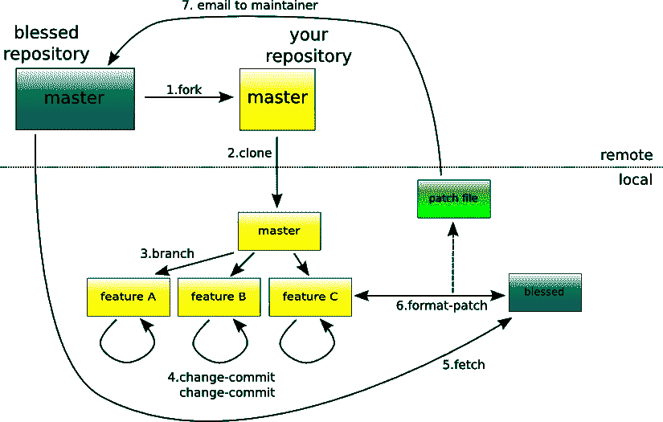

# 正在申请。来自 Git 的补丁文件

> 原文：<https://medium.easyread.co/applying-patch-file-from-git-eca61fc18db6?source=collection_archive---------0----------------------->

在我的工作场所，我们使用这种 git 分支和流程来协同工作:

```
+ master
+ prod
+ branchA
+ branchB
+ ...
```

`master`分支是开发和试运行级别的分支，所以如果有人想开发一个新特性，他/她必须向这个分支提交一个 PR ( [pull request](https://help.github.com/articles/about-pull-requests/) )。

`prod`分支是生产级分支。所有发布都将从此分支进行标记。

`branchA`和`branchB`是另一个例子分支，如果有人想在应用程序上做些什么，在 PR 被接受后很快就会被删除。

有了这种工作流程，每当我想从开发部门发布一些东西时，我必须做一个关于从`master`合并到`prod`分支的公关。但问题是，除了我唯一的改动，我不想发布另一个代码。

我怎样才能做到这一点，而不需要删除除我的代码之外的所有代码呢？


Release only certain commit

感谢我在办公室的导师，我从 git 找到了一个非常有用的文件:

> *.补丁和*。差速器

这些类型的文件仅包含我们在某次提交中所做的更改，这里有一个来自 [stackoverflow](https://stackoverflow.com/questions/8279602/what-is-a-patch-in-git-version-control) 中回复的图表，显示了什么是补丁:



patch diagram by Jan Aerts from [http://saaientist.blogspot.co.id/2008/06/bioruby-with-git-how-would-that-work.html](http://saaientist.blogspot.co.id/2008/06/bioruby-with-git-how-would-that-work.html)

## 生成。补丁文件

要生成一个. patch 文件，您可以通过在 url 末尾添加`.patch`从 github 提交页面保存它，例如:

```
[https://github.com/ridhoperdana/multibranch/commit/a533bbbdadea57a84617ea76374e88fbe595901c](https://github.com/ridhoperdana/multibranch/commit/a533bbbdadea57a84617ea76374e88fbe595901c).patch
```

或者，您可以通过键入以下命令从命令行生成该文件:

```
git format-patch -1 <sha>
```

对于生成的文件，您可以通过在命令行中键入以下内容来应用补丁:

```
git am name-of-the-patch-file.patchorgit apply --check name-of-the-patch-file.patchorgit apply --stat name-of-the-patch-file.patch
```

就这样，现在我可以只用我的修改来做公关了。

## **结论**

在某些时候，当你们一起工作的时候，你会面临一个问题，你想要得到你所做的唯一的改变，并且用那些改变做一个拉请求。Git 支持一个. patch 文件，其中包含您所做的更改。使用生成的。补丁文件，您可以看到与远程分支的变化和差异。如果您想要将您唯一的更改与远程分支合并，那么可以将该文件应用到某个分支。

参考资料:

*   [https://coder wall . com/p/ye H5 tw/how-to-create-and-apply-a-patch with-git](https://coderwall.com/p/yeh5tw/how-to-create-and-apply-a-patch-with-git)
*   [https://stackoverflow.com/a/8279647/4089955](https://stackoverflow.com/a/8279647/4089955)
*   [https://stackoverflow.com/a/9339460/4089955](https://stackoverflow.com/a/9339460/4089955)